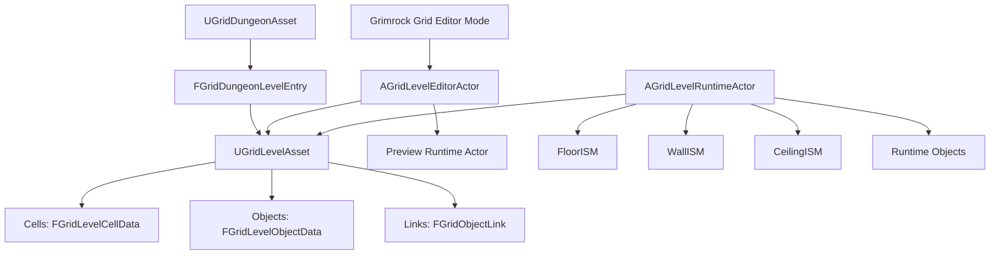
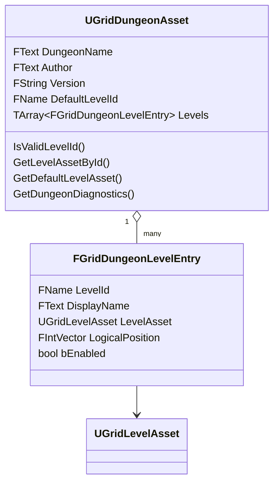
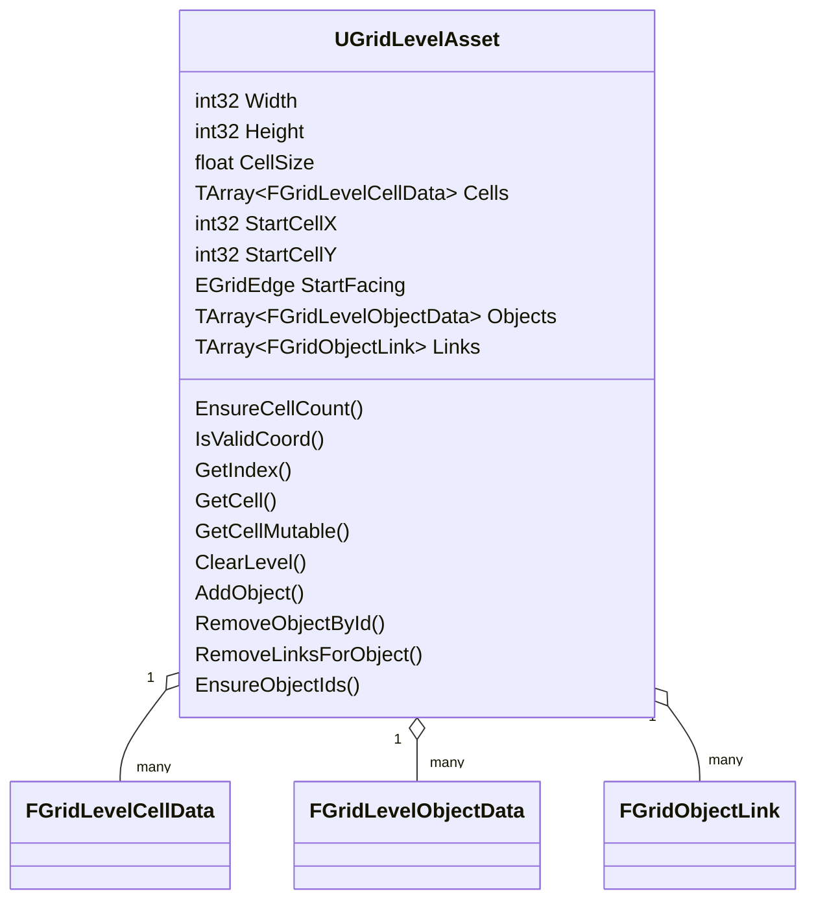
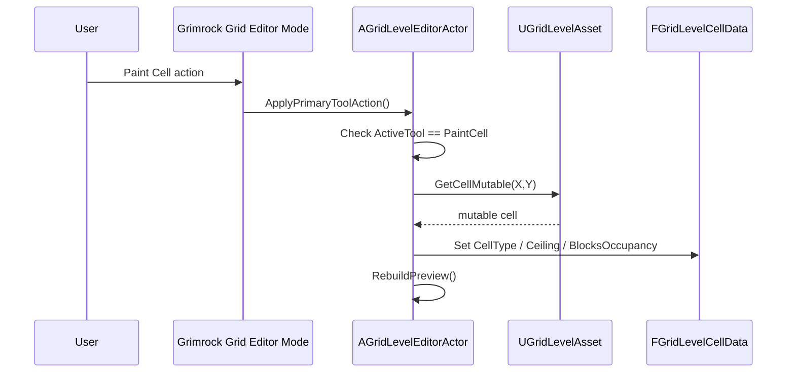
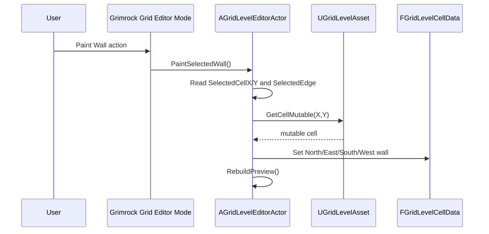
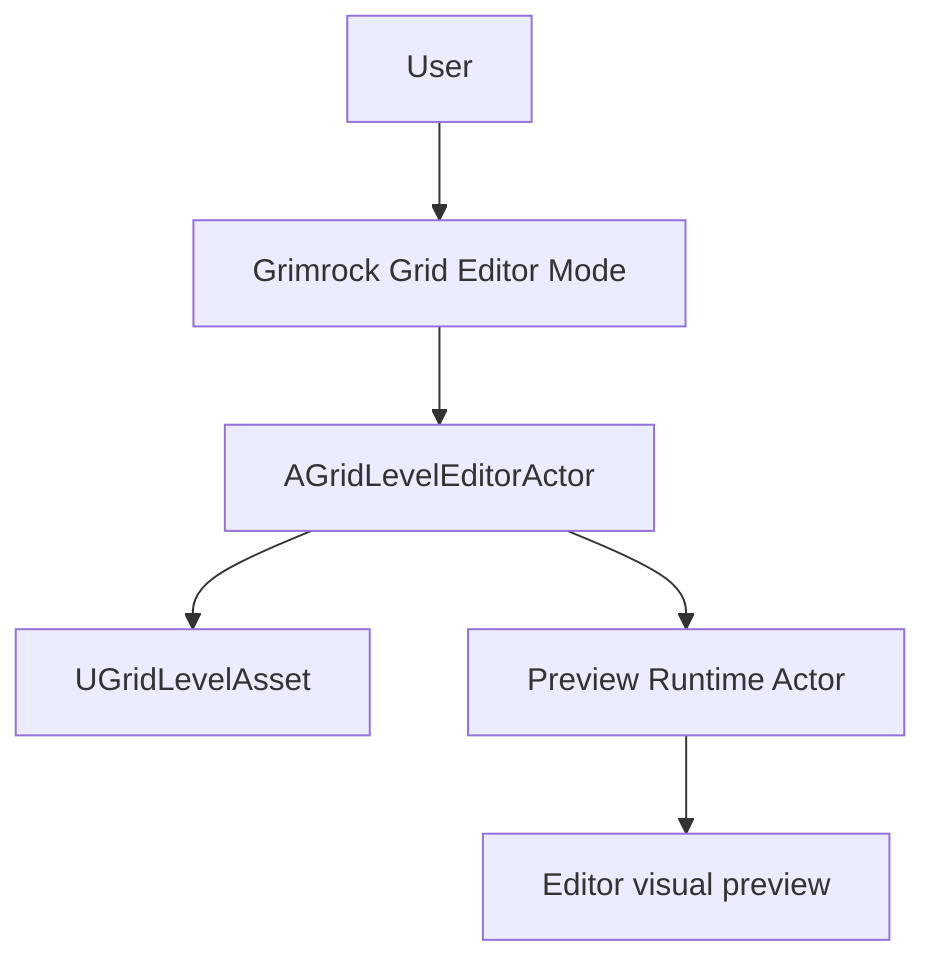
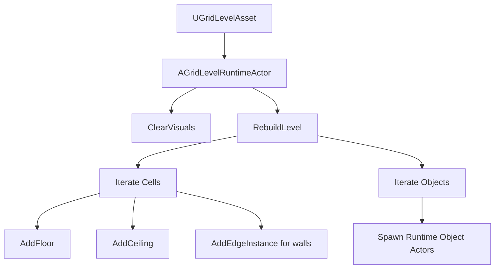
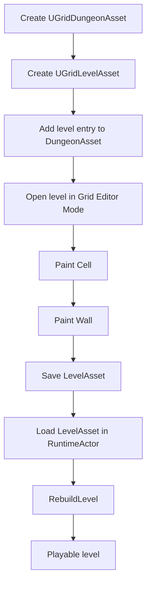
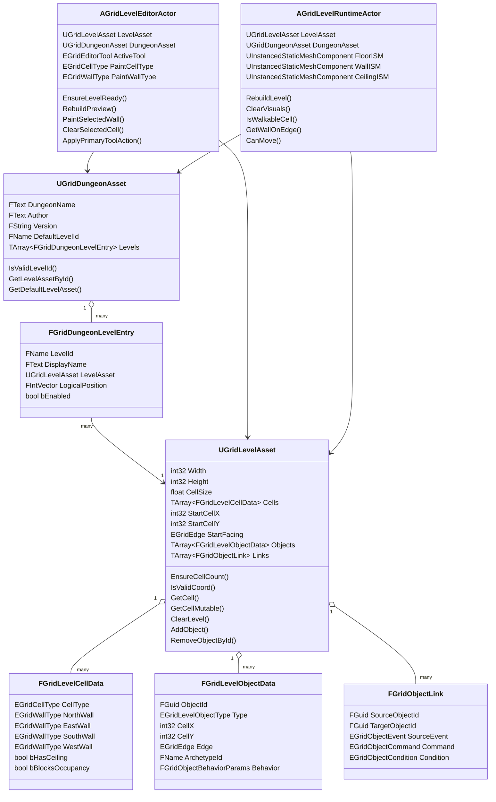

# Grimrock Prototype — Core Dungeon / Level / Grid Architecture

## 1. Purpose of this document

This document defines the foundational architecture of the Grimrock Prototype dungeon system.

It intentionally focuses only on the core structural layer:

- `UGridDungeonAsset`
- `UGridLevelAsset`
- grid cells
- cell walls
- level objects as structural data
- level links as structural data
- `AGridLevelEditorActor`
- Grimrock Grid Editor Mode
- Paint Cell
- Paint Wall
- `AGridLevelRuntimeActor`

This document does **not** cover the detailed gameplay systems yet:

- items
- doors
- receptacles
- secret passages
- pits as gameplay hazards
- teleporters
- triggers
- buttons / levers / plates
- inventory
- runtime puzzles

Those systems must be documented separately after this core is stable.

The goal is to clearly identify:

- where persistent data lives;
- which C++ classes own each responsibility;
- how dungeon data flows into editor tools;
- how level data flows into runtime actors;
- how cells and walls are painted;
- what rules must remain stable before adding advanced gameplay.

---

## 2. Core principle

The prototype is built around four distinct layers:

```text
1. Persistent data
   DataAssets stored in the project.

2. Level placement data
   Objects, cells, walls, links and start position stored inside a level asset.

3. Editor layer
   Tools and actors that modify the level asset.

4. Runtime layer
   Actors and components that read the level asset and generate the playable world.
```

The most important rule is:

```text
DataAssets describe the dungeon.
Editor actors modify those assets.
Runtime actors execute those assets.
```

A common source of bugs is confusing these concepts:

```text
Source data != placed data != editor actor != runtime actor
```

---

## 3. High-level architecture



Interpretation:

- `UGridDungeonAsset` organizes dungeon levels.
- `FGridDungeonLevelEntry` links a logical dungeon level id to a `UGridLevelAsset`.
- `UGridLevelAsset` stores the actual level data.
- `AGridLevelEditorActor` edits a level asset.
- `AGridLevelRuntimeActor` reads a level asset and generates runtime geometry.

---

## 4. Main C++ classes and responsibility map

| Area | Class / Struct | File | Responsibility |
|---|---|---|---|
| Dungeon data | `UGridDungeonAsset` | `Source/GrimrockPrototype/Public/Core/GridDungeonAsset.h` | Stores dungeon metadata and level entries. |
| Dungeon level entry | `FGridDungeonLevelEntry` | `GridDungeonAsset.h` | Connects a `LevelId` to a `UGridLevelAsset`. |
| Level data | `UGridLevelAsset` | `Source/GrimrockPrototype/Public/Core/GridLevelAsset.h` | Stores grid dimensions, cells, objects, links and start position. |
| Cell data | `FGridLevelCellData` | `Source/GrimrockPrototype/Public/Core/GridTypes.h` | Stores cell type, four walls, ceiling and occupancy blocking. |
| Placed object data | `FGridLevelObjectData` | `GridTypes.h` | Stores one object placed in a level. |
| Link data | `FGridObjectLink` | `GridTypes.h` | Stores a logical relation between two placed objects. |
| Editor actor | `AGridLevelEditorActor` | `Source/GrimrockPrototypeEditor/Public/EditorTools/GridLevelEditorActor.h` | Edits a level asset and rebuilds preview. |
| Editor tool enum | `EGridEditorTool` | `GridLevelEditorActor.h` | Defines Select, PaintCell, PaintWall, PaintObject, Erase, Link. |
| Runtime actor | `AGridLevelRuntimeActor` | `Source/GrimrockPrototype/Public/Runtime/GridLevelRuntimeActor.h` | Reads a level asset and builds playable geometry/runtime objects. |
| Runtime rendering | `FloorISM`, `WallISM`, `CeilingISM` | `GridLevelRuntimeActor.h` | Instanced mesh components for generated geometry. |

---

## 5. `UGridDungeonAsset`

### 5.1. Role

`UGridDungeonAsset` represents a complete dungeon.

It does not store the grid itself. It stores metadata and references to level assets.

Conceptually:

```text
UGridDungeonAsset = a binder containing several dungeon levels.
```

### 5.2. Class

```cpp
UGridDungeonAsset
```

Defined in:

```text
Source/GrimrockPrototype/Public/Core/GridDungeonAsset.h
```

### 5.3. Structure

`UGridDungeonAsset` contains:

```text
DungeonName
Author
Version
DefaultLevelId
Levels[]
```

Each `Levels[]` entry is an `FGridDungeonLevelEntry`.

### 5.4. `FGridDungeonLevelEntry`

A dungeon level entry contains:

```text
LevelId
DisplayName
LevelAsset
LogicalPosition
bEnabled
```

Example:

```text
LevelId         = Floor_00
DisplayName     = Entrance
LevelAsset      = DA_Level_Dungeon01_Floor00
LogicalPosition = X=0, Y=0, Z=0
bEnabled        = true
```

### 5.5. Diagram



### 5.6. What it should do

`UGridDungeonAsset` should:

- identify the dungeon;
- list the available levels;
- define the default level;
- allow lookup by `LevelId`;
- provide diagnostics.

### 5.7. What it should not do

`UGridDungeonAsset` should not:

- store cell data directly;
- store walls directly;
- generate runtime geometry;
- edit levels;
- spawn gameplay actors.

---

## 6. `UGridLevelAsset`

### 6.1. Role

`UGridLevelAsset` represents one individual level of the dungeon.

It is the core asset for a Grimrock-style floor or area.

It stores:

```text
Grid size
Cells
Start position
Objects
Links
```

### 6.2. Class

```cpp
UGridLevelAsset
```

Defined in:

```text
Source/GrimrockPrototype/Public/Core/GridLevelAsset.h
```

### 6.3. Structure

```text
UGridLevelAsset
  ├─ Width
  ├─ Height
  ├─ CellSize
  ├─ Cells[]
  ├─ StartCellX
  ├─ StartCellY
  ├─ StartFacing
  ├─ Objects[]
  └─ Links[]
```

### 6.4. Diagram



### 6.5. Core functions

Important functions:

```cpp
EnsureCellCount()
IsValidCoord()
GetIndex()
GetCell()
GetCellMutable()
ClearLevel()
AddObject()
RemoveObjectById()
RemoveLinksForObject()
EnsureObjectIds()
```

These functions form the basic API for level data manipulation.

---

## 7. Cells: `FGridLevelCellData`

### 7.1. Role

A cell represents one square of the level grid.

It stores both:

- the inner type of the cell;
- the wall state on each of its four edges.

### 7.2. Structure

```cpp
FGridLevelCellData
```

Contains:

```text
CellType
NorthWall
EastWall
SouthWall
WestWall
bHasCeiling
bBlocksOccupancy
```

### 7.3. Cell diagram

```text
                  NorthWall
              ┌───────────────┐
              │               │
 WestWall     │   Cell X,Y    │    EastWall
              │               │
              └───────────────┘
                  SouthWall
```

### 7.4. Cell type

`CellType` defines the main nature of the cell.

Current enum values include:

```text
Empty
Floor
Pit
StairsUp
StairsDown
Teleporter
```

For the core documentation, the important base distinction is:

```text
Empty = no playable cell / empty space
Floor = standard playable cell
```

Advanced cell types must be documented later.

### 7.5. Wall type

Each wall field uses `EGridWallType`:

```text
None
Solid
```

### 7.6. Ceiling

```text
bHasCeiling
```

Defines whether the runtime should generate a ceiling for the cell.

### 7.7. Occupancy blocking

```text
bBlocksOccupancy
```

Defines whether the cell blocks occupation. This is useful for movement and future gameplay systems.

---

## 8. Grid coordinate conventions

### 8.1. Logical coordinates

The grid uses integer coordinates:

```text
X = horizontal grid coordinate
Y = vertical grid coordinate
```

Example 4x4 grid:

```text
Y=3   [0,3] [1,3] [2,3] [3,3]
Y=2   [0,2] [1,2] [2,2] [3,2]
Y=1   [0,1] [1,1] [2,1] [3,1]
Y=0   [0,0] [1,0] [2,0] [3,0]

       X=0   X=1   X=2   X=3
```

### 8.2. World scale

`CellSize` converts grid coordinates into Unreal world units.

Example:

```text
CellSize = 200.0
```

means each logical grid cell covers a 200 x 200 Unreal unit square.

### 8.3. Runtime conversion

The runtime actor owns helper functions such as:

```cpp
GetCellCenterWorld()
CellToWorld()
```

Those functions should be used instead of duplicating conversion logic elsewhere.

---

## 9. Paint Cell

### 9.1. Role

Paint Cell modifies the inside of a selected cell.

It acts on:

```text
CellType
bHasCeiling
bBlocksOccupancy
```

### 9.2. Responsible editor class

```cpp
AGridLevelEditorActor
```

Relevant fields:

```text
PaintCellType
bPaintCellHasCeiling
bPaintCellBlocksOccupancy
SelectedCellX
SelectedCellY
ActiveTool
```

Relevant tool enum:

```cpp
EGridEditorTool::PaintCell
```

### 9.3. Conceptual flow



### 9.4. Design rule

Paint Cell must remain simple.

It should not contain logic for:

- items;
- doors;
- receptacles;
- triggers;
- runtime puzzles.

It only writes cell data into `UGridLevelAsset`.

---

## 10. Paint Wall

### 10.1. Role

Paint Wall modifies one edge of one selected cell.

It acts on:

```text
NorthWall
EastWall
SouthWall
WestWall
```

### 10.2. Responsible editor class

```cpp
AGridLevelEditorActor
```

Relevant fields:

```text
PaintWallType
SelectedCellX
SelectedCellY
SelectedEdge
ActiveTool
```

Relevant tool enum:

```cpp
EGridEditorTool::PaintWall
```

### 10.3. Conceptual flow



### 10.4. Cell wall drawing

```text
                  NorthWall
              ┌──────█──────┐
              │             │
 WestWall     █   Cell X,Y  █    EastWall
              │             │
              └──────█──────┘
                  SouthWall
```

Legend:

```text
█ = wall edge
```

### 10.5. Shared wall rule

A wall edge may be geometrically shared between two cells.

Example:

```text
Cell(X,Y).EastWall
```

is the same physical boundary as:

```text
Cell(X+1,Y).WestWall
```

The project must define and consistently apply one official rule:

```text
Option A: Paint Wall modifies only the selected cell edge.
Option B: Paint Wall also synchronizes the opposite edge of the neighboring cell.
```

This rule must be enforced in:

- editor painting;
- runtime wall lookup;
- validation;
- diagnostics;
- future import/export systems.

---

## 11. Paint Cell vs Paint Wall

### 11.1. Conceptual difference

```text
Paint Cell = modifies the square.
Paint Wall = modifies one side of the square.
```

### 11.2. Drawing

```text
Paint Cell
──────────

      ┌───────┐
      │███████│
      │███████│   The cell interior changes.
      │███████│
      └───────┘


Paint Wall
──────────

      ┌███████┐
      │       │
      │       │   Only one edge changes.
      │       │
      └───────┘
```

---

## 12. `FGridLevelObjectData` in the core

### 12.1. Role

Objects are not documented in detail here, but their storage location must be clear.

A placed object is stored as data:

```cpp
FGridLevelObjectData
```

inside:

```cpp
UGridLevelAsset::Objects
```

### 12.2. Important fields

Conceptually:

```text
ObjectId
Type
CellX
CellY
Edge
LocalYaw
ArchetypeId
ItemDefinitionAsset
ItemDefinitionId
bInitiallyEnabled
bInitiallyActive
Tag
Notes
PaletteEntryId
Behavior
```

### 12.3. Core rule

A level does not directly store Blueprint actors.

It stores placed object data. Runtime actors are spawned later from those data.

```text
FGridLevelObjectData = persistent level data
Runtime actor = generated execution object
```

---

## 13. `FGridObjectLink` in the core

### 13.1. Role

Links are stored as level data.

They represent logical relations between placed objects.

### 13.2. Structure

Conceptually:

```text
SourceObjectId
TargetObjectId
SourceEvent
Command
Condition
Condition parameters
bInvertCondition
```

### 13.3. Core rule

Links belong to the `UGridLevelAsset`.

They should not be stored only inside Blueprint actors.

Detailed link behavior must be documented separately.

---

## 14. `AGridLevelEditorActor`

### 14.1. Role

`AGridLevelEditorActor` is the editor-side actor used to manipulate a `UGridLevelAsset`.

It is not the source of truth.

The source of truth is the `UGridLevelAsset`.

### 14.2. Class

```cpp
AGridLevelEditorActor
```

Defined in:

```text
Source/GrimrockPrototypeEditor/Public/EditorTools/GridLevelEditorActor.h
```

### 14.3. Main references

```text
LevelAsset
DungeonAsset
CurrentDungeonLevelId
PreviewRuntimeActor
```

### 14.4. Selection state

```text
SelectedCellX
SelectedCellY
SelectedEdge
HoveredCellX
HoveredCellY
HoveredEdge
HoveredObjectId
```

### 14.5. Editor tools

```cpp
EGridEditorTool
```

Contains:

```text
Select
PaintCell
PaintWall
PaintObject
Erase
Link
```

### 14.6. Core editor functions

Relevant functions include:

```cpp
EnsureLevelReady()
RebuildPreview()
ApplyCurrentDungeonLevel()
LoadDefaultDungeonLevelInEditor()
CreateAndAddDungeonLevel()
ClearSelectedCell()
PaintSelectedWall()
ClearSelectedWall()
ApplyViewportHitSelection()
SelectCellFromOverview()
CommitHoveredCellSelection()
ApplyPrimaryToolAction()
ApplySecondaryToolAction()
EraseAtSelection()
ValidateCurrentLevel()
```

---

## 15. Grimrock Grid Editor Mode

### 15.1. Role

Grimrock Grid Editor Mode is the Unreal Editor tool layer.

It provides the user interface and viewport interaction for editing the level.

It should call into `AGridLevelEditorActor` instead of duplicating level-editing logic.

### 15.2. Editor flow



### 15.3. Design rule

The Editor Mode should be treated as UI/tooling.

It should not become a second storage layer for level data.

---

## 16. `AGridLevelRuntimeActor`

### 16.1. Role

`AGridLevelRuntimeActor` reads a `UGridLevelAsset` and builds the playable level.

It is responsible for:

- runtime geometry;
- floors;
- walls;
- ceilings;
- object spawning;
- runtime lookup helpers;
- movement checks;
- interaction routing.

### 16.2. Class

```cpp
AGridLevelRuntimeActor
```

Defined in:

```text
Source/GrimrockPrototype/Public/Runtime/GridLevelRuntimeActor.h
```

### 16.3. Main references

```text
LevelAsset
DungeonAsset
CurrentDungeonLevelId
ObjectArchetypes
FloorMesh
WallMesh
CeilingMesh
```

### 16.4. Runtime geometry components

```text
FloorISM
WallISM
CeilingISM
```

These are instanced static mesh components used to render repeated geometry efficiently.

### 16.5. Core functions

Relevant functions include:

```cpp
RebuildLevel()
ClearVisuals()
GetCellCenterWorld()
IsValidCell()
GetCell()
IsWalkableCell()
TryGetNeighborCell()
GetWallOnEdge()
CanMove()
ShouldHideCellFloor()
TryInteractAtEdge()
RebuildRuntimeObjects()
AddRuntimeObjectActor()
FindObjectArchetype()
```

### 16.6. Runtime generation flow



---

## 17. Complete lifecycle of a level



---

## 18. Full class diagram



---

## 19. Responsibility diagram

```text
┌─────────────────────────────────────────────────────────────┐
│                         DATA                                │
│                                                             │
│  UGridDungeonAsset                                          │
│    └─ lists dungeon levels                                  │
│                                                             │
│  UGridLevelAsset                                            │
│    ├─ Cells                                                 │
│    ├─ Objects                                               │
│    └─ Links                                                 │
└─────────────────────────────────────────────────────────────┘

                         │
                         │ edited by
                         ▼

┌─────────────────────────────────────────────────────────────┐
│                         EDITOR                              │
│                                                             │
│  AGridLevelEditorActor                                      │
│    ├─ selected cell / selected edge                         │
│    ├─ Paint Cell                                            │
│    ├─ Paint Wall                                            │
│    └─ Rebuild Preview                                       │
│                                                             │
│  Grimrock Grid Editor Mode                                  │
│    └─ user interface / viewport tools                       │
└─────────────────────────────────────────────────────────────┘

                         │
                         │ read by
                         ▼

┌─────────────────────────────────────────────────────────────┐
│                         RUNTIME                             │
│                                                             │
│  AGridLevelRuntimeActor                                     │
│    ├─ reads Cells                                           │
│    ├─ generates FloorISM                                    │
│    ├─ generates WallISM                                     │
│    ├─ generates CeilingISM                                  │
│    └─ prepares movement / interactions                      │
└─────────────────────────────────────────────────────────────┘
```

---

## 20. Recommended illustrations

The following illustrations should be produced and stored in `docs/Images/` later.

### 20.1. Illustration: Dungeon as a binder

Description:

```text
A large binder labeled GridDungeonAsset.
Inside it, several tabs:
- Floor_00
- Floor_01
- Floor_02
Each tab points to a GridLevelAsset map.
```

Purpose:

```text
Show that DungeonAsset organizes levels but does not store the grid directly.
```

### 20.2. Illustration: Level as a grid map

Description:

```text
A top-down 32x32 grid map.
Some cells are painted as floor.
Some edges are painted as walls.
A start marker indicates StartCell and StartFacing.
```

Purpose:

```text
Show that GridLevelAsset stores cells, walls, start position, objects and links.
```

### 20.3. Illustration: One cell with four walls

Description:

```text
A single square cell.
Center label: CellType.
Four side labels: NorthWall, EastWall, SouthWall, WestWall.
Top label: bHasCeiling.
Bottom label: bBlocksOccupancy.
```

Purpose:

```text
Explain the difference between Paint Cell and Paint Wall.
```

### 20.4. Illustration: Editor flow

Description:

```text
User -> Grimrock Grid Editor Mode -> AGridLevelEditorActor -> GridLevelAsset -> Preview Runtime Actor
```

Purpose:

```text
Show that the editor modifies level data and then rebuilds a visual preview.
```

### 20.5. Illustration: Runtime flow

Description:

```text
GridLevelAsset -> AGridLevelRuntimeActor -> FloorISM / WallISM / CeilingISM -> Playable Level
```

Purpose:

```text
Show that runtime reads level data and generates playable geometry.
```

---

## 21. Core architecture rules

### Rule 1 — DataAssets are the persistent source of truth

Persistent dungeon data should live in:

```text
UGridDungeonAsset
UGridLevelAsset
```

not in arbitrary map actors, unless explicitly documented.

### Rule 2 — Editor actors edit assets

`AGridLevelEditorActor` modifies `UGridLevelAsset` data.

It must not become a second source of truth.

### Rule 3 — Runtime actors read assets

`AGridLevelRuntimeActor` reads `UGridLevelAsset` and generates runtime geometry.

It should not be treated as the main persistent editor of level data.

### Rule 4 — Paint Cell and Paint Wall must remain simple

Paint Cell writes cell data.

Paint Wall writes wall data.

They must not contain gameplay object logic.

### Rule 5 — Coordinate conversion must be centralized

Grid-to-world conversion should use runtime/editor helper functions.

Do not duplicate conversion formulas in many systems.

### Rule 6 — Shared wall behavior must be official

The project must decide whether painting one wall also updates the opposite wall of the neighboring cell.

This rule must be implemented consistently everywhere.

### Rule 7 — Data copy vs data reference must be explicit

Whenever editor code copies data from a source asset into placed level data, this must be documented.

If data is an override, the editor should eventually expose it as such.

---

## 22. Core validation checklist

A core level validation tool should eventually verify:

```text
Dungeon:
- DefaultLevelId is valid.
- All enabled level entries have a valid LevelAsset.
- LevelIds are unique.

Level:
- Width > 0.
- Height > 0.
- CellSize > 0.
- Cells.Num == Width * Height.
- StartCell is inside bounds.
- StartCell is walkable.

Cells:
- Cell data is valid.
- Wall data uses known enum values.
- Shared walls are coherent if synchronization is required.

Objects:
- ObjectIds are valid.
- Object coordinates are inside bounds.
- Object edge placement is coherent.

Links:
- SourceObjectId exists.
- TargetObjectId exists.
```

---

## 23. Workflow: create a new dungeon

### Step 1 — Create the dungeon asset

Create:

```text
DA_Dungeon_MyDungeon
```

Configure:

```text
DungeonName
Author
Version
DefaultLevelId
```

### Step 2 — Create the first level asset

Create:

```text
DA_Level_MyDungeon_00
```

Configure:

```text
Width = 32
Height = 32
CellSize = 200
StartCellX
StartCellY
StartFacing
```

### Step 3 — Add the level to the dungeon

Add an entry to `DA_Dungeon_MyDungeon`:

```text
LevelId = Floor_00
DisplayName = Entrance
LevelAsset = DA_Level_MyDungeon_00
LogicalPosition = 0,0,0
bEnabled = true
```

Set:

```text
DefaultLevelId = Floor_00
```

### Step 4 — Open the level in the editor

In the editor map, configure:

```text
BP_GridLevelEditorActor
  DungeonAsset = DA_Dungeon_MyDungeon
  CurrentDungeonLevelId = Floor_00
```

Then apply the current dungeon level.

### Step 5 — Paint cells

Use Paint Cell to create floor areas.

### Step 6 — Paint walls

Use Paint Wall to define boundaries and room separation.

### Step 7 — Save

Save:

```text
GridDungeonAsset
GridLevelAsset
Editor map, if needed
```

---

## 24. Workflow: add a level to an existing dungeon

1. Create a new `UGridLevelAsset`.
2. Add a new `FGridDungeonLevelEntry` to the dungeon asset.
3. Assign a unique `LevelId`.
4. Assign the new level asset.
5. Apply the new level in `AGridLevelEditorActor`.
6. Paint cells and walls.
7. Save the dungeon and level assets.

---

## 25. Workflow: remove a level from a dungeon

1. Open the `UGridDungeonAsset`.
2. Remove the corresponding `FGridDungeonLevelEntry`.
3. If it was the default level, update `DefaultLevelId`.
4. Save the dungeon asset.
5. Delete the `UGridLevelAsset` only if the level must be permanently removed from the project.
6. Check editor and runtime maps for stale references.

---

## 26. Core summary

The foundational architecture is:

```text
UGridDungeonAsset
  organizes dungeon levels.

UGridLevelAsset
  stores a level grid, cells, objects, links and start position.

FGridLevelCellData
  stores one cell and its four walls.

FGridLevelObjectData
  stores one placed object as data.

FGridObjectLink
  stores a logical relation between two placed objects.

AGridLevelEditorActor
  edits the level asset.

Grimrock Grid Editor Mode
  provides the editor UI/tooling.

AGridLevelRuntimeActor
  reads the level asset and generates the playable level.
```

The core rule is:

```text
Clear persistent data
→ controlled editor modifications
→ generated runtime world
```

All future systems must respect this separation.

---

## 27. Next documentation steps

After this core document, the following documents should be created:

```text
OBJECT_ARCHETYPES_AND_PLACED_OBJECTS.md
EDITOR_PALETTE_AND_OBJECT_PLACEMENT.md
RUNTIME_OBJECT_SPAWNING.md
RECEPTACLE_SYSTEM_EXPLAINED.md
ITEM_AND_INVENTORY_ARCHITECTURE.md
LINKS_EVENTS_COMMANDS_CONDITIONS.md
```

Each new gameplay system must explicitly state:

```text
What is stored in DataAssets?
What is copied into LevelAsset?
What is provided by Blueprint actors?
What is generated at runtime?
What is edited by Grimrock Grid Editor Mode?
```
