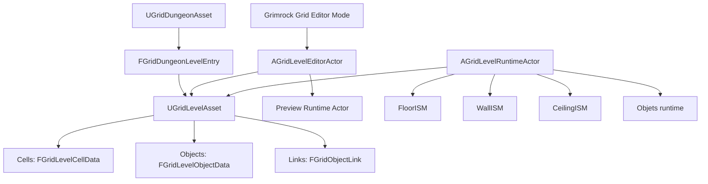
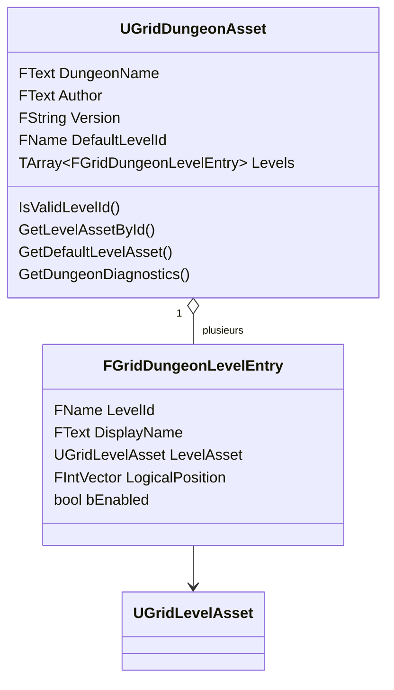
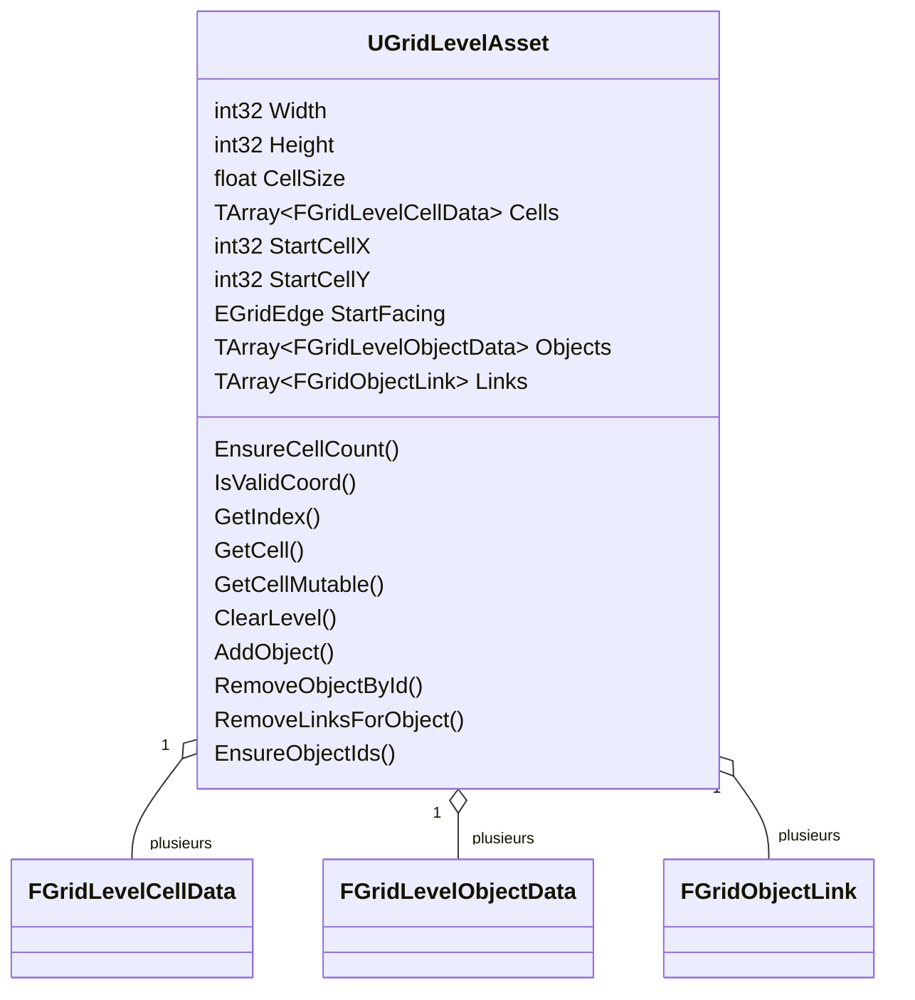
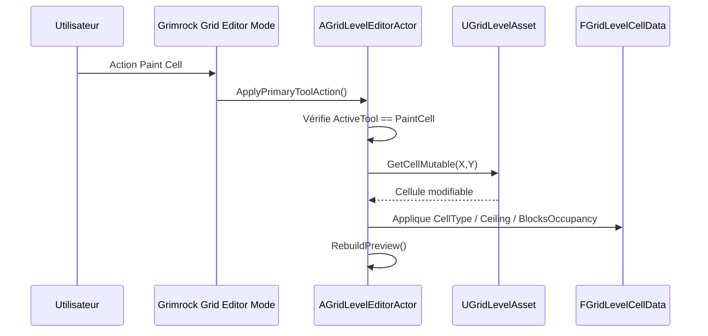
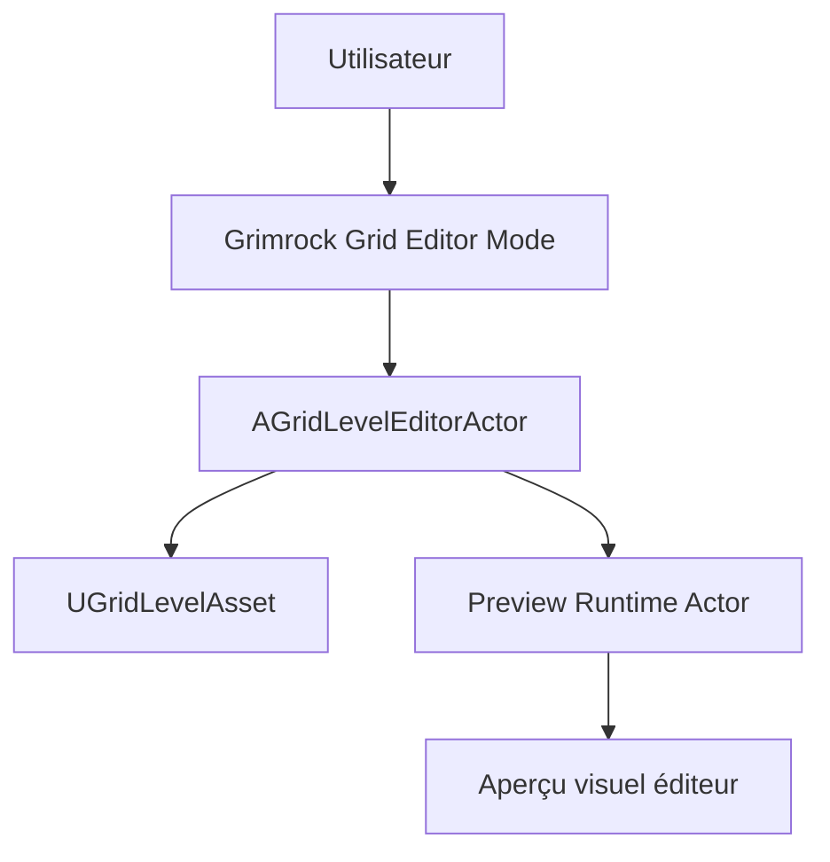
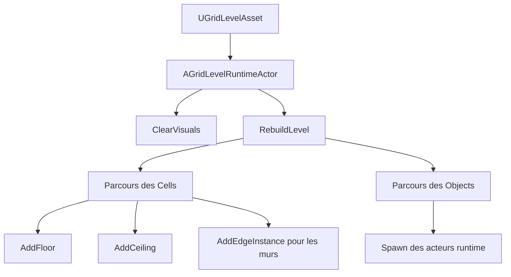
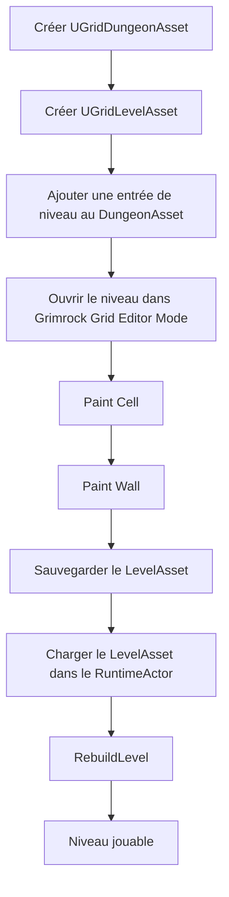

# Grimrock Prototype — Architecture noyau Donjon / Niveau / Grille

## 1. Objet du document

Ce document définit l’architecture de base du système de donjon du prototype **Grimrock Prototype**.

Il couvre uniquement le socle structurel suivant :

- `UGridDungeonAsset` ;
- `UGridLevelAsset` ;
- les cellules de grille ;
- les murs de cellule ;
- les objets de niveau en tant que données structurelles ;
- les liens de niveau en tant que données structurelles ;
- `AGridLevelEditorActor` ;
- le mode d’édition `Grimrock Grid Editor Mode` ;
- l’outil **Paint Cell** ;
- l’outil **Paint Wall** ;
- `AGridLevelRuntimeActor`.

Ce document ne traite pas encore les systèmes de gameplay détaillés : items, portes, réceptacles, passages secrets, pits en tant que pièges, téléporteurs, triggers, boutons, leviers, plaques de pression, inventaire ou énigmes runtime. Ces systèmes devront être documentés séparément une fois le noyau stabilisé.

L’objectif est d’établir clairement où vivent les données persistantes, quelles classes C++ sont responsables de quoi, comment les données arrivent dans l’éditeur puis dans le runtime, et quelles règles doivent rester stables avant d’ajouter des mécaniques avancées.

---

## 2. Principe général

Le prototype repose sur quatre couches distinctes :

```text
1. Données persistantes
   DataAssets stockés dans le projet Unreal.

2. Données placées dans le niveau
   Cellules, murs, objets, liens et position de départ stockés dans un LevelAsset.

3. Couche d’édition
   Outils et acteurs qui modifient le LevelAsset.

4. Couche runtime
   Acteurs et composants qui lisent le LevelAsset et génèrent le monde jouable.
```

La règle principale est :

```text
Les DataAssets décrivent le donjon.
Les acteurs éditeur modifient ces assets.
Les acteurs runtime exécutent ces assets.
```

Une source fréquente de bugs consiste à confondre ces notions :

```text
Donnée source ≠ donnée placée ≠ acteur d’édition ≠ acteur runtime
```

---

## 3. Architecture générale



Lecture du schéma :

- `UGridDungeonAsset` organise les niveaux du donjon.
- `FGridDungeonLevelEntry` relie un identifiant logique de niveau à un `UGridLevelAsset`.
- `UGridLevelAsset` stocke les données réelles du niveau.
- `AGridLevelEditorActor` modifie un `UGridLevelAsset`.
- `AGridLevelRuntimeActor` lit un `UGridLevelAsset` et génère la géométrie jouable.

---

## 4. Cartographie des classes C++ responsables

| Domaine | Classe / structure | Fichier | Responsabilité |
|---|---|---|---|
| Donjon | `UGridDungeonAsset` | `Source/GrimrockPrototype/Public/Core/GridDungeonAsset.h` | Stocke les métadonnées du donjon et la liste des niveaux. |
| Entrée de niveau | `FGridDungeonLevelEntry` | `GridDungeonAsset.h` | Relie un `LevelId` à un `UGridLevelAsset`. |
| Niveau | `UGridLevelAsset` | `Source/GrimrockPrototype/Public/Core/GridLevelAsset.h` | Stocke dimensions, cellules, objets, liens et position de départ. |
| Cellule | `FGridLevelCellData` | `Source/GrimrockPrototype/Public/Core/GridTypes.h` | Stocke type de cellule, quatre murs, plafond et blocage d’occupation. |
| Objet placé | `FGridLevelObjectData` | `GridTypes.h` | Stocke un objet placé dans le niveau. |
| Lien logique | `FGridObjectLink` | `GridTypes.h` | Stocke une relation logique entre deux objets placés. |
| Acteur éditeur | `AGridLevelEditorActor` | `Source/GrimrockPrototypeEditor/Public/EditorTools/GridLevelEditorActor.h` | Modifie un LevelAsset et reconstruit l’aperçu. |
| Outils éditeur | `EGridEditorTool` | `GridLevelEditorActor.h` | Définit Select, PaintCell, PaintWall, PaintObject, Erase, Link. |
| Acteur runtime | `AGridLevelRuntimeActor` | `Source/GrimrockPrototype/Public/Runtime/GridLevelRuntimeActor.h` | Lit un LevelAsset et génère le niveau jouable. |
| Rendu runtime | `FloorISM`, `WallISM`, `CeilingISM` | `GridLevelRuntimeActor.h` | Composants d’instances pour sols, murs et plafonds. |

---

## 5. `UGridDungeonAsset`

### 5.1. Rôle

`UGridDungeonAsset` représente un donjon complet. Il ne stocke pas directement la grille. Il stocke les métadonnées du donjon et les références vers les niveaux.

```text
UGridDungeonAsset = un classeur contenant plusieurs niveaux de donjon.
```

### 5.2. Structure

`UGridDungeonAsset` contient principalement :

```text
DungeonName
Author
Version
DefaultLevelId
Levels[]
```

Chaque élément de `Levels[]` est une structure `FGridDungeonLevelEntry` contenant :

```text
LevelId
DisplayName
LevelAsset
LogicalPosition
bEnabled
```

Exemple :

```text
LevelId         = Floor_00
DisplayName     = Entrée
LevelAsset      = DA_Level_Dungeon01_Floor00
LogicalPosition = X=0, Y=0, Z=0
bEnabled        = true
```

### 5.3. Diagramme



### 5.4. Responsabilités

`UGridDungeonAsset` doit identifier le donjon, lister les niveaux disponibles, définir le niveau par défaut, permettre la recherche d’un niveau par `LevelId` et fournir des diagnostics.

Il ne doit pas stocker directement les cellules ou les murs, générer la géométrie runtime, éditer les niveaux ni spawner des acteurs de gameplay.

---

## 6. `UGridLevelAsset`

### 6.1. Rôle

`UGridLevelAsset` représente un niveau individuel du donjon. C’est l’asset central pour un étage ou une zone de type Grimrock.

Il stocke :

```text
la taille de la grille
les cellules
la position de départ
les objets placés
les liens logiques
```

### 6.2. Structure

```text
UGridLevelAsset
  ├─ Width
  ├─ Height
  ├─ CellSize
  ├─ Cells[]
  ├─ StartCellX
  ├─ StartCellY
  ├─ StartFacing
  ├─ Objects[]
  └─ Links[]
```

### 6.3. Diagramme



### 6.4. Fonctions importantes

```cpp
EnsureCellCount()
IsValidCoord()
GetIndex()
GetCell()
GetCellMutable()
ClearLevel()
AddObject()
RemoveObjectById()
RemoveLinksForObject()
EnsureObjectIds()
```

Ces fonctions constituent l’API minimale de manipulation d’un niveau.

---

## 7. Cellules : `FGridLevelCellData`

### 7.1. Rôle

Une cellule représente une case de la grille. Elle stocke à la fois la nature intérieure de la case et l’état des murs sur ses quatre côtés.

### 7.2. Structure

```text
CellType
NorthWall
EastWall
SouthWall
WestWall
bHasCeiling
bBlocksOccupancy
```

### 7.3. Schéma d’une cellule

```text
                  NorthWall
              ┌───────────────┐
              │               │
 WestWall     │   Cell X,Y    │    EastWall
              │               │
              └───────────────┘
                  SouthWall
```

### 7.4. Types utiles au noyau

`CellType` définit la nature principale de la cellule. Valeurs actuelles :

```text
Empty
Floor
Pit
StairsUp
StairsDown
Teleporter
```

Dans le cadre du noyau, la distinction importante est :

```text
Empty = absence de case jouable / espace vide
Floor = case jouable standard
```

Chaque mur utilise `EGridWallType` :

```text
None
Solid
```

`bHasCeiling` détermine si le runtime doit générer un plafond. `bBlocksOccupancy` détermine si la cellule bloque l’occupation.

---

## 8. Convention de coordonnées

La grille utilise des coordonnées entières :

```text
X = coordonnée horizontale de grille
Y = coordonnée verticale de grille
```

Exemple de grille 4x4 :

```text
Y=3   [0,3] [1,3] [2,3] [3,3]
Y=2   [0,2] [1,2] [2,2] [3,2]
Y=1   [0,1] [1,1] [2,1] [3,1]
Y=0   [0,0] [1,0] [2,0] [3,0]

       X=0   X=1   X=2   X=3
```

`CellSize` convertit les coordonnées de grille en unités Unreal. Exemple : `CellSize = 200.0` signifie qu’une cellule logique occupe un carré de 200 x 200 unités Unreal.

Le runtime possède des fonctions d’aide telles que `GetCellCenterWorld()` et `CellToWorld()`. Ces fonctions doivent être utilisées plutôt que de dupliquer les formules de conversion dans plusieurs systèmes.

---

## 9. Paint Cell

### 9.1. Rôle

Paint Cell modifie l’intérieur d’une cellule sélectionnée.

Il agit sur :

```text
CellType
bHasCeiling
bBlocksOccupancy
```

### 9.2. Classe éditrice responsable

```cpp
AGridLevelEditorActor
```

Champs concernés :

```text
PaintCellType
bPaintCellHasCeiling
bPaintCellBlocksOccupancy
SelectedCellX
SelectedCellY
ActiveTool
```

Outil concerné :

```cpp
EGridEditorTool::PaintCell
```

### 9.3. Flux conceptuel



### 9.4. Règle de conception

Paint Cell doit rester simple. Il ne doit pas contenir de logique liée aux items, portes, réceptacles, triggers ou énigmes runtime. Il écrit uniquement les données de cellule dans `UGridLevelAsset`.

---

## 10. Paint Wall

### 10.1. Rôle

Paint Wall modifie un côté d’une cellule sélectionnée.

Il agit sur :

```text
NorthWall
EastWall
SouthWall
WestWall
```

### 10.2. Classe éditrice responsable

```cpp
AGridLevelEditorActor
```

Champs concernés :

```text
PaintWallType
SelectedCellX
SelectedCellY
SelectedEdge
ActiveTool
```

Outil concerné :

```cpp
EGridEditorTool::PaintWall
```

### 10.3. Flux conceptuel


### 10.4. Règle des murs partagés

Un mur peut être géométriquement partagé entre deux cellules.

```text
Cell(X,Y).EastWall
```

correspond physiquement à :

```text
Cell(X+1,Y).WestWall
```

Le projet doit définir officiellement une seule règle :

```text
Option A : Paint Wall modifie uniquement le bord de la cellule sélectionnée.
Option B : Paint Wall synchronise aussi le bord opposé de la cellule voisine.
```

Cette règle doit être appliquée partout : peinture dans l’éditeur, lecture runtime des murs, validation, diagnostics et futurs systèmes d’import/export.

---

## 11. Différence entre Paint Cell et Paint Wall

```text
Paint Cell = modifie la case.
Paint Wall = modifie un côté de la case.
```

```text
Paint Cell
──────────

      ┌───────┐
      │███████│
      │███████│   L’intérieur de la cellule change.
      │███████│
      └───────┘


Paint Wall
──────────

      ┌███████┐
      │       │
      │       │   Un seul bord change.
      │       │
      └───────┘
```

---

## 12. `FGridLevelObjectData` dans le noyau

Les objets ne sont pas détaillés dans ce document, mais leur lieu de stockage doit être clair.

Un objet placé est stocké comme donnée :

```cpp
FGridLevelObjectData
```

dans :

```cpp
UGridLevelAsset::Objects
```

Champs principaux :

```text
ObjectId
Type
CellX
CellY
Edge
LocalYaw
ArchetypeId
ItemDefinitionAsset
ItemDefinitionId
bInitiallyEnabled
bInitiallyActive
Tag
Notes
PaletteEntryId
Behavior
```

Un niveau ne stocke pas directement des acteurs Blueprint. Il stocke des données d’objets placés. Les acteurs runtime sont générés plus tard à partir de ces données.

```text
FGridLevelObjectData = donnée persistante du niveau
Acteur runtime = objet d’exécution généré
```

---

## 13. `FGridObjectLink` dans le noyau

Les liens sont stockés comme données de niveau. Ils représentent des relations logiques entre objets placés.

Structure conceptuelle :

```text
SourceObjectId
TargetObjectId
SourceEvent
Command
Condition
Paramètres de condition
bInvertCondition
```

Les liens appartiennent au `UGridLevelAsset`. Ils ne doivent pas être stockés uniquement dans des acteurs Blueprint. Le comportement détaillé des liens doit être documenté dans un document séparé.

---

## 14. `AGridLevelEditorActor`

### 14.1. Rôle

`AGridLevelEditorActor` est l’acteur côté éditeur utilisé pour manipuler un `UGridLevelAsset`. Il n’est pas la source de vérité. La source de vérité reste le `UGridLevelAsset`.

### 14.2. Références principales

```text
LevelAsset
DungeonAsset
CurrentDungeonLevelId
PreviewRuntimeActor
```

### 14.3. État de sélection

```text
SelectedCellX
SelectedCellY
SelectedEdge
HoveredCellX
HoveredCellY
HoveredEdge
HoveredObjectId
```

### 14.4. Outils d’édition

`EGridEditorTool` contient :

```text
Select
PaintCell
PaintWall
PaintObject
Erase
Link
```

### 14.5. Fonctions importantes du noyau

```cpp
EnsureLevelReady()
RebuildPreview()
ApplyCurrentDungeonLevel()
LoadDefaultDungeonLevelInEditor()
CreateAndAddDungeonLevel()
ClearSelectedCell()
PaintSelectedWall()
ClearSelectedWall()
ApplyViewportHitSelection()
SelectCellFromOverview()
CommitHoveredCellSelection()
ApplyPrimaryToolAction()
ApplySecondaryToolAction()
EraseAtSelection()
ValidateCurrentLevel()
```

---

## 15. Grimrock Grid Editor Mode

`Grimrock Grid Editor Mode` est la couche outil dans l’éditeur Unreal. Il fournit l’interface utilisateur et les interactions de viewport pour éditer le niveau.

Il doit appeler `AGridLevelEditorActor` plutôt que dupliquer la logique de modification du niveau.



L’Editor Mode doit être considéré comme une couche d’interface et d’outillage. Il ne doit pas devenir une seconde couche de stockage des données du niveau.

---

## 16. `AGridLevelRuntimeActor`

### 16.1. Rôle

`AGridLevelRuntimeActor` lit un `UGridLevelAsset` et construit le niveau jouable.

Il est responsable de la géométrie runtime, des sols, murs, plafonds, du spawn des objets runtime, des fonctions d’aide runtime, des vérifications de déplacement et du routage d’interaction de base.

### 16.2. Références principales

```text
LevelAsset
DungeonAsset
CurrentDungeonLevelId
ObjectArchetypes
FloorMesh
WallMesh
CeilingMesh
```

### 16.3. Composants de géométrie runtime

```text
FloorISM
WallISM
CeilingISM
```

Ce sont des composants d’instances statiques utilisés pour rendre efficacement la géométrie répétée.

### 16.4. Fonctions importantes

```cpp
RebuildLevel()
ClearVisuals()
GetCellCenterWorld()
IsValidCell()
GetCell()
IsWalkableCell()
TryGetNeighborCell()
GetWallOnEdge()
CanMove()
ShouldHideCellFloor()
TryInteractAtEdge()
RebuildRuntimeObjects()
AddRuntimeObjectActor()
FindObjectArchetype()
```

### 16.5. Flux de génération runtime



---

## 17. Cycle de vie complet d’un niveau



---

## 18. Diagramme de classes complet


---

## 19. Diagramme des responsabilités

```text
┌─────────────────────────────────────────────────────────────┐
│                         DONNÉES                             │
│                                                             │
│  UGridDungeonAsset                                          │
│    └─ liste les niveaux du donjon                           │
│                                                             │
│  UGridLevelAsset                                            │
│    ├─ Cells                                                 │
│    ├─ Objects                                               │
│    └─ Links                                                 │
└─────────────────────────────────────────────────────────────┘

                         │
                         │ édité par
                         ▼

┌─────────────────────────────────────────────────────────────┐
│                         ÉDITEUR                             │
│                                                             │
│  AGridLevelEditorActor                                      │
│    ├─ cellule sélectionnée / edge sélectionné               │
│    ├─ Paint Cell                                            │
│    ├─ Paint Wall                                            │
│    └─ Rebuild Preview                                       │
│                                                             │
│  Grimrock Grid Editor Mode                                  │
│    └─ interface utilisateur / outils viewport               │
└─────────────────────────────────────────────────────────────┘

                         │
                         │ lu par
                         ▼

┌─────────────────────────────────────────────────────────────┐
│                         RUNTIME                             │
│                                                             │
│  AGridLevelRuntimeActor                                     │
│    ├─ lit Cells                                             │
│    ├─ génère FloorISM                                       │
│    ├─ génère WallISM                                        │
│    ├─ génère CeilingISM                                     │
│    └─ prépare déplacement / interactions                    │
└─────────────────────────────────────────────────────────────┘
```

---

## 20. Illustrations du noyau

Les illustrations suivantes accompagnent le noyau Donjon / Niveau / Grille. Elles sont stockées dans `docs/Images/` au format SVG afin de rester lisibles, légères et modifiables.

### 20.1. Le donjon comme classeur


Cette illustration montre que `UGridDungeonAsset` organise les niveaux du donjon, mais ne stocke pas directement la grille.

### 20.2. Le niveau comme carte quadrillée


Cette illustration montre que `UGridLevelAsset` stocke les cellules, les murs, la position de départ, les objets et les liens.

### 20.3. Une cellule et ses quatre murs


Cette illustration montre qu’une cellule `FGridLevelCellData` contient `CellType`, `NorthWall`, `EastWall`, `SouthWall`, `WestWall`, `bHasCeiling` et `bBlocksOccupancy`.

### 20.4. Flux éditeur


Cette illustration montre le chemin de l’action utilisateur : `Grimrock Grid Editor Mode` pilote `AGridLevelEditorActor`, qui modifie le `UGridLevelAsset` puis reconstruit l’aperçu.

### 20.5. Flux runtime


Cette illustration montre que le runtime lit le `UGridLevelAsset`, génère les composants `FloorISM`, `WallISM`, `CeilingISM`, puis produit le niveau jouable.

---

## 21. Règles d’architecture du noyau

### Règle 1 — Les DataAssets sont la source persistante

Les données durables du donjon doivent vivre dans :

```text
UGridDungeonAsset
UGridLevelAsset
```

et non dans des acteurs arbitraires placés dans une map Unreal, sauf cas explicitement documenté.

### Règle 2 — Les acteurs éditeur modifient les assets

`AGridLevelEditorActor` modifie les données de `UGridLevelAsset`. Il ne doit pas devenir une deuxième source de vérité.

### Règle 3 — Les acteurs runtime lisent les assets

`AGridLevelRuntimeActor` lit `UGridLevelAsset` et génère la géométrie runtime. Il ne doit pas être traité comme l’éditeur principal des données persistantes.

### Règle 4 — Paint Cell et Paint Wall doivent rester simples

Paint Cell écrit des données de cellule. Paint Wall écrit des données de mur. Ils ne doivent pas contenir de logique d’objets de gameplay.

### Règle 5 — La conversion de coordonnées doit être centralisée

La conversion grille -> monde doit passer par les fonctions d’aide prévues. Il ne faut pas dupliquer des formules de conversion dans plusieurs systèmes.

### Règle 6 — Le comportement des murs partagés doit être officiel

Le projet doit décider si peindre un mur met aussi à jour le mur opposé de la cellule voisine. Cette règle doit être appliquée partout.

### Règle 7 — Copie de donnée et référence doivent être explicites

Quand le code éditeur copie des données depuis un asset source vers des données placées dans le niveau, cela doit être documenté. Si une donnée est un override local, l’éditeur devrait à terme l’afficher comme tel.

---

## 22. Checklist de validation du noyau

Un outil de validation du noyau devrait vérifier :

```text
Donjon :
- DefaultLevelId est valide.
- Tous les niveaux activés ont un LevelAsset valide.
- Les LevelId sont uniques.

Niveau :
- Width > 0.
- Height > 0.
- CellSize > 0.
- Cells.Num == Width * Height.
- StartCell est dans les limites.
- StartCell est jouable.

Cellules :
- Les données de cellule sont valides.
- Les murs utilisent des valeurs d’énumération connues.
- Les murs partagés sont cohérents si la synchronisation est requise.

Objets :
- Les ObjectId sont valides.
- Les coordonnées d’objet sont dans les limites.
- Le placement sur edge est cohérent.

Liens :
- SourceObjectId existe.
- TargetObjectId existe.
```

---

## 23. Workflow : créer un nouveau donjon

### Étape 1 — Créer le DungeonAsset

Créer :

```text
DA_Dungeon_MonDonjon
```

Configurer :

```text
DungeonName
Author
Version
DefaultLevelId
```

### Étape 2 — Créer le premier LevelAsset

Créer :

```text
DA_Level_MonDonjon_00
```

Configurer :

```text
Width = 32
Height = 32
CellSize = 200
StartCellX
StartCellY
StartFacing
```

### Étape 3 — Ajouter le niveau au donjon

Ajouter une entrée dans `DA_Dungeon_MonDonjon` :

```text
LevelId = Floor_00
DisplayName = Entrée
LevelAsset = DA_Level_MonDonjon_00
LogicalPosition = 0,0,0
bEnabled = true
```

Définir :

```text
DefaultLevelId = Floor_00
```

### Étape 4 — Ouvrir le niveau dans l’éditeur

Dans la map d’édition, configurer :

```text
BP_GridLevelEditorActor
  DungeonAsset = DA_Dungeon_MonDonjon
  CurrentDungeonLevelId = Floor_00
```

Puis appliquer le niveau courant.

### Étape 5 — Peindre les cellules

Utiliser Paint Cell pour créer les zones de sol.

### Étape 6 — Peindre les murs

Utiliser Paint Wall pour définir les limites et les séparations de pièces.

### Étape 7 — Sauvegarder

Sauvegarder :

```text
GridDungeonAsset
GridLevelAsset
Map d’édition, si nécessaire
```

---

## 24. Workflow : ajouter un niveau à un donjon existant

1. Créer un nouveau `UGridLevelAsset`.
2. Ajouter un nouveau `FGridDungeonLevelEntry` dans le DungeonAsset.
3. Choisir un `LevelId` unique.
4. Assigner le nouveau LevelAsset.
5. Appliquer ce niveau dans `AGridLevelEditorActor`.
6. Peindre cellules et murs.
7. Sauvegarder le DungeonAsset et le LevelAsset.

---

## 25. Workflow : supprimer un niveau d’un donjon

1. Ouvrir le `UGridDungeonAsset`.
2. Supprimer l’entrée `FGridDungeonLevelEntry` correspondante.
3. Si ce niveau était le niveau par défaut, modifier `DefaultLevelId`.
4. Sauvegarder le DungeonAsset.
5. Supprimer le `UGridLevelAsset` uniquement si le niveau doit vraiment disparaître du projet.
6. Vérifier les maps éditeur et runtime afin d’éliminer les références obsolètes.

---

## 26. Résumé du noyau

L’architecture de base est :

```text
UGridDungeonAsset
  organise les niveaux du donjon.

UGridLevelAsset
  stocke la grille, les cellules, les objets, les liens et le départ du niveau.

FGridLevelCellData
  stocke une cellule et ses quatre murs.

FGridLevelObjectData
  stocke un objet placé sous forme de donnée.

FGridObjectLink
  stocke une relation logique entre deux objets placés.

AGridLevelEditorActor
  édite le LevelAsset.

Grimrock Grid Editor Mode
  fournit l’interface et les outils d’édition.

AGridLevelRuntimeActor
  lit le LevelAsset et génère le niveau jouable.
```

La règle centrale est :

```text
Donnée persistante claire
→ modification contrôlée par l’éditeur
→ monde runtime généré
```

Tous les futurs systèmes doivent respecter cette séparation.

---

## 27. Prochaines documentations à rédiger

Après ce document noyau, les documents suivants devraient être créés :

```text
OBJECT_ARCHETYPES_AND_PLACED_OBJECTS.md
EDITOR_PALETTE_AND_OBJECT_PLACEMENT.md
RUNTIME_OBJECT_SPAWNING.md
RECEPTACLE_SYSTEM_EXPLAINED.md
ITEM_AND_INVENTORY_ARCHITECTURE.md
LINKS_EVENTS_COMMANDS_CONDITIONS.md
```

Chaque nouveau système de gameplay devra répondre explicitement aux questions suivantes :

```text
Qu’est-ce qui est stocké dans les DataAssets ?
Qu’est-ce qui est copié dans le LevelAsset ?
Qu’est-ce qui est fourni par les Blueprints ?
Qu’est-ce qui est généré au runtime ?
Qu’est-ce qui est modifié par Grimrock Grid Editor Mode ?
```
