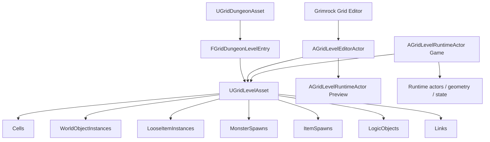

# Grimrock Prototype — Architecture noyau Donjon / Niveau / Grille

> **Contrat courant — 2026-09-12 / UE 5.5.4.** Le niveau repose sur des placements typés. L'ancien modèle monolithique `Objects` / `FGridLevelObjectData` n'est plus une architecture active. Voir aussi [Définitions et placements typés](WORLD_OBJECT_DEFINITIONS_AND_PLACED_OBJECTS.md).

## 1. Objet du document

Ce document décrit le socle commun qui organise, édite et exécute un donjon quadrillé :

- `UGridDungeonAsset` et ses entrées de niveau ;
- `UGridLevelAsset`, ses cellules, placements et liens ;
- `AGridLevelEditorActor` et le mode **Grimrock Grid Editor** ;
- `AGridLevelRuntimeActor` et la représentation jouable ;
- les règles de coordonnées, murs, identité et état initial.

Les systèmes spécialisés — portes, réceptacles, pits, téléporteurs, monstres, items, Lua, inventaire et combat — utilisent ce noyau mais possèdent leur propre documentation.

## 2. Séparation des responsabilités

```text
UGridDungeonAsset
  organise les niveaux et leurs positions logiques.

UGridLevelAsset
  stocke les données persistantes d'un niveau.

AGridLevelEditorActor + Grimrock Grid Editor
  modifient le LevelAsset et pilotent son aperçu.

AGridLevelRuntimeActor
  lit le LevelAsset et construit la représentation runtime.

SaveGame / FGridDungeonRuntimeState
  stocke les deltas mutables produits pendant le jeu.
```

Règle centrale :

```text
DataAsset persistant != acteur éditeur != acteur runtime != état de sauvegarde
```

L'acteur éditeur et l'acteur runtime référencent les assets ; ils ne deviennent jamais une seconde source de vérité pour la définition statique du niveau.



## 3. `UGridDungeonAsset`

`UGridDungeonAsset` organise plusieurs `UGridLevelAsset`. Il ne contient pas lui-même la grille d'un niveau.

Chaque `FGridDungeonLevelEntry` porte notamment :

```text
LevelId
DisplayName
LevelAsset
LogicalPosition
bEnabled
```

`DefaultLevelId` désigne le niveau par défaut. `LogicalPosition` décrit l'organisation logique du donjon ; ce n'est pas une transform Unreal d'acteur.

Les transitions inter-niveaux résolvent un `LevelId` vers l'entrée active correspondante. Le runtime courant conserve également `CurrentDungeonLevelId` pour identifier le niveau actif et sa persistance.

## 4. `UGridLevelAsset`

`UGridLevelAsset` est l'autorité persistante d'un niveau.

```text
Width / Height / CellSize
Cells[]
StartCellX / StartCellY / StartFacing
WorldObjectInstances[]
LooseItemInstances[]
MonsterSpawns[]
ItemSpawns[]
LogicObjects[]
Links[]
LuaScripts[]
LevelVariables[]
QuestDefinitions[]
```

`Cells` est indexé par :

```cpp
Index = Y * Width + X;
```

Le niveau fournit les opérations communes de coordonnées, accès aux cellules, identité de placement, suppression, recherche typée et validation. Une suppression de placement doit également supprimer les liens qui le référencent.

## 5. Les cinq familles de placements

### 5.1 `WorldObjectInstances`

`FGridWorldObjectInstance` représente les objets réutilisables du décor et du gameplay : portes, boutons, leviers, plaques de pression, téléporteurs, pits, triggers, réceptacles, décorations, lumières, etc.

Le placement référence une `UGridWorldObjectDefinitionAsset` par `WorldObjectDefinitionId`.

### 5.2 `LooseItemInstances`

`FGridLooseItemInstance` représente un item déjà présent physiquement dans le niveau. Il référence directement une `UGridItemDefinitionAsset`.

Il ne faut pas créer un `WorldObjectDefinitionAsset` supplémentaire pour représenter le même item ramassable.

### 5.3 `MonsterSpawns`

`FGridMonsterSpawnInstance` décrit une implantation de monstre : définition, cellule, orientation, état initial du monstre, patrol, encounter et présence initiale via `bSpawnAtStart`.

Le `SpawnId` est l'identité persistante de cette implantation.

### 5.4 `ItemSpawns`

`FGridItemSpawnInstance` est un générateur d'items, distinct d'un item déjà posé. Sa génération initiale est contrôlée par `bSpawnAtStart`.

```text
LooseItemInstance != ItemSpawnInstance
```

### 5.5 `LogicObjects`

`FGridLogicObjectInstance` représente les cibles data-only : relais logiques, compteurs, comparateurs, certains services de recrutement et autres objets ne nécessitant pas d'acteur physique.

## 6. États initiaux : règle sémantique

Le noyau ne possède plus de booléens génériques « initially enabled » / « initially active » sur les placements persistés.

La présence dans une collection signifie que le placement existe. Lorsqu'un état initial a une signification de gameplay réelle, il est nommé selon le type :

| Type | Donnée persistante |
|---|---|
| Door | `InstanceConfig.bDoorInitiallyOpen` |
| Teleporter | `InstanceConfig.bTeleporterInitiallyEnabled` |
| Pit | `InstanceConfig.Pit.bInitiallyOpen` |
| Lock | `InstanceConfig.bStartsUnlocked` |
| MonsterSpawn | `bSpawnAtStart` |
| ItemSpawn | `bSpawnAtStart` |
| Lever | pas d'override : démarre Off |
| PressurePlate | pas d'état pressé authoré ; état dérivé au runtime |
| Loose item | sa présence dans `LooseItemInstances` signifie qu'il est placé |
| Logic object | sa présence dans `LogicObjects` signifie qu'il existe |

`UGridWorldObjectDefinitionAsset` ne fournit pas de defaults génériques d'existence/activité à recopier dans les placements.

## 7. Cellules

`FGridLevelCellData` porte le contenu structurel de la grille :

```text
CellType
NorthWall
EastWall
SouthWall
WestWall
bHasCeiling
bBlocksOccupancy
```

La grille de référence du prototype utilise des cellules carrées ; le projet courant emploie principalement des cellules de 200 cm de côté, avec une hauteur de donjon gérée par les meshes et conventions de niveau.

Une cellule `Empty` n'est pas une cellule praticable. `bBlocksOccupancy` permet de rendre non occupable une cellule autrement valide.

## 8. Orientation et coordonnées

Convention du projet :

```text
North = Y+
East  = X+
South = Y-
West  = X-
```

Les objets muraux portent leur face concrète dans `WallSide`. Les monstres portent leur orientation dans `Facing`. Les conversions de direction doivent utiliser les helpers communs plutôt que réimplémenter des mappings locaux.

Le centre monde d'une cellule est calculé à partir du `CellSize`, du `GridOrigin` et de la transform de l'acteur runtime.

## 9. Murs et frontières

Chaque cellule stocke ses quatre champs de mur. Une frontière entre deux cellules peut donc être décrite depuis l'un ou l'autre côté.

Le contenu doit éviter les incohérences suivantes :

- deux murs structurels superposés sur la même séparation ;
- un bord défini d'un seul côté alors qu'un algorithme consulte l'autre ;
- une porte combinée à un mur structurel qui continue de bloquer le déplacement ;
- un objet mural sans `WallSide` cardinal.

Les objets de frontière, notamment les portes, utilisent leurs propres systèmes de blocage logique en plus de la géométrie structurelle.

## 10. Définitions world-object

`UGridWorldObjectDefinitionAsset` décrit le concept partagé :

- identité et classification ;
- surface de placement et position locale par défaut ;
- `StaticPart` et jusqu'à deux `MovingParts` ;
- motion, audio et comportement partagé ;
- classe runtime ;
- interaction, lecture, lumière et règles spécialisées.

Une instance ne recopie pas la définition. Les exceptions locales restent sparse : transform/amplitude/durée forward d'une partie mobile, certaines règles d'interaction, chaîne de porte et données réellement propres au puzzle.

Voir [11 — Référence des paramètres GridWorldObjectDefinitionAsset](../Design/11_GRID_WORLD_OBJECT_DEFINITION_PARAMETERS_REFERENCE.md).

## 11. Liens

`FGridObjectLink` relie un événement source à une commande cible ou à un callback Lua.

Conceptuellement :

```text
SourceObjectId
SourceEvent
        │
        ▼
Command / LuaCallback
        │
        ▼
TargetObjectId éventuel
```

Les identités utilisées par les liens sont celles des placements natifs (`InstanceId` / `SpawnId`). Il n'existe pas de projection parallèle d'identité.

Les conditions natives sont réservées aux requêtes simples réellement prises en charge, notamment certains états de réceptacle. Les branches de puzzle complexes appartiennent à Lua.

## 12. `AGridLevelEditorActor`

`AGridLevelEditorActor` est le contrôleur de l'authoring du niveau. Il référence notamment :

```text
LevelAsset
DungeonAsset
CurrentDungeonLevelId
PreviewRuntimeActor
ObjectPalette
```

Le mode **Grimrock Grid Editor** utilise cet acteur pour :

- peindre cellules et murs ;
- placer les cinq familles d'objets ;
- sélectionner et déplacer les placements ;
- éditer leurs propriétés sémantiques ;
- créer les liens ;
- reconstruire l'aperçu ;
- exécuter la validation du niveau.

Les mutations persistantes appellent `Modify()`, marquent le package sale et reconstruisent l'aperçu lorsque nécessaire.

## 13. Selected Object

L'inspecteur doit refléter le type sélectionné, pas exposer des concepts génériques artificiels.

Exemples :

```text
Door         -> Open at Start
Teleporter   -> Enabled at Start
MonsterSpawn -> Spawn at Start
ItemSpawn    -> Spawn at Start
Pit          -> Open at Start
Lever        -> aucun On at Start
PressurePlate-> aucun Pressed at Start
```

Pour une plaque de pression, son état effectif est recalculé depuis la présence du groupe, des monstres autorisés et le poids des items. Pour une porte, la course/angle et la durée forward peuvent recevoir un override d'instance sparse.

## 14. `AGridLevelRuntimeActor`

Le runtime lit le niveau et construit :

- les instances de géométrie structurelle (`FloorISM`, `WallISM`, `CeilingISM`) ;
- les acteurs world-object ;
- les items placés ;
- les monstres demandés au démarrage ou par encounter/commande ;
- les index des systèmes de porte, activation, interaction et preview selon le contexte.

`FGridRuntimeWorldObjectData` est une frontière C++ non réfléchie entre placement et acteur runtime. Elle conserve les noms sémantiques nécessaires, par exemple `bDoorInitiallyOpen` et `bTeleporterInitiallyEnabled`; elle ne réintroduit pas de booléens génériques d'état initial.

## 15. Preview éditeur

Le preview utilise les mêmes placements et définitions que le runtime autant que possible. La transform de placement doit passer par les resolvers partagés pour éviter les divergences entre édition et jeu.

Un preview peut être volontairement plus léger qu'un runtime de jeu : il sert à l'authoring et à la sélection, pas à simuler automatiquement tous les systèmes de gameplay.

## 16. Persistance runtime

`FGridDungeonRuntimeState` / `FGridLevelRuntimeState` stockent les mutations survenues pendant le jeu :

- état des portes et pits ;
- états interactifs utiles ;
- présence et transformation des items ;
- contenu des réceptacles ;
- monstres, implantations et encounters ;
- variables de niveau et autres deltas persistants.

Lors d'un nouveau jeu, le runtime part des données authorées du `LevelAsset`. Lors d'un Continue, le snapshot mutable restauré reprend ensuite l'autorité.

La définition permanente d'un objet n'est pas copiée dans le SaveGame.

## 17. Validation

La validation du Grid Editor doit notamment contrôler :

- coordonnées dans les limites ;
- identités stables valides et uniques entre les cinq familles ;
- références de définitions ;
- surfaces et `WallSide` compatibles ;
- conflits de cellules/encounters pour les monstres ;
- cohérence des liens ;
- configuration des transitions ;
- règles spécifiques des objets lorsque leur absence rend le niveau incohérent.

La validation signale un problème ; elle ne doit pas transformer silencieusement le modèle de données pour le masquer.

## 18. Invariants à conserver

1. Le `LevelAsset` reste l'autorité persistante du niveau.
2. Les placements sont répartis entre cinq collections typées.
3. Chaque placement possède une identité stable unique à l'échelle du niveau.
4. Definition = concept partagé ; Instance = différence locale réelle.
5. Aucun booléen générique d'état initial n'est authoré sur les placements.
6. Un item ramassable n'a qu'une `UGridItemDefinitionAsset`.
7. Un monstre n'a qu'une `UGridMonsterDefinitionAsset`.
8. `LooseItemInstance` et `ItemSpawnInstance` restent deux concepts distincts.
9. Preview et runtime partagent les mêmes autorités de placement.
10. Le SaveGame stocke des deltas runtime, pas des copies de définitions.
