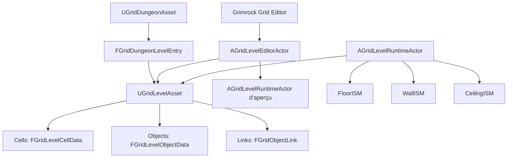
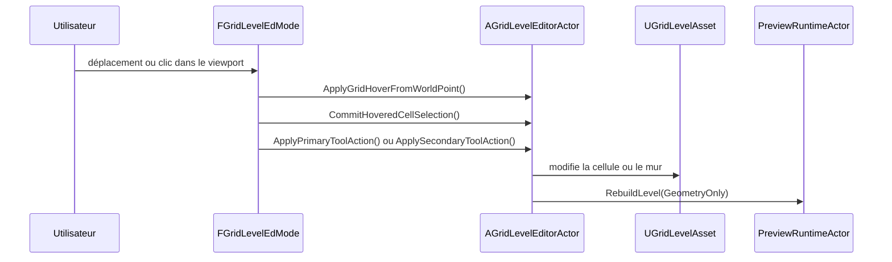
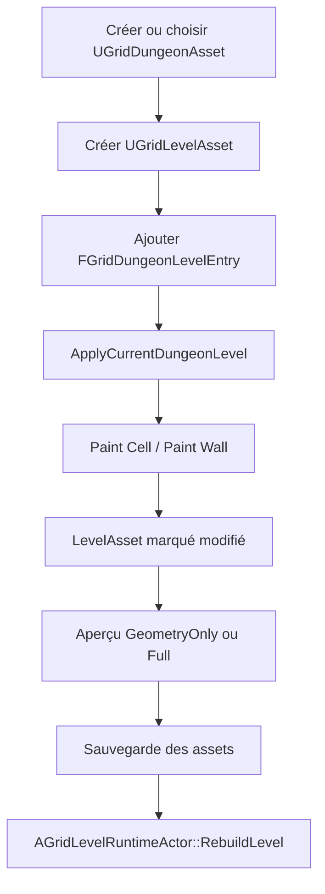
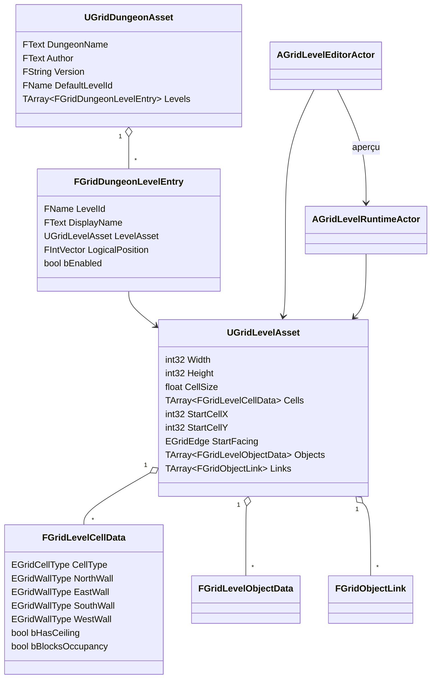

# Grimrock Prototype - Architecture noyau Donjon / Niveau / Grille

## 1. Objet du document

Ce document décrit le socle réellement implémenté pour organiser, éditer et générer un donjon quadrillé :

- `UGridDungeonAsset` et ses entrées de niveau ;
- `UGridLevelAsset`, ses cellules, objets et liens ;
- `AGridLevelEditorActor` et le mode **Grimrock Grid Editor** ;
- les outils **Paint Cell** et **Paint Wall** ;
- `AGridLevelRuntimeActor` et la génération de la géométrie.

Les systèmes de gameplay spécialisés ne sont pas détaillés ici : items, portes, réceptacles, passages secrets, pits, téléporteurs, triggers, inventaire et énigmes. Ils ne sont cités que lorsque leur présence explique une donnée ou une étape générique du noyau.

---

## 2. Séparation des responsabilités

```text
UGridDungeonAsset
  organise les niveaux et désigne un niveau par défaut.

UGridLevelAsset
  stocke les données persistantes d'un niveau.

AGridLevelEditorActor + Grimrock Grid Editor
  modifient le LevelAsset et pilotent son aperçu.

AGridLevelRuntimeActor
  lit le LevelAsset et construit la représentation runtime.
```

Règle centrale :

```text
DataAsset persistant != acteur éditeur != acteur runtime
```

`AGridLevelEditorActor` et `AGridLevelRuntimeActor` référencent les assets, mais ne doivent pas devenir une seconde source de vérité pour la grille.



---

## 3. Cartographie du code

| Domaine | Type | Déclaration | Implémentation | Rôle |
|---|---|---|---|---|
| Donjon | `UGridDungeonAsset`, `FGridDungeonLevelEntry` | `Source/GrimrockPrototype/Public/Core/GridDungeonAsset.h` | `Source/GrimrockPrototype/Private/Core/GridDungeonAsset.cpp` | Liste et résolution des niveaux. |
| Niveau | `UGridLevelAsset` | `Source/GrimrockPrototype/Public/Core/GridLevelAsset.h` | `Source/GrimrockPrototype/Private/Core/GridLevelAsset.cpp` | Grille et données persistantes du niveau. |
| Données | `FGridLevelCellData`, `FGridLevelObjectData`, `FGridObjectLink` | `Source/GrimrockPrototype/Public/Core/GridTypes.h` | Structures sans fichier `.cpp` dédié. | Cellules, objets placés et liens. |
| Runtime | `AGridLevelRuntimeActor` | `Source/GrimrockPrototype/Public/Runtime/GridLevelRuntimeActor.h` | `Source/GrimrockPrototype/Private/Runtime/GridLevelRuntimeActor.cpp` | Géométrie, requêtes de grille et objets runtime. |
| Éditeur | `AGridLevelEditorActor`, `EGridEditorTool` | `Source/GrimrockPrototypeEditor/Public/EditorTools/GridLevelEditorActor.h` | `Source/GrimrockPrototypeEditor/Private/EditorTools/GridLevelEditorActor.cpp` | Mutation du `LevelAsset`, sélection et aperçu. |
| Mode éditeur | `FGridLevelEdMode` | `Source/GrimrockPrototypeEditor/Public/EditorTools/GridLevelEdMode.h` | `Source/GrimrockPrototypeEditor/Private/EditorTools/GridLevelEdMode.cpp` | Entrées souris, survol et déclenchement des outils. |
| Interface du mode | `FGridLevelEdModeToolkit` | `Source/GrimrockPrototypeEditor/Public/EditorTools/GridLevelEdModeToolkit.h` | `Source/GrimrockPrototypeEditor/Private/EditorTools/GridLevelEdModeToolkit.cpp` | Panneaux Slate du mode. |
| Enregistrement | module `GrimrockPrototypeEditor` | - | `Source/GrimrockPrototypeEditor/GrimrockPrototypeEditor.cpp` | Enregistre le mode sous le libellé **Grimrock Grid Editor**. |

Le toolkit s'appuie aussi sur les panneaux de `Source/GrimrockPrototypeEditor/Private/EditorTools/Widgets/`, notamment la palette d'outils, la carte d'ensemble et la validation. Aucune classe de commandes ni personnalisation `IDetailCustomization` dédiée à ce mode n'a été trouvée.

---

## 4. `UGridDungeonAsset`

`UGridDungeonAsset` est un `UDataAsset` qui organise plusieurs `UGridLevelAsset`. Il ne contient pas lui-même de grille.


### 4.1. Données

```text
DungeonName
Author
Version
DefaultLevelId
Levels[]
```

Chaque `FGridDungeonLevelEntry` contient :

```text
LevelId
DisplayName
LevelAsset
LogicalPosition
bEnabled
```

`LogicalPosition` est une position logique dans le donjon, pas une position Unreal garantie.

### 4.2. API réelle

Les fonctions suivantes sont publiques. Les cinq premières sont `BlueprintCallable`; `FindLevelEntry()` est une API C++ publique.

```cpp
bool IsValidLevelId(FName LevelId) const;
UGridLevelAsset* GetLevelAssetById(FName LevelId) const;
UGridLevelAsset* GetDefaultLevelAsset() const;
FString GetDungeonDiagnostics() const;
FString GetTransitionDiagnostics() const;
const FGridDungeonLevelEntry* FindLevelEntry(FName LevelId) const;
```

Comportements importants :

- `IsValidLevelId()` exige une entrée existante, activée et associée à un `LevelAsset`.
- `GetLevelAssetById()` refuse les entrées désactivées.
- `GetDefaultLevelAsset()` utilise `DefaultLevelId`, puis se rabat sur le premier niveau activé possédant un identifiant non vide et un asset.
- `GetDungeonDiagnostics()` détecte notamment les assets manquants, les identifiants vides ou dupliqués, les positions logiques dupliquées et un niveau par défaut absent ou invalide.

Références : `GridDungeonAsset.h`, `GridDungeonAsset.cpp`.

---

## 5. `UGridLevelAsset`

`UGridLevelAsset` est le stockage persistant d'un niveau.


```text
Width, Height, CellSize
Cells[]
StartCellX, StartCellY, StartFacing
Objects[]
Links[]
```

`Cells` est indexé en ligne par :

```cpp
Index = Y * Width + X;
```

### 5.1. API réelle

Toutes les fonctions ci-dessous sont publiques C++. Seules `IsStartCellValid()` et `GetStartCell()` sont `BlueprintCallable`.

```cpp
bool IsStartCellValid() const;
FIntPoint GetStartCell() const;
void EnsureCellCount();
bool IsValidCoord(int32 X, int32 Y) const;
int32 GetIndex(int32 X, int32 Y) const;
const FGridLevelCellData& GetCell(int32 X, int32 Y) const;
FGridLevelCellData& GetCellMutable(int32 X, int32 Y);
void ClearLevel();
FGuid AddObject(const FGridLevelObjectData& NewObject);
bool RemoveObjectById(const FGuid& ObjectId);
void RemoveLinksForObject(const FGuid& ObjectId);
void EnsureObjectIds();
```

Précisions :

- `EnsureCellCount()` redimensionne `Cells` à `max(1, Width) * max(1, Height)` sans corriger `Width` ni `Height`.
- `GetCell()` et `GetCellMutable()` utilisent `check(IsValidCoord(...))`; l'appelant doit valider les coordonnées.
- `ClearLevel()` réinitialise les cellules, puis vide `Objects` et `Links`; il ne change pas les dimensions ni le départ.
- `AddObject()` crée un `ObjectId` si nécessaire.
- `RemoveObjectById()` supprime aussi les liens entrants et sortants via `RemoveLinksForObject()`.
- `EnsureObjectIds()` attribue uniquement les identifiants manquants.
- en build éditeur, les opérations de mutation concernées appellent `Modify()` et `MarkPackageDirty()`.

Références : `GridLevelAsset.h`, `GridLevelAsset.cpp`.

---

## 6. Cellules et murs

`FGridLevelCellData` est déclaré dans `GridTypes.h`.


```text
CellType
NorthWall
EastWall
SouthWall
WestWall
bHasCeiling
bBlocksOccupancy
```

Valeurs actuelles :

```text
EGridCellType : Empty, Floor, Pit, StairsUp, StairsDown, Teleporter
EGridWallType : None, Solid
```

Dans le noyau runtime :

- `Empty` n'est pas rendu et n'est pas praticable ;
- toute cellule non vide est praticable si `bBlocksOccupancy == false` ;
- `bHasCeiling` commande l'ajout d'une instance dans `CeilingISM` ;
- `bBlocksOccupancy` est consulté par `IsWalkableCell()`.

### 6.1. Règle réellement implémentée pour les murs partagés

Les quatre murs sont stockés indépendamment dans chaque cellule. Actuellement :

- `PaintSelectedWall()` modifie uniquement le bord sélectionné ;
- `ClearSelectedWall()` efface uniquement ce bord ;
- aucune synchronisation automatique n'écrit le bord opposé de la cellule voisine ;
- `RebuildLevel()` rend chaque bord non nul rencontré ; deux bords opposés renseignés peuvent donc produire deux instances superposées ;
- `GetWallOnEdge()` lit uniquement le bord demandé sur la cellule donnée ;
- `CanMove()` consulte le mur de la cellule source, pas le bord opposé de la cellule cible.

La cohérence des murs partagés est donc une convention de contenu, pas une invariance imposée par le code. L'illustration montre correctement les quatre champs d'une cellule, mais ne doit pas être interprétée comme une synchronisation bidirectionnelle.

`ValidateCurrentLevel()` agrège deux avertissements dédiés : nombre de bords renseignés des deux côtés, susceptibles de produire des instances superposées, et nombre de bords asymétriques dont le résultat de déplacement dépend de la cellule source.

---

## 7. Objets et liens dans le niveau

Cette section fixe seulement leur place dans le noyau.

### 7.1. `FGridLevelObjectData`

La structure persistante contient :

```text
ObjectId, Type, CellX, CellY, Edge, LocalYaw
ArchetypeId, ItemDefinitionAsset, ItemDefinitionId
bInitiallyEnabled, bInitiallyActive
Tag, Notes, OverrideReadableText, PaletteEntryId, Behavior
```

Un `UGridLevelAsset` stocke ces données dans `Objects`; il ne sérialise pas les acteurs runtime générés.

### 7.2. `FGridObjectLink`

La structure contient :

```text
SourceObjectId, TargetObjectId
SourceEvent, Command, Condition
ConditionItemDefinitionId, ConditionItemTag, ConditionItemType
ConditionCount, ConditionWeight, bInvertCondition
```

Les liens sont stockés dans `UGridLevelAsset::Links`. Leur exécution détaillée appartient à une documentation séparée.

Référence : `Source/GrimrockPrototype/Public/Core/GridTypes.h`.

---

## 8. `AGridLevelEditorActor`

`AGridLevelEditorActor` appartient au module `GrimrockPrototypeEditor`. Il référence :

```text
LevelAsset
DungeonAsset
CurrentDungeonLevelId
PreviewRuntimeActor
ObjectPalette
```

Il maintient aussi la sélection (`SelectedCellX/Y`, `SelectedEdge`), le survol (`HoveredCellX/Y`, `HoveredEdge`, `HoveredObjectId`) et l'outil actif.

### 8.1. Outils

`EGridEditorTool` est déclaré dans `GridLevelEditorActor.h` :

```text
Select
PaintCell
PaintWall
PaintObject
Erase
Link
```

Les fonctions publiques du noyau d'édition comprennent :

```cpp
EnsureLevelReady();
RebuildPreview();
ApplyCurrentDungeonLevel();
LoadDefaultDungeonLevelInEditor();
CreateAndAddDungeonLevel(...);
ClearSelectedCell();
PaintSelectedWall();
ClearSelectedWall();
ApplyViewportHitSelection(...);
SelectCellFromOverview(...);
CommitHoveredCellSelection();
ApplyPrimaryToolAction();
ApplySecondaryToolAction();
EraseAtSelection();
ValidateCurrentLevel();
```

Elles sont déclarées dans `GridLevelEditorActor.h` et implémentées dans `GridLevelEditorActor.cpp`. Elles sont publiques et, selon la fonction, `BlueprintCallable` et parfois `CallInEditor`.

Deux helpers importants ne constituent pas une API publique :

```cpp
PaintSelectedCell();       // private
RebuildGeometryPreview();  // private
```

### 8.2. Mutations du `LevelAsset`

Le code confirme que l'acteur éditeur modifie directement le `LevelAsset` :

- `PaintSelectedCell()` écrit `CellType`, `bHasCeiling` et `bBlocksOccupancy` ;
- `PaintSelectedWall()` écrit le champ de mur correspondant à `SelectedEdge` ;
- `ClearSelectedWall()` remet ce champ à `None` ;
- `ClearSelectedCell()` remet toute la cellule à sa valeur par défaut et supprime les objets de la sélection ;
- ces opérations appellent `Modify()`, marquent le package sale et reconstruisent l'aperçu géométrique.

`EnsureLevelReady()` appelle `EnsureCellCount()`, `EnsureObjectIds()` puis `RebuildPreview()`.

### 8.3. Sélection et actions

- `ApplyViewportHitSelection()` convertit un point monde en survol, puis valide ce survol.
- `SelectCellFromOverview()` sélectionne directement une cellule valide et place `SelectedEdge` à `None`.
- `CommitHoveredCellSelection()` copie cellule et bord survolés vers la sélection.
- `ApplyPrimaryToolAction()` distribue l'action selon `ActiveTool`.
- `ApplySecondaryToolAction()` efface une cellule, un mur ou des objets selon l'outil.
- `EraseAtSelection()` tente d'abord les objets, puis le mur sélectionné, puis une cellule non vide sans objet ni mur.

Références : `GridLevelEditorActor.h`, `GridLevelEditorActor.cpp`.

---

## 9. Grimrock Grid Editor

Le mode est `FGridLevelEdMode`, identifié par `EM_GrimrockGridLevelEdMode`. Le module éditeur l'enregistre sous le libellé **Grimrock Grid Editor**.


Flux réel :



`FGridLevelEdMode` gère les entrées souris, le survol, le glisser-peindre et évite de repeindre plusieurs fois la même cellule, le même bord et le même outil. Il délègue les mutations à `AGridLevelEditorActor`.

`FGridLevelEdModeToolkit` construit l'interface Slate et utilise les panneaux de `EditorTools/Widgets`. Il ne remplace pas la logique de mutation portée par l'acteur éditeur.

---

## 10. Paint Cell et Paint Wall

| Outil | Champs écrits | Contraintes |
|---|---|---|
| Paint Cell | `CellType`, `bHasCeiling`, `bBlocksOccupancy` | Utilise `PaintCellType`, `bPaintCellHasCeiling`, `bPaintCellBlocksOccupancy`. |
| Paint Wall | un seul parmi `NorthWall`, `EastWall`, `SouthWall`, `WestWall` | Refuse une cellule `Empty`; exige un `SelectedEdge` cardinal. |

Le clic principal appelle `ApplyPrimaryToolAction()` :

- `PaintCell` appelle le helper privé `PaintSelectedCell()` ;
- `PaintWall` appelle `PaintSelectedWall()`.

Le clic secondaire appelle `ApplySecondaryToolAction()` :

- `PaintCell` appelle `ClearSelectedCell()` ;
- `PaintWall` appelle `ClearSelectedWall()`.

Les deux chemins reconstruisent seulement la géométrie avec `RebuildLevel(EGridRuntimeRebuildMode::GeometryOnly)`. Ils ne reconstruisent pas les acteurs d'objets.

---

## 11. Aperçu éditeur

`PreviewRuntimeActor` est un `AGridLevelRuntimeActor` référencé par l'acteur éditeur. `ResolvePreviewRuntimeActor()` utilise la référence existante ou recherche le premier acteur de cette classe dans le monde éditeur.

Deux chemins existent :

```text
RebuildPreview()
  assigne LevelAsset,
  synchronise les archétypes de la palette,
  appelle RebuildLevel() en mode Full.

RebuildGeometryPreview()
  assigne LevelAsset,
  appelle RebuildLevel(GeometryOnly).
```

En monde non jeu, un rebuild complet peut reconstruire les objets d'aperçu via `UGridEditorPreviewComponent`. Un rebuild `GeometryOnly` conserve les acteurs/objets d'aperçu et ne reconstruit que `FloorISM`, `WallISM` et `CeilingISM`.

`EGridRuntimeRebuildMode::ObjectsOnly` est une valeur héritée conservée pour compatibilité sérialisée. Aucun appel C++ actuel ne l'utilise; son comportement ne doit pas être considéré comme une API stabilisée.

L'illustration de flux éditeur reste valable si « Preview Runtime » est compris comme un véritable `AGridLevelRuntimeActor` utilisé en monde éditeur.

---

## 12. `AGridLevelRuntimeActor`

`AGridLevelRuntimeActor` appartient au module runtime `GrimrockPrototype`.


### 12.1. Composants et références

```text
LevelAsset, DungeonAsset, CurrentDungeonLevelId
ObjectArchetypes
FloorMesh, WallMesh, CeilingMesh
FloorISM, WallISM, CeilingISM
```

`FloorISM`, `WallISM` et `CeilingISM` sont des `UInstancedStaticMeshComponent` créés dans le constructeur.

### 12.2. API de grille exposée

Les fonctions suivantes sont publiques et `BlueprintCallable` :

```cpp
RebuildLevel(EGridRuntimeRebuildMode RebuildMode = Full);
ClearVisuals(EGridRuntimeRebuildMode RebuildMode = Full);
GetCellCenterWorld(...);
IsValidCell(...);
GetCell(...);
IsWalkableCell(...);
TryGetNeighborCell(...);
GetWallOnEdge(...);
CanMove(...);
ShouldHideCellFloor(...);
TryInteractAtEdge(...);
```

`CellToWorld()` existe mais est `protected`; il ne doit pas être présenté comme API publique. `GetCellCenterWorld()` est l'aide publique qui inclut la position de l'acteur.

Les fonctions suivantes sont publiques C++ mais non `BlueprintCallable` :

```cpp
RebuildRuntimeObjects();
AddRuntimeObjectActor(...);
FindObjectArchetype(...);
```

Déclaration : `GridLevelRuntimeActor.h`. Implémentation : `GridLevelRuntimeActor.cpp`.

### 12.3. Génération de la géométrie

`RebuildLevel()` :

1. appelle `ClearVisuals()` avec le même mode ;
2. vérifie `LevelAsset` et les trois composants ISM ;
3. appelle `LevelAsset->EnsureCellCount()` ;
4. affecte les meshes aux composants ;
5. parcourt toutes les cellules non vides ;
6. ajoute le sol sauf si `ShouldHideCellFloor()` le masque ;
7. ajoute le plafond si `bHasCeiling` ;
8. ajoute chaque mur `Solid` avec `AddEdgeInstance()` ;
9. en rebuild complet seulement, reconstruit les objets d'aperçu en éditeur ou les objets runtime en monde jeu.

`RebuildRuntimeObjects()` parcourt `LevelAsset->Objects`, traite séparément les objets de type `Item`, filtre les objets non générables et appelle `AddRuntimeObjectActor()` pour les autres.

L'illustration runtime reste correcte pour un rebuild complet. En mode `GeometryOnly`, la branche « objets runtime » n'est pas exécutée.

### 12.4. Requêtes de déplacement

- `IsValidCell()` délègue à `LevelAsset->IsValidCoord()`.
- `IsWalkableCell()` exige une cellule valide, non `Empty` et non bloquante.
- `TryGetNeighborCell()` applique le décalage cardinal et valide la destination.
- `GetWallOnEdge()` retourne `Solid` pour une cellule ou une direction invalide.
- `CanMove()` valide source et destination, consulte le système de porte, puis le mur de la cellule source.

---

## 13. Gestion des niveaux du donjon

### 13.1. Appliquer un niveau

`ApplyCurrentDungeonLevel()` :

1. utilise `CurrentDungeonLevelId`, ou `DefaultLevelId` s'il est vide ;
2. recherche l'entrée avec `FindLevelEntry()` ;
3. exige une entrée activée avec un `LevelAsset` ;
4. assigne `CurrentDungeonLevelId` et `LevelAsset` ;
5. synchronise et reconstruit le `PreviewRuntimeActor`.

`LoadDefaultDungeonLevelInEditor()` charge le niveau par défaut s'il est valide, sinon le premier niveau activé possédant un asset.

### 13.2. Créer et ajouter un niveau

`CreateAndAddDungeonLevel()` est publique et `BlueprintCallable`, mais son travail de création d'asset est protégé par `WITH_EDITOR`.

Elle :

- refuse un `LevelId` ou une `LogicalPosition` déjà utilisés ;
- crée un `UGridLevelAsset` sous `/Game/GrimrockPrototype/Core/DataAssets/GrimrockLevels` ;
- initialise une grille `32 x 32`, `CellSize = 200`, puis `EnsureCellCount()` ;
- place le départ en `(1,1)`, orienté au nord, et initialise cette cellule en `Floor` praticable avec plafond ;
- ajoute une entrée activée au `DungeonAsset` ;
- définit le niveau par défaut si nécessaire ;
- applique le nouveau niveau, synchronise l'aperçu et sauvegarde les packages ;
- restaure l'état précédent et n'enregistre pas le nouvel asset si l'application échoue.

### 13.3. Supprimer un niveau

Aucune fonction dédiée de suppression d'une entrée de donjon n'est implémentée dans `UGridDungeonAsset` ou `AGridLevelEditorActor`. La suppression reste une opération manuelle sur `DungeonAsset->Levels`, avec mise à jour de `DefaultLevelId` et traitement séparé de l'éventuel asset devenu inutilisé.

---

## 14. Cycle de vie d'un niveau



---

## 15. Diagramme de classes



---

## 16. Règles d'architecture

1. Les données durables vivent dans `UGridDungeonAsset` et `UGridLevelAsset`.
2. `AGridLevelEditorActor` modifie le `LevelAsset`; il n'est pas une source persistante parallèle.
3. `AGridLevelRuntimeActor` lit le `LevelAsset` et génère une représentation.
4. Paint Cell écrit uniquement les propriétés internes de cellule.
5. Paint Wall écrit uniquement le bord sélectionné; le bord voisin n'est pas synchronisé.
6. Les appels à `GetCell()` et `GetCellMutable()` doivent être précédés d'une validation de coordonnées.
7. La conversion publique vers le centre monde doit utiliser `GetCellCenterWorld()`; `CellToWorld()` est un helper protégé du runtime.
8. Un aperçu `GeometryOnly` ne doit pas être confondu avec une reconstruction complète des objets.

---

## 17. Checklist de validation

### Donjon

- [ ] `LevelId` non vide et unique.
- [ ] `LogicalPosition` unique lorsque le workflow éditeur l'exige.
- [ ] chaque niveau activé possède un `LevelAsset`.
- [ ] `DefaultLevelId` référence un niveau activé, ou le fallback est accepté explicitement.

### Niveau

- [ ] `Width > 0`, `Height > 0`, `CellSize > 0`.
- [ ] `Cells.Num() == max(1, Width) * max(1, Height)`.
- [ ] la cellule de départ est dans la grille, non vide et non bloquante.

### Cellules et murs

- [ ] les cellules destinées au déplacement ne sont ni `Empty` ni bloquantes.
- [ ] les murs partagés respectent une convention de contenu explicite.
- [ ] aucun doublon visuel involontaire n'est créé par deux murs opposés superposés.
- [ ] les déplacements ne dépendent pas d'un mur renseigné uniquement sur la cellule cible.

### Objets et liens

- [ ] chaque `ObjectId` est valide et unique.
- [ ] les coordonnées des objets sont dans la grille.
- [ ] les objets nécessitant un bord ont un `Edge` cardinal.
- [ ] chaque `SourceObjectId` et `TargetObjectId` référence un objet existant.

`ValidateCurrentLevel()` contrôle les entrées du donjon, les dimensions, la cardinalité de `Cells`, le départ, les murs partagés, les objets, les archétypes et les liens. `GetDungeonDiagnostics()` fournit une synthèse textuelle complémentaire des entrées de donjon.

---

## 18. Workflows

### 18.1. Créer un donjon

1. Créer un `UGridDungeonAsset`.
2. Renseigner `DungeonName`, `Author` et `Version`.
3. Assigner le `DungeonAsset` à un `AGridLevelEditorActor`.
4. Utiliser `CreateAndAddDungeonLevel()` ou créer manuellement un `UGridLevelAsset` et une entrée.
5. Définir `DefaultLevelId`.
6. Appliquer le niveau avec `ApplyCurrentDungeonLevel()`.
7. Peindre les cellules et les murs, puis sauvegarder les assets.

### 18.2. Ajouter un niveau

1. Choisir un `LevelId` et une `LogicalPosition` libres.
2. Créer le `UGridLevelAsset`.
3. Ajouter un `FGridDungeonLevelEntry` activé.
4. Définir `CurrentDungeonLevelId`.
5. appeler `ApplyCurrentDungeonLevel()`.
6. Éditer et sauvegarder.

Le bouton du toolkit utilise `CreateAndAddDungeonLevel()` pour automatiser ces étapes.

### 18.3. Supprimer un niveau

1. Retirer manuellement l'entrée de `DungeonAsset->Levels`.
2. Corriger `DefaultLevelId` si nécessaire.
3. Appliquer un autre niveau dans l'acteur éditeur.
4. Sauvegarder le `DungeonAsset`.
5. Supprimer le `UGridLevelAsset` séparément seulement s'il n'est plus référencé.

---

## 19. Index des illustrations

| Illustration | Section | Fichier |
|---|---|---|
| Le donjon comme classeur | `UGridDungeonAsset` | `../Images/core_20_1_dungeon_binder.svg` |
| Le niveau comme carte quadrillée | `UGridLevelAsset` | `../Images/core_20_2_level_grid_map.svg` |
| Une cellule et ses quatre murs | Cellules et murs | `../Images/core_20_3_cell_four_walls.svg` |
| Flux éditeur | Grimrock Grid Editor | `../Images/core_20_4_editor_flow.svg` |
| Flux runtime | `AGridLevelRuntimeActor` | `../Images/core_20_5_runtime_flow.svg` |

---

## 20. Résumé du noyau

```text
UGridDungeonAsset
  organise et résout les niveaux.

UGridLevelAsset
  stocke dimensions, cellules, départ, objets et liens.

FGridLevelCellData
  stocke le type de cellule, quatre murs indépendants,
  le plafond et le blocage d'occupation.

AGridLevelEditorActor
  modifie le LevelAsset et pilote un runtime d'aperçu.

FGridLevelEdMode + FGridLevelEdModeToolkit
  fournissent les interactions viewport et l'interface du mode.

AGridLevelRuntimeActor
  génère FloorISM, WallISM, CeilingISM et, lors d'un rebuild complet,
  les objets d'aperçu ou runtime.
```

Le document est volontairement limité au noyau Donjon / Niveau / Grille. L'architecture des archétypes, de la palette et des objets placés est détaillée dans [`OBJECT_ARCHETYPES_AND_PLACED_OBJECTS.md`](OBJECT_ARCHETYPES_AND_PLACED_OBJECTS.md). Les comportements spécialisés des objets et des liens restent dans des documents séparés.
