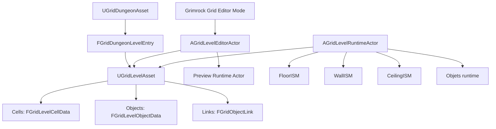
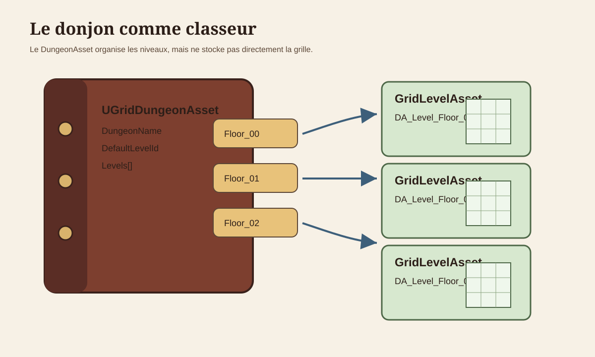
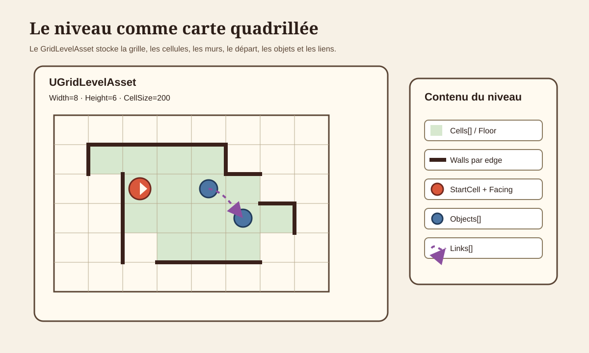
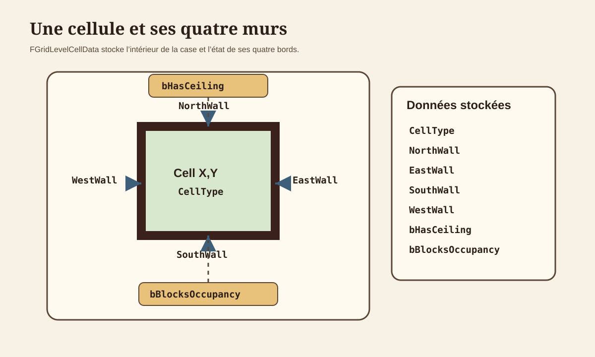
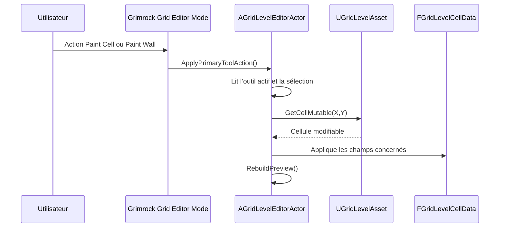
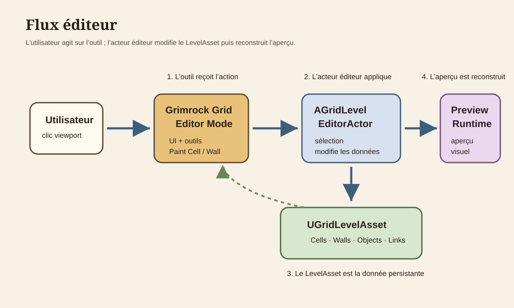
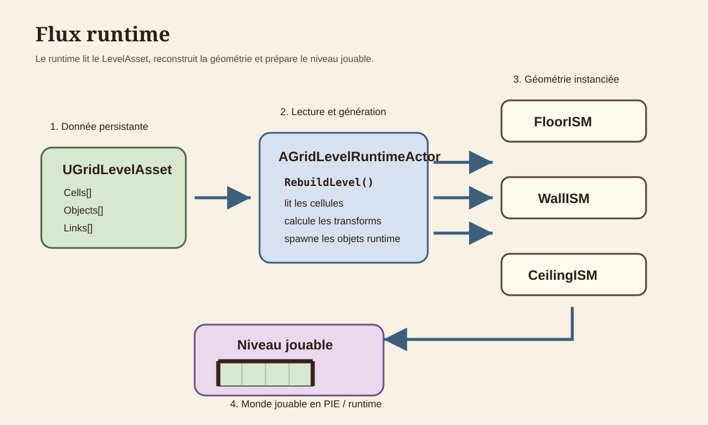
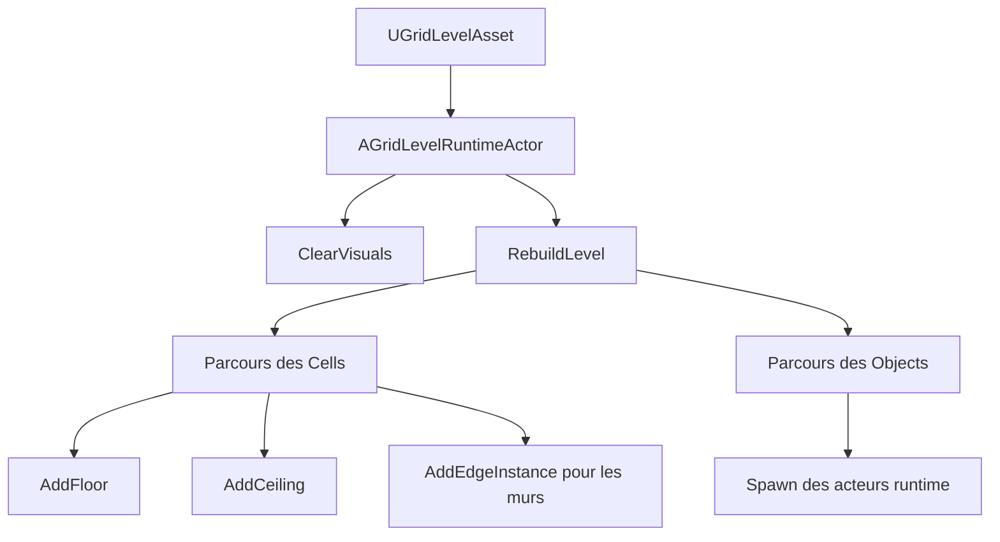
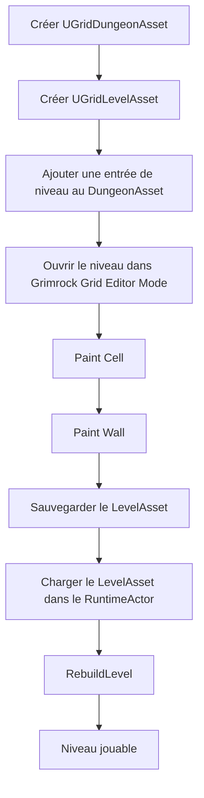
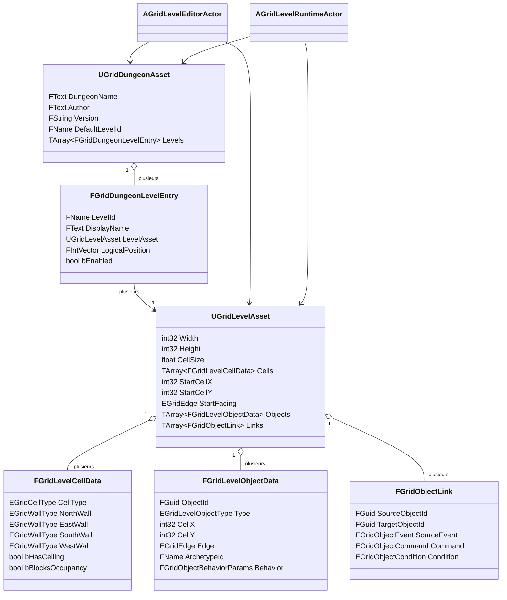

# Grimrock Prototype — Architecture noyau Donjon / Niveau / Grille

## 1. Objet du document

Ce document définit le noyau structurel du système de donjon de **Grimrock Prototype**. Il sert de référence pour comprendre comment un donjon est décrit, édité puis exécuté en runtime.

Il couvre :

- `UGridDungeonAsset` ;
- `UGridLevelAsset` ;
- les cellules et leurs murs ;
- les objets et liens en tant que données de niveau ;
- `AGridLevelEditorActor` ;
- `Grimrock Grid Editor Mode` ;
- les outils **Paint Cell** et **Paint Wall** ;
- `AGridLevelRuntimeActor`.

Il ne détaille pas encore les systèmes de gameplay avancés : items, portes, réceptacles, passages secrets, pits, téléporteurs, triggers, boutons, leviers, plaques de pression, inventaire ou énigmes. Ces éléments doivent être documentés séparément après stabilisation du noyau.

Objectif : clarifier où vivent les données persistantes, quelles classes C++ sont responsables de chaque étape, comment l’éditeur modifie les niveaux, et comment le runtime génère le monde jouable.

---

## 2. Principe général

Le prototype repose sur quatre couches distinctes :

```text
1. Données persistantes
   DataAssets stockés dans le projet Unreal.

2. Données de niveau
   Cellules, murs, objets, liens et position de départ stockés dans un LevelAsset.

3. Couche d’édition
   Outils et acteurs qui modifient le LevelAsset.

4. Couche runtime
   Acteurs et composants qui lisent le LevelAsset et génèrent le monde jouable.
```

Règle centrale :

```text
Les DataAssets décrivent le donjon.
Les acteurs éditeur modifient ces assets.
Les acteurs runtime exécutent ces assets.
```

Il faut donc toujours distinguer :

```text
Donnée source ≠ donnée placée ≠ acteur d’édition ≠ acteur runtime
```

---

## 3. Architecture générale



Lecture du schéma :

- `UGridDungeonAsset` organise les niveaux du donjon.
- `FGridDungeonLevelEntry` relie un identifiant logique à un `UGridLevelAsset`.
- `UGridLevelAsset` stocke les données du niveau.
- `AGridLevelEditorActor` modifie le `UGridLevelAsset`.
- `AGridLevelRuntimeActor` lit le `UGridLevelAsset` et génère le niveau jouable.

---

## 4. Cartographie des classes C++ responsables

| Domaine | Classe / structure | Fichier | Responsabilité |
|---|---|---|---|
| Donjon | `UGridDungeonAsset` | `Source/GrimrockPrototype/Public/Core/GridDungeonAsset.h` | Stocke les métadonnées du donjon et la liste des niveaux. |
| Entrée de niveau | `FGridDungeonLevelEntry` | `GridDungeonAsset.h` | Relie un `LevelId` à un `UGridLevelAsset`. |
| Niveau | `UGridLevelAsset` | `Source/GrimrockPrototype/Public/Core/GridLevelAsset.h` | Stocke dimensions, cellules, objets, liens et position de départ. |
| Cellule | `FGridLevelCellData` | `Source/GrimrockPrototype/Public/Core/GridTypes.h` | Stocke type de cellule, quatre murs, plafond et blocage d’occupation. |
| Objet placé | `FGridLevelObjectData` | `GridTypes.h` | Stocke un objet placé sous forme de donnée. |
| Lien logique | `FGridObjectLink` | `GridTypes.h` | Stocke une relation logique entre deux objets placés. |
| Acteur éditeur | `AGridLevelEditorActor` | `Source/GrimrockPrototypeEditor/Public/EditorTools/GridLevelEditorActor.h` | Modifie un LevelAsset et reconstruit l’aperçu. |
| Outils éditeur | `EGridEditorTool` | `GridLevelEditorActor.h` | Définit Select, PaintCell, PaintWall, PaintObject, Erase, Link. |
| Acteur runtime | `AGridLevelRuntimeActor` | `Source/GrimrockPrototype/Public/Runtime/GridLevelRuntimeActor.h` | Lit un LevelAsset et génère le niveau jouable. |
| Rendu runtime | `FloorISM`, `WallISM`, `CeilingISM` | `GridLevelRuntimeActor.h` | Composants d’instances pour sols, murs et plafonds. |

---

## 5. `UGridDungeonAsset`

`UGridDungeonAsset` représente un donjon complet. Il ne stocke pas directement la grille ; il stocke les métadonnées du donjon et les références vers les niveaux.



```text
UGridDungeonAsset = un classeur contenant plusieurs niveaux de donjon.
```

Structure principale :

```text
DungeonName
Author
Version
DefaultLevelId
Levels[]
```

Chaque élément de `Levels[]` est un `FGridDungeonLevelEntry` :

```text
LevelId
DisplayName
LevelAsset
LogicalPosition
bEnabled
```

Exemple :

```text
LevelId         = Floor_00
DisplayName     = Entrée
LevelAsset      = DA_Level_Dungeon01_Floor00
LogicalPosition = X=0, Y=0, Z=0
bEnabled        = true
```

Responsabilités :

- identifier le donjon ;
- lister les niveaux disponibles ;
- définir le niveau par défaut ;
- retrouver un niveau par `LevelId` ;
- fournir des diagnostics.

`UGridDungeonAsset` ne doit pas stocker directement les cellules ou les murs, générer la géométrie runtime, éditer les niveaux ni spawner des acteurs de gameplay.

---

## 6. `UGridLevelAsset`

`UGridLevelAsset` représente un niveau individuel du donjon. C’est l’asset central d’un étage ou d’une zone de type Grimrock.



Structure principale :

```text
UGridLevelAsset
  ├─ Width
  ├─ Height
  ├─ CellSize
  ├─ Cells[]
  ├─ StartCellX
  ├─ StartCellY
  ├─ StartFacing
  ├─ Objects[]
  └─ Links[]
```

Fonctions importantes :

```cpp
EnsureCellCount()
IsValidCoord()
GetIndex()
GetCell()
GetCellMutable()
ClearLevel()
AddObject()
RemoveObjectById()
RemoveLinksForObject()
EnsureObjectIds()
```

`UGridLevelAsset` est la source persistante du niveau. Il doit rester indépendant de la représentation visuelle runtime.

---

## 7. Cellules : `FGridLevelCellData`

Une cellule représente une case de la grille. Elle stocke à la fois la nature intérieure de la case et l’état des murs sur ses quatre côtés.



Structure :

```text
CellType
NorthWall
EastWall
SouthWall
WestWall
bHasCeiling
bBlocksOccupancy
```

Schéma logique :

```text
                  NorthWall
              ┌───────────────┐
              │               │
 WestWall     │   Cell X,Y    │    EastWall
              │               │
              └───────────────┘
                  SouthWall
```

`CellType` définit la nature principale de la cellule :

```text
Empty
Floor
Pit
StairsUp
StairsDown
Teleporter
```

Dans le noyau, la distinction minimale est :

```text
Empty = absence de case jouable / espace vide
Floor = case jouable standard
```

Chaque mur utilise `EGridWallType` :

```text
None
Solid
```

`bHasCeiling` indique si le runtime doit générer un plafond. `bBlocksOccupancy` indique si la cellule bloque l’occupation.

---

## 8. Coordonnées et échelle

La grille utilise des coordonnées entières :

```text
X = coordonnée horizontale de grille
Y = coordonnée verticale de grille
```

Exemple de grille 4x4 :

```text
Y=3   [0,3] [1,3] [2,3] [3,3]
Y=2   [0,2] [1,2] [2,2] [3,2]
Y=1   [0,1] [1,1] [2,1] [3,1]
Y=0   [0,0] [1,0] [2,0] [3,0]

       X=0   X=1   X=2   X=3
```

`CellSize` convertit les coordonnées de grille en unités Unreal. Par exemple, `CellSize = 200.0` signifie qu’une cellule logique occupe un carré de 200 x 200 unités Unreal.

La conversion grille -> monde doit rester centralisée dans les fonctions d’aide prévues, par exemple `GetCellCenterWorld()` et `CellToWorld()`.

---

## 9. Paint Cell et Paint Wall

Les deux outils modifient des données de cellule dans `UGridLevelAsset`, mais ils ne modifient pas la même partie de la cellule.

```text
Paint Cell = modifie l’intérieur de la case.
Paint Wall = modifie un côté de la case.
```

| Outil | Données modifiées | Champs éditeur principaux |
|---|---|---|
| Paint Cell | `CellType`, `bHasCeiling`, `bBlocksOccupancy` | `PaintCellType`, `bPaintCellHasCeiling`, `bPaintCellBlocksOccupancy`, `SelectedCellX`, `SelectedCellY` |
| Paint Wall | `NorthWall`, `EastWall`, `SouthWall`, `WestWall` selon `SelectedEdge` | `PaintWallType`, `SelectedCellX`, `SelectedCellY`, `SelectedEdge` |

Flux commun :



Règle de conception : ces outils doivent rester simples. Ils ne doivent pas contenir de logique liée aux items, portes, réceptacles, triggers ou énigmes runtime.

### Murs partagés

Un mur peut être géométriquement partagé entre deux cellules :

```text
Cell(X,Y).EastWall
```

correspond physiquement à :

```text
Cell(X+1,Y).WestWall
```

Le projet doit définir officiellement une seule règle :

```text
Option A : Paint Wall modifie uniquement le bord de la cellule sélectionnée.
Option B : Paint Wall synchronise aussi le bord opposé de la cellule voisine.
```

Cette règle doit être appliquée partout : peinture dans l’éditeur, lecture runtime des murs, validation, diagnostics et futurs systèmes d’import/export.

---

## 10. Objets et liens comme données de niveau

Les objets et les liens ne sont pas détaillés dans ce document, mais leur lieu de stockage doit être clair.

### 10.1. Objets placés

Un objet placé est stocké comme donnée dans `UGridLevelAsset::Objects` :

```cpp
FGridLevelObjectData
```

Champs principaux :

```text
ObjectId
Type
CellX
CellY
Edge
LocalYaw
ArchetypeId
ItemDefinitionAsset
ItemDefinitionId
bInitiallyEnabled
bInitiallyActive
Tag
Notes
PaletteEntryId
Behavior
```

Un niveau ne stocke pas directement des acteurs Blueprint. Il stocke des données d’objets placés ; les acteurs runtime sont générés plus tard à partir de ces données.

```text
FGridLevelObjectData = donnée persistante du niveau
Acteur runtime = objet d’exécution généré
```

### 10.2. Liens logiques

Un lien est stocké dans `UGridLevelAsset::Links` :

```cpp
FGridObjectLink
```

Structure conceptuelle :

```text
SourceObjectId
TargetObjectId
SourceEvent
Command
Condition
Paramètres de condition
bInvertCondition
```

Les liens appartiennent au `UGridLevelAsset`. Ils ne doivent pas être stockés uniquement dans des acteurs Blueprint.

---

## 11. `AGridLevelEditorActor` et Grimrock Grid Editor Mode

`AGridLevelEditorActor` est l’acteur côté éditeur utilisé pour manipuler un `UGridLevelAsset`. Il n’est pas la source de vérité : la source de vérité reste le `UGridLevelAsset`.

`Grimrock Grid Editor Mode` fournit l’interface utilisateur et les interactions de viewport. Il doit appeler `AGridLevelEditorActor` plutôt que dupliquer la logique de modification du niveau.



Références principales de l’acteur éditeur :

```text
LevelAsset
DungeonAsset
CurrentDungeonLevelId
PreviewRuntimeActor
```

État de sélection :

```text
SelectedCellX
SelectedCellY
SelectedEdge
HoveredCellX
HoveredCellY
HoveredEdge
HoveredObjectId
```

Outils d’édition :

```text
Select
PaintCell
PaintWall
PaintObject
Erase
Link
```

Fonctions importantes du noyau :

```cpp
EnsureLevelReady()
RebuildPreview()
ApplyCurrentDungeonLevel()
LoadDefaultDungeonLevelInEditor()
CreateAndAddDungeonLevel()
ClearSelectedCell()
PaintSelectedWall()
ClearSelectedWall()
ApplyViewportHitSelection()
SelectCellFromOverview()
CommitHoveredCellSelection()
ApplyPrimaryToolAction()
ApplySecondaryToolAction()
EraseAtSelection()
ValidateCurrentLevel()
```

---

## 12. `AGridLevelRuntimeActor`

`AGridLevelRuntimeActor` lit un `UGridLevelAsset` et construit le niveau jouable.



Il est responsable de la géométrie runtime, des sols, murs, plafonds, du spawn des objets runtime, des fonctions d’aide runtime, des vérifications de déplacement et du routage d’interaction de base.

Références principales :

```text
LevelAsset
DungeonAsset
CurrentDungeonLevelId
ObjectArchetypes
FloorMesh
WallMesh
CeilingMesh
```

Composants de géométrie runtime :

```text
FloorISM
WallISM
CeilingISM
```

Fonctions importantes :

```cpp
RebuildLevel()
ClearVisuals()
GetCellCenterWorld()
IsValidCell()
GetCell()
IsWalkableCell()
TryGetNeighborCell()
GetWallOnEdge()
CanMove()
ShouldHideCellFloor()
TryInteractAtEdge()
RebuildRuntimeObjects()
AddRuntimeObjectActor()
FindObjectArchetype()
```

Flux de génération runtime :



---

## 13. Cycle de vie complet d’un niveau



---

## 14. Diagramme de classes récapitulatif



---

## 15. Règles d’architecture du noyau

1. Les données durables vivent dans `UGridDungeonAsset` et `UGridLevelAsset`, pas dans des acteurs arbitraires placés dans une map Unreal, sauf cas explicitement documenté.
2. `AGridLevelEditorActor` modifie les données de `UGridLevelAsset` ; il ne doit pas devenir une deuxième source de vérité.
3. `AGridLevelRuntimeActor` lit `UGridLevelAsset` et génère la géométrie runtime ; il ne doit pas être traité comme l’éditeur principal des données persistantes.
4. Paint Cell et Paint Wall doivent écrire uniquement les données de cellule ou de mur. Ils ne doivent pas contenir de logique d’objets de gameplay.
5. La conversion grille -> monde doit passer par les fonctions d’aide prévues.
6. Le comportement des murs partagés doit être officiel et appliqué partout.
7. Toute copie de donnée depuis un asset source vers une donnée placée doit être explicite et documentée. Si une donnée est un override local, l’éditeur devrait à terme l’afficher comme tel.

---

## 16. Checklist de validation du noyau

Un outil de validation du noyau devrait vérifier :

```text
Donjon :
- DefaultLevelId est valide.
- Tous les niveaux activés ont un LevelAsset valide.
- Les LevelId sont uniques.

Niveau :
- Width > 0.
- Height > 0.
- CellSize > 0.
- Cells.Num == Width * Height.
- StartCell est dans les limites.
- StartCell est jouable.

Cellules :
- Les données de cellule sont valides.
- Les murs utilisent des valeurs d’énumération connues.
- Les murs partagés sont cohérents si la synchronisation est requise.

Objets :
- Les ObjectId sont valides.
- Les coordonnées d’objet sont dans les limites.
- Le placement sur edge est cohérent.

Liens :
- SourceObjectId existe.
- TargetObjectId existe.
```

---

## 17. Workflows de gestion d’un donjon

### 17.1. Créer un nouveau donjon

1. Créer un `UGridDungeonAsset`, par exemple `DA_Dungeon_MonDonjon`.
2. Configurer `DungeonName`, `Author`, `Version` et `DefaultLevelId`.
3. Créer un premier `UGridLevelAsset`, par exemple `DA_Level_MonDonjon_00`.
4. Configurer `Width`, `Height`, `CellSize`, `StartCellX`, `StartCellY` et `StartFacing`.
5. Ajouter une entrée au DungeonAsset :

```text
LevelId = Floor_00
DisplayName = Entrée
LevelAsset = DA_Level_MonDonjon_00
LogicalPosition = 0,0,0
bEnabled = true
```

6. Définir `DefaultLevelId = Floor_00`.
7. Dans la map d’édition, configurer `BP_GridLevelEditorActor` avec le DungeonAsset et `CurrentDungeonLevelId = Floor_00`.
8. Appliquer le niveau courant, peindre cellules et murs, puis sauvegarder le DungeonAsset, le LevelAsset et la map si nécessaire.

### 17.2. Ajouter un niveau

1. Créer un nouveau `UGridLevelAsset`.
2. Ajouter un `FGridDungeonLevelEntry` dans le DungeonAsset.
3. Choisir un `LevelId` unique.
4. Assigner le nouveau LevelAsset.
5. Appliquer ce niveau dans `AGridLevelEditorActor`.
6. Peindre cellules et murs.
7. Sauvegarder le DungeonAsset et le LevelAsset.

### 17.3. Supprimer un niveau

1. Ouvrir le `UGridDungeonAsset`.
2. Supprimer l’entrée `FGridDungeonLevelEntry` correspondante.
3. Si ce niveau était le niveau par défaut, modifier `DefaultLevelId`.
4. Sauvegarder le DungeonAsset.
5. Supprimer le `UGridLevelAsset` uniquement si le niveau doit vraiment disparaître du projet.
6. Vérifier les maps éditeur et runtime afin d’éliminer les références obsolètes.

---

## 18. Index des illustrations

Les illustrations principales sont placées dans les sections où elles sont utiles. Cet index sert uniquement de repère.

| Illustration | Emplacement principal | Fichier |
|---|---|---|
| Le donjon comme classeur | Section 5 — `UGridDungeonAsset` | `../Images/core_20_1_dungeon_binder.svg` |
| Le niveau comme carte quadrillée | Section 6 — `UGridLevelAsset` | `../Images/core_20_2_level_grid_map.svg` |
| Une cellule et ses quatre murs | Section 7 — `FGridLevelCellData` | `../Images/core_20_3_cell_four_walls.svg` |
| Flux éditeur | Section 11 — éditeur | `../Images/core_20_4_editor_flow.svg` |
| Flux runtime | Section 12 — runtime | `../Images/core_20_5_runtime_flow.svg` |

---

## 19. Résumé du noyau

```text
UGridDungeonAsset
  organise les niveaux du donjon.

UGridLevelAsset
  stocke la grille, les cellules, les objets, les liens et le départ du niveau.

FGridLevelCellData
  stocke une cellule et ses quatre murs.

FGridLevelObjectData
  stocke un objet placé sous forme de donnée.

FGridObjectLink
  stocke une relation logique entre deux objets placés.

AGridLevelEditorActor
  édite le LevelAsset.

Grimrock Grid Editor Mode
  fournit l’interface et les outils d’édition.

AGridLevelRuntimeActor
  lit le LevelAsset et génère le niveau jouable.
```

```text
Donnée persistante claire
→ modification contrôlée par l’éditeur
→ monde runtime généré
```

Tous les futurs systèmes doivent respecter cette séparation.

---

## 20. Prochaines documentations à rédiger

Après ce document noyau, les documents suivants devraient être créés :

```text
OBJECT_ARCHETYPES_AND_PLACED_OBJECTS.md
EDITOR_PALETTE_AND_OBJECT_PLACEMENT.md
RUNTIME_OBJECT_SPAWNING.md
RECEPTACLE_SYSTEM_EXPLAINED.md
ITEM_AND_INVENTORY_ARCHITECTURE.md
LINKS_EVENTS_COMMANDS_CONDITIONS.md
```

Chaque nouveau système de gameplay devra répondre explicitement aux questions suivantes :

```text
Qu’est-ce qui est stocké dans les DataAssets ?
Qu’est-ce qui est copié dans le LevelAsset ?
Qu’est-ce qui est fourni par les Blueprints ?
Qu’est-ce qui est généré au runtime ?
Qu’est-ce qui est modifié par Grimrock Grid Editor Mode ?
```
