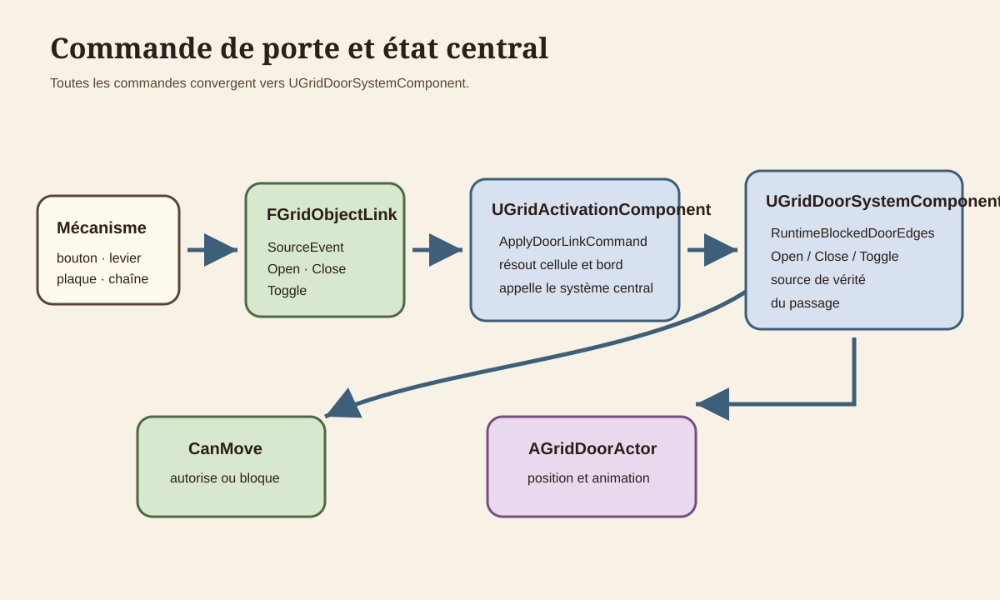
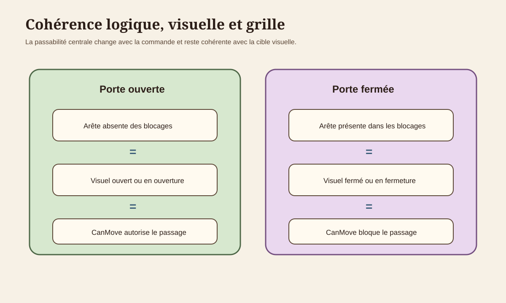
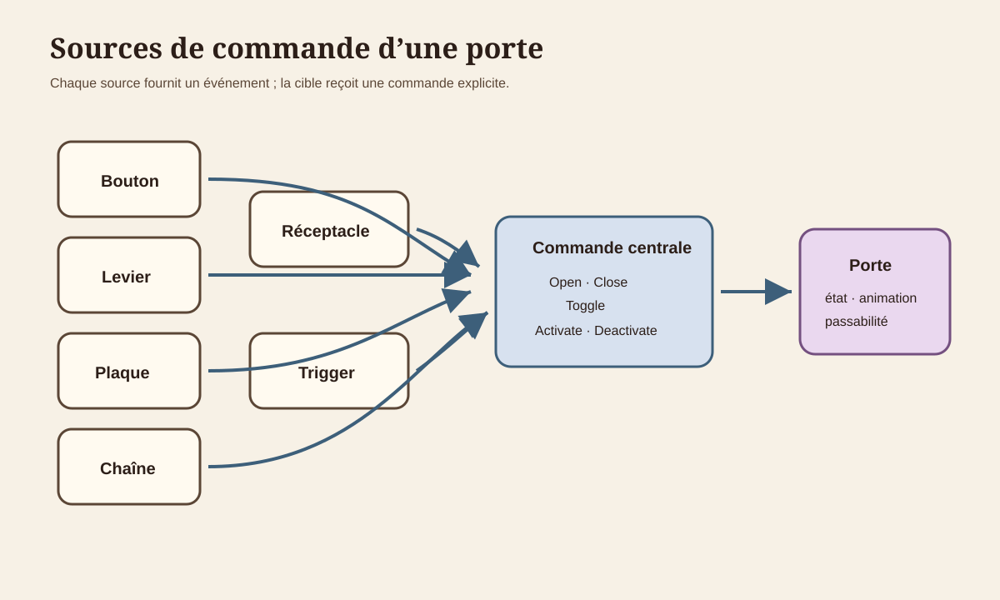

# Architecture des portes et mécanismes

Les items, le curseur et leur transfert vers les réceptacles sont documentés dans [`ITEM_PICKUP_AND_PLACEMENT_FOUNDATION.md`](ITEM_PICKUP_AND_PLACEMENT_FOUNDATION.md).

## 1. Objet du document

Ce document décrit la fondation existante qui relie une porte placée, son acteur runtime, les commandes issues des mécanismes, son animation et la passabilité de la grille.

Il ne définit ni serrure complexe, ni système de clés, ni nouveau type de porte.

## 2. Vocabulaire

**Porte placée** : `FGridLevelObjectData` de type `Door`, persistée dans `UGridLevelAsset::Objects`.

**Arête de porte** : triplet cellule `CellX`, `CellY` et bord cardinal `Edge`.

**État de passage** : présence ou absence de l’arête dans `UGridDoorSystemComponent::RuntimeBlockedDoorEdges`. C’est la source de vérité de `CanMove()`.

**État visuel** : position cible et animation de `AGridDoorActor`. `bIsOpen` indique la position atteinte lorsque l’animation se termine.

**Mécanisme source** : bouton, levier, plaque, réceptacle ou trigger dont un événement sélectionne un `FGridObjectLink`.

## 3. Cartographie du code

| Domaine | Déclaration | Implémentation | Responsabilité |
|---|---|---|---|
| Données placées | `Source/GrimrockPrototype/Public/Core/GridTypes.h` | structure sans `.cpp` | Position, bord, état initial, comportement et identité. |
| Paramètres de porte | `Source/GrimrockPrototype/Public/Core/GridObjectBehavior.h` | structure sans `.cpp` | Hauteur, durée et chaîne optionnelle. |
| Niveau | `Source/GrimrockPrototype/Public/Core/GridLevelAsset.h` | `Source/GrimrockPrototype/Private/Core/GridLevelAsset.cpp` | Stockage persistant dans `Objects` et `Links`. |
| Acteur visuel | `Source/GrimrockPrototype/Public/Runtime/GridDoorActor.h` | `Source/GrimrockPrototype/Private/Runtime/GridDoorActor.cpp` | Meshes, animation verticale, chaîne et interaction. |
| État central | `Source/GrimrockPrototype/Public/Runtime/GridDoorSystemComponent.h` | `Source/GrimrockPrototype/Private/Runtime/GridDoorSystemComponent.cpp` | Index des portes, passage bloqué, commandes et état runtime. |
| Niveau runtime | `Source/GrimrockPrototype/Public/Runtime/GridLevelRuntimeActor.h` | `Source/GrimrockPrototype/Private/Runtime/GridLevelRuntimeActor.cpp` | Génération, résolution des deux côtés d’une arête et `CanMove()`. |
| Liens | `Source/GrimrockPrototype/Public/Runtime/GridActivationComponent.h` | `Source/GrimrockPrototype/Private/Runtime/GridActivationComponent.cpp` | Traduit les commandes de lien en opérations de porte. |
| Validation | `Source/GrimrockPrototypeEditor/Public/EditorTools/GridLevelEditorActor.h` | `Source/GrimrockPrototypeEditor/Private/EditorTools/GridLevelEditorActor.cpp` | Cohérence placement, arête et liens entrants. |
| Panneau de liens | `Source/GrimrockPrototypeEditor/Private/EditorTools/Widgets/SGridEditorLinksPanel.cpp` | même fichier | Propose les commandes compatibles avec une porte. |

## 4. Données persistantes

Une porte utilise les champs communs de `FGridLevelObjectData` :

- `ObjectId`, identité des liens et de l’état runtime ;
- `Type=Door` ;
- `CellX`, `CellY`, cellule qui porte l’arête ;
- `Edge`, bord cardinal obligatoire ;
- `ArchetypeId`, résolution de la classe et des meshes ;
- `bInitiallyEnabled`, qui décide si l’acteur est généré ;
- `bInitiallyActive`, interprété comme « ouverte au démarrage » ;
- `Behavior.DoorAnimation`, copie locale des paramètres de mouvement et de chaîne.

`FGridDoorAnimationParams` contient `OpenHeight`, `MoveDuration`, `bHasChainMechanism`, `ChainPullDistance` et `ChainPullDuration`.

La cellule doit rester franchissable et l’arête de la porte doit utiliser `WallType=None`. Un mur `Solid` continue de bloquer `CanMove()` même si la porte est ouverte.

## 5. Génération runtime

`AGridLevelRuntimeActor::AddRuntimeObjectActor()` résout l’archétype, génère sa `RuntimeActorClass`, initialise les visuels du mécanisme puis appelle `InitializeGridObject()`.

Pour une porte :

1. `AGridDoorActor` reçoit `ObjectId`, cellule et bord ;
2. le mesh mobile est placé fermé ou à `OpenHeight` selon `bInitiallyActive` ;
3. la chaîne est créée si elle est activée et si ses meshes existent ;
4. `UGridDoorSystemComponent::RegisterDoorObject()` indexe l’acteur par arête ;
5. l’arête est initialement bloquée si `bInitiallyActive=false`.

`DoorIndexByEdge` résout les données placées. `DoorActorByEdge` résout l’acteur visuel.

## 6. État logique et visuel

`RuntimeBlockedDoorEdges` est la source de vérité de la passabilité :

- arête présente : porte bloquante ;
- arête absente : passage autorisé par le système de porte.

`AGridDoorActor` conserve l’état de son animation :

- `bIsAnimating`, mouvement en cours ;
- `bIsOpen`, position finale atteinte ;
- `IsFullyOpen()` et `IsFullyClosed()`, états terminaux.

La politique runtime est asymétrique et volontaire :

- une commande d’ouverture libère immédiatement l’arête, puis lance l’animation ;
- une commande de fermeture bloque immédiatement l’arête, puis lance l’animation ;
- la fin d’animation vérifie et resynchronise l’arête avec la position finale.

Cette règle évite une porte visuellement en mouvement dont la passabilité conserve un ordre précédent. Une commande inverse pendant l’animation inverse aussi la cible visuelle et l’état de passage.

## 7. Commandes applicables

`UGridActivationComponent::ApplyDoorLinkCommand()` applique :

| Commande | Effet |
|---|---|
| `Open` | Appelle `OpenDoorOnEdge()`. |
| `Activate` | Alias actuel de `Open`. |
| `Close` | Appelle `CloseDoorOnEdge()`. |
| `Deactivate` | Alias actuel de `Close`. |
| `Toggle` | Inverse l’état de passage central. |
| Autre valeur | Échec du lien et diagnostic. |

`AGridLevelRuntimeActor` résout d’abord l’arête directe, puis l’arête opposée de la cellule voisine. Une commande fonctionne donc depuis les deux représentations d’une même séparation.

Une commande répétant l’état courant est sans danger. L’acteur ignore une cible visuelle déjà atteinte et l’état de passage reste idempotent.

## 8. Sources de commande

Les chemins suivants convergent vers le même système :

- bouton `Activated` ;
- levier `Activated` ou `Deactivated` ;
- plaque `Activated` ou `Deactivated` ;
- réceptacle `ItemInserted`, `ItemRemoved` ou `ItemChanged` ;
- trigger `Activated` ou `Deactivated` ;
- tout autre émetteur runtime explicitement pris en charge.

`SourceEvent` sélectionne le lien. `Command` choisit ensuite `Open`, `Close`, `Toggle`, `Activate` ou `Deactivate`.
Pour les réceptacles, voir [`RECEPTACLE_SYSTEM_FOUNDATION.md`](RECEPTACLE_SYSTEM_FOUNDATION.md).

## 9. Chaîne optionnelle

La chaîne appartient à `AGridDoorActor` :

- `ChainInteractionBox` bloque uniquement `ECC_Visibility` et sert au clic ;
- les meshes de chaîne n’ont pas de collision ;
- `CanInteract()` vérifie le composant touché, l’état des animations et le bon côté de l’arête avec `CanPartyInteractWithEdgeObject()` ;
- le mauvais côté est refusé ;
- `PullChain()` anime la traction ;
- à la fin de la traction, la chaîne appelle `AGridLevelRuntimeActor::ToggleDoorOnEdge()`.

La chaîne utilise donc désormais la même source de vérité que les liens. Elle ne modifie plus directement `AGridDoorActor`.

## 10. `CanMove()` et collision

`AGridLevelRuntimeActor::CanMove()` vérifie, dans l’ordre :

1. la cellule de départ ;
2. la cellule voisine ;
3. `DoorSystemComponent->IsDoorPassageBlocked()` sur l’arête directe ou opposée ;
4. le mur directionnel de la cellule de départ.

Une porte ouverte n’annule pas un mur `Solid`. La validation éditeur signale cette configuration.

Le déplacement case par case ne prend pas la collision du mesh comme source de vérité. La base `AGridRuntimeObjectActor::MeshComponent` est sans collision ; les composants de mécanisme peuvent conserver leurs réglages de mesh, mais `CanMove()` reste autoritaire pour la traversée. La collision `Visibility` de la chaîne concerne uniquement la sélection par la souris.

## 11. État de niveau

`CaptureCurrentLevelRuntimeState()` demande au système de porte :

- l’état ouvert ;
- l’état d’animation ;
- l’état bloquant.

L’état persistant de transition de niveau conserve `bIsOpen` et `bBlocksMovement`. `ApplyDoorState()` replace instantanément le visuel et l’arête lors de la restauration. L’animation en cours n’est pas reprise.

## 12. Validation éditeur

`ValidateCurrentLevel()` signale :

- porte ou objet d’arête avec `Edge=None` ;
- porte posée sur un mur `Solid` ;
- porte sur une limite extérieure sans cellule voisine ;
- commande non compatible avec une cible de type porte ;
- source ou cible absente ou désactivée ;
- même événement d’une même source qui ouvre et ferme la même porte.

`SGridEditorLinksPanel` propose pour une porte : `Open`, `Close`, `Toggle`, `Activate` et `Deactivate`.

## 13. Diagnostics

Le runtime journalise :

- l’échec de résolution d’un acteur de porte ;
- chaque commande d’ouverture ou fermeture avec l’état bloquant ;
- la fin d’animation avec l’état final ;
- l’échec d’une chaîne qui ne peut pas résoudre ou commander le runtime ;
- le résultat du lien source vers cible.

`GetDebugSummary()` expose le nombre de portes indexées, d’acteurs associés et d’arêtes bloquées.

## 14. Règles d’architecture

1. `UGridLevelAsset::Objects` conserve les portes placées.
2. `UGridDoorSystemComponent::RuntimeBlockedDoorEdges` décide de la passabilité.
3. `AGridDoorActor` anime et représente visuellement cet ordre.
4. Toute commande, y compris la chaîne, passe par le système central.
5. `CanMove()` reste autoritaire face à la collision physique des meshes.
6. `bInitiallyActive` signifie « porte initialement ouverte ».
7. Une arête de porte doit avoir `WallType=None`.
8. Les deux côtés d’une arête résolvent la même porte.

## 15. Limites actuelles

- aucune serrure ou clé générale ;
- aucune protection contre la fermeture sur le groupe, qui se déplace par cellules ;
- l’ouverture autorise le passage dès le début de l’animation ;
- la restauration replace la porte sans reprendre une animation interrompue ;
- `Opened` et `Closed` existent dans l’enum mais ne sont pas émis ;
- la collision des meshes dépend encore de leurs composants et assets, sans piloter `CanMove()`.
