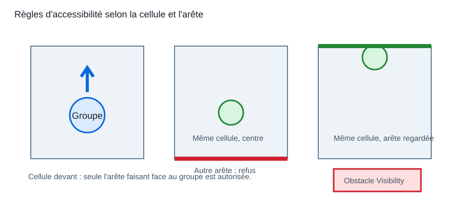
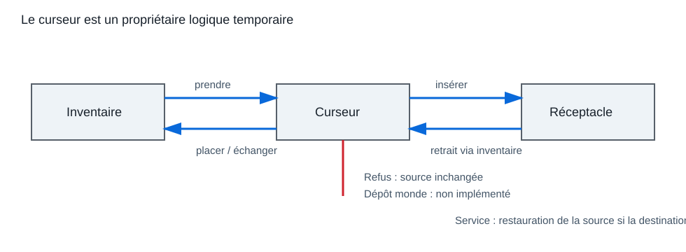
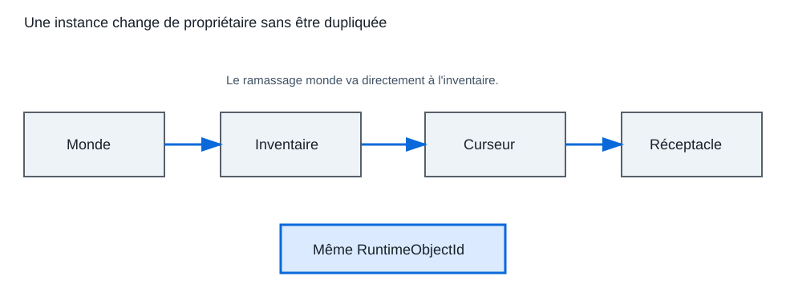
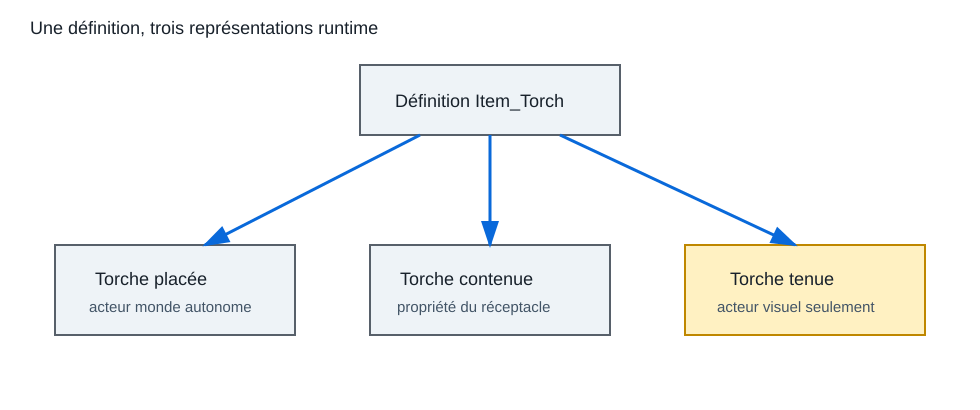

# Fondation du ramassage et du placement des items

## 1. Portée

Ce document décrit le socle réellement implémenté pour les items placés dans un niveau, leur ramassage, leur passage par l'inventaire ou le curseur, leur insertion dans un réceptacle, leur dépôt libre dans le monde et leur représentation visuelle lorsqu'ils sont équipés. Il ne définit pas de butin aléatoire.

## 2. Cartographie du code

| Domaine | Déclaration | Implémentation |
|---|---|---|
| Objet placé | `Source/GrimrockPrototype/Public/Core/GridTypes.h` | structure sans `.cpp` |
| Paramètres d'archétype | `Source/GrimrockPrototype/Public/Core/GridObjectArchetypeAsset.h` | `Source/GrimrockPrototype/Private/Core/GridObjectArchetypeAsset.cpp` |
| Définition d'item | `Source/GrimrockPrototype/Public/Runtime/GridItemDefinitionAsset.h` | `Source/GrimrockPrototype/Private/Runtime/GridItemDefinitionAsset.cpp` |
| Instance et propriété | `Source/GrimrockPrototype/Public/Runtime/GridInventoryTypes.h` | structures sans `.cpp` |
| Acteur d'item | `Source/GrimrockPrototype/Public/Runtime/GridItemActor.h` | `Source/GrimrockPrototype/Private/Runtime/GridItemActor.cpp` |
| Génération et ramassage | `Source/GrimrockPrototype/Public/Runtime/GridLevelRuntimeActor.h` | `Source/GrimrockPrototype/Private/Runtime/GridLevelRuntimeActor.cpp` |
| Inventaire et curseur | `Source/GrimrockPrototype/Public/Runtime/GridPartyInventoryComponent.h` | `Source/GrimrockPrototype/Private/Runtime/GridPartyInventoryComponent.cpp` |
| Transferts atomiques | `Source/GrimrockPrototype/Public/Runtime/GridItemTransferService.h` | `Source/GrimrockPrototype/Private/Runtime/GridItemTransferService.cpp` |
| Groupe et visuel tenu | `Source/GrimrockPrototype/Public/Runtime/GrimrockPartyPawn.h` | `Source/GrimrockPrototype/Private/Runtime/GrimrockPartyPawn.cpp` |
| Souris | `Source/GrimrockPrototype/Public/Runtime/GrimrockPlayerController.h` | `Source/GrimrockPrototype/Private/Runtime/GrimrockPlayerController.cpp` |
| Validation éditeur | `Source/GrimrockPrototypeEditor/Public/EditorTools/GridLevelEditorActor.h` | `Source/GrimrockPrototypeEditor/Private/EditorTools/GridLevelEditorActor.cpp` |

### Vocabulaire

| Terme | Rôle réel |
|---|---|
| `ItemDefinitionAsset` | référence directe vers les données stables d'un item |
| `ItemDefinitionId` | identifiant stable utilisable sans référence directe chargée |
| `ItemActor` | représentation physique ou visuelle d'un item |
| `ItemInstance` | identité runtime, quantité, poids, lumière et propriétaire logique |
| `PlacedObject` | enregistrement persistant d'un item dans `UGridLevelAsset::Objects` |
| `ContainedReceptacleItem` | état d'une instance possédée et éventuellement visualisée par un réceptacle |
| `CursorItem` | instance temporairement possédée par le curseur |
| `InventoryItem` | instance stockée dans une case d'un personnage du groupe |

## 3. Modèle de données

`UGridItemDefinitionAsset` est la définition stable : identifiant, type, poids, emplacements d'équipement compatibles, icône, maillages, lumière et tags.

`FGridItemInstance` est l'instance runtime. Son identité est `RuntimeObjectId`; sa nature est `ItemDefinitionId`. Les champs `OwnerType`, `OwnerGuid`, `OwnerCharacterIndex` et `EquipmentSlot` décrivent son propriétaire logique.

`FGridLevelObjectData` de type `Item` est un placement persistant. Sa définition effective est résolue dans cet ordre :

1. `ItemDefinitionAsset` de l'objet ;
2. `ItemDefinitionId` de l'objet ;
3. définition d'item des paramètres par défaut de l'archétype.

`ArchetypeId` sélectionne l'archétype de placement et de génération. Il ne doit pas remplacer une définition d'item explicite dans les nouvelles données.

## 4. Génération dans le monde

`AGridLevelRuntimeActor::RebuildRuntimeObjects()` traite les objets `Item` actifs par `AddPlacedItemActor()`. L'acteur créé est enregistré dans `SpawnedItemEntries` avec sa cellule, son arête, son identifiant d'objet et sa définition.

Un item avec `Edge=None` est placé au centre de la cellule. Un item avec une arête cardinale utilise le placement au bord du sol, même si son archétype est normalement centré. Ce comportement est propre aux items placés.

`AGridItemActor::ConfigureAsWorldPickup()` active la collision, la visibilité et la physique nécessaires au ramassage. L'état lumineux d'un item placé par le niveau est actuellement désactivé après sa création par `OnRemovedFromWorld()`. Une torche contenue ou tenue suit un autre chemin lumineux.

## 5. Accessibilité du ramassage

La portée physique du clic ne suffit pas. `CanPartyPickupItemEntry()` impose aussi une règle de grille.



- item central, `Edge=None` : le groupe doit être dans la même cellule ;
- item sur une arête de la cellule du groupe : l'arête doit être celle que le groupe regarde ;
- item dans la cellule située devant : il doit être sur l'arête opposée à la direction regardée, donc face au groupe ;
- toute autre cellule ou arête est refusée.

`AGridItemActor::CanInteract()` appelle la même vérification que le ramassage final. Le curseur de survol ne promet donc plus une action que `TryPickupItemActor()` refuserait ensuite.

Les items contenus dans un réceptacle délèguent leur interaction au réceptacle propriétaire. Ils ne passent pas par cette règle de ramassage direct.

### Chemin souris et obstacles

`AGrimrockPlayerController` déprojette la souris puis effectue un unique rayon `ECC_Visibility`. Seul le premier impact bloquant est examiné. Le chemin est :

1. premier impact `Visibility` ;
2. acteur implémentant `IGridInteractableInterface` ;
3. distance maximale ;
4. `CanInteract()` ;
5. curseur d'interaction ;
6. `InteractWithHit()` ;
7. validation de grille et transfert.

Un mur, une porte fermée ou un autre composant bloquant `Visibility` masque donc l'item. Aucun second rayon ni repli implicite ne cherche une cible derrière l'obstacle.

## 6. Destination d'un ramassage

Le ramassage monde ne place pas l'item sur le curseur. `TryPickupItemActor()` et `TryPickupItemAtCell()` construisent une `FGridItemInstance`, puis appellent `AddItemInstanceToSelectedCharacterInventory()`.

L'acteur monde n'est détruit et retiré de `SpawnedItemEntries` qu'après l'ajout réussi. Si l'inventaire ne possède pas la capacité nécessaire dans ses piles existantes et ses cases libres, l'item reste intact dans le monde.

Le poids est recalculé après l'ajout, mais ne bloque pas l'opération.

### Empilement des items

Lorsqu'un item rejoint l'inventaire, `UGridPartyInventoryComponent` applique sa `UGridItemDefinitionAsset`.

Si la définition indique `bStackable=true`, l'ajout complète d'abord les piles existantes du même `ItemDefinitionId` jusqu'à `MaxStackSize`, puis crée une nouvelle pile si nécessaire.

L'opération reste atomique : si toute la quantité ne peut pas être ajoutée, l'inventaire n'est pas modifié et l'item source reste intact. Aucun slot supplémentaire n'est créé automatiquement lorsque l'inventaire est plein.

Le ramassage d'un item placé initialement ajoute une quantité de 1. Un item runtime déposé dans le monde conserve la quantité portée par sa pile.

### Séparation de pile

Les items stackables peuvent être séparés depuis l'interface d'inventaire.

La règle UI retenue est :

- clic ou drag normal : prend ou déplace la pile complète ;
- CTRL + clic ou drag : prend une seule unité de la pile.

Une unité séparée reçoit un nouveau `RuntimeObjectId`. La pile restante conserve son `RuntimeObjectId`.

Cette logique est gérée par `UGridPartyInventoryComponent` afin de rester indépendante des Blueprints UI. Un item non stackable ou une pile d'une seule unité est toujours pris intégralement.

### Résolution automatique des définitions

Le composant d'inventaire peut enregistrer automatiquement les définitions d'items rencontrées pendant le runtime.

Quand un item est ramassé depuis le niveau, la définition est résolue via `AGridLevelRuntimeActor::ResolveRuntimeItemDefinition`, puis enregistrée dans `UGridPartyInventoryComponent`.

Cela évite de devoir renseigner manuellement chaque `DA_Item_*` dans le Blueprint du pawn, tant que l'item provient d'un LevelAsset, d'un archétype ou d'un contenu runtime résoluble.

### Tags d'items

Les tags métier d'un item appartiennent à `UGridItemDefinitionAsset.ItemTags`.

Un archétype de placement comme `DA_Object_StonePickup` peut ajouter des tags de placement si nécessaire, mais ne doit pas être obligé de recopier les tags métier de l'item.

La validation des archétypes accepte donc un item si l'archétype définit `ItemActorClass`, `ItemTags`, ou une définition d'item par défaut dans `DefaultBehavior.Item`.

## 7. Curseur et transferts

`UGridPartyInventoryComponent` est la source de vérité du curseur avec `bHasCursorItem` et `CursorItem`. Un item pris depuis une case d'inventaire ou d'équipement change de propriétaire logique pour `Cursor`.



- inventaire vers curseur : refus si le curseur est occupé ;
- curseur vers case vide : déplacement puis vidage du curseur ;
- curseur vers case occupée : échange ;
- curseur vers inventaire plein : refus, curseur inchangé ;
- curseur vers réceptacle : le curseur est vidé seulement après insertion réussie ;
- dépôt libre du curseur dans le monde : création d'un item runtime, puis vidage du curseur seulement après succès.

`UGridItemTransferService` couvre les transferts inventaire vers réceptacle, équipement vers réceptacle et réceptacle vers inventaire. Il capture la source et la restaure si l'écriture de destination échoue.



### Retour visuel

- `Take` : item directement touché, à portée et accessible ;
- `Forbidden` : premier acteur interactif touché hors de portée ;
- `PlaceItem` : curseur occupé et réceptacle directement touché, accessible et compatible ;
- `CannotPlaceItem` : curseur occupé sans cible directe valide, hors portée ou refusé ;
- `Locked` : valeur du contrat d'interface, mais non produite par le chemin générique des items audité ici.

Quand le curseur est occupé, un réceptacle directement touché garde la priorité. Si le premier hit `Visibility` n'est pas un réceptacle, le contrôleur tente un dépôt libre sur la cellule résolue depuis le hit. Il n'existe aucun fallback à travers un mur ou une porte fermée.

### Dépôt libre dans le monde

Un item détenu par le curseur peut être déposé librement dans le monde, sans passer par un réceptacle.

Le dépôt crée une instance runtime d'item dans le niveau courant. Le `LevelAsset` n'est pas modifié : il reste la description des placements initiaux du level designer.

L'opération est atomique :

- si le dépôt réussit, le curseur est vidé ;
- si le dépôt échoue, le curseur conserve l'item.

Un item déposé est enregistré dans `SpawnedItemActors` et `SpawnedItemEntries`, puis redevient ramassable par le système de pickup standard. Sa quantité est conservée, qu'il s'agisse d'une pile complète ou d'une unité séparée.

`FGridLevelRuntimeState::Items` capture son `RuntimeObjectId`, son `ItemDefinitionId`, sa quantité, sa cellule, son arête et sa transform. Le dépôt est donc restauré lors d'une transition de niveau sans créer de placement dans le DataAsset.

Cette première version accepte les hits qui se résolvent sur la cellule du groupe ou sur la cellule directement devant lui. Le placement utilise le centre de la cellule avec un décalage horizontal limité dérivé du point d'impact.

### Lancer d'item

Les items peuvent être rendus lançables via leur `UGridItemDefinitionAsset`.

La première version utilise :

- `bThrowable` pour autoriser le lancer ;
- `ThrowSpeed` pour la vitesse initiale ;
- `ThrowArc` pour une légère composante verticale ;
- `ThrowLifeSeconds` pour la durée maximale du projectile ;
- `ThrowImpactDropOffset` pour stabiliser le dépôt après impact.

### Interaction souris avec item en curseur

Le clic droit est réservé au free look / mouvement de tête du groupe. Le système de lancer ne doit jamais détourner `RightMouseButton`.

Le clic gauche est contextuel lorsqu'un item est présent dans le curseur :

1. Si la cible est un réceptacle compatible et accessible, l'item est placé dans le réceptacle.
2. Sinon, si la cible est une zone proche compatible, l'item est posé librement dans le monde.
3. Sinon, si l'item est lançable (`bThrowable=true`), une unité de la pile est projetée :
   - cible à moins de 200 cm : jet court ;
   - cible à 200 cm ou plus : lancer.
4. Si l'item n'est pas lançable et ne peut pas être posé, l'action échoue sans modifier le curseur.

Le clic gauche sans item en curseur conserve le comportement d'interaction normal : boutons, leviers, items monde, panneaux, torches, etc.

### Dépiler depuis le curseur

Lorsqu'un item stackable est porté par le curseur, les actions monde consomment une seule unité par clic.

Exemples :

- `Pierre x5` + clic gauche sol proche : pose `Pierre x1`, le curseur devient `Pierre x4`.
- `Pierre x4` + clic gauche réceptacle : insère `Pierre x1`, le curseur devient `Pierre x3`.
- `Pierre x3` + clic gauche lointain : lance `Pierre x1`, le curseur devient `Pierre x2`.

Le système ne dépose pas toute la pile par défaut. Un dépôt complet de pile pourra être ajouté plus tard avec un modificateur dédié. L'unité séparée reçoit son propre `RuntimeObjectId`, tandis que la pile restante conserve le sien. Le curseur n'est décrémenté qu'après la réussite de l'action monde.

### Information donnée par le curseur

Le curseur ne doit pas révéler les objets interactifs situés à plusieurs cellules.

Les états d'interaction (`Use`, `Take`, `Read`, `PlaceItem`, `CannotPlaceItem`, `Forbidden`) sont réservés aux interactions immédiates :

- cellule actuelle ;
- cellule devant le groupe ;
- edge adjacent faisant face au groupe.

Un objet visible mais trop éloigné ne doit pas afficher un curseur `Forbidden`. Le curseur reste neutre.

Lorsqu'un item lançable est porté par le curseur, un état de visée (`AimThrow`) peut être affiché pour indiquer que l'objet peut être lancé vers la cible visible. Cet état ne révèle pas une interaction distante ; il indique seulement la possibilité de lancer l'objet tenu.

Le Blueprint `WBP_GridMouseCursor` doit associer `AimThrow` à une icône de visée. Tant que cette branche n'est pas ajoutée à `SetCursorState`, son comportement dépend de la sortie par défaut du switch Blueprint.

Le clic droit reste exclusivement réservé au free look / mouvement de tête du groupe.

### Jet court et lancer

Le jet court et le lancer utilisent la même fondation de projectile.

Le jet court applique une vitesse réduite et un arc plus marqué. Le lancer applique la vitesse normale définie par l'item. Dans les deux cas, une seule unité est séparée de la pile. Le curseur n'est décrémenté qu'après la création effective du projectile.

À terme, la portée, la précision et les dégâts devront dépendre :

- du poids de l'objet ;
- de la force ou caractéristique du personnage ;
- de la compétence du personnage pour les armes à distance ou le lancer.

`AGridThrownItemActor` est temporaire et utilise une collision sphérique avec `UProjectileMovementComponent`. À l'impact ou à l'expiration, il appelle le dépôt monde standard afin que l'unité lancée redevienne ramassable, empilable, persistante et compatible avec les PressurePlates par poids.

### PressurePlates et poids des items

Les PressurePlates peuvent être activées par la présence du joueur, par le poids des items déposés sur leur cellule, ou par les deux.

La configuration logique est portée par `PressurePlateWeight` :

- `bActivateWhenPartyPresent` conserve le comportement classique : le joueur active la plaque en marchant dessus ;
- `bUseItemWeight` active le calcul du poids des items déposés ;
- `RequiredItemWeight` définit le seuil minimal à atteindre ;
- `bCountEdgeItems` permet de compter aussi les items placés sur un bord de cellule.

Le poids total est calculé à partir des `UGridItemDefinitionAsset` :

```text
TotalWeight = Somme(ItemDefinition.Weight * Quantity)
```

Les items déposés dans le monde sont stockés dans l'état runtime. Le `LevelAsset` n'est pas modifié.

L'évaluation est centralisée dans `UGridActivationComponent::RefreshPressurePlatesAtCell`. Elle est relancée quand le groupe change de cellule, quand un item est déposé ou ramassé, et après la restauration d'un niveau. La plaque ne déclenche `Activated` ou `Deactivated` que lorsque son état logique change.

## 8. Torches

Une torche peut apparaître sous trois formes distinctes :

- item placé dans le niveau : `AGridItemActor` autonome, ramassable selon cellule et arête ;
- item contenu dans un support : instance possédée par `AGridReceptacleActor`, interaction et retrait gouvernés par sa politique ;
- item équipé : instance dans l'équipement, représentée par un `HeldItemActor` visuel attaché au groupe.



`HeldItemActor` n'est pas une seconde instance de gameplay. Le commentaire et le code de `AGrimrockPartyPawn` le traitent comme une représentation visuelle ; la propriété réelle reste dans l'inventaire, l'équipement, le curseur, un réceptacle ou le monde.

`HeldTorchActorClass` est une classe visuelle spécialisée utilisée pour `DefaultHeldItemDefinitionId`. Les autres items tenus sont générés par le runtime à partir de leur définition.

## 9. Validation éditeur

`AGridLevelEditorActor::ValidateCurrentLevel()` signale désormais :

- un item sans définition résoluble dans l'objet ou l'archétype ;
- un asset de définition dont `ItemDefinitionId` est vide ;
- un conflit entre `ItemDefinitionAsset` et `ItemDefinitionId` locaux ;
- un item placé sur une cellule vide ou bloquant l'occupation.

Les validations existantes continuent de contrôler l'identifiant d'objet, l'archétype, le type, la palette et le placement.

## 10. Diagnostics

Les refus de ramassage journalisent la cellule du groupe, son orientation, la cellule de l'item et son arête. Les échecs d'ajout indiquent `InventoryFull`. Les transferts du service journalisent l'opération, le résultat, `ItemDefinitionId` et `RuntimeObjectId`. Les refus de dépôt souris distinguent notamment l'absence de cible, la portée, l'arête et l'incompatibilité.

Les évaluations d'acceptation utilisées par le survol sont silencieuses. Un clic réellement refusé peut produire un warning court. Le détail complet des règles et de l'item candidat n'est journalisé qu'avec `bLogDiagnostics=true`, au niveau `VeryVerbose`.

## 11. Invariants

- Une instance valide possède un `RuntimeObjectId`, un `ItemDefinitionId` et une quantité positive.
- Une instance ne doit avoir qu'un propriétaire logique à la fois.
- Un refus de destination ne doit pas supprimer la source.
- Un ajout d'inventaire doit accepter toute la quantité demandée ou ne modifier aucun slot.
- Chaque pile nouvellement créée possède son propre `RuntimeObjectId`.
- Une unité séparée possède un nouvel identifiant ; la pile source conserve le sien.
- Un dépôt monde ne modifie jamais le `LevelAsset`.
- Le survol et l'action finale utilisent la même règle d'accessibilité.
- Un acteur visuel tenu ne constitue pas une nouvelle instance.
- Un item contenu appartient au réceptacle et ne doit pas être ramassé directement par le niveau.

## 12. Tests manuels PIE

1. Ramasser un item central depuis sa cellule : il rejoint l'inventaire sélectionné.
2. Cliquer un item central depuis une cellule adjacente ou non adjacente : le curseur ne propose pas le ramassage.
3. Dans la cellule du groupe, vérifier qu'un item d'arête est accessible uniquement en regardant cette arête.
4. Dans la cellule devant le groupe, vérifier que seule l'arête faisant face au groupe est accessible.
5. Placer l'item derrière un mur, une porte fermée puis un autre bloqueur `Visibility` : le premier impact empêche le ramassage.
6. Ramasser plusieurs exemplaires d'un item stackable : les piles existantes sont complétées jusqu'à `MaxStackSize`, puis une nouvelle pile est créée.
7. Avec une pile de trois unités, CTRL + clic puis CTRL + drag : le curseur reçoit une unité et la pile source en conserve deux.
8. Avec une pile dans le curseur, déposer sur une cellule valide : une seule unité apparaît et la pile du curseur est décrémentée.
9. Ramasser les items déposés : leurs quantités rejoignent les piles compatibles de l'inventaire.
10. Tenter un dépôt hors portée, hors des cellules autorisées ou sans définition résoluble : le curseur reste inchangé.
11. Remplir les piles et les cases libres, puis tenter un ramassage : l'acteur monde reste présent et l'inventaire ne change pas.
12. Déplacer un item inventaire vers le curseur, tenter avec un curseur déjà occupé, puis tester une case vide, une case occupée et un inventaire plein.
13. Cliquer hors portée, sur un réceptacle incompatible puis compatible : le curseur reste inchangé sur les refus.
14. Tester le retrait autorisé, interdit et verrouillé d'un réceptacle.
15. Prendre une torche depuis le bon puis le mauvais côté d'un support ; la redéposer dans un support simple puis retournable.
16. Vérifier la lumière, le visuel du support et le visuel tenu après retrait et redépôt.
17. Valider un niveau contenant un item sans définition, sur cellule non jouable et avec identifiants contradictoires.
18. Avec `bActivateWhenPartyPresent=true` et `bUseItemWeight=false`, entrer puis sortir d'une PressurePlate : vérifier un seul `Activated`, puis un seul `Deactivated`.
19. Avec une plaque à poids seul et un seuil de `3.0`, déposer trois pierres de poids `1.0`, puis en ramasser une : vérifier l'activation à `3.0` et la désactivation à `2.0`.
20. Déposer directement une pile de trois pierres : vérifier que la contribution vaut `3.0`, pas `1.0`.
21. Avec les deux sources actives, laisser trois pierres sur la plaque puis entrer et sortir : vérifier que la plaque reste pressée sans événement supplémentaire.
22. Relier la plaque à une porte et vérifier que l'activation et la désactivation par poids utilisent les mêmes liens que la présence du groupe.
23. Maintenir le clic droit et déplacer la souris : vérifier le free look et l'absence de projectile.
24. Avec une pierre dans le curseur, cliquer gauche sur un réceptacle compatible proche : vérifier que le réceptacle reste prioritaire.
25. Cliquer gauche sur une cellule valide proche : vérifier un dépôt libre sans projectile.
26. Configurer une pierre avec `bThrowable=true`, placer une pile de trois dans le curseur et cliquer gauche sur une cible non posable à moins de 200 cm : vérifier un jet court quantité 1 et un curseur quantité 2.
27. Cliquer gauche sur une cible à 200 cm ou plus : vérifier un lancer normal quantité 1 et un curseur décrémenté d'une unité.
28. Lancer la dernière unité d'une pile : vérifier que le curseur est vidé seulement après la création du projectile.
29. Essayer de lancer un item avec `bThrowable=false` : vérifier le feedback et l'absence de mutation du curseur.
30. Ramasser une pierre après son impact : vérifier qu'elle rejoint une pile compatible.
31. Lancer une pierre de poids `1.0` sur une PressurePlate dont le seuil vaut `1.0` : vérifier sa conversion en item monde et l'activation de la plaque.
32. Avec `Pierre x3` dans le curseur, déposer au sol puis dans un réceptacle : vérifier que chaque action consomme exactement une unité.
33. Survoler un bouton, panneau ou item situé à plusieurs cellules sans item dans le curseur : vérifier que le curseur reste `Default`.
34. Avec une pierre lançable dans le curseur, viser une surface lointaine dans la portée de lancer : vérifier l'état `AimThrow`.
35. Avec un item non lançable dans le curseur, viser une surface lointaine : vérifier que le curseur reste `Default`.

## 13. Limites actuelles

- Le ramassage monde alimente directement l'inventaire, pas le curseur.
- Le dépôt libre est limité à la cellule courante ou directement devant le groupe.
- Le système ne simule pas encore une physique réaliste de contact avec la plaque. Un item compte pour le poids s'il est enregistré comme item runtime sur la cellule de la PressurePlate.
- Le lancer ne gère pas encore les dégâts, les ennemis, la physique réaliste de rebond, les sons d'impact ou la charge de puissance.
- Les compétences, la précision, les dégâts et les effets sur les ennemis ne sont pas encore implémentés.
- Le nombre de cases d'inventaire n'est pas étendu automatiquement.
- Les actifs `.uasset` déterminent les variantes concrètes de supports et ne sont pas audités par ce document.

Les curseurs d'item et le retour court d'inventaire plein sont décrits dans
[`READABLE_OBJECTS_AND_FEEDBACK_FOUNDATION.md`](READABLE_OBJECTS_AND_FEEDBACK_FOUNDATION.md).

Les validations d'item sont présentées dans
[`LEVEL_VALIDATION_PANEL_FOUNDATION.md`](LEVEL_VALIDATION_PANEL_FOUNDATION.md).
