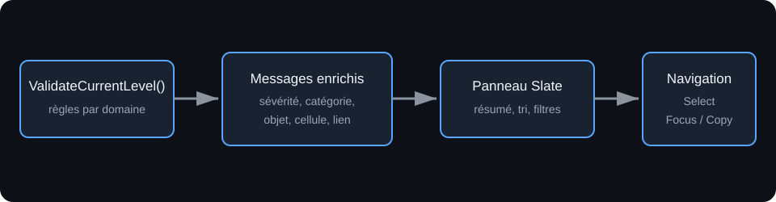

# Panneau de validation du niveau

## 1. Objet

Ce document décrit la production, la présentation et l'exploitation des validations du niveau dans le mode d'édition de grille. La validation analyse les données sans modifier le `LevelAsset`.

## 2. Cartographie du code

| Responsabilité | Fichier |
|---|---|
| Sévérité et structure du message | `Source/GrimrockPrototypeEditor/Public/EditorTools/GridLevelEditorActor.h` |
| Règles et enrichissement des messages | `Source/GrimrockPrototypeEditor/Private/EditorTools/GridLevelEditorActor.cpp` |
| État et interface du panneau | `Source/GrimrockPrototypeEditor/Public/EditorTools/Widgets/SGridEditorValidationPanel.h` |
| Construction Slate et actions | `Source/GrimrockPrototypeEditor/Private/EditorTools/Widgets/SGridEditorValidationPanel.cpp` |
| Intégration au toolkit | `Source/GrimrockPrototypeEditor/Private/EditorTools/GridLevelEdModeToolkit.cpp` |

## 3. Structure des messages

`FGridLevelValidationMessage` contient :

- `Severity` : niveau `Error`, `Warning` ou `Info` ;
- `Message` : explication destinée au level designer ;
- `OptionalObjectId` : objet principal concerné lorsqu'il est connu ;
- `SourceObjectId` et `TargetObjectId` : extrémités d'un lien lorsque le message désigne un lien ;
- `CellX`, `CellY` et `Edge` : localisation récupérée depuis l'objet associé ;
- `Category` : domaine fonctionnel affiché et utilisé pour le tri secondaire.

`OptionalObjectId` est conservé pour compatibilité avec les validations existantes. Les métadonnées de lien, de localisation et de catégorie sont enrichies après l'exécution des règles.

## 4. Sévérités

- **Error** : donnée invalide ou contrat impossible à exécuter correctement.
- **Warning** : configuration suspecte, asymétrique ou potentiellement intentionnelle.
- **Info** : indication non bloquante, notamment validation sans problème ou exposition directe d'un archétype d'item.

Le panneau affiche les erreurs avant les warnings, puis les informations. Chaque groupe est trié par catégorie.

## 5. Catégories

Les catégories visibles sont `Core`, `Grid`, `Walls`, `Objects`, `Archetypes`, `Palette`, `Links`, `Doors`, `Receptacles`, `Items`, `Readable` et `Runtime`.

La catégorie est actuellement déduite de la règle et de son texte par une fonction centrale. Cette approche couvre les règles existantes sans dupliquer chaque appel à `AddMessage()`. Une future règle ambiguë devra soit employer un texte explicite, soit faire évoluer `AddMessage()` pour fournir directement la catégorie.

## 6. Sources de validation

`ValidateCurrentLevel()` couvre notamment :

| Domaine | Exemples |
|---|---|
| Donjon et niveau | asset absent, niveaux invalides, identifiants ou positions dupliqués, niveau par défaut invalide |
| Grille | dimensions, nombre de cellules, taille, cellule de départ |
| Murs | murs superposés et arêtes directionnelles |
| Objets | identité, limites de grille, placement, collisions d'ancrage, activation initiale |
| Archétypes et palette | archétype absent, type incompatible, entrée de palette obsolète, validation de l'archétype |
| Items | définition absente, asset sans identifiant, conflit asset/identifiant, cellule non jouable, placement |
| Portes | bord absent, mur solide, limite extérieure, commandes contradictoires |
| Liens | source/cible absente, doublon, événement non émis, commande incompatible, condition invalide |
| Réceptacles | règles contradictoires, contenu initial invalide, condition ou commande spécialisée incompatible |
| Lisibles | texte effectif absent, notes non affichées, override ignoré, objet désactivé |

Les validations d'archétype et de palette sont converties vers les mêmes sévérités que le niveau.

## 7. Panneau Slate

Le panneau est ouvert depuis la section `VALIDATION` du toolkit. `Refresh Validation` exécute explicitement `ValidateCurrentLevel()` ; il n'existe pas de validation automatique à chaque modification.

Le tableau de bord présente :

- le résumé `Errors | Warnings | Infos` ;
- trois filtres de sévérité persistants dans l'état du panneau ;
- les messages triés ;
- la sévérité, la catégorie et le texte ;
- l'identifiant court de l'objet principal ;
- la cellule et le bord lorsqu'ils sont connus ;
- les identifiants source et cible pour les liens ;
- un bouton `Copy Summary`.

La section se déploie automatiquement après validation lorsqu'une erreur ou un warning existe.

## 8. Actions depuis le panneau

Un message associé à un objet propose `Select Object` et `Focus Object`. Un lien peut proposer séparément les actions pour sa source et sa cible. Un message localisé sans objet peut proposer `Select Cell`.

La sélection appelle `AGridLevelEditorActor::SelectObjectById()` et synchronise la cellule, le bord, les données d'édition, l'aperçu et l'inspecteur. Le focus cadre une boîte autour de la position calculée de l'objet dans le viewport.

## 9. Liens avec les autres fondations

Les règles métier restent décrites dans leurs documents respectifs :

- [noyau de grille](CORE_DUNGEON_LEVEL_GRID.md) ;
- [archétypes et objets placés](OBJECT_ARCHETYPES_AND_PLACED_OBJECTS.md) ;
- [liens, événements et commandes](LINK_EVENT_COMMAND_FOUNDATION.md) ;
- [portes](DOOR_MECHANISM_FOUNDATION.md) ;
- [réceptacles](RECEPTACLE_SYSTEM_FOUNDATION.md) ;
- [items](ITEM_PICKUP_AND_PLACEMENT_FOUNDATION.md) ;
- [objets lisibles](READABLE_OBJECTS_AND_FEEDBACK_FOUNDATION.md).

Le panneau ne redéfinit aucune de ces règles : il rend leurs diagnostics exploitables.

## 10. Limites actuelles

- La validation reste manuelle.
- Il n'existe pas de filtre par catégorie.
- Les catégories sont inférées, pas déclarées par chaque règle.
- Les messages globaux sans objet n'ont pas toujours de cellule.
- Un lien est identifié par son index et ses extrémités, sans identifiant persistant propre.
- Le panneau ne corrige jamais automatiquement les données.
- Le comportement visuel doit encore être vérifié dans l'éditeur.

## 11. Règles d'architecture

1. La validation est en lecture seule vis-à-vis du `LevelAsset`.
2. Une erreur doit expliquer le contrat rompu et, si possible, identifier l'objet ou le lien.
3. Les règles restent dans `ValidateCurrentLevel()` ou dans les validateurs d'assets, jamais dans Slate.
4. Le panneau filtre et navigue, mais ne décide pas de la validité.
5. La sélection utilise `ObjectId`, pas le tag ni l'archétype.
6. Le focus ne doit pas changer les données persistantes.
7. Une nouvelle famille de règles doit employer une catégorie stable et un message compréhensible.
