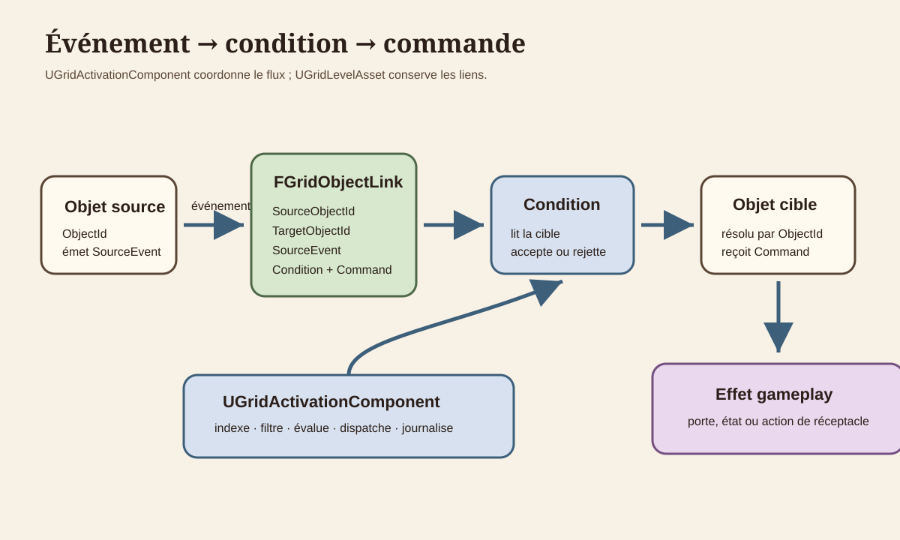
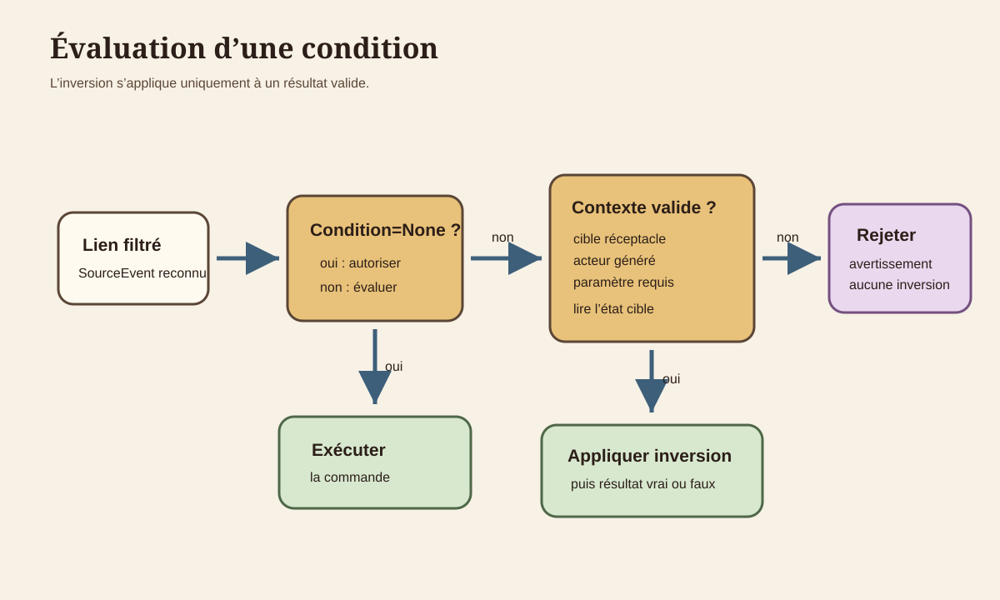
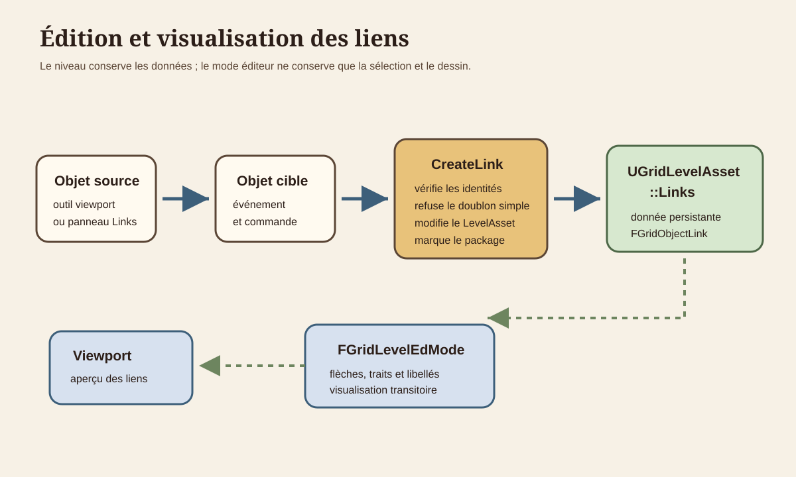

# Architecture des liens, événements et commandes

## 1. Objet du document

Ce document décrit le système existant qui relie un événement émis par un objet placé à une commande appliquée à un autre objet. Il couvre les données persistantes, l’exécution runtime, les conditions, l’édition et la validation.

Il ne définit ni langage de script, ni nouveau mécanisme de gameplay. Les valeurs d’enum non exécutées par le code actuel sont documentées comme réservées ou inactives.

Le contrat spécialisé des portes, de leur animation et de `CanMove()` est documenté dans
`docs/Architecture/DOOR_MECHANISM_FOUNDATION.md`.
Le contrat des événements, commandes et conditions de réceptacle est détaillé dans
`docs/Architecture/RECEPTACLE_SYSTEM_FOUNDATION.md`.

## 2. Vocabulaire

**Source** : objet placé identifié par `SourceObjectId`, dont un événement déclenche la recherche de liens.

**Cible** : objet placé identifié par `TargetObjectId`, auquel la commande est appliquée.

**Événement** : valeur `EGridObjectEvent` produite par un comportement runtime.

**Commande** : valeur `EGridObjectCommand` interprétée par le runtime central.

**Condition** : prédicat `EGridObjectCondition` évalué avant la commande. Les conditions actuelles lisent uniquement un réceptacle cible.

## 3. Cartographie du code

| Domaine | Déclaration | Implémentation | Responsabilité |
|---|---|---|---|
| Types de lien | `Source/GrimrockPrototype/Public/Core/GridTypes.h` | structures et enums sans `.cpp` | `FGridObjectLink`, événements, commandes et conditions. |
| Stockage | `Source/GrimrockPrototype/Public/Core/GridLevelAsset.h` | `Source/GrimrockPrototype/Private/Core/GridLevelAsset.cpp` | `UGridLevelAsset::Links`, suppression des liens liés à un objet. |
| Coordination runtime | `Source/GrimrockPrototype/Public/Runtime/GridActivationComponent.h` | `Source/GrimrockPrototype/Private/Runtime/GridActivationComponent.cpp` | Indexation, filtrage par événement, conditions et dispatch. |
| Façade du niveau | `Source/GrimrockPrototype/Public/Runtime/GridLevelRuntimeActor.h` | `Source/GrimrockPrototype/Private/Runtime/GridLevelRuntimeActor.cpp` | Expose `ExecuteLinksFromRuntimeObject()`. |
| Réceptacles | `Source/GrimrockPrototype/Public/Runtime/GridReceptacleActor.h` | `Source/GrimrockPrototype/Private/Runtime/GridReceptacleActor.cpp` | Émet les événements d’insertion, retrait et changement. |
| Édition | `Source/GrimrockPrototypeEditor/Public/EditorTools/GridLevelEditorActor.h` | `Source/GrimrockPrototypeEditor/Private/EditorTools/GridLevelEditorActor.cpp` | Création, suppression, sélection et validation. |
| Mode éditeur | `Source/GrimrockPrototypeEditor/Public/EditorTools/GridLevelEdMode.h` | `Source/GrimrockPrototypeEditor/Private/EditorTools/GridLevelEdMode.cpp` | Actions viewport et dessin des connecteurs. |
| Panneau de liens | `Source/GrimrockPrototypeEditor/Public/EditorTools/Widgets/SGridEditorLinksPanel.h` | `Source/GrimrockPrototypeEditor/Private/EditorTools/Widgets/SGridEditorLinksPanel.cpp` | Choix source, événement, cible et commande. |

## 4. Donnée persistante `FGridObjectLink`

`UGridLevelAsset::Links` est la source persistante. Les acteurs runtime ne deviennent pas propriétaires des liens.

| Champ | Rôle | Obligatoire et validation |
|---|---|---|
| `SourceObjectId` | Identifie l’objet émetteur. | Requis, GUID valide et présent dans `Objects`. |
| `TargetObjectId` | Identifie l’objet recevant la commande. | Requis, GUID valide et présent dans `Objects`. |
| `SourceEvent` | Filtre l’événement qui active le lien. | Requis ; avertissement si le type source ne l’émet pas actuellement. |
| `Command` | Action demandée à la cible. | Requise ; erreur si le runtime ne la gère pas pour le type cible. |
| `Condition` | Prédicat optionnel. | `None` exécute sans lecture de contexte ; les autres exigent une cible réceptacle. |
| `ConditionItemDefinitionId` | Définition recherchée. | Requis pour `ReceptacleContainsItemDefinition`. |
| `ConditionItemTag` | Tag recherché. | Requis pour `ReceptacleContainsItemTag`. |
| `ConditionItemType` | Type d’item recherché. | Différent de `None` pour `ReceptacleContainsItemType`. |
| `ConditionCount` | Seuil de quantité. | Strictement positif pour `ReceptacleItemCountAtLeast`. |
| `ConditionWeight` | Seuil de poids. | Strictement positif pour `ReceptacleWeightAtLeast`. |
| `bInvertCondition` | Inverse un résultat valide. | N’inverse ni une cible incompatible ni un paramètre invalide. |

`RemoveObjectById()` appelle `RemoveLinksForObject()`. `ClearLevel()` vide aussi `Links`.

## 5. Événements

`EGridObjectEvent` contient :

- `Activated`, émis par bouton, levier, plaque de pression et trigger ;
- `Deactivated`, émis par levier, plaque de pression et trigger ;
- `ItemInserted`, `ItemRemoved`, `ItemChanged`, émis par les réceptacles ;
- `Used`, `Entered`, `Exited`, `Opened`, `Closed`, `Enabled`, `Disabled`, présents dans l’enum mais sans émetteur C++ actif dans le système audité.

Le trigger traduit actuellement entrée et sortie en `Activated` et `Deactivated`. Une porte n’émet pas encore `Opened` ou `Closed`.

Le levier exécute désormais uniquement les liens dont `SourceEvent` correspond à son nouvel état. Une commande `Toggle` n’est plus un chemin parallèle indépendant de l’événement.

### Leviers et plaques de pression

Le levier est bidirectionnel :

- le passage de l’état inactif à l’état actif émet `Activated` ;
- le retour de l’état actif à l’état inactif émet `Deactivated`.

La plaque de pression suit le même contrat :

- l’appui, lors de l’entrée sur sa cellule, émet `Activated` ;
- le relâchement, lors de la sortie de sa cellule, émet `Deactivated`.

`ActiveObjectIds` protège les plaques contre la répétition : un nouvel événement est émis uniquement lorsque l’état change. La même règle s’applique lorsqu’une commande de lien modifie l’état d’un levier ou d’une plaque. Le visuel est mis à jour par `SetLeverState()` ou `SetPressed()`, puis les liens du nouvel événement peuvent poursuivre la chaîne.

`Toggle` n’est pas un événement. C’est une commande envoyée à la cible après sélection du lien par `SourceEvent`. Elle peut donc être utilisée avec `Activated` comme avec `Deactivated`. Une protection de réentrée rejette une chaîne cyclique qui tente de redispatcher le même objet source avant la fin de son événement courant.

## 6. Commandes

`EGridObjectCommand` contient :

- commandes d’état : `Toggle`, `Open`, `Close`, `Activate`, `Deactivate` ;
- valeurs présentes mais non dispatchées : `Enable`, `Disable`, `Lock`, `Unlock`, `Spawn`, `Despawn`, `Teleport`, `ShowMessage` ;
- commandes de réceptacle : `ReceptacleConsumeItem`, `ReceptacleConsumeAllItems`, `ReceptacleLock`, `ReceptacleUnlock`, `ReceptacleEnableRemoval`, `ReceptacleDisableRemoval`.

Le dispatch est centralisé dans `UGridActivationComponent::ApplyLinkCommand()` :

| Cible | Commandes effectives |
|---|---|
| Porte | `Toggle`, `Open`/`Activate`, `Close`/`Deactivate`. |
| Réceptacle | Les six commandes spécialisées, plus les commandes d’état génériques. |
| Bouton, plaque, levier, décoration, spawn, item, lumière, téléporteur, trigger | Commandes d’état génériques. Leur effet peut se limiter à l’état central ou à un comportement spécialisé déjà présent. |
| Type `None` ou commande incompatible | Échec journalisé, aucun effet. |

Il n’existe pas d’interface commune de commande. Le composant central sélectionne une fonction selon `EGridLevelObjectType`, puis utilise les acteurs spécialisés lorsque nécessaire.

## 7. Conditions

`EGridObjectCondition` contient :

- `None` ;
- `ReceptacleIsEmpty` ;
- `ReceptacleHasAnyItem` ;
- `ReceptacleContainsItemDefinition` ;
- `ReceptacleContainsItemTag` ;
- `ReceptacleContainsItemType` ;
- `ReceptacleItemCountAtLeast` ;
- `ReceptacleWeightAtLeast`.

`EvaluateGridObjectLinkCondition()` reçoit les acteurs source et cible, mais les conditions actuelles lisent uniquement `AGridReceptacleActor` sur la cible. La source sert au diagnostic.

Une cible absente, non générée ou non réceptacle rejette la condition. Un paramètre requis vide ou nul la rejette également. `bInvertCondition` est appliqué seulement après une évaluation valide ; il ne transforme donc plus une configuration invalide en succès.

## 8. Flux runtime

1. Un bouton, levier, plaque, trigger ou réceptacle produit un événement.
2. L’acteur appelle directement le composant d’activation ou passe par `AGridLevelRuntimeActor::ExecuteLinksFromRuntimeObject()`.
3. `LinkIndexesBySource` retrouve les liens indexés pour le `SourceObjectId`.
4. Le composant conserve uniquement les liens dont `SourceEvent` correspond.
5. Il résout la cible dans l’index des objets du niveau.
6. Il évalue la condition éventuelle.
7. Il applique la commande selon le type de cible.
8. Il journalise le nombre de liens examinés et le résultat du dispatch.

Si la source n’existe plus, l’événement est rejeté avec un avertissement. Si la cible n’existe pas, le lien échoue sans exécuter de commande.

Les événements d’item sont émis par `AGridReceptacleActor`. `ActivateReceptacle()` met seulement à jour l’état central après le transfert et ne réémet plus ces événements.

## 9. Édition des liens

Deux chemins créent un lien :

- l’outil viewport mémorise une source, puis utilise l’objet sélectionné comme cible ;
- `SGridEditorLinksPanel` propose source, événement, cible et commande, puis appelle `CreateLink()`.

Le panneau limite maintenant ses choix aux événements réellement émis et aux commandes effectivement gérées pour le type choisi. Il n’expose pas encore les champs de condition ; ceux-ci restent accessibles par les données Unreal génériques.

`FGridLevelEdMode` dessine les liens entrants et sortants de la sélection, leurs flèches, leurs libellés et le connecteur temporaire d’une source en attente. Cette visualisation ne duplique pas l’exécution runtime.

## 10. Validation et diagnostics

`ValidateCurrentLevel()` contrôle désormais :

- GUID source ou cible invalide ;
- objet source ou cible absent ;
- doublon exact de lien, condition et paramètres compris ;
- événement non émis par le type source actuel ;
- commande incompatible avec le type cible ;
- condition appliquée à une cible non réceptacle ;
- paramètre de condition manquant ou invalide ;
- source identique à la cible, signalée comme boucle potentielle ;
- source ou cible initialement désactivée ;
- cohérence des événements de réceptacle déjà contrôlée par la validation existante.

Le runtime journalise les événements, les conditions rejetées, les paramètres invalides et les commandes non appliquées. Ces logs complètent la validation, notamment lorsque l’acteur cible n’a pas été généré.

## 11. Règles d’architecture

1. `UGridLevelAsset::Links` reste la donnée persistante.
2. Les identités de source et cible sont des `ObjectId`, pas des tags ou des archétypes.
3. Les acteurs produisent des événements ; le composant d’activation filtre, évalue et dispatche.
4. L’éditeur modifie et visualise les données, sans reproduire la logique runtime.
5. Une nouvelle valeur d’enum n’est pas fonctionnelle tant qu’un émetteur ou un dispatch explicite n’existe pas.
6. Une condition invalide échoue avant toute inversion.
7. Un événement ne doit suivre qu’un seul chemin d’émission pour une même action.
8. Un changement d’état commandé sur un levier ou une plaque émet l’événement correspondant une seule fois.

## 12. Limites actuelles

- plusieurs événements et commandes sont déclarés mais inactifs ;
- les conditions sont limitées à l’état d’un réceptacle cible ;
- aucune interface polymorphe générale ne porte les commandes ;
- le panneau de liens ne permet pas d’éditer les conditions ;
- les boucles indirectes entre plusieurs objets ne sont pas détectées ;
- certains types acceptent une commande d’état sans effet visuel ou gameplay spécialisé ;
- aucun état de lien runtime n’est sauvegardé dans cette fondation.

## 13. À documenter plus tard

- les contrats détaillés de porte et de réceptacle ;
- la sauvegarde des états activés, verrouillés ou consommés ;
- une éventuelle interface de commande commune ;
- l’activation future des valeurs d’enum actuellement réservées ;
- une interface dédiée à l’édition des conditions.

La présentation et la navigation des erreurs de liens sont décrites dans
[`LEVEL_VALIDATION_PANEL_FOUNDATION.md`](LEVEL_VALIDATION_PANEL_FOUNDATION.md).
