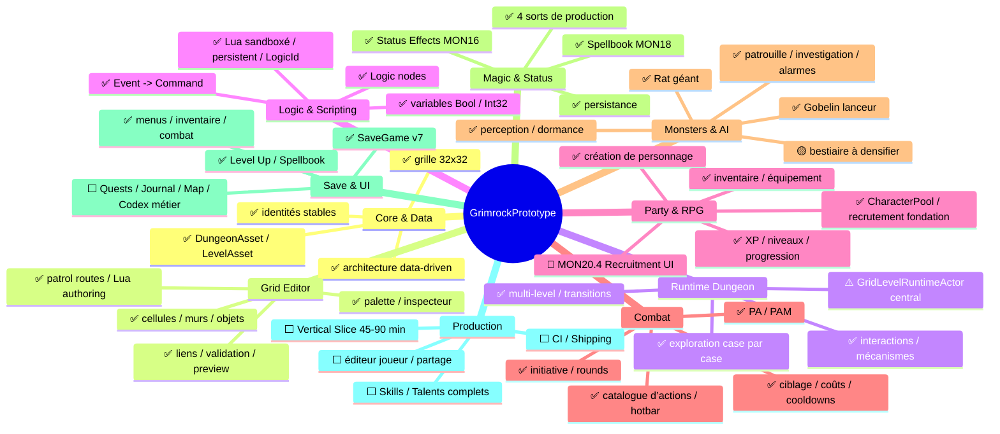
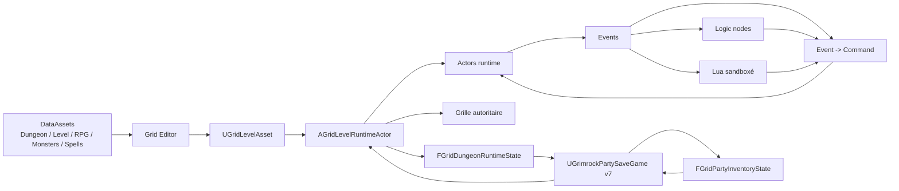
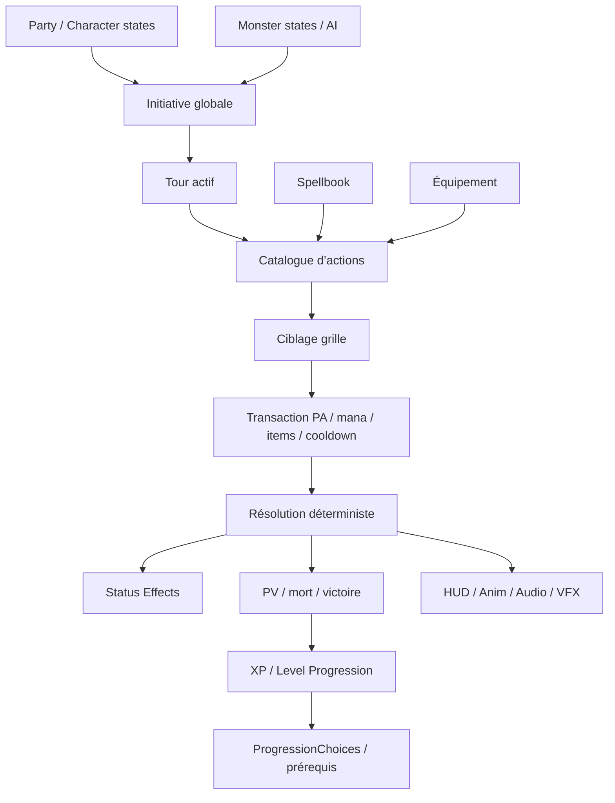
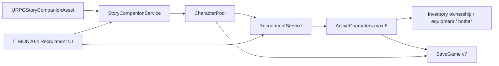
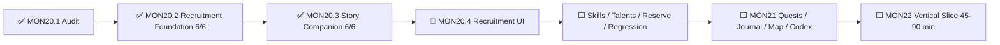

# GrimrockPrototype — Cartes d’architecture Mermaid

> Vue visuelle de synthèse. La source détaillée et autoritaire reste
> [`GRIMROCK_PROJECT_MAP.md`](GRIMROCK_PROJECT_MAP.md).
> État : 23 août 2026, après validation de MON20.3 et avant MON20.4.

## Légende

- ✅ implémenté / validé dans le périmètre indiqué
- 🟡 partiel ou à généraliser
- ⬜ à faire
- ⚠️ dette / risque
- 🎯 priorité immédiate

## 1. Carte globale

## 2. Flux de données et runtime

## 3. Combat, monstres et RPG

## 4. Recrutement MON20

## 5. Roadmap immédiate

