# GrimrockPrototype — Cartographie Mermaid détaillée

> **Vue actuelle — DOC-ARCH01, 9 octobre 2026.**
>
> Baseline C++ auditée : `6f98a0ef`. Dernière globale + Shipping :
> `9045ef2d`, **1026/1026**, 0 warning/échec, Shipping Win64 validé.

## 1 — Modules et autorités

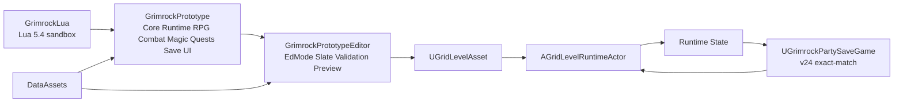
```mermaid
flowchart LR
    LUA[GrimrockLua\nLua 5.4 sandbox] --> RT[GrimrockPrototype\nCore Runtime RPG Combat Magic Quests Save UI]
    RT --> ED[GrimrockPrototypeEditor\nEdMode Slate Validation Preview]
    DA[DataAssets] --> RT
    DA --> ED
    ED --> LVL[UGridLevelAsset]
    LVL --> RTA[AGridLevelRuntimeActor]
    RTA --> STATE[Runtime State]
    STATE --> SAVE[UGrimrockPartySaveGame\nv24 exact-match]
    SAVE --> RTA
```

## 2 — Dungeon / LevelAsset

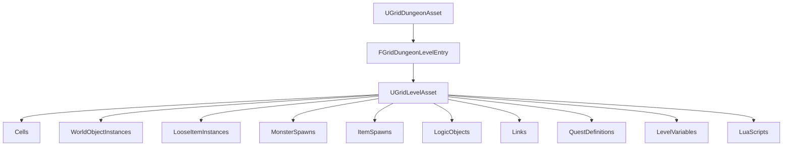
```mermaid
flowchart TB
    D[UGridDungeonAsset] --> E[FGridDungeonLevelEntry]
    E --> L[UGridLevelAsset]
    L --> C[Cells]
    L --> WO[WorldObjectInstances]
    L --> LI[LooseItemInstances]
    L --> MS[MonsterSpawns]
    L --> IS[ItemSpawns]
    L --> LO[LogicObjects]
    L --> LK[Links]
    L --> Q[QuestDefinitions]
    L --> V[LevelVariables]
    L --> LUA[LuaScripts]
```

## 3 — World Object Definition / Instance / Palette

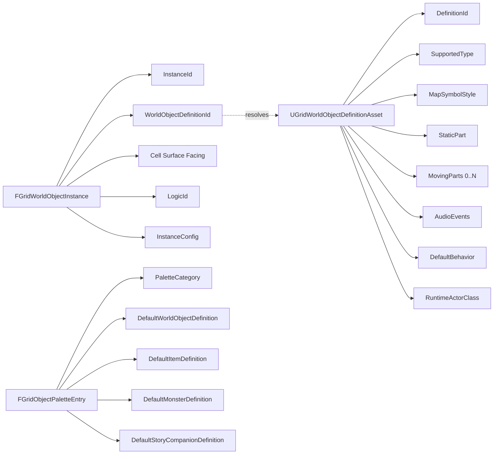
```mermaid
flowchart LR
    DEF[UGridWorldObjectDefinitionAsset] --> DID[DefinitionId]
    DEF --> TYPE[SupportedType]
    DEF --> MAP[MapSymbolStyle]
    DEF --> STATIC[StaticPart]
    DEF --> MOV[MovingParts 0..N]
    DEF --> AUDIO[AudioEvents]
    DEF --> BEH[DefaultBehavior]
    DEF --> ACTOR[RuntimeActorClass]

    INST[FGridWorldObjectInstance] --> IID[InstanceId]
    INST --> REF[WorldObjectDefinitionId]
    INST --> POS[Cell Surface Facing]
    INST --> LOGIC[LogicId]
    INST --> OVR[InstanceConfig]
    REF -. resolves .-> DEF

    PAL[FGridObjectPaletteEntry] --> CAT[PaletteCategory]
    PAL --> WREF[DefaultWorldObjectDefinition]
    PAL --> IREF[DefaultItemDefinition]
    PAL --> MREF[DefaultMonsterDefinition]
    PAL --> CREF[DefaultStoryCompanionDefinition]
```

La palette n'a **aucun DisplayNameOverride** ; son nom effectif vient de la
définition référencée.

## 4 — Grid Editor

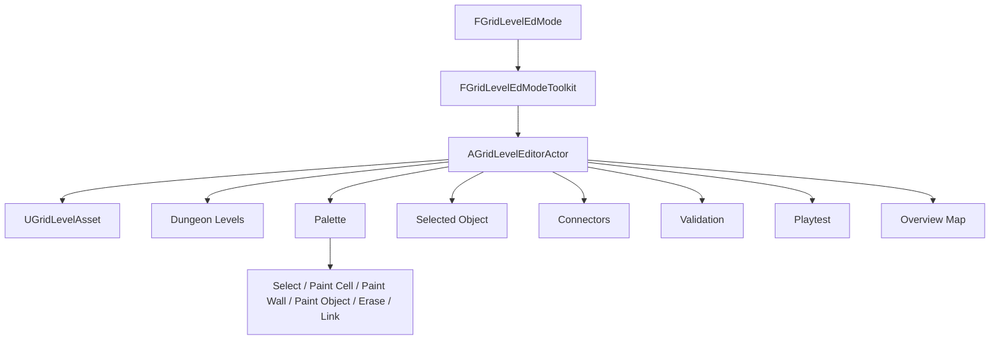
```mermaid
flowchart TB
    MODE[FGridLevelEdMode] --> TK[FGridLevelEdModeToolkit]
    TK --> ACT[AGridLevelEditorActor]
    ACT --> LVL[UGridLevelAsset]
    ACT --> LEVELS[Dungeon Levels]
    ACT --> PAL[Palette]
    ACT --> SEL[Selected Object]
    ACT --> LINKS[Connectors]
    ACT --> VAL[Validation]
    ACT --> PLAY[Playtest]
    ACT --> OVMAP[Overview Map]
    PAL --> TOOLS[Select / Paint Cell / Paint Wall / Paint Object / Erase / Link]
```

## 5 — Mouse interaction

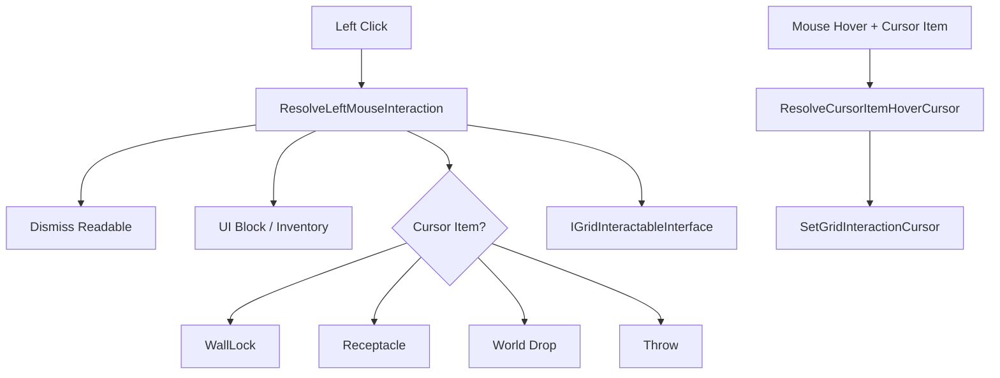
```mermaid
flowchart TB
    CLICK[Left Click] --> RES[ResolveLeftMouseInteraction]
    RES --> READ[Dismiss Readable]
    RES --> UI[UI Block / Inventory]
    RES --> CUR{Cursor Item?}
    CUR --> LOCK[WallLock]
    CUR --> REC[Receptacle]
    CUR --> DROP[World Drop]
    CUR --> THROW[Throw]
    RES --> WORLD[IGridInteractableInterface]
    HOVER[Mouse Hover + Cursor Item] --> HRES[ResolveCursorItemHoverCursor]
    HRES --> CURSOR[SetGridInteractionCursor]
```

## 6 — Event / Logic / Lua / Quest

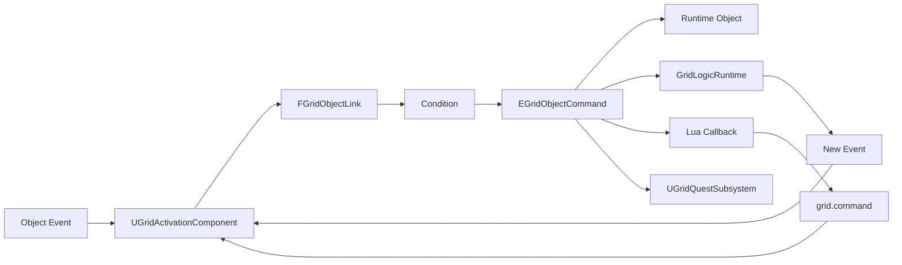
```mermaid
flowchart LR
    EV[Object Event] --> A[UGridActivationComponent]
    A --> L[FGridObjectLink]
    L --> COND[Condition]
    COND --> CMD[EGridObjectCommand]
    CMD --> OBJ[Runtime Object]
    CMD --> LOG[GridLogicRuntime]
    CMD --> LUA[Lua Callback]
    CMD --> QUEST[UGridQuestSubsystem]
    LOG --> EV2[New Event]
    EV2 --> A
    LUA --> GC[grid.command]
    GC --> A
```

## 7 — Inventory / ownership

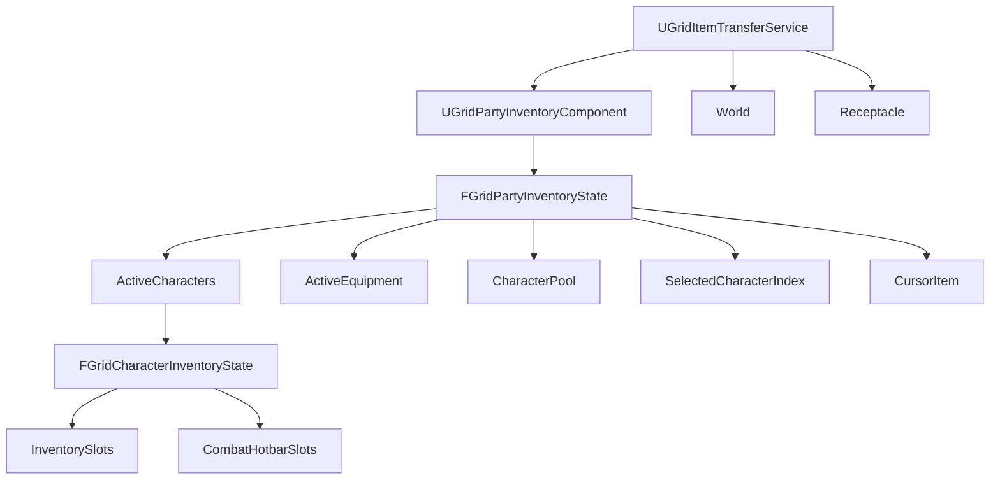
```mermaid
flowchart TB
    PIC[UGridPartyInventoryComponent] --> PS[FGridPartyInventoryState]
    PS --> AC[ActiveCharacters]
    PS --> EQ[ActiveEquipment]
    PS --> POOL[CharacterPool]
    PS --> SEL[SelectedCharacterIndex]
    PS --> CUR[CursorItem]

    CHAR[FGridCharacterInventoryState] --> INV[InventorySlots]
    CHAR --> HOT[CombatHotbarSlots]
    AC --> CHAR

    XFER[UGridItemTransferService] --> PIC
    XFER --> WORLD[World]
    XFER --> REC[Receptacle]
```

## 8 — RPG Skills / Talents / Attributes

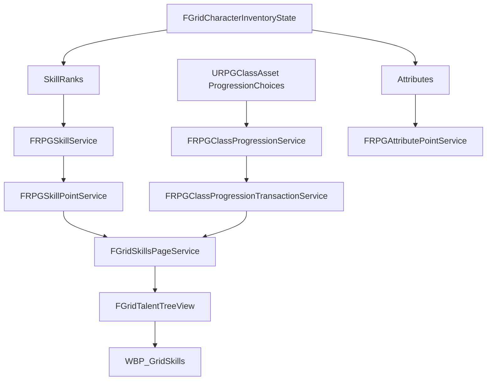
```mermaid
flowchart TB
    CHAR[FGridCharacterInventoryState]
    CHAR --> SKR[SkillRanks]
    SKR --> SKS[FRPGSkillService]
    SKS --> SKP[FRPGSkillPointService]
    SKP --> PAGE[FGridSkillsPageService]

    CLASS[URPGClassAsset ProgressionChoices] --> CPS[FRPGClassProgressionService]
    CPS --> TX[FRPGClassProgressionTransactionService]
    TX --> PAGE
    PAGE --> TREE[FGridTalentTreeView]
    TREE --> UI[WBP_GridSkills]

    CHAR --> ATTR[Attributes]
    ATTR --> APS[FRPGAttributePointService]
```

## 9 — Level Up

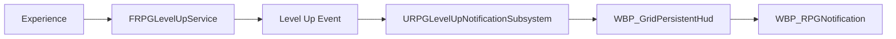
```mermaid
flowchart LR
    XP[Experience] --> LVL[FRPGLevelUpService]
    LVL --> EVENT[Level Up Event]
    EVENT --> SUB[URPGLevelUpNotificationSubsystem]
    SUB --> HUD[WBP_GridPersistentHud]
    HUD --> TOAST[WBP_RPGNotification]
```

Aucun Level-Up modal ni `LastAcknowledgedLevel`.

## 10 — Combat

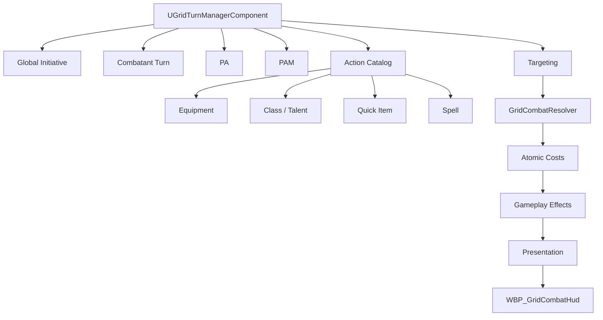
```mermaid
flowchart TB
    TM[UGridTurnManagerComponent] --> INIT[Global Initiative]
    TM --> TURN[Combatant Turn]
    TM --> PA[PA]
    TM --> PAM[PAM]
    TM --> CAT[Action Catalog]
    CAT --> EQUIP[Equipment]
    CAT --> CLASS[Class / Talent]
    CAT --> QUICK[Quick Item]
    CAT --> SPELL[Spell]
    TM --> TARGET[Targeting]
    TARGET --> RES[GridCombatResolver]
    RES --> COST[Atomic Costs]
    COST --> FX[Gameplay Effects]
    FX --> PRES[Presentation]
    PRES --> HUD[WBP_GridCombatHud]
```

## 11 — Monster AI

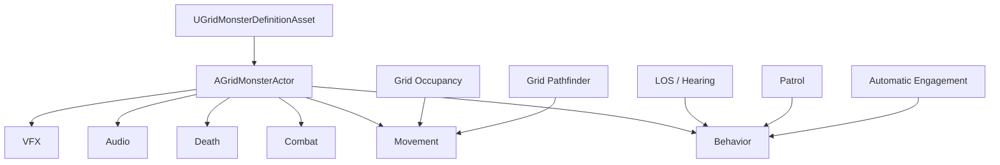
```mermaid
flowchart TB
    DEF[UGridMonsterDefinitionAsset] --> M[AGridMonsterActor]
    M --> MOVE[Movement]
    M --> BEH[Behavior]
    M --> COMBAT[Combat]
    M --> DEATH[Death]
    M --> AUDIO[Audio]
    M --> VFX[VFX]
    OCC[Grid Occupancy] --> MOVE
    PATH[Grid Pathfinder] --> MOVE
    PERC[LOS / Hearing] --> BEH
    PATROL[Patrol] --> BEH
    ENG[Automatic Engagement] --> BEH
```

## 12 — Save v24

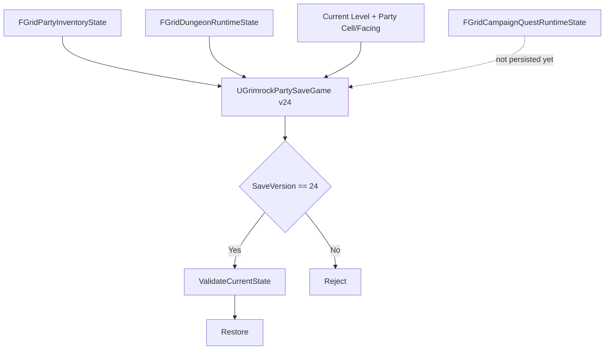
```mermaid
flowchart TB
    PARTY[FGridPartyInventoryState] --> SG[UGrimrockPartySaveGame v24]
    DUN[FGridDungeonRuntimeState] --> SG
    POS[Current Level + Party Cell/Facing] --> SG
    SG --> CHECK{SaveVersion == 24}
    CHECK -- Yes --> VALID[ValidateCurrentState]
    VALID --> LOAD[Restore]
    CHECK -- No --> REJECT[Reject]

    Q[FGridCampaignQuestRuntimeState] -. not persisted yet .-> SG
```

## 13 — Map runtime

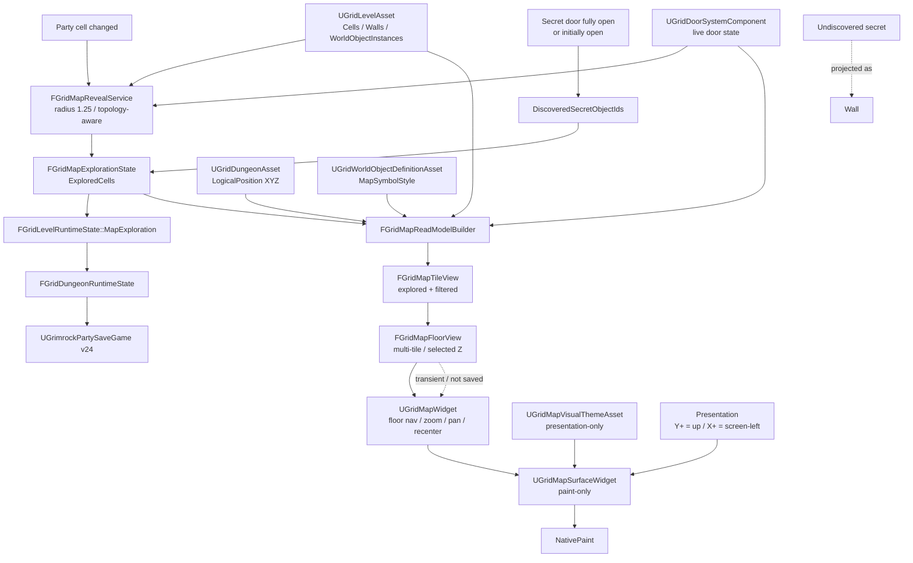
```mermaid
flowchart TB
    PARTY[Party cell changed] --> REVEAL[FGridMapRevealService<br/>radius 1.25 / topology-aware]
    LEVEL[UGridLevelAsset<br/>Cells / Walls / WorldObjectInstances] --> REVEAL
    DOOR[UGridDoorSystemComponent<br/>live door state] --> REVEAL
    REVEAL --> EXP[FGridMapExplorationState<br/>ExploredCells]
    SECRET[Secret door fully open<br/>or initially open] --> DISC[DiscoveredSecretObjectIds]
    DISC --> EXP

    EXP --> LSTATE[FGridLevelRuntimeState::MapExploration]
    LSTATE --> DSTATE[FGridDungeonRuntimeState]
    DSTATE --> SAVE[UGrimrockPartySaveGame v24]

    DUN[UGridDungeonAsset<br/>LogicalPosition XYZ] --> READ[FGridMapReadModelBuilder]
    LEVEL --> READ
    EXP --> READ
    DOOR --> READ
    DEF[UGridWorldObjectDefinitionAsset<br/>MapSymbolStyle] --> READ

    READ --> TILE[FGridMapTileView<br/>explored + filtered]
    TILE --> FLOOR[FGridMapFloorView<br/>multi-tile / selected Z]
    FLOOR --> W[UGridMapWidget<br/>floor nav / zoom / pan / recenter]
    W --> SURF[UGridMapSurfaceWidget<br/>paint-only]
    THEME[UGridMapVisualThemeAsset<br/>presentation-only] --> SURF
    ORIENT[Presentation<br/>Y+ = up / X+ = screen-left] --> SURF
    SURF --> PAINT[NativePaint]

    HIDDEN[Undiscovered secret] -. projected as .-> WALL[Wall]
    FLOOR -. transient / not saved .-> W
```

Règles de sécurité de projection :

- cellule non explorée → absente du read-model ;
- secret non découvert ou porte impossible à classifier → `Wall` ;
- état de porte : live → persisted → authored fallback ;
- `MapSymbolStyle` n'est qu'un opt-in de présentation ;
- `FGridMapFloorView`, zoom, pan et étage consulté ne sont pas persistés ;
- le miroir X appartient uniquement au rendu : le gameplay reste
  `North=Y+ / East=X+`.

## 14 — UI viewport

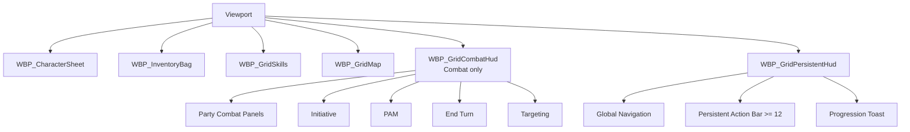
```mermaid
flowchart TB
    VP[Viewport] --> CS[WBP_CharacterSheet]
    VP --> BAG[WBP_InventoryBag]
    VP --> SK[WBP_GridSkills]
    VP --> MAP[WBP_GridMap]
    VP --> CH[WBP_GridCombatHud\nCombat only]
    VP --> PH[WBP_GridPersistentHud]

    PH --> NAV[Global Navigation]
    PH --> BAR[Persistent Action Bar >= 12]
    PH --> NOTIF[Progression Toast]

    CH --> MEMBERS[Party Combat Panels]
    CH --> INIT[Initiative]
    CH --> PAM[PAM]
    CH --> END[End Turn]
    CH --> TARGET[Targeting]
```

## 15 — Remaining GrimrockMenu shell

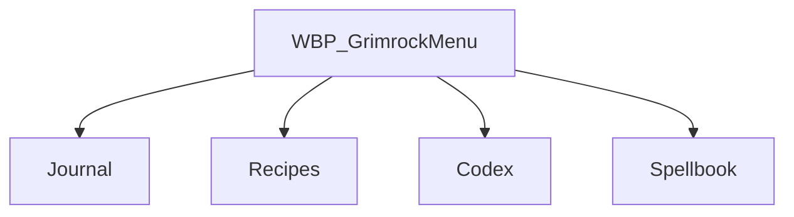
```mermaid
flowchart TB
    MENU[WBP_GrimrockMenu] --> JOURNAL[Journal]
    MENU --> RECIPES[Recipes]
    MENU --> CODEX[Codex]
    MENU --> SPELL[Spellbook]
```

Inventory, Skills et Map sont autonomes.

## 16 — Startup

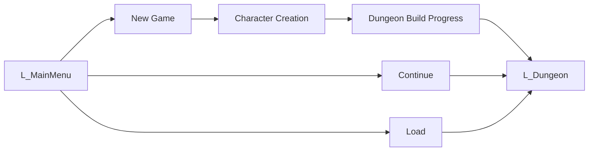
```mermaid
flowchart LR
    MAIN[L_MainMenu] --> NEW[New Game]
    MAIN --> CONT[Continue]
    MAIN --> LOAD[Load]
    NEW --> CC[Character Creation]
    CC --> PROG[Dungeon Build Progress]
    PROG --> DUN[L_Dungeon]
    CONT --> DUN
    LOAD --> DUN
```

## 17 — Roadmap

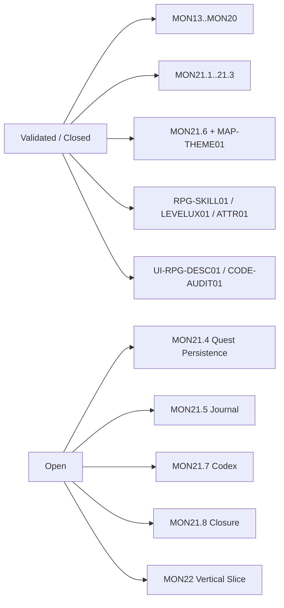
```mermaid
flowchart LR
    DONE[Validated / Closed] --> M13[MON13..MON20]
    DONE --> Q123[MON21.1..21.3]
    DONE --> MAP[MON21.6 + MAP-THEME01]
    DONE --> RPG[RPG-SKILL01 / LEVELUX01 / ATTR01]
    DONE --> UI[UI-RPG-DESC01 / CODE-AUDIT01]

    OPEN[Open] --> QP[MON21.4 Quest Persistence]
    OPEN --> J[MON21.5 Journal]
    OPEN --> C[MON21.7 Codex]
    OPEN --> CROSS[MON21.8 Closure]
    OPEN --> VS[MON22 Vertical Slice]
```

## 18 — Documentation authority

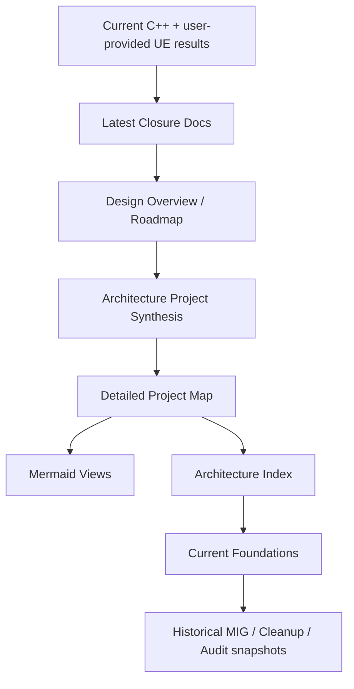
```mermaid
flowchart TB
    CODE[Current C++ + user-provided UE results] --> CLOSURE[Latest Closure Docs]
    CLOSURE --> OVER[Design Overview / Roadmap]
    OVER --> SYN[Architecture Project Synthesis]
    SYN --> MAP1[Detailed Project Map]
    MAP1 --> MAP2[Mermaid Views]
    MAP1 --> IDX[Architecture Index]
    IDX --> FOUND[Current Foundations]
    FOUND --> HIST[Historical MIG / Cleanup / Audit snapshots]
```
