# GrimrockPrototype — Cartographie Mermaid détaillée

> Vues visuelles complémentaires de la carte textuelle.
>
> État : **27 septembre 2026** — HEAD `85951ce0ffaa3ad79c4e767db729b92922e2d501`.

## 1 — Vue système globale

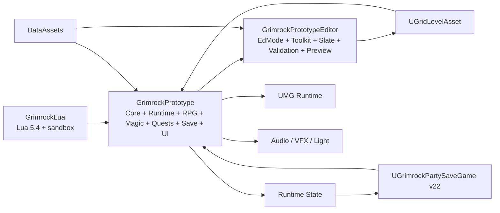
```mermaid
flowchart LR
    LUA[GrimrockLua\nLua 5.4 + sandbox] --> RT[GrimrockPrototype\nCore + Runtime + RPG + Magic + Quests + Save + UI]
    RT --> ED[GrimrockPrototypeEditor\nEdMode + Toolkit + Slate + Validation + Preview]
    DA[DataAssets] --> RT
    DA --> ED
    ED --> LVL[UGridLevelAsset]
    LVL --> RT
    RT --> STATE[Runtime State]
    STATE --> SAVE[UGrimrockPartySaveGame v22]
    SAVE --> RT
    RT --> UI[UMG Runtime]
    RT --> AUDIO[Audio / VFX / Light]
```

## 2 — Donjon, niveau et placements typés

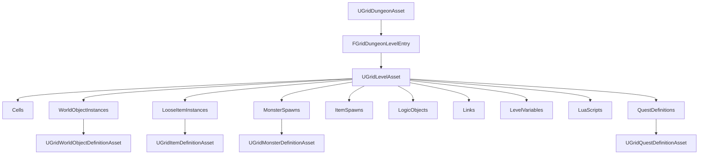
```mermaid
flowchart TB
    D[UGridDungeonAsset] --> E[FGridDungeonLevelEntry]
    E --> L[UGridLevelAsset]
    L --> C[Cells]
    L --> WO[WorldObjectInstances]
    L --> LI[LooseItemInstances]
    L --> MS[MonsterSpawns]
    L --> IS[ItemSpawns]
    L --> LO[LogicObjects]
    L --> LINKS[Links]
    L --> VARS[LevelVariables]
    L --> LUA[LuaScripts]
    L --> Q[QuestDefinitions]

    WO --> WOD[UGridWorldObjectDefinitionAsset]
    LI --> ITEM[UGridItemDefinitionAsset]
    MS --> MON[UGridMonsterDefinitionAsset]
    Q --> QD[UGridQuestDefinitionAsset]
```

## 3 — Définition / instance World Object

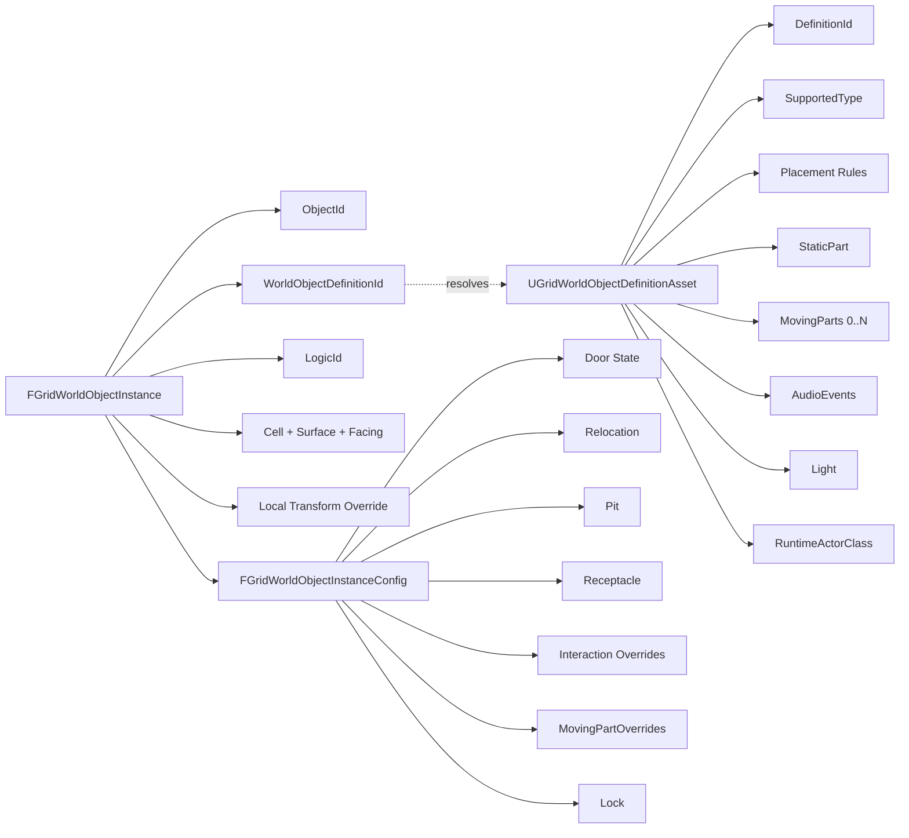
```mermaid
flowchart LR
    DEF[UGridWorldObjectDefinitionAsset] --> ID[DefinitionId]
    DEF --> TYPE[SupportedType]
    DEF --> PLACE[Placement Rules]
    DEF --> STATIC[StaticPart]
    DEF --> MOVE[MovingParts 0..N]
    DEF --> AUDIO[AudioEvents]
    DEF --> LIGHT[Light]
    DEF --> ACTOR[RuntimeActorClass]

    INST[FGridWorldObjectInstance] --> OID[ObjectId]
    INST --> DID[WorldObjectDefinitionId]
    INST --> LOGIC[LogicId]
    INST --> POS[Cell + Surface + Facing]
    INST --> LOCAL[Local Transform Override]
    INST --> CFG[FGridWorldObjectInstanceConfig]

    DID -. resolves .-> DEF
    CFG --> DOOR[Door State]
    CFG --> RELO[Relocation]
    CFG --> PIT[Pit]
    CFG --> REC[Receptacle]
    CFG --> INT[Interaction Overrides]
    CFG --> MP[MovingPartOverrides]
    CFG --> LOCK[Lock]
```

## 4 — Grid Editor

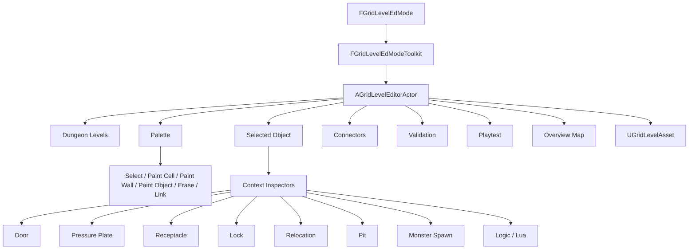
```mermaid
flowchart TB
    MODE[FGridLevelEdMode] --> TK[FGridLevelEdModeToolkit]
    TK --> ACT[AGridLevelEditorActor]
    ACT --> LEVELS[Dungeon Levels]
    ACT --> PAL[Palette]
    ACT --> SEL[Selected Object]
    ACT --> LINKS[Connectors]
    ACT --> VAL[Validation]
    ACT --> PLAY[Playtest]
    ACT --> MAP[Overview Map]

    PAL --> TOOLS[Select / Paint Cell / Paint Wall / Paint Object / Erase / Link]
    SEL --> INSPECT[Context Inspectors]
    INSPECT --> DOOR[Door]
    INSPECT --> PP[Pressure Plate]
    INSPECT --> REC[Receptacle]
    INSPECT --> LOCK[Lock]
    INSPECT --> RELO[Relocation]
    INSPECT --> PIT[Pit]
    INSPECT --> MON[Monster Spawn]
    INSPECT --> LUA[Logic / Lua]
    ACT --> LVL[UGridLevelAsset]
```

## 5 — Runtime niveau

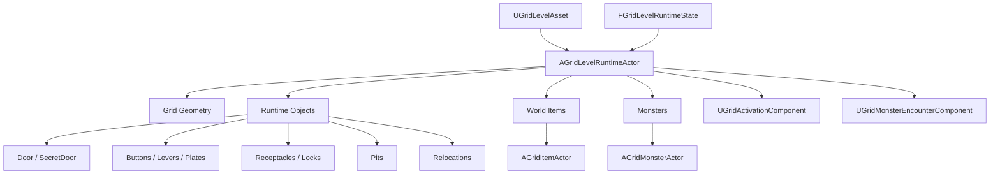
```mermaid
flowchart TB
    LVL[UGridLevelAsset] --> R[AGridLevelRuntimeActor]
    SAVE[FGridLevelRuntimeState] --> R
    R --> GEO[Grid Geometry]
    R --> OBJ[Runtime Objects]
    R --> ITEMS[World Items]
    R --> MON[Monsters]
    R --> ACT[UGridActivationComponent]
    R --> ENC[UGridMonsterEncounterComponent]

    OBJ --> DOOR[Door / SecretDoor]
    OBJ --> MECH[Buttons / Levers / Plates]
    OBJ --> REC[Receptacles / Locks]
    OBJ --> PIT[Pits]
    OBJ --> RELO[Relocations]
    ITEMS --> IA[AGridItemActor]
    MON --> MA[AGridMonsterActor]
```

## 6 — Exploration joueur

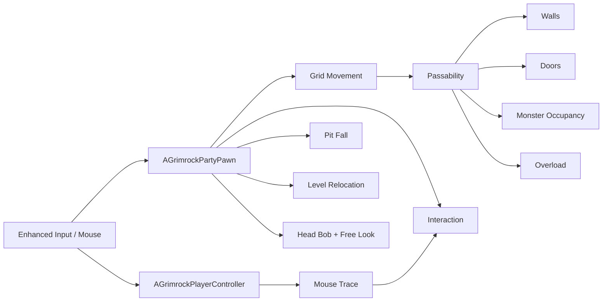
```mermaid
flowchart LR
    INPUT[Enhanced Input / Mouse] --> PC[AGrimrockPlayerController]
    INPUT --> P[AGrimrockPartyPawn]
    P --> GRID[Grid Movement]
    GRID --> PASS[Passability]
    PASS --> WALL[Walls]
    PASS --> DOOR[Doors]
    PASS --> OCC[Monster Occupancy]
    PASS --> WEIGHT[Overload]
    P --> INTERACT[Interaction]
    PC --> TRACE[Mouse Trace]
    TRACE --> INTERACT
    P --> PIT[Pit Fall]
    P --> RELO[Level Relocation]
    P --> CAM[Head Bob + Free Look]
```

## 7 — Event / Logic / Lua / Quest

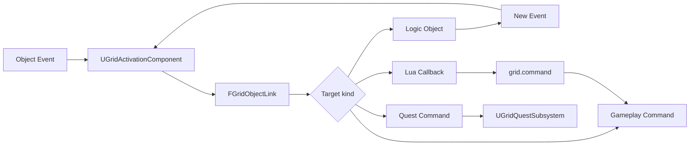
```mermaid
flowchart LR
    E[Object Event] --> A[UGridActivationComponent]
    A --> L[FGridObjectLink]
    L --> C{Target kind}
    C --> CMD[Gameplay Command]
    C --> LOGIC[Logic Object]
    C --> LUA[Lua Callback]
    C --> QUEST[Quest Command]

    LOGIC --> E2[New Event]
    E2 --> A
    LUA --> GC[grid.command]
    GC --> CMD
    QUEST --> QS[UGridQuestSubsystem]
```

## 8 — Inventory / Item authority

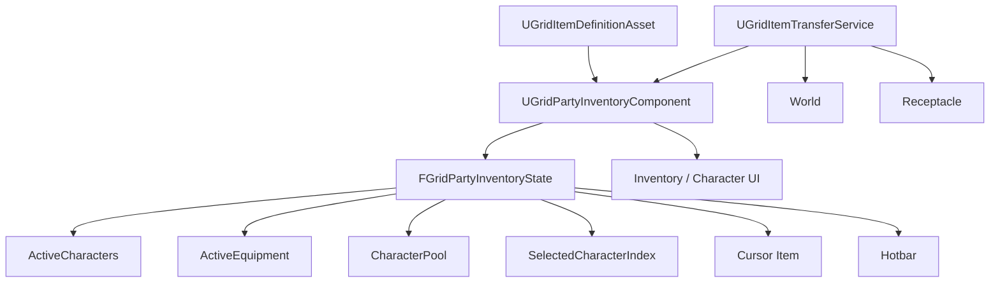
```mermaid
flowchart TB
    PIC[UGridPartyInventoryComponent] --> STATE[FGridPartyInventoryState]
    STATE --> AC[ActiveCharacters]
    STATE --> EQ[ActiveEquipment]
    STATE --> POOL[CharacterPool]
    STATE --> SEL[SelectedCharacterIndex]
    STATE --> CUR[Cursor Item]
    STATE --> HOT[Hotbar]

    XFER[UGridItemTransferService] --> PIC
    XFER --> WORLD[World]
    XFER --> REC[Receptacle]

    ITEM[UGridItemDefinitionAsset] --> PIC
    PIC --> UI[Inventory / Character UI]
```

## 9 — Combat

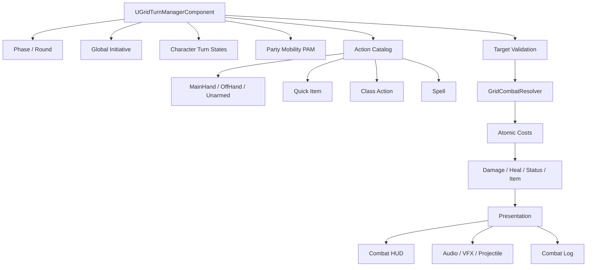
```mermaid
flowchart TB
    TM[UGridTurnManagerComponent] --> PH[Phase / Round]
    TM --> INIT[Global Initiative]
    TM --> CHAR[Character Turn States]
    TM --> MOB[Party Mobility PAM]
    TM --> CAT[Action Catalog]
    CAT --> HAND[MainHand / OffHand / Unarmed]
    CAT --> QUICK[Quick Item]
    CAT --> CLASS[Class Action]
    CAT --> SPELL[Spell]
    TM --> TARGET[Target Validation]
    TARGET --> RES[GridCombatResolver]
    RES --> COST[Atomic Costs]
    COST --> EFFECT[Damage / Heal / Status / Item]
    EFFECT --> PRESENT[Presentation]
    PRESENT --> HUD[Combat HUD]
    PRESENT --> AUDIO[Audio / VFX / Projectile]
    PRESENT --> LOG[Combat Log]
```

## 10 — Monster AI

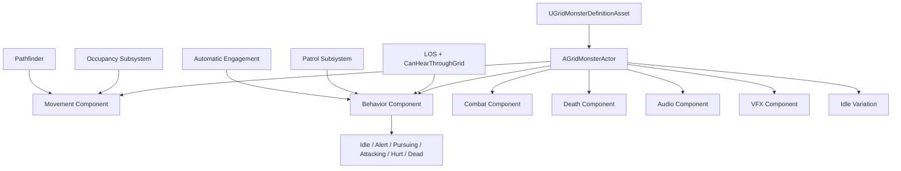
```mermaid
flowchart TB
    DEF[UGridMonsterDefinitionAsset] --> M[AGridMonsterActor]
    M --> MOVE[Movement Component]
    M --> BEH[Behavior Component]
    M --> COMBAT[Combat Component]
    M --> DEATH[Death Component]
    M --> AUD[Audio Component]
    M --> VFX[VFX Component]
    M --> IDLE[Idle Variation]

    OCC[Occupancy Subsystem] --> MOVE
    PATH[Pathfinder] --> MOVE
    PERC[LOS + CanHearThroughGrid] --> BEH
    PATROL[Patrol Subsystem] --> BEH
    ENG[Automatic Engagement] --> BEH
    BEH --> STATES[Idle / Alert / Pursuing / Attacking / Hurt / Dead]
```

## 11 — Save current-schema

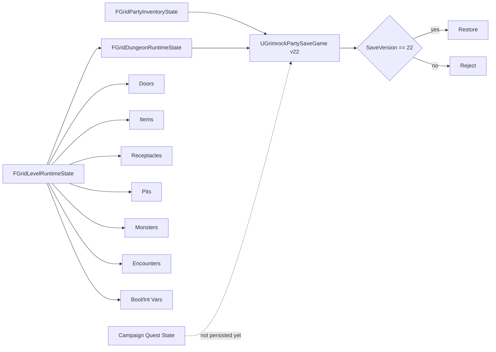
```mermaid
flowchart LR
    PARTY[FGridPartyInventoryState] --> SG[UGrimrockPartySaveGame v22]
    DUN[FGridDungeonRuntimeState] --> SG
    LEVEL[FGridLevelRuntimeState] --> DUN

    LEVEL --> DOORS[Doors]
    LEVEL --> ITEMS[Items]
    LEVEL --> REC[Receptacles]
    LEVEL --> PITS[Pits]
    LEVEL --> MON[Monsters]
    LEVEL --> ENCS[Encounters]
    LEVEL --> VARS[Bool/Int Vars]

    SG --> CHECK{SaveVersion == 22}
    CHECK -- yes --> LOAD[Restore]
    CHECK -- no --> REJECT[Reject]
    QUEST[Campaign Quest State] -. not persisted yet .-> SG
```

## 12 — UI viewport actuel

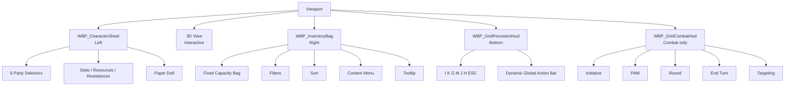
```mermaid
flowchart TB
    VP[Viewport] --> LEFT[WBP_CharacterSheet\nLeft]
    VP --> CENTER[3D View\nInteractive]
    VP --> RIGHT[WBP_InventoryBag\nRight]
    VP --> BOTTOM[WBP_GridPersistentHud\nBottom]
    VP --> COMBAT[WBP_GridCombatHud\nCombat only]

    LEFT --> PARTY[6 Party Selectors]
    LEFT --> STATS[Stats / Resources / Resistances]
    LEFT --> PAPER[Paper Doll]

    RIGHT --> BAG[Fixed Capacity Bag]
    RIGHT --> FILTER[Filters]
    RIGHT --> SORT[Sort]
    RIGHT --> CTX[Context Menu]
    RIGHT --> TIP[Tooltip]

    BOTTOM --> NAV[I K G M J H ESC]
    BOTTOM --> ACTIONS[Dynamic Global Action Bar]

    COMBAT --> INIT[Initiative]
    COMBAT --> PAM[PAM]
    COMBAT --> ROUND[Round]
    COMBAT --> END[End Turn]
    COMBAT --> TARGET[Targeting]
```

## 13 — État de la roadmap UI

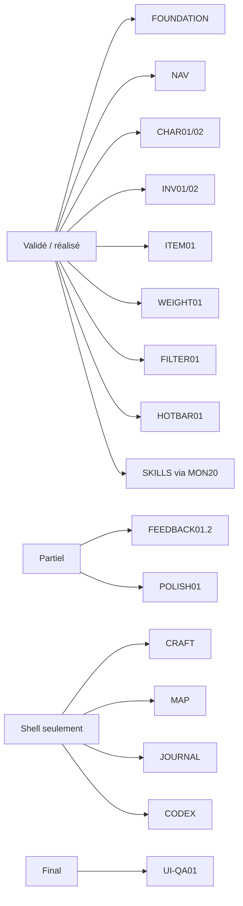
```mermaid
flowchart LR
    DONE[Validé / réalisé] --> FND[FOUNDATION]
    DONE --> NAV[NAV]
    DONE --> CHAR[CHAR01/02]
    DONE --> INV[INV01/02]
    DONE --> ITEM[ITEM01]
    DONE --> WEIGHT[WEIGHT01]
    DONE --> FILTER[FILTER01]
    DONE --> HOT[HOTBAR01]
    DONE --> SK[SKILLS via MON20]

    PART[Partiel] --> FB[FEEDBACK01.2]
    PART --> POL[POLISH01]

    SHELL[Shell seulement] --> CRAFT[CRAFT]
    SHELL --> MAP[MAP]
    SHELL --> JOURNAL[JOURNAL]
    SHELL --> CODEX[CODEX]

    FUTURE[Final] --> QA[UI-QA01]
```

## 14 — Main Menu / Startup

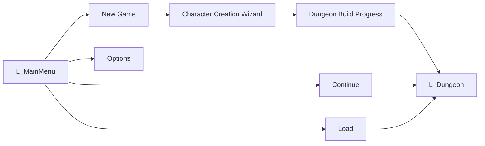
```mermaid
flowchart LR
    MENU[L_MainMenu] --> NEW[New Game]
    MENU --> CONT[Continue]
    MENU --> LOAD[Load]
    MENU --> OPT[Options]
    NEW --> CC[Character Creation Wizard]
    CC --> PROG[Dungeon Build Progress]
    PROG --> DUN[L_Dungeon]
    CONT --> DUN
    LOAD --> DUN
```

## 15 — Validation

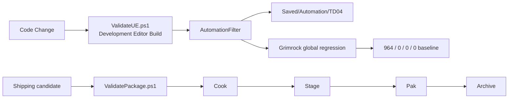
```mermaid
flowchart LR
    CODE[Code Change] --> BUILD[ValidateUE.ps1\nDevelopment Editor Build]
    BUILD --> AUTO[AutomationFilter]
    AUTO --> REPORT[Saved/Automation/TD04]
    AUTO --> GLOBAL[Grimrock global regression]
    GLOBAL --> BASE[964 / 0 / 0 / 0 baseline]

    RELEASE[Shipping candidate] --> PACK[ValidatePackage.ps1]
    PACK --> COOK[Cook]
    COOK --> STAGE[Stage]
    STAGE --> PAK[Pak]
    PAK --> ARCH[Archive]
```

## 16 — Audits / stop conditions

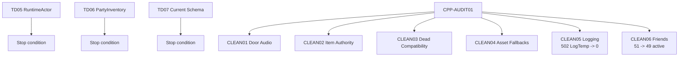
```mermaid
flowchart TB
    TD05[TD05 RuntimeActor] --> STOP1[Stop condition]
    TD06[TD06 PartyInventory] --> STOP2[Stop condition]
    TD07[TD07 Current Schema] --> STOP3[Stop condition]
    CPP[CPP-AUDIT01] --> C1[CLEAN01 Door Audio]
    CPP --> C2[CLEAN02 Item Authority]
    CPP --> C3[CLEAN03 Dead Compatibility]
    CPP --> C4[CLEAN04 Asset Fallbacks]
    CPP --> C5[CLEAN05 Logging\n502 LogTemp -> 0]
    CPP --> C6[CLEAN06 Friends\n51 -> 49 active]
```

## 17 — Documentation authority

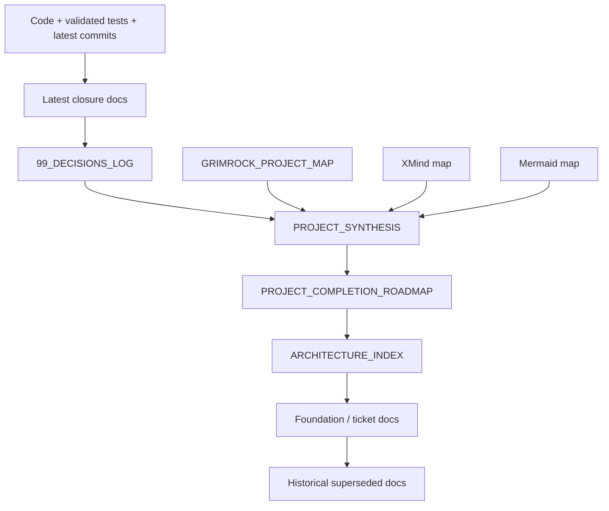
```mermaid
flowchart TB
    CODE[Code + validated tests + latest commits] --> CLOSURE[Latest closure docs]
    CLOSURE --> DEC[99_DECISIONS_LOG]
    DEC --> SYN[PROJECT_SYNTHESIS]
    SYN --> ROAD[PROJECT_COMPLETION_ROADMAP]
    ROAD --> IDX[ARCHITECTURE_INDEX]
    IDX --> FOUNDATION[Foundation / ticket docs]
    FOUNDATION --> HIST[Historical superseded docs]

    MAP1[GRIMROCK_PROJECT_MAP] --> SYN
    MAP2[XMind map] --> SYN
    MAP3[Mermaid map] --> SYN
```

## 18 — Roadmap courante

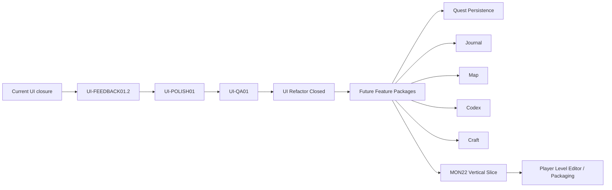
```mermaid
flowchart LR
    NOW[Current UI closure] --> FB[UI-FEEDBACK01.2]
    FB --> POL[UI-POLISH01]
    POL --> QA[UI-QA01]
    QA --> CLOSED[UI Refactor Closed]

    CLOSED --> FEATURES[Future Feature Packages]
    FEATURES --> QUEST[Quest Persistence]
    FEATURES --> JOURNAL[Journal]
    FEATURES --> MAP[Map]
    FEATURES --> CODEX[Codex]
    FEATURES --> CRAFT[Craft]

    FEATURES --> VS[MON22 Vertical Slice]
    VS --> PLAYER[Player Level Editor / Packaging]
```

## 19 — Invariants à ne pas casser

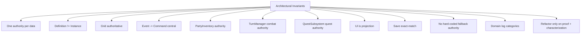
```mermaid
flowchart TB
    INV[Architectural Invariants]
    INV --> I1[One authority per data]
    INV --> I2[Definition != Instance]
    INV --> I3[Grid authoritative]
    INV --> I4[Event -> Command central]
    INV --> I5[PartyInventory authority]
    INV --> I6[TurnManager combat authority]
    INV --> I7[QuestSubsystem quest authority]
    INV --> I8[UI is projection]
    INV --> I9[Save exact-match]
    INV --> I10[No hard-coded fallback authority]
    INV --> I11[Domain log categories]
    INV --> I12[Refactor only on proof + characterization]
```
