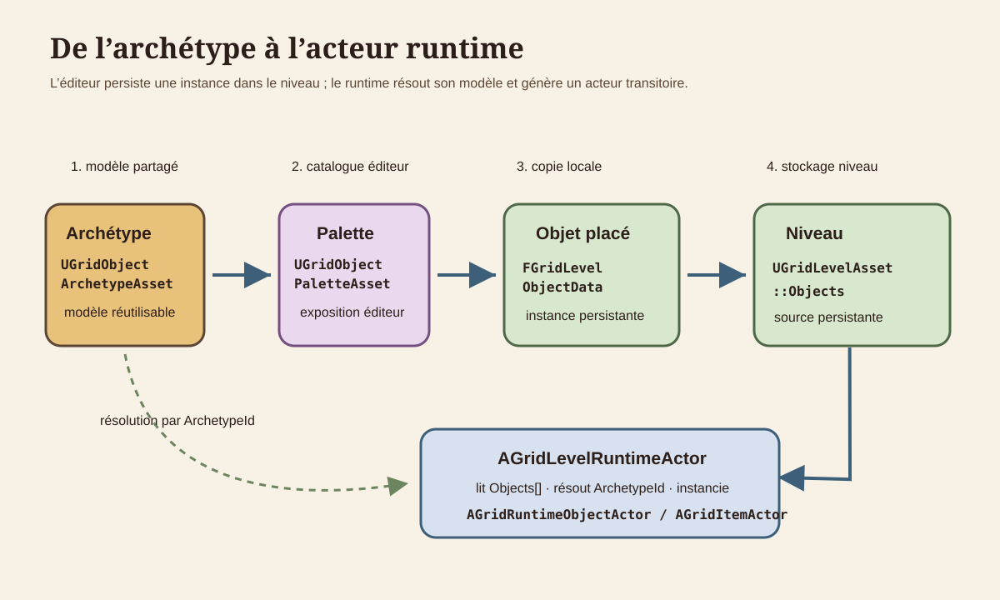
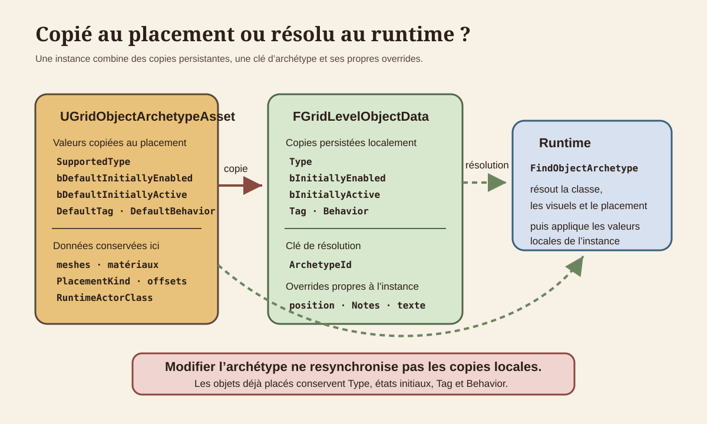
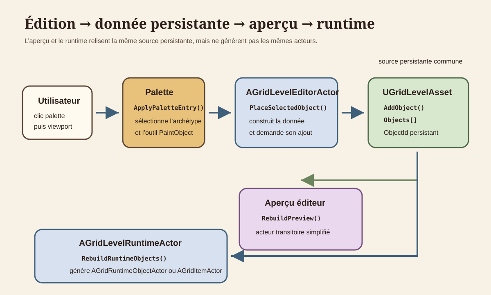
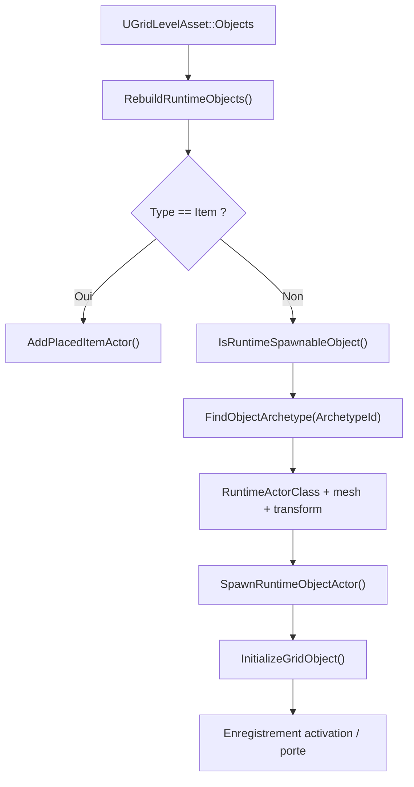

# Architecture des archétypes et objets placés

Pour le cas spécialisé des objets `Item`, voir [`ITEM_PICKUP_AND_PLACEMENT_FOUNDATION.md`](ITEM_PICKUP_AND_PLACEMENT_FOUNDATION.md).

## 1. Objet du document

Ce document décrit le système existant qui relie :

- les modèles réutilisables `UGridObjectArchetypeAsset` ;
- leur exposition dans `UGridObjectPaletteAsset` ;
- les instances persistantes `FGridLevelObjectData` stockées dans `UGridLevelAsset::Objects` ;
- l'aperçu éditeur ;
- les acteurs générés par `AGridLevelRuntimeActor`.

Il ne définit pas de nouvelle mécanique de gameplay. Les items, réceptacles, portes et liens ne sont cités que pour expliquer le contrat commun des objets placés.

Les règles de sélection et de clic runtime sont documentées séparément dans
`docs/Architecture/MOUSE_INTERACTION_FOUNDATION.md`.

Le contrat des liens entre objets, des événements, des conditions et des commandes est documenté dans
`docs/Architecture/LINK_EVENT_COMMAND_FOUNDATION.md`.

Le système runtime des portes et leur interaction avec la passabilité est documenté dans
`docs/Architecture/DOOR_MECHANISM_FOUNDATION.md`.

## 2. Vocabulaire

**Archétype** : `UGridObjectArchetypeAsset`, modèle partagé qui décrit identité, type fonctionnel, placement, visuels, classe runtime et valeurs par défaut.

**Entrée de palette** : `FGridObjectPaletteEntry`, tuile éditeur qui référence un archétype et peut surcharger son libellé, sa catégorie de classement et son icône.

**Objet placé** : `FGridLevelObjectData`, instance sérialisée dans un niveau. Il possède un `ObjectId`, une position et des valeurs locales.

**Acteur runtime** : instance transitoire d'`AGridRuntimeObjectActor` ou, pour un item placé, d'`AGridItemActor`.

Ce schéma correspond au code, avec une précision importante : la palette ne reste pas une dépendance runtime directe. L'acteur éditeur copie ses archétypes dans `AGridLevelRuntimeActor::ObjectArchetypes`.

## 3. Cartographie du code

| Domaine | Déclaration | Implémentation | Rôle |
|---|---|---|---|
| Données placées | `Source/GrimrockPrototype/Public/Core/GridTypes.h` | structure sans `.cpp` | `FGridLevelObjectData` et `FGridObjectLink`. |
| Niveau | `Source/GrimrockPrototype/Public/Core/GridLevelAsset.h` | `Source/GrimrockPrototype/Private/Core/GridLevelAsset.cpp` | Stockage, ajout, suppression et génération des `ObjectId`. |
| Archétype | `Source/GrimrockPrototype/Public/Core/GridObjectArchetypeAsset.h` | `Source/GrimrockPrototype/Private/Core/GridObjectArchetypeAsset.cpp` | Modèle, helpers de placement et validation. |
| Palette | `Source/GrimrockPrototype/Public/Core/GridObjectPaletteAsset.h` | `Source/GrimrockPrototype/Private/Core/GridObjectPaletteAsset.cpp` | Entrées affichées dans l'éditeur et validation de base. |
| Éditeur | `Source/GrimrockPrototypeEditor/Public/EditorTools/GridLevelEditorActor.h` | `Source/GrimrockPrototypeEditor/Private/EditorTools/GridLevelEditorActor.cpp` | Sélection de palette, placement, édition, suppression, validation et aperçu. |
| Mode éditeur | `Source/GrimrockPrototypeEditor/Public/EditorTools/GridLevelEdMode.h` | `Source/GrimrockPrototypeEditor/Private/EditorTools/GridLevelEdMode.cpp` | Conversion des actions viewport en actions de l'acteur éditeur. |
| Interface | `Source/GrimrockPrototypeEditor/Private/EditorTools/Widgets/` | fichiers `.cpp` associés | Palette, inspecteur, carte d'ensemble, liens et validation. |
| Runtime de niveau | `Source/GrimrockPrototype/Public/Runtime/GridLevelRuntimeActor.h` | `Source/GrimrockPrototype/Private/Runtime/GridLevelRuntimeActor.cpp` | Résolution d'archétype, transform, filtrage, génération et initialisation. |
| Base runtime | `Source/GrimrockPrototype/Public/Runtime/GridRuntimeObjectActor.h` | `Source/GrimrockPrototype/Private/Runtime/GridRuntimeObjectActor.cpp` | Identité runtime commune et mesh simple. |
| Aperçu | `GridEditorPreviewComponent.h`, `GridEditorPreviewObjectActor.h` | fichiers `.cpp` associés | Acteurs transitoires visibles uniquement dans l'éditeur. |

`GridObjectActor.h` n'existe pas. La base réelle est `GridRuntimeObjectActor.h`.

## 4. `FGridLevelObjectData`

Tous les champs ci-dessous sont persistants dans `UGridLevelAsset::Objects` et exposés en `EditAnywhere, BlueprintReadWrite`.

| Champ | Rôle et origine | Usage |
|---|---|---|
| `ObjectId` | Identité stable de l'instance. Généré par `UGridLevelAsset::AddObject()` ou réparé par `EnsureObjectIds()`. | Sélection, liens, registres runtime et état de niveau. |
| `Type` | Famille fonctionnelle. Copié de `SupportedType` lors du choix de palette. | Dispatch éditeur et runtime. Peut devenir incohérent si l'archétype change. |
| `CellX`, `CellY` | Cellule d'ancrage choisie dans l'éditeur. | Validation, aperçu, transform et interactions. |
| `Edge` | Bord cardinal pour un placement mural/edge. L'éditeur écrit `None` pour un placement central. | Transform runtime. Les items disposent aussi d'un placement de bord au sol. |
| `LocalYaw` | Rotation locale, initialisée à `0`, modifiable par l'orientation dans l'inspecteur. | Ajoutée à la rotation calculée du placement. |
| `ArchetypeId` | Clé de résolution vers `ObjectArchetypes`. Copiée depuis la palette. | Visuels, placement, classe runtime et paramètres d'archétype. |
| `ItemDefinitionAsset` | Référence locale d'un item placé. Modifiable dans l'inspecteur pour `Type=Item`. | Résolution de la définition runtime. |
| `ItemDefinitionId` | Identifiant local d'item, synchronisable depuis l'asset. | Fallback de résolution et identité runtime de l'item. |
| `bInitiallyEnabled` | Copie de `bDefaultInitiallyEnabled`, ensuite éditable localement. | Filtre la preview et la génération runtime. |
| `bInitiallyActive` | Copie de `bDefaultInitiallyActive`, ensuite éditable localement. | État initial des mécanismes et de composants runtime. |
| `Tag` | Copie de `DefaultTag`, ensuite éditable localement. | Identification fonctionnelle ponctuelle et compatibilité de certains chemins. |
| `Notes` | Texte local de level design. | Affiché et édité dans l'inspecteur, sans effet runtime générique. |
| `OverrideReadableText` | Texte lisible local. | Prioritaire sur `ReadableText` dans `AGridGenericObjectActor`. |
| `PaletteEntryId` | Provenance de la tuile choisie. | Affichage éditeur et diagnostic ; le runtime résout par `ArchetypeId`, pas par cette valeur. |
| `Behavior` | Copie complète de `DefaultBehavior`, ensuite éditable localement. | Paramètres initiaux spécialisés lus par les acteurs runtime. |

Les valeurs copiées ne sont pas liées dynamiquement à l'archétype. Modifier un Data Asset d'archétype ne met pas à jour `Type`, `bInitiallyEnabled`, `bInitiallyActive`, `Tag` ou `Behavior` des objets déjà placés. L'éditeur fournit `ResetSelectedObjectBehaviorFromArchetype()`, mais aucun resynchroniseur général.

## 5. `UGridObjectArchetypeAsset`

L'archétype est la source partagée utilisée à la fois par l'éditeur et le runtime.

### Identité et classification

- `ArchetypeId`, `DisplayName`, `Description` ;
- `SupportedType`, famille fonctionnelle de type `EGridLevelObjectType` ;
- `Category`, classement de palette sans effet gameplay ;
- `ObjectCategory`, classification utilisée surtout par l'interface et la validation.

### Valeurs copiées au placement

- `SupportedType` vers `Type` ;
- `ArchetypeId` vers `ArchetypeId` ;
- `bDefaultInitiallyEnabled` vers `bInitiallyEnabled` ;
- `bDefaultInitiallyActive` vers `bInitiallyActive` ;
- `DefaultTag` vers `Tag` ;
- `DefaultBehavior` vers `Behavior`.

### Données référencées après placement

- `PlacementKind`, offsets de placement et règles de partage ;
- `bReplacesStandardWall`, `bBlocksMovement`, `bHideCellFloor` ;
- paramètres de lecture, interaction et lumière ;
- `PreviewMesh`, `PreviewMaterial`, meshes et matériaux fixes/mobiles ;
- `RuntimeActorClass` et `ItemActorClass` ;
- `ItemTags`.

Les copies persistées dans l'objet placé ne sont pas resynchronisées automatiquement lorsque l'archétype évolue.

`PlacementKind` est l'unique source de vérité du placement. TD07.3.6 a supprimé les anciens miroirs `bPlaceOnEdge` et `bPlaceAtCellCenter`.

`ValidateArchetype()` vérifie notamment l'identité, le type, la classe runtime requise, le placement, les meshes attendus et plusieurs cohérences de catégorie ou de paramètres.

## 6. Palette

`UGridObjectPaletteAsset::Entries` contient des `FGridObjectPaletteEntry` :

- `EntryId` ;
- `DisplayNameOverride` ;
- `CategoryOverride` ;
- `Icon` ;
- `DefaultArchetype`.

Le panneau `SGridEditorToolPalettePanel` groupe les entrées par catégorie et ignore les entrées `ItemSpawn`. Un clic appelle `AGridLevelEditorActor::ApplyPaletteEntry()`, sélectionne `PaintObject` et copie les valeurs par défaut dans l'état de peinture.

`ValidatePalette()` contrôle les `EntryId` vides ou dupliqués et la présence d'un archétype avec identifiant et type valides. L'entrée de palette n'est pas une instance et ne stocke aucun état de niveau.

## 7. Placement et suppression dans l'éditeur

`PlaceSelectedObject()` :

1. valide le niveau, la cellule, le type et le bord requis ;
2. résout l'archétype dans `ObjectPalette` ;
3. applique la politique de conflits de cellule ou d'ancre ;
4. construit `FGridLevelObjectData` à partir de l'état de peinture ;
5. appelle `UGridLevelAsset::AddObject()` ;
6. sélectionne le nouvel `ObjectId` et reconstruit l'aperçu.

La suppression passe par les helpers de l'acteur éditeur ou `UGridLevelAsset::RemoveObjectById()`. Les liens entrants et sortants sont supprimés avec l'objet. L'outil `Erase` essaie d'abord les objets, puis le mur, puis la cellule.

La carte d'ensemble parcourt directement `LevelAsset->Objects`, affiche des marqueurs par cellule et groupe les objets de la cellule sélectionnée par ancre.

## 8. Aperçu éditeur

`RebuildPreview()` assigne le `LevelAsset`, ajoute à `PreviewRuntimeActor->ObjectArchetypes` les archétypes référencés par la palette, puis appelle un rebuild complet.

En monde non jeu, `UGridEditorPreviewComponent` :

- ignore les objets désactivés, hors grille ou sans mesh résolu ;
- calcule le transform avec `AGridLevelRuntimeActor::GetObjectPlacementTransform()` ;
- génère un `AGridEditorPreviewObjectActor` transitoire ;
- applique un mesh unique selon la priorité `PreviewMesh`, `MovingMesh`, `FixedMesh`.

La preview ne génère donc pas les véritables classes runtime et ne reproduit pas les assemblages fixes/mobiles ni leur comportement. Elle valide principalement présence, position, orientation et mesh principal.

## 9. Génération runtime

Pour les objets non-item, `SpawnRuntimeObjectActor()` exige actuellement :

- une classe `RuntimeActorClass` résolue depuis l'archétype ;
- un mesh résolu ;
- un transform de placement valide.

`AddRuntimeObjectActor()` initialise ensuite les visuels composites des `AGridMechanismActor`, le chemin générique des `AGridGenericObjectActor`, ou appelle directement `InitializeGridObject()`. Les classes concrètes lisent l'état local, par exemple `bInitiallyActive` et les paramètres de `Behavior`.

Les items suivent un chemin séparé : définition locale, définition par défaut de l'archétype, puis compatibilité par identifiant. Ils sont générés comme `AGridItemActor`, pas comme `AGridRuntimeObjectActor`.

`bInitiallyEnabled=false` empêche la preview et le spawn initial. `bInitiallyActive` ne décide pas du spawn ; il initialise l'état de l'acteur ou du système d'activation.

## 10. Overrides et obsolescence

Trois familles de données coexistent :

| Famille | Exemples | Mise à jour après modification de l'archétype |
|---|---|---|
| Référence dynamique | mesh, matériau, placement, classe runtime, lecture, lumière | Oui, au prochain rebuild si le même `ArchetypeId` est résolu. |
| Copie au placement | `Type`, états initiaux, `Tag`, `Behavior` | Non. La copie locale reste inchangée. |
| Donnée propre à l'instance | position, `ObjectId`, `Notes`, texte lisible local, définition d'item | Sans objet dans l'archétype ou explicitement prioritaire. |

`PaletteEntryId` est une trace de provenance. Renommer ou supprimer une entrée ne casse pas directement le runtime si `ArchetypeId` reste valide, mais rend cette provenance obsolète.

Changer uniquement `ArchetypeId` dans l'inspecteur ne resynchronise ni `Type`, ni `PaletteEntryId`, ni `Behavior`. La validation signale désormais les divergences certaines.

## 11. Validation

`AGridLevelEditorActor::ValidateCurrentLevel()` contrôle :

- `ObjectId` manquant ou dupliqué ;
- coordonnées hors grille ;
- objet mural sans bord ;
- objet central non-item avec un bord cardinal ;
- `ArchetypeId` absent ou non exposé par la palette assignée ;
- divergence entre `Type` et `SupportedType` ;
- `PaletteEntryId` supprimé ou redirigé vers un autre archétype ;
- règles de partage de cellule et d'ancre ;
- validations propres aux archétypes et à la palette ;
- références de liens vers des objets inexistants.

Les règles métier spécialisées restent hors du contrat générique.

## 12. Règles d'architecture

1. `UGridLevelAsset::Objects` est la source persistante des instances placées.
2. `UGridObjectArchetypeAsset` décrit un modèle partagé ; il ne contient pas la position d'une instance.
3. `UGridObjectPaletteAsset` est un catalogue éditeur, pas une base d'état runtime.
4. Le runtime résout les archétypes par `ArchetypeId` dans `AGridLevelRuntimeActor::ObjectArchetypes`.
5. Les acteurs générés sont transitoires et ne doivent pas remplacer les données du niveau.
6. Toute nouvelle valeur copiée au placement doit être documentée comme override local potentiel.
7. Une modification d'archétype ne doit jamais être supposée migrer automatiquement les objets existants.
8. `ObjectId` reste la clé des liens et de l'état runtime ; `Tag`, `ArchetypeId` et `PaletteEntryId` ne le remplacent pas.

## 13. Limites actuelles

- la synchronisation palette vers `ObjectArchetypes` ajoute les archétypes sans retirer les anciennes références ;
- la preview affiche un seul mesh et non les acteurs runtime réels ;
- `SpawnRuntimeObjectActor()` exige un mesh, alors que certains types sont classés comme pouvant être invisibles ;
- le fallback par `Type` de `IsRuntimeSpawnableObject()` peut déclarer un objet générable sans fournir la classe requise au spawn ;
- les champs hérités `bPlaceOnEdge` et `bPlaceAtCellCenter` dupliquent encore `PlacementKind` ;
- aucune migration globale ne resynchronise les copies locales après modification d'un archétype ;
- `Notes` et `PaletteEntryId` sont persistants mais n'ont pas d'effet runtime générique.

Ces points sont documentés, mais volontairement non refondus dans cette passe.

## 14. À documenter plus tard

- les comportements détaillés des items ;
- la sauvegarde et restauration des états runtime ;
- une éventuelle politique de migration des objets placés après évolution d'un archétype.

Le contrat actuel des réceptacles est décrit dans
[`RECEPTACLE_SYSTEM_FOUNDATION.md`](RECEPTACLE_SYSTEM_FOUNDATION.md).

Le contrat des textes lisibles placés et de leurs overrides est décrit dans
[`READABLE_OBJECTS_AND_FEEDBACK_FOUNDATION.md`](READABLE_OBJECTS_AND_FEEDBACK_FOUNDATION.md).

Le tableau de bord des validations d'objets et d'archétypes est décrit dans
[`LEVEL_VALIDATION_PANEL_FOUNDATION.md`](LEVEL_VALIDATION_PANEL_FOUNDATION.md).
