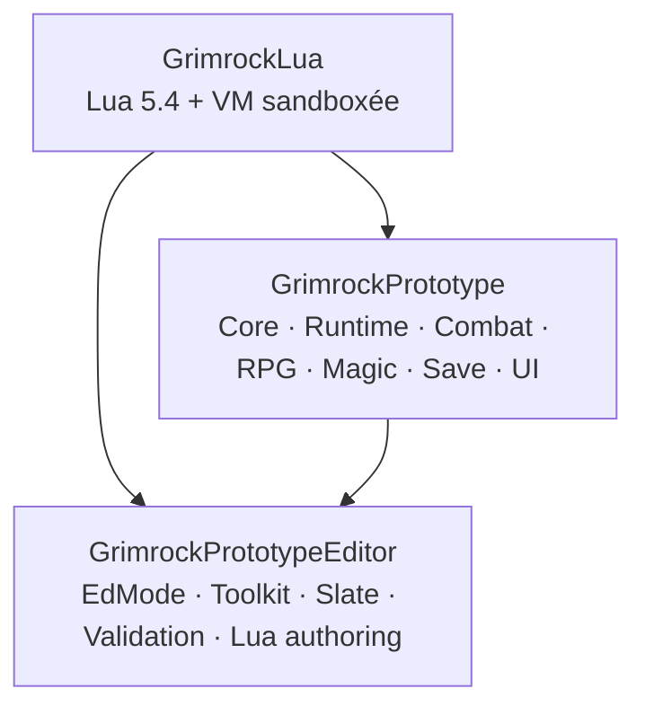

# GrimrockPrototype — Synthèse globale du projet

> Point d’entrée transversal de l’architecture et de l’état fonctionnel actuel.
> État : **24 août 2026, après clôture de MON20 et avant MON21.1.**

## 1. Référence

| Élément | Valeur |
|---|---|
| Projet | `GrimrockPrototype` |
| Moteur | Unreal Engine 5.5.4 |
| Branche | `master` |
| Baseline MON20 validée | `41884f2994e85065558ef27872acd07a12370dc0` |
| Modules C++ | `GrimrockPrototype`, `GrimrockPrototypeEditor`, `GrimrockLua` |
| SaveGame | version courante `8`, compatibilité minimale historique `1` |
| Dernier jalon fermé | `MON20 — Recruitment / Skills / Talents` |
| Jalon courant | `MON21 — Quests / Journal / Map / Codex` |
| Prochaine étape | `MON21.1 — Audit & Architecture Contract` |

Une validation « UE5.5.4 » n’est inscrite que lorsqu’un résultat de compilation, Automation ou PIE a été fourni depuis l’environnement utilisateur.

## 2. Lecture en cinq minutes

GrimrockPrototype est désormais un vertical slice technique avancé de dungeon crawler case par case : édition de donjons, exploration, mécanismes, Event -> Command enrichi de variables/Logic/Lua, groupe RPG persistant, inventaire/équipement, combat tactique, IA de monstres, XP/niveaux, Status Effects, magie/Spellbook, recrutement, Skills, Talents et persistance associée.

MON13 à MON20 sont fermés. La campagne Automation finale MON20 est **151/151 Success**, et le PIE final valide un vrai `Continuer` SaveGame v8 avec restauration de deux Gobelins morts, menu/SelectedCharacter fonctionnels et resauvegarde du même état.

Le prochain manque structurel majeur n’est plus le groupe RPG mais la couche de campagne : **quêtes, journal, carte et codex**, puis un vertical slice jouable de 45–90 minutes.

## 3. Principes autoritaires

1. DataAssets = état de conception persistant ; Actors runtime reconstruits et transitoires.
2. Grille autoritaire pour déplacement, occupation, ligne de mire et ciblage.
3. Event -> Command reste le bus gameplay ; Logic et Lua y reviennent.
4. Identités stables (`ObjectId`, `CharacterId`, RuntimeObjectId/spawn identities).
5. État initial distinct de l’état vivant/sauvegardé.
6. Logique déterministe séparée de la présentation.
7. Pas d’abstraction parallèle sans besoin démontré.
8. Editor dépend du Runtime, jamais l’inverse ; `GrimrockLua` est autonome.
9. `FGridPartyInventoryState` reste l’autorité unique du groupe.
10. Les données dérivées (`RequirementIds`, disponibilité d’actions, read models UI) ne sont pas persistées lorsqu’elles peuvent être reconstruites.

## 4. Architecture des modules



## 5. Domaines actuels

| Domaine | État |
|---|---|
| Donjon / grille / LevelAsset | ✅ |
| Grid Editor | ✅ avancé |
| Runtime niveau | ✅ ; ⚠️ centralisé |
| Interaction / mécanismes | ✅ |
| Event / Command | ✅ |
| Variables / Logic / Lua | ✅ MON19 |
| Items / inventaire / équipement | ✅ avancé |
| Combat | ✅ MON12+ |
| Monstres / IA | ✅ ; 🟡 bestiaire à densifier |
| Progression RPG | ✅ MON15 |
| Status Effects | ✅ MON16 |
| Magic / Spellbook | ✅ MON18 |
| Recrutement actif / réserve | ✅ MON20 |
| Skills | ✅ MON20 |
| Talents | ✅ MON20, via ProgressionChoices MON15 |
| Save | ✅ v8 |
| UI groupe / inventaire / Skills | ✅ |
| Quêtes / Journal / Map / Codex métier | ⬜ MON21 |

## 6. Donjon, grille et éditeur

`UGridDungeonAsset -> UGridLevelAsset` reste la racine du contenu. Un LevelAsset porte cellules, objets, liens, variables typées et scripts Lua. L’Editor offre peinture cellule/mur, placement, inspecteur, connecteurs, preview, mini-carte, validation et playtest PIE.

L’architecture reste volontairement data-driven : les Assets portent le design, le runtime reconstruit Actors et état jouable.

## 7. Event -> Command, Logic et Lua

```text
Event -> Command
Event -> Logic -> Event -> Command
Event -> Lua -> grid.command(...) -> Command
```

Variables `Bool`/`Int32`, Logic nodes, données `persistent`, `LogicId` et Lua sandboxé sont fermés par MON19. Le bus Event -> Command doit être réutilisé par MON21 pour faire progresser quêtes, journal et codex au lieu de créer une chaîne parallèle.

## 8. Groupe, recrutement, Skills et Talents

Autorité :

```text
FGridPartyInventoryState
├── ActiveCharacters
├── ActiveEquipment
├── CharacterPool
└── FGridCharacterInventoryState
```

MON20 fournit :

- transaction atomique `CharacterPool -> ActiveCharacters` avec rollback ;
- maximum actif explicite de 6 ;
- `URPGStoryCompanionAsset` + recrutement UI ;
- recrutement personnalisé par réutilisation du Character Creation Wizard ;
- `URPGSkillAsset` ;
- rangs de Skills sparse par personnage ;
- Skill checks déterministes `d20 + SkillRank + AttributeModifier` ;
- Talents réutilisant les `ProgressionChoices` MON15 ;
- projection Skill/Talent vers `RequirementIds` ;
- intégration au catalogue d’actions, HUD/hotbar et page Compétences.

Aucun second registre de membres, aucun système Talent parallèle.

## 9. Combat, monstres, magie et statuts

Combat : initiative globale, PA/PAM, catalogue d’actions, ciblage grille, transactions de ressources, cooldowns, hotbar 0–9.

Monstres : occupation/pathfinding, perception automatique, dormance, patrouille, investigation, alarmes ; Rat géant mêlée et Gobelin lanceur à distance.

MON16 fournit Status Effects ; MON18 fournit Spellbook/cast. Sorts de production actuellement présents : Arcane Bolt, Lesser Heal, Haste, Cure Poison.

Le contrat de mort persistante est désormais verrouillé : un monstre mort restauré conserve son Actor runtime, est caché, sans collision ni occupation, et ne rejoue pas sa mort.

## 10. Persistance

`UGrimrockPartySaveGame v8` conserve notamment :

- groupe actif et réserve ;
- inventaire / équipement / hotbar ;
- progression de classe et Level Up ;
- Status Effects persistants ;
- Spellbooks ;
- `CharacterSkillStates` par `CharacterId` ;
- dungeon runtime state ;
- variables de niveau ;
- niveau courant ;
- position et facing du groupe ;
- état persistant des monstres.

Les `SkillRanks` runtime restent `Transient` et sont projetés vers un snapshot SaveGame dédié. Les `RequirementIds` ne sont jamais sauvegardés.

Migration v7 -> v8 : Skill snapshots vides par défaut, sans inventer de rang historique.

Le restore est atomique et fail-closed.

## 11. UI

Surfaces fonctionnelles :

- menu principal / Continue / Load Game ;
- inventaire / paper doll ;
- sélection des membres du groupe ;
- création de personnage ;
- recrutement Story Companion ;
- recrutement Custom Recruit ;
- Level Up ;
- combat ;
- Spellbook ;
- Skills / Talents read model.

Les widgets Journal, Map et Codex existent comme surfaces UI mais leur métier reste à construire dans MON21.

## 12. Qualité et tests

Références récentes :

```text
Grimrock.MON19                     55/55 Success
Grimrock.MON20                     151/151 Success
Grimrock.MON20.10.2                 2/2 Success
Grimrock.Monsters.MON17.8           8/8 Success
```

PIE MON20 final :

```text
Save v8 Result=Accepted
2 Gobelins RestoreDead
GridRuntimeState Apply DeadMonsters=2
PartySave Continued CharacterCount=2
menu / SelectedCharacter OK
Save v8 après Continue OK
```

## 13. Diagnostics connus

Acceptés et documentés :

```text
CustomRecruiter_Service has no RuntimeActorClass
```

car CustomRecruiter est un target logique/data-only.

Un ancien slot `GrimrockParty_2` incohérent peut être rejeté fail-closed sans invalider `GrimrockParty`.

Un `PartySave SaveRejected ... CombatStateNotSaveable` pendant combat est attendu par MON18.9.1.

En revanche, `PartyOccupiesCell -> MissingActor` sur un snapshot mort est un diagnostic bloquant ; il ne réapparaît pas dans le PIE final MON20.

## 14. Risques prioritaires

- ⚠️ `AGridLevelRuntimeActor` reste très centralisé.
- ⚠️ `UGridPartyInventoryComponent`, PartyPawn et PlayerController restent volumineux.
- 🟡 Grid Editor mieux fractionné mais Slate/validation complexes.
- 🟡 bestiaire encore trop réduit pour un vrai jeu.
- 🟡 contenu de campagne absent avant MON21.
- ⬜ CI build/tests/Shipping à durcir.
- ⬜ éditeur joueur et format de publication à long terme.

## 15. Roadmap active

```text
MON13    Monster Spawn / Encounters / Persistence       CLOS
MON14    Engagement / Patrol / Investigation / Alarm    CLOS
MON15    XP & Level Progression                         CLOS
MON16    Status Effects                                 CLOS
MON17    Gobelin lanceur                                CLOS
MON18    Magic & Spellbook                              CLOS
MON19    Dungeon Logic / Scripting                      CLOS
MON20    Recruitment / Skills / Talents                 CLOS
MON21    Quests / Journal / Map / Codex                 PROCHAIN
MON22    Vertical Slice 45–90 minutes                   À FAIRE
```

## 16. Prochain audit — MON21.1

Avant tout code, auditer :

```text
WBP_GridJournal
WBP_GridMap
WBP_GridCodex
UGrimrockMenuWidget / WBP_GrimrockMenu
UGridLevelAsset
Event -> Command
Variables / Logic / Lua
SaveGame v8
Monster definitions / Bestiary presentation
```

Objectif : définir l’autorité de `QuestId`, `ObjectiveId`, états de quête, découverte de carte et `CodexEntryId`, puis seulement décider des nouvelles structures nécessaires.

## 17. Cartographie

- source détaillée autoritaire : `docs/Architecture/Maps/GRIMROCK_PROJECT_MAP.md` ;
- vues visuelles : `docs/Architecture/Maps/GRIMROCK_PROJECT_MAP_MERMAID.md`.

Les anciennes cartes XMind restent disponibles dans l’historique Git mais ne sont plus maintenues comme source courante.
