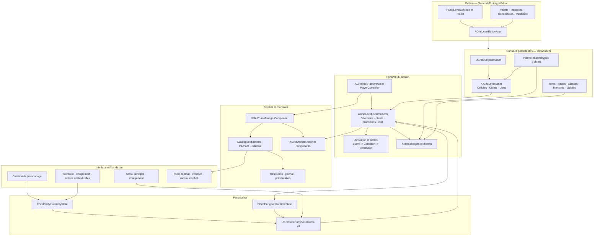
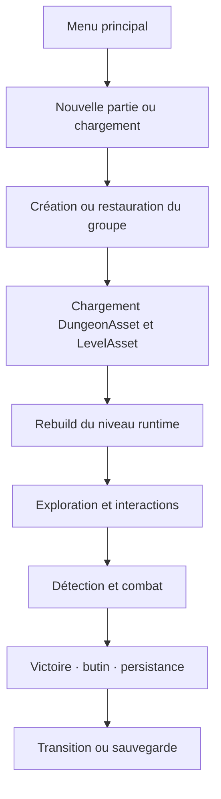
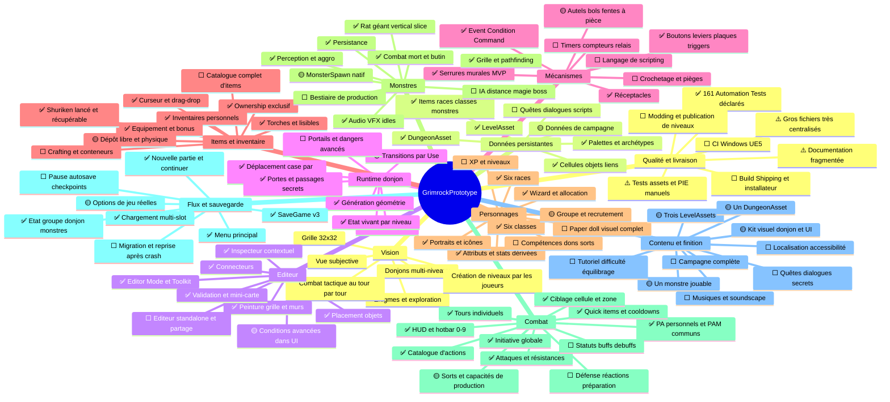

# GrimrockPrototype — Synthèse globale du projet

> Point d'entrée transversal pour comprendre l'architecture, l'état fonctionnel
> et la feuille de route du projet sans devoir relire l'ensemble du C++ et des
> documents de jalon.

## 1. Référence de cette synthèse

| Élément | Valeur |
|---|---|
| Projet | `GrimrockPrototype` |
| Cible | Dungeon crawler en vue subjective, case par case, inspiré de *Legend of Grimrock 2* |
| Moteur | Unreal Engine 5.5.4 |
| Branche analysée | `master` |
| Commit analysé | `a3a29a953c8bbb39c0db4b811487fa796065288c` — `Fix MON12 action transactions and cooldowns` |
| Date de l'état analysé | 9 août 2026 |
| Fichiers suivis | 1 059 |
| Code C++ | 128 `.cpp` + 105 `.h`, environ 90 575 lignes |
| Modules | `GrimrockPrototype` et `GrimrockPrototypeEditor` |
| Tests C++ | 27 fichiers, 161 déclarations d'Automation Tests |
| Contenu Unreal | 550 `.uasset` + 2 `.umap` |
| Documentation | 153 fichiers Markdown, plus 29 SVG et 66 images PNG/JPG |

Cette synthèse décrit l'état présent dans le dépôt. Un statut **validé** signifie
que le jalon correspondant est documenté comme validé et/ou couvert par des
tests autoritaires. Cela ne remplace pas une recompilation Win64 ni une passe
PIE complète après modification des Blueprints ou des DataAssets.

## 2. Lecture en cinq minutes

GrimrockPrototype n'est plus un simple prototype de déplacement. Il possède
déjà une architecture data-driven couvrant :

- l'édition de donjons multi-niveaux sur grilles 32 × 32 ;
- la génération runtime de la géométrie ;
- le déplacement du groupe et les interactions souris/clavier ;
- les objets, mécanismes, liens `Event -> Command` et conditions ;
- les portes, portes secrètes, réceptacles, serrures murales et objets lisibles ;
- l'inventaire, l'équipement, l'ownership exclusif et les transferts d'items ;
- la création de personnage, les races/classes, les portraits et la sauvegarde ;
- un système de monstres déterministe construit autour du Rat géant ;
- un combat tour par tour à initiative globale, PA/PAM et catalogue d'actions ;
- un HUD de combat avec dix raccourcis persistants par personnage ;
- le menu principal, les slots de sauvegarde et les transitions de niveaux.

Le projet est donc un **vertical slice technique avancé**, mais pas encore un
jeu complet. Le principal écart n'est plus l'absence d'une architecture de
base : ce sont les systèmes de progression, le contenu de campagne, la variété
de monstres/items/sorts, les écrans encore décoratifs et la finition de
production.

### Légende des statuts

| Symbole | Signification |
|---|---|
| ✅ | Implémenté et validé pour le périmètre actuel |
| 🟡 | Implémenté en partie ou vertical slice à généraliser |
| ⬜ | À concevoir ou à implémenter |
| ⚠️ | Dette, risque ou validation manuelle importante |

## 3. Principes d'architecture autoritaires

1. **Les DataAssets sont les sources persistantes.** Les Actors runtime sont
   reconstruits depuis les données ; ils ne remplacent pas les assets.
2. **Le donjon organise les niveaux.** `UGridDungeonAsset` référence plusieurs
   `UGridLevelAsset`. Chaque niveau possède cellules, objets et liens.
3. **La grille est l'autorité logique.** La physique, le NavMesh, le Root Motion
   et l'Animation Blueprint ne décident ni des déplacements ni du combat.
4. **Les objets ne se connaissent pas directement.** Un lien associe
   `SourceObjectId + Event` à `TargetObjectId + Command`, avec condition
   optionnelle.
5. **Les variantes sont portées par les données.** Plusieurs boutons, portes ou
   réceptacles peuvent partager une classe C++ et différer par leurs archétypes.
6. **L'ownership d'un item est exclusif.** Un item appartient au monde, à un
   inventaire, à un équipement, au curseur ou à un réceptacle — jamais à deux
   endroits simultanément.
7. **La logique et la présentation sont séparées.** Les jets, coûts et dégâts
   sont déterministes ; animations, audio, VFX et widgets présentent le résultat.
8. **L'état vivant est distinct de l'état initial.** Le `LevelAsset` décrit le
   départ ; `FGridDungeonRuntimeState` puis `UGrimrockPartySaveGame` conservent
   les modifications de la session.
9. **Le module Editor dépend du Runtime, jamais l'inverse.** Les outils Slate et
   l'Editor Mode ne doivent pas être nécessaires dans une build de jeu.

## 4. Schéma-bloc global

### Flux runtime principal

## 5. Carte des domaines C++

| Domaine | Classes et données principales | Responsabilité | État |
|---|---|---|---|
| Core donjon | `UGridDungeonAsset`, `UGridLevelAsset`, `FGridLevelCellData`, `FGridLevelObjectData` | Définition du donjon, des grilles, objets et liens | ✅ |
| Archétypes | `UGridObjectArchetypeAsset`, `UGridObjectPaletteAsset`, `FGridObjectBehaviorParams` | Variantes concrètes, placement, rendu et comportements par défaut | ✅ |
| Éditeur | `FGridLevelEdMode`, `AGridLevelEditorActor`, Toolkit, panneaux Slate | Peinture, sélection, inspecteur, connecteurs, aperçu, validation, création de niveaux | ✅ avancé |
| Runtime niveau | `AGridLevelRuntimeActor` | Reconstruction, géométrie, objets, items, interactions, transitions et état | ✅ mais très centralisé |
| Événements | `UGridActivationComponent`, `FGridObjectLink` | Routage événement, condition et commande | ✅ cœur ; 🟡 commandes avancées |
| Portes | `UGridDoorSystemComponent`, `AGridDoorActor`, `AGridSecretDoorActor` | Animation et passabilité autoritaire des arêtes | ✅ |
| Mécanismes | `AGridButtonActor`, `AGridLeverActor`, `AGridPressurePlateActor`, `AGridTriggerActor` | Sources d'événements et interactions de grille | ✅ MVP |
| Réceptacles | `AGridReceptacleActor`, `FGridReceptacleBehaviorParams` | Acceptation, contenu, retrait, placement socket/physique et événements | ✅ MVP ; 🟡 conteneurs complexes |
| Serrures | `AGridWallLockActor`, profils de clé | Clé explicite, insertion visuelle et activation d'une porte liée | ✅ MVP ; 🟡 crochetage/pièges |
| Items | `UGridItemDefinitionAsset`, `AGridItemActor`, `AGridThrownItemActor` | Définitions, items monde, piles, torches, objets lisibles et projectiles | ✅ MVP |
| Transferts | `UGridItemTransferService`, `UGridPartyInventoryComponent` | Ownership, inventaires, équipement, curseur, monde et réceptacles | ✅ avancé |
| RPG | `URPGRaceAsset`, `URPGClassAsset`, `FRPGAttributes`, règles | Identité, caractéristiques, statistiques dérivées et actions de classe | ✅ socle ; 🟡 progression |
| Création | Widgets `RPGCharacterCreation*` | Wizard, race, genre, portrait, classe et allocation d'attributs | 🟡 avancé, recrutement à finir |
| Menu | `UGrimrockGameInstance`, widgets Main/Load, StartupMode | Nouvelle partie, continuer, charger, options, crédits, licence, quitter | ✅ MVP |
| Sauvegarde | `UGrimrockPartySaveGame`, `FGridDungeonRuntimeState` | Groupe, inventaire, niveau courant, items, objets, portes et monstres | ✅ version 3 |
| Monstres | `AGridMonsterActor` et composants Movement/Behavior/Combat/Death/Audio/VFX | Définition data-driven, grille, IA, attaque, mort, butin et présentation | ✅ pour Rat géant ; 🟡 bestiaire |
| Combat | `UGridTurnManagerComponent`, `FGridCombatAction*`, Resolver, Log | Initiative, tours, PA/PAM, actions, dégâts, ressources et cooldowns | ✅ fondation MON1–MON12 |
| HUD combat | `UGridCombatHudWidget`, ActionPanel, InitiativeSlot | 4 panneaux, initiative glissante, palette, ciblage et dix raccourcis | ✅ MON12.11 |
| UI hors inventaire | Pages Skills, Journal, Map, Recipes, Codex | Navigation et conteneurs visuels | 🟡 coquilles, logique métier absente |
| Tests | 27 fichiers `Private/Tests` | CC0–CC6 et MON1–MON12, déterminisme et non-régression | ✅ couverture logique forte |

## 6. État fonctionnel détaillé

### 6.1 Donjon, grille et éditeur

**Fait**

- Donjon multi-niveaux via `UGridDungeonAsset`.
- Niveaux indépendants via `UGridLevelAsset`, grille 32 × 32.
- Cellules, murs, plafonds, sols, arêtes, géométrie instanciée.
- Point de départ et orientation du groupe.
- Palette data-driven et archétypes concrets.
- Outils de peinture, effacement, sélection, rotation et déplacement.
- Inspecteur contextuel, aperçu, mini-carte, connecteurs et diagnostics.
- Création d'un niveau depuis le panneau `DUNGEON LEVELS`.
- Trois LevelAssets et un DungeonAsset actuellement versionnés.
- Escaliers haut/bas et transitions automatiques entre niveaux.

**Reste à faire**

- Transition déclenchée par l'action `Use` lorsqu'elle est requise.
- Portails et autres formes de transition.
- Génération visuelle complète des descentes : face sombre/mur avant.
- Validation PIE régulière de toutes les configurations binaires.
- Éditeur standalone destiné aux joueurs et format de publication de donjons.

### 6.2 Objets, mécanismes et énigmes

**Fait**

- Identité stable par `ObjectId`.
- Modèle `Event -> Condition -> Command`.
- Boutons normaux/secrets, leviers, plaques, triggers.
- Portes ordinaires et secrètes, cohérence visuelle/logique de passabilité.
- Réceptacles : alcôves, supports de torche et configurations d'acceptation.
- Dépôt socketé et dépôt physique au point d'impact.
- Serrures murales avec clé compatible et connecteur vers la porte.
- Objets lisibles et canaux distincts pour message, feedback et curseur.
- État des mécanismes sauvegardé par niveau.

**Reste à faire**

- Exécution réelle des commandes `Spawn`, `Despawn` et `Teleport` pour toutes
  les cibles déclarées.
- Émission systématique `Opened`/`Closed` par les portes si nécessaire au design.
- Édition complète des conditions de lien directement dans le panneau Slate.
- Timers, compteurs, relais logiques et séquences programmables.
- Fente à pièce, bol d'offrande et autel en contenu concret complet.
- Coffres/conteneurs à inventaire dédié.
- Crochetage, kits, pièges de serrure et conteneurs verrouillables.
- Langage léger de scripting et sandbox d'exécution.

### 6.3 Exploration, interaction et items

**Fait**

- Déplacement avant/arrière, strafe, rotations à 90° et input buffer.
- Interpolation, head bob et free look.
- Interaction souris par trace `Visibility`, priorité du premier hit bloquant.
- Interaction de bord selon cellule, orientation et portée.
- Ramassage, curseur, équipement, dépôt ciblé et lancer.
- Torches en main, au mur, au sol et persistance de l'éclairage.
- Items lisibles, tooltip, examiner et lire.
- Shuriken visible en vol, récupérable au sol et intégré au combat.

**Reste à faire**

- Finaliser le dépôt libre générique depuis le curseur.
- Dégâts de lancer hors action de combat, précision par compétence, puissance
  variable, sons d'impact et rebonds réalistes.
- Interactions environnementales supplémentaires : pièges, fosses, eau,
  surfaces dangereuses, objets cassables et obstacles mobiles.
- Gestion complète des empilements avec raccourcis de transfert utilisateur.

### 6.4 Inventaire, équipement et personnage

**Fait**

- Jusqu'à six personnages actifs, inventaires personnels de 40 slots par défaut.
- Ownership exclusif avec identités runtime stables.
- Drag-and-drop, curseur, piles, poids et surcharge calculée.
- Paper doll C++ : mains, armures, bijoux et accessoires.
- Compatibilité d'équipement, bonus de statistiques et résistances.
- Actions contextuelles d'item et routage C++/UMG.
- Six races et six classes sous forme de DataAssets.
- Portraits race/genre, variantes, icônes de classe et allocation d'attributs.
- Persistance de l'identité, des statistiques, de l'inventaire et de l'équipement.

**Reste à faire**

- Boucle d'expérience, montée de niveau et courbe de progression.
- Compétences, dons, spécialisations et choix de niveau.
- Grimoire/livre de sorts et apprentissage des sorts.
- Équipement de départ complet par classe.
- Recrutement et gestion de compagnons après le premier personnage.
- Composition visuelle plein pied et couches d'équipement, si conservées dans
  la cible artistique.
- Contenu d'items de production : armes, armures, consommables, clés, objets
  de quête et composants.

### 6.5 Monstres, IA et combat

**Fait**

- Rat géant data-driven avec mesh, squelette, animation, textures et icône.
- Occupation/réservation de grille et interpolation sans Root Motion.
- Pathfinding orthogonal déterministe, perception et dernière position connue.
- Profils `DirectMelee` et `FastHarasser`, repli et groupes d'agression.
- Attaques de monstres, ciblage de la formation, dégâts, armures et résistances.
- Mort logique unique, cadavre non bloquant, butin déterministe et victoire.
- Audio, VFX, variations d'idle et métriques d'équilibrage.
- Persistance des monstres vivants, blessés, déplacés ou morts.
- Attaques du groupe : mains nues, équipement offensif et armes de jet.
- Initiative globale mélangeant personnages et monstres.
- Tours individuels, quatre PA personnels, deux PAM communs et rotations gratuites.
- Catalogue d'actions unifié : universel, équipement, capacité, sort, quick item.
- Attaques, effets de soin/mana, coûts transactionnels et cooldowns.
- Ciblage automatique, cellule et zone.
- HUD orienté actions, initiative glissante et raccourcis 0–9 persistants.

**Reste à faire**

- Pipeline natif créant les monstres depuis les placements `MonsterSpawn` du
  LevelAsset ; le Rat géant dépend encore du chemin d'Actor placé/configuré.
- Attribution de l'expérience de victoire et progression du groupe.
- Effets de statut : hâte réelle, ralentissement, poison, étourdissement,
  immobilisation, saignement, buffs et debuffs.
- Défense, garde, préparation, réactions, interruption et attaques d'opportunité
  si elles sont retenues par le design.
- Variété de sorts, capacités et quick items réellement configurés dans les
  DataAssets de production.
- Présentations dédiées aux sorts, attaques de zone et effets persistants.
- Nouveaux profils IA : distance, lanceur de sorts, soutien, invocation, fuite,
  gardien, boss multi-phase.
- Production et équilibrage du bestiaire au-delà du Rat géant.

### 6.6 Flux de jeu, sauvegarde et menus

**Fait**

- Menu principal séparé.
- Nouvelle partie, Continuer et Chargement multi-slot.
- Options, crédits, licence et quitter en MVP.
- Blocage modal pendant la création de personnage.
- Progression de construction/chargement par phases.
- Sauvegarde versionnée v3 et compatibilité v1–v3.
- Persistance du groupe, des items, objets, portes, réceptacles, niveaux et monstres.
- Retour à l'exploration au chargement, sans reprendre un tour au milieu.

**Reste à faire**

- Menu pause en jeu.
- Paramètres graphiques, audio, contrôles et remapping réellement persistants.
- Sauvegarde automatique, checkpoints et politique de rotation des slots.
- Barre de construction proportionnelle par lots/ticks plutôt que phases synchrones.
- Migration explicite pour les futures versions de structures complexes.
- Packaging, installation, mises à jour et validation sur une build Shipping.

### 6.7 Pages de menu et systèmes de jeu absents

Les widgets `Skills`, `Journal`, `Map`, `Recipes` et `Codex` existent comme
pages navigables, mais ils ne correspondent pas encore à des systèmes métier
complets.

| Système | État actuel | Travail nécessaire |
|---|---|---|
| Skills | Page/UI | Modèle de compétences, dépenses, prérequis, sauvegarde et effets |
| Journal | Page/UI | Quêtes, objectifs, états, événements et persistance |
| Map | Page/UI | Découverte des cellules, niveaux, annotations et secrets |
| Recipes | Page/UI | Recettes, composants, crafting/alchimie et validation |
| Codex | Page/UI | Entrées déverrouillables, bestiaire, lore et persistance |
| Dialogues | Absent | Données de dialogue, conditions, choix, conséquences et UI |
| Quêtes | Absent | Graphe d'états, objectifs, récompenses et journal |
| Progression | Partielle | XP, niveaux, compétences, dons, sorts et équilibrage |

## 7. Jalons réalisés

| Famille | Résultat synthétique |
|---|---|
| Core / Editor | Asset unique de niveau, donjon multi-niveaux, outils de grille, objets, connecteurs, validation |
| Items / UI | Ownership, inventaire, équipement, actions contextuelles, tooltip, lecture, résistances |
| CC0–CC6 | Modèle RPG minimal, création atomique, UI, inventaire, sauvegarde, races/classes/portraits |
| MM1–MM5 | Menu principal, GameInstance, nouvelle partie, continuer, slots, options/crédits/licence |
| MON1–MON4 | Définition monstre, Actor, occupation, mouvement, pathfinding et perception |
| MON5–MON7 | Tours, combat monstre, IA FastHarasser et agression de groupe |
| MON8–MON10 | Mort, butin, persistance, audio/VFX/idles, équilibrage et optimisation |
| MON11 | Requête et résolution des attaques du groupe, équipement offensif, présentation, armes de jet |
| MON12 | Initiative globale, PA/PAM, catalogue, HUD, hotbar, quick items, sorts/capacités, ciblage et cooldowns |

## 8. Carte mentale type XMind

## 9. Feuille de route vers un jeu complet

La suite ne devrait pas être une accumulation de nouveaux systèmes isolés. Elle
devrait progresser par **portes de sortie jouables**.

### Phase A — Consolider le vertical slice actuel

Objectif : disposer d'une référence stable après MON12.

- compiler `Development Editor Win64` et `Development/Shipping Win64` ;
- exécuter tous les filtres `Grimrock.CharacterCreation.*` et
  `Grimrock.Monsters.MON*` ;
- refaire la checklist PIE transversale : nouvelle partie, inventaire, serrure,
  réceptacle, transition, combat, sauvegarde et chargement ;
- corriger les documents obsolètes et faire de cette synthèse le point d'entrée ;
- ajouter un inventaire de code généré automatiquement ;
- définir une petite carte de référence reproductible.

**Porte de sortie :** un exécutable autonome permet une boucle de 15–30 minutes
sans commande de debug ni manipulation manuelle d'asset.

### Phase B — Fermer les trous du moteur de donjon

- pipeline natif `MonsterSpawn -> MonsterDefinition -> AGridMonsterActor` ;
- commandes runtime `Spawn`, `Despawn`, `Teleport` ;
- transitions par `Use` et portails ;
- dépôt libre d'items finalisé ;
- timers, compteurs, relais et conditions éditables ;
- réceptacles concrets restants et conteneurs ;
- système de serrure complet : crochetage, pièges et conteneurs verrouillables.

**Porte de sortie :** un level designer crée sans C++ une énigme multi-étapes,
une rencontre et une transition de niveau entièrement à partir des DataAssets.

### Phase C — Fermer la boucle RPG

- expérience et montée de niveau ;
- compétences, dons, spécialisations et prérequis ;
- sorts appris/préparés et ressources ;
- effets temporaires et permanents ;
- recrutement et composition du groupe ;
- équipement initial, tables d'items et économie de progression ;
- repos, nourriture et récupération selon le design retenu.

**Porte de sortie :** un personnage gagne un niveau, fait un choix durable,
apprend une capacité et retrouve exactement son état après chargement.

### Phase D — Généraliser le combat et le bestiaire

- défense, garde, attente et réactions retenues par le design ;
- hâte, ralentissement, poison, stun, immobilisation et résistances ;
- attaques et sorts de zone avec VFX/feedback propres ;
- ennemis mêlée, distance, magie, soutien, invocation et boss ;
- attribution d'XP, tables de butin et équilibrage par danger ;
- validation des combats à plusieurs groupes et sur plusieurs niveaux.

**Porte de sortie :** au moins cinq familles de monstres imposent des réponses
tactiques différentes avec trois archétypes de personnages viables.

### Phase E — Construire un vertical slice de contenu

- définir une mini-campagne de 45–90 minutes ;
- produire 3–5 niveaux reliés avec thème, progression et raccourcis ;
- intégrer plusieurs énigmes, secrets, serrures et objets lisibles ;
- ajouter objectifs, journal minimal et récompenses ;
- créer un boss, une conclusion et une boucle de sauvegarde complète ;
- finaliser lumière, ambiance, musique, son et présentation.

**Porte de sortie :** une personne extérieure peut terminer le slice sans aide du
développeur.

### Phase F — Ajouter les systèmes de campagne

- journal et quêtes ;
- carte découverte par exploration ;
- codex et bestiaire déverrouillables ;
- recettes, alchimie ou crafting si conservés ;
- dialogues et choix si la campagne en a besoin ;
- difficulté, tutoriel, aide et onboarding.

**Porte de sortie :** la campagne peut guider le joueur, suivre ses objectifs et
présenter sa progression sans documents externes.

### Phase G — Production, qualité et livraison

- budget performance par niveau et génération runtime par lots ;
- CI Windows/UE5 pour compilation et tests ;
- tests de migration de sauvegarde ;
- menus pause/options, remapping, audio, graphismes et accessibilité ;
- localisation des textes ;
- build Shipping, installateur, crash handling et tests matériels ;
- documentation et packaging de l'éditeur joueur/modding.

**Porte de sortie :** build candidate installable, sauvegardes migrables, campagne
complète, aucun blocage critique et budget de performance respecté.

## 10. Priorités recommandées immédiatement après MON12

Ordre conseillé :

1. **Audit de clôture MON12 complet**, compilation et PIE transversal.
2. **Pipeline natif `MonsterSpawn`**, car il relie enfin l'éditeur au système de
   monstres sans Actor posé manuellement.
3. **XP et montée de niveau**, afin que les combats alimentent une progression.
4. **Premier deuxième monstre**, choisi pour tester un nouveau comportement
   plutôt qu'une simple variante du Rat géant.
5. **Premier sort et premier consommable de production**, utilisant la palette
   et le ciblage déjà terminés.
6. **Vertical slice de 45 minutes**, pour transformer les fondations en jeu et
   révéler les vrais manques avant d'étendre encore l'architecture.

## 11. Risques et dettes techniques

### 11.1 Concentration des responsabilités

Plusieurs fichiers deviennent des points de fragilité :

| Fichier | Taille approximative | Risque |
|---|---:|---|
| `GridLevelEditorActor.cpp` | 153 Ko | Trop de logique d'édition et de validation dans un Actor |
| `GridLevelRuntimeActor.cpp` | 142 Ko | Reconstruction, interactions, état, transitions et spawn centralisés |
| `GridPartyInventoryComponent.cpp` | 113 Ko | Ownership, RPG, équipement et hotbar dans le même composant |
| `GridInventoryWidget.cpp` | 100 Ko | Logique UI et routage d'actions très dense |
| `SGridEditorObjectInspectorPanel.cpp` | 94 Ko | Inspecteur monolithique difficile à faire évoluer |
| `GrimrockPartyPawn.cpp` | 85 Ko | Mouvement, UI, sauvegarde, inventaire et lancer liés au Pawn |
| `GridCombatHudWidget.cpp` | 70 Ko | Projection, hotbar, ciblage et exécution dans une même classe UI |

Il ne faut pas lancer un refactor massif. Chaque nouvelle fonctionnalité doit
cependant éviter d'agrandir automatiquement ces fichiers. Extraire uniquement
les responsabilités dont le contrat est stabilisé : build runtime, transitions,
transferts, projection HUD, validation éditeur, etc.

### 11.2 Documentation fragmentée

- 153 documents Markdown rendent la recherche difficile.
- `00_PROJECT_OVERVIEW.md` ne reflète pas encore toute la création de personnage,
  le menu, l'inventaire et MON8–MON12.
- Plusieurs roadmaps historiques restent justes pour leur époque mais ne sont
  plus le backlog actif.
- Les documents de fondation architecturale ont été audités sur un commit de
  juin 2026, antérieur aux grands ajouts combat/UI.

### 11.3 Tests et assets

- La couverture C++ est importante, mais les `.uasset`, Widget Blueprints,
  références de meshes/materials et Animation Blueprints nécessitent encore PIE.
- Aucun workflow CI GitHub n'est versionné dans l'état analysé.
- Les tests de performance, packaging et migration longue de sauvegarde sont
  encore à institutionnaliser.

### 11.4 Contenu

Le moteur est plus mature que le jeu : trois LevelAssets, un DungeonAsset et une
seule famille de monstre jouable ne permettent pas encore de juger la variété,
le rythme, l'équilibrage ou le coût réel de production d'une campagne.

## 12. Organisation documentaire recommandée

Cette synthèse doit devenir le premier document lu. Les autres documents gardent
leur rôle spécialisé.

| Emplacement | Rôle |
|---|---|
| `docs/README.md` | Porte d'entrée de toute la documentation |
| `docs/Architecture/PROJECT_SYNTHESIS.md` | Vue globale, état et feuille de route |
| `docs/Architecture/ARCHITECTURE_INDEX.md` | Contrats techniques détaillés |
| `docs/Architecture/CODEBASE_INVENTORY.md` | Inventaire de code à générer automatiquement |
| `docs/Architecture/*_FOUNDATION.md` | Contrats par sous-système |
| `docs/Design/README.md` | Index des designs et jalons |
| `docs/Design/99_DECISIONS_LOG.md` | Décisions autoritaires |
| `docs/Design/PROJECT_COMPLETION_ROADMAP.md` | Backlog actif uniquement |
| `docs/Tests/MASTER_TEST_MATRIX.md` | Matrice C++, PIE et packaging |
| `docs/Rules/` | Règles RPG et tables de référence |

### Règle de mise à jour

À la clôture de chaque jalon majeur :

1. mettre à jour la ligne du domaine dans la section 5 ;
2. déplacer les éléments de « Reste à faire » vers « Fait » ;
3. mettre à jour la carte mentale ;
4. modifier le commit/date de référence ;
5. ajouter ou mettre à jour le test autoritaire ;
6. inscrire la décision durable dans `docs/Design/99_DECISIONS_LOG.md` ;
7. garder les documents de jalon comme historique, sans les transformer en
   backlog actif.

## 13. Sources principales dans le dépôt

Pour approfondir un bloc sans parcourir les 1 059 fichiers :

| Sujet | Document d'entrée |
|---|---|
| Architecture actuelle | `docs/Architecture/ARCHITECTURE_INDEX.md` |
| Vue historique du design | `docs/Design/00_PROJECT_OVERVIEW.md` |
| Décisions autoritaires | `docs/Design/99_DECISIONS_LOG.md` |
| Donjon et état runtime | `docs/Design/JALON_RUNTIME_DUNGEON_STATE.md` |
| Inventaire et ownership | `docs/Design/INVENTORY_AND_ITEM_OWNERSHIP_DESIGN.md` |
| Création de personnage | `docs/Design/CHARACTER_CREATION_ROADMAP.md` |
| Combat cible | `docs/Design/COMBAT_SYSTEM_V2_ACTION_POINTS_INITIATIVE.md` |
| Monstres MON1–MON10 | `docs/Design/MONSTERS_AI_ANIMATIONS_TURN_BASED_COMBAT_RAT_GIANT.md` |
| Attaques du groupe | `docs/Design/MON11_1_PARTY_ATTACK_REQUEST_PIPELINE.md` |
| HUD et hotbar | `docs/Design/MON12_11_HOTBAR_VALIDATION.md` |
| Tests manuels | `docs/Tests/TEST_DUNGEON_PASS_CHECKLIST.md` |

---

**Conclusion :** la prochaine étape stratégique n'est pas d'ajouter une nouvelle
couche générique. Il faut maintenant consolider MON12, fermer le pipeline
`MonsterSpawn`, ajouter progression et variété, puis produire un vertical slice
de contenu assez long pour tester le jeu — pas seulement ses systèmes.
