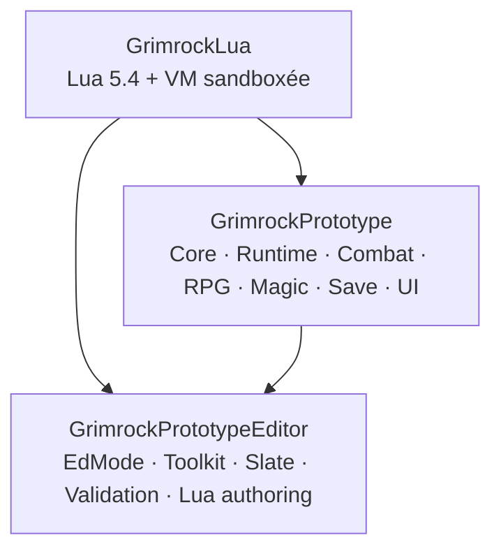

# GrimrockPrototype — Synthèse globale du projet

> Point d’entrée transversal de l’architecture et de l’état fonctionnel actuel.
> État : 23 août 2026, après validation de MON20.3 et avant MON20.4.

## 1. Référence

| Élément | Valeur |
|---|---|
| Projet | `GrimrockPrototype` |
| Moteur | Unreal Engine 5.5.4 |
| Branche | `master` |
| Code audité | `0b8bab8f86f3a7f9df4979f1df4259838a93023d` |
| Modules C++ | `GrimrockPrototype`, `GrimrockPrototypeEditor`, `GrimrockLua` |
| SaveGame | version courante `7`, compatibilité minimale `1` |
| Dernier jalon fermé | `MON19 — Advanced Dungeon Logic / Scripting` |
| Jalon courant | `MON20 — Recruitment / Skills / Talents` |
| État MON20 | `20.1`, `20.2`, `20.3` terminés ; `20.4` prochain |

Une validation « UE5.5.4 » n’est inscrite que lorsqu’un résultat de compilation, Automation ou PIE a été fourni depuis l’environnement utilisateur.

## 2. Lecture en cinq minutes

GrimrockPrototype est un vertical slice technique avancé : édition de donjons, exploration, mécanismes, Event → Command enrichi de variables/Logic/Lua, groupe RPG persistant, inventaire/équipement, combat tactique, IA de monstres, XP/niveaux, Status Effects, magie/Spellbook et premières transactions de recrutement.

MON13 à MON19 sont fermés. MON20.2 et MON20.3 sont validés 6/6. Le prochain travail est MON20.4 Recruitment UI. Les principaux écarts vers un jeu complet sont désormais le contenu de production et les systèmes de campagne : recrutement UI/réserve, compétences/talents, quêtes/journal/map/codex, densité du bestiaire et vertical slice jouable de 45–90 minutes.

## 3. Principes autoritaires

1. DataAssets = état de conception persistant ; Actors runtime reconstruits et transitoires.
2. Grille autoritaire pour déplacement, occupation, ligne de mire et ciblage.
3. Event → Command reste le bus gameplay ; Logic et Lua y reviennent.
4. Identités stables (`ObjectId`, `CharacterId`, RuntimeObjectId/spawn identities).
5. État initial distinct de l’état vivant/sauvegardé.
6. Logique déterministe séparée de la présentation.
7. Pas d’abstraction parallèle sans besoin démontré.
8. Editor dépend du Runtime, jamais l’inverse ; `GrimrockLua` est autonome.

## 4. Architecture des modules



## 5. Domaines actuels

| Domaine | État |
|---|---|
| Donjon / grille / LevelAsset | ✅ |
| Grid Editor | ✅ avancé |
| Runtime niveau | ✅ ; ⚠️ centralisé |
| Interaction / mécanismes | ✅ |
| Event / Command | ✅ |
| Variables / Logic / Lua | ✅ MON19 |
| Items / inventaire / équipement | ✅ avancé |
| Combat | ✅ MON12+ |
| Monstres / IA | ✅ ; 🟡 bestiaire |
| Progression RPG | ✅ MON15 |
| Status Effects | ✅ MON16 |
| Magic / Spellbook | ✅ MON18 |
| Recrutement | ✅ MON20.1–20.3 |
| Save | ✅ v7 |
| UI | ✅/🟡 |
| Quêtes / Journal / Map / Codex métier | ⬜ MON21 |

## 6. Donjon, grille et éditeur

`UGridDungeonAsset -> UGridLevelAsset` reste la racine du contenu. Un LevelAsset porte cellules, objets, liens, variables typées et scripts Lua. L’Editor offre peinture cellule/mur, placement, inspecteur, connecteurs, preview, mini-carte, validation et playtest PIE. `AGridLevelEditorActor` reste une façade importante mais son implémentation est mieux fractionnée en parts/services.

## 7. Event → Command, Logic et Lua

```text
Event -> Command
Event -> Logic -> Event -> Command
Event -> Lua -> grid.command(...) -> Command
```

Variables `Bool`/`Int32`, Logic nodes, `persistent`, `LogicId` et Lua sandboxé sont fermés par MON19. Validation : MON19.8 4/4, `Grimrock.MON19` 55/55, puzzle PIE validé.

## 8. Groupe, RPG et recrutement

`FGridPartyInventoryState` est l’autorité unique : `ActiveCharacters`, `ActiveEquipment`, `CharacterPool`. MON15 fournit XP/niveaux/progression de classe. MON20.2 fournit la transaction atomique `CharacterPool -> ActiveCharacters` avec rollback (6/6). MON20.3 fournit `URPGStoryCompanionAsset` et l’enregistrement idempotent (6/6). SaveGame reste v7 ; `PartyMemberKind` reste différé.

## 9. Combat, monstres, magie et statuts

Combat : initiative globale, PA/PAM, catalogue d’actions, ciblage grille, transactions de ressources, cooldowns, hotbar 0–9.

Monstres : occupation/pathfinding, perception automatique, dormance, patrouille, investigation, alarmes ; Rat géant mêlée et Gobelin lanceur ranged.

MON16 fournit Status Effects ; MON18 fournit Spellbook/cast. Sorts de production : Arcane Bolt, Lesser Heal, Haste, Cure Poison.

## 10. Persistance

`UGrimrockPartySaveGame v7` conserve groupe/réserve, progression, Level Up, Status Effects, Spellbooks, dungeon runtime state, variables de niveau, niveau courant et position/facing. La VM Lua n’est pas sérialisée ; seules les données autoritaires le sont.

## 11. UI

Surfaces fonctionnelles : menu principal/chargement, inventaire/paper doll, groupe, création de personnage, Level Up, combat, Spellbook. Skills, Journal, Map, Recipes et Codex ne sont pas encore des systèmes métier terminés. MON20.4 doit ajouter Recruitment UI sans déplacer la logique métier en Blueprint.

## 12. Qualité et tests

```text
Grimrock.MON19.8                    4/4 Success
Grimrock.MON19                     55/55 Success
Grimrock.MON20.2.Recruitment        6/6 Success
Grimrock.MON20.3.StoryCompanion     6/6 Success
```

## 13. Risques prioritaires

- ⚠️ `AGridLevelRuntimeActor` très centralisé.
- ⚠️ `UGridPartyInventoryComponent`, PartyPawn et PlayerController volumineux.
- 🟡 Grid Editor mieux fractionné mais Slate/validation complexes.
- 🟡 pages UI présentes avant logique métier MON20/MON21.
- ⬜ CI build/tests/Shipping.
- ⬜ éditeur joueur et format de publication.

## 14. Roadmap

```text
MON20.1  Audit & Architecture Contract                  TERMINÉ
MON20.2  Active Party Recruitment Foundation            VALIDÉ — 6/6
MON20.3  Story Companion Definition / Pool              VALIDÉ — 6/6
MON20.4  Story Companion Recruitment UI                 PROCHAIN
...      Skills / Talents / Reserve / Regression
MON21    Quests / Journal / Map / Codex
MON22    Vertical Slice 45–90 minutes
```

## 15. Cartographie

- source détaillée autoritaire : `docs/Architecture/Maps/GRIMROCK_PROJECT_MAP.md` ;
- vues visuelles : `docs/Architecture/Maps/GRIMROCK_PROJECT_MAP_MERMAID.md`.

Les anciennes cartes XMind restent disponibles dans l’historique Git mais ne sont plus maintenues comme source courante.
