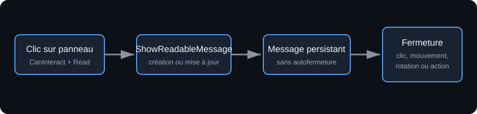
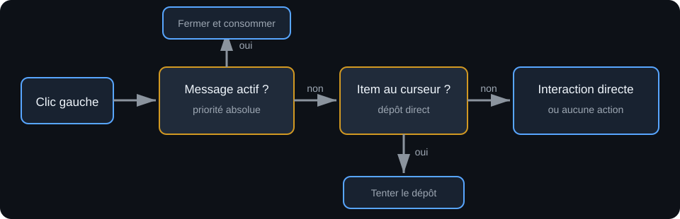
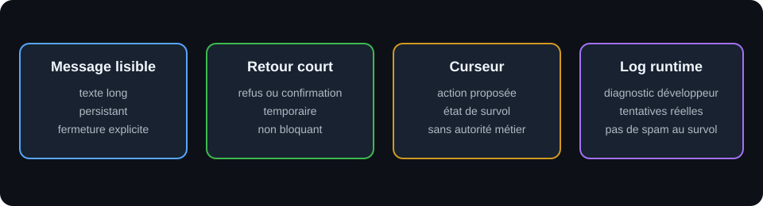
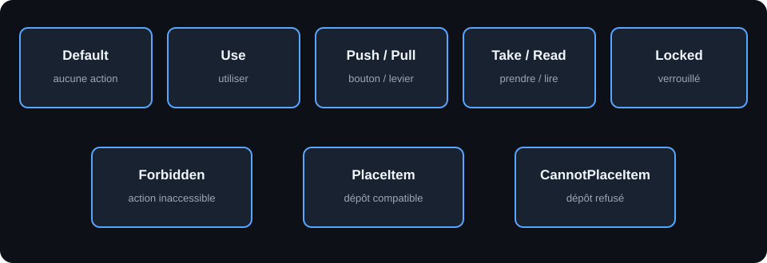

# Objets lisibles et retours d'interaction

## 1. Objet

Ce document décrit le socle des objets lisibles, du message persistant, du retour d'interaction court et des curseurs. Il ne définit ni dialogue, ni journal, ni interface finale.

## 2. Vocabulaire

- **Texte d'archétype** : `UGridObjectArchetypeAsset::ReadableText`, valeur commune aux instances.
- **Texte placé** : `FGridLevelObjectData::OverrideReadableText`, remplacement local non vide.
- **Notes** : `FGridLevelObjectData::Notes`, information d'édition jamais affichée au joueur.
- **Tag** : `FGridLevelObjectData::Tag`, identifiant runtime, pas un texte d'interface.
- **Message lisible** : texte long, persistant et bloquant pour le clic suivant.
- **Retour court** : message temporaire d'échec ou de confirmation, non bloquant.

## 3. Cartographie du code

| Responsabilité | Déclaration | Implémentation |
|---|---|---|
| Données placées | `Core/GridTypes.h` | sérialisation Unreal |
| Archétype lisible | `Core/GridObjectArchetypeAsset.h` | `Core/GridObjectArchetypeAsset.cpp` |
| Acteur lisible | `Runtime/GridGenericObjectActor.h` | `Runtime/GridGenericObjectActor.cpp` |
| Activation du texte | `Runtime/GridActivationComponent.h` | `Runtime/GridActivationComponent.cpp` |
| Widget | `UI/ReadableMessageWidget.h` | `UI/ReadableMessageWidget.cpp` |
| Affichage et fermeture | `Runtime/GridLevelRuntimeActor.h` | `Runtime/GridLevelRuntimeActor.cpp` |
| Priorité du clic et curseur | `Runtime/GrimrockPlayerController.h` | `Runtime/GrimrockPlayerController.cpp` |
| Fermeture par mouvement | `Runtime/GrimrockPartyPawn.h` | `Runtime/GrimrockPartyPawn.cpp` |
| Validation du niveau | `EditorTools/GridLevelEditorActor.h` | `EditorTools/GridLevelEditorActor.cpp` |

Les chemins runtime sont sous `Source/GrimrockPrototype/Public` ou `Private`. Les chemins éditeur sont sous `Source/GrimrockPrototypeEditor/Public` ou `Private`.

## 4. Objets lisibles et stockage

Le comportement lisible générique est porté par `AGridGenericObjectActor`. Un archétype active ce comportement avec `bIsReadable`. À l'initialisation, son `ReadableText` est copié, puis un `OverrideReadableText` non vide le remplace. Un override vide signifie donc « utiliser le texte de l'archétype », pas « masquer le texte ».

`bShowReadableOnlyOnce` empêche une nouvelle lecture après `MarkAsRead()`. Un objet sans texte effectif ou déjà lu lorsque cette option est active refuse `CanInteract()`. Les objets placés sur une arête doivent aussi être accessibles depuis le bon côté.

## 5. Widget et cycle de vie

`UReadableMessageWidget` expose `SetReadableText()` et attend un `UTextBlock` nommé conformément au `BindWidget`. La classe concrète est normalement un Blueprint UMG assigné à `AGridLevelRuntimeActor::ReadableMessageWidgetClass`.

`ShowReadableMessage()` crée le widget si nécessaire, le place au niveau Z `50`, ou met à jour le texte du widget existant. Le message reste affiché sans limite par défaut. L'autofermeture n'est active que si `bReadableMessageAutoHide` est vrai.

`DismissReadableMessage()` et `HideReadableMessage()` assurent la fermeture explicite. Sans classe de widget assignée, le texte n'est pas affiché et un warning de configuration est produit.

## 6. Priorité du clic

`AGrimrockPlayerController::HandleLeftMousePressed()` applique cet ordre :

1. fermer un message lisible actif et consommer le clic ;
2. sinon, tenter de déposer l'item du curseur ;
3. sinon, rechercher un interactable direct et l'activer ;
4. sinon, ne rien faire.

Le premier clic après une lecture ne traverse donc pas le message pour activer un objet situé derrière.

## 7. Fermeture par déplacement

Les six actions du groupe ferment d'abord le message, puis continuent normalement : avancer, reculer, déplacement latéral gauche ou droit, rotation gauche ou droite. Cette fermeture passe par `AGrimrockPartyPawn::DismissReadableMessageIfVisible()`.

## 8. Retour court

`AGridLevelRuntimeActor::ShowInteractionFeedback()` utilise une instance de widget et un minuteur distincts du message lisible. `InteractionFeedbackWidgetClass` peut fournir une présentation dédiée ; à défaut, la classe du message lisible sert de repli.

Le retour court :

- disparaît automatiquement, avec une durée par défaut de `1,5` seconde ;
- ne modifie pas `HasActiveReadableMessage()` ;
- ne consomme pas le clic suivant ;
- ne bloque ni déplacement ni rotation ;
- est actuellement utilisé pour les échecs explicites de dépôt, la distance, l'inaccessibilité et l'inventaire plein.

Les refus de porte verrouillée, de retrait interdit ou de mécanisme déjà actif ne disposent pas tous d'un chemin métier uniforme. Ils restent à brancher au cas par cas lorsque ces règles produisent une raison structurée.

## 9. Curseurs

| État | Usage actuel |
|---|---|
| `Default` | aucune action proposée |
| `Use` | support ou réceptacle utilisable |
| `Push` | bouton |
| `Pull` | levier et chaîne de porte |
| `Take` | item ramassable ou item contenu retirable |
| `Read` | objet lisible |
| `Locked` | état disponible, peu émis actuellement |
| `Forbidden` | interactable direct hors de portée |
| `PlaceItem` | dépôt compatible |
| `CannotPlaceItem` | dépôt impossible |

Le widget de curseur personnalisé doit fournir la fonction Blueprint `SetCursorState(EGridInteractionCursor)` et rester non interceptant. Le curseur système de repli ne distingue visuellement que `Take`.

## 10. Relations avec les autres systèmes

- **Items** : un item monde utilise `Take`; un inventaire plein produit un retour court sans détruire l'acteur.
- **Réceptacles** : le survol avec un item choisit `PlaceItem` ou `CannotPlaceItem`; le clic distingue notamment cible absente, distance, mauvais bord, incompatibilité et capacité pleine.
- **Portes** : la chaîne utilise `Pull`. Le système de porte reste responsable de la commande et de la passabilité.

## 11. Validation éditeur

La validation signale :

- un archétype lisible sans texte, au niveau de l'archétype ;
- un objet lisible placé sans texte effectif ;
- des notes renseignées à la place du texte lisible ;
- un override présent sur un archétype non lisible ;
- un objet lisible initialement désactivé.

Un archétype sans texte par défaut reste valide si chaque instance fournit un override. Aucune limite de longueur n'est imposée, car le widget actuel n'en définit pas.

## 12. Diagnostics

Les échecs de clic réels conservent des logs courts. Le survol ne doit pas produire de warning ; ses traces détaillées restent en niveau `Verbose`. Le retour UI ne remplace pas les warnings utiles à une configuration invalide.

## 13. Limites actuelles

- Le rendu concret dépend de widgets Blueprint non modifiés par cette passe.
- Le retour court réutilise le type `UReadableMessageWidget`; une présentation dédiée reste configurable.
- `Locked` n'est pas encore alimenté par une raison d'échec générique.
- `CanInteract()` retourne un booléen sans raison structurée.
- Certains refus métier ne peuvent donc produire qu'un message générique.

## 14. Règles d'architecture

1. Le texte joueur ne doit jamais provenir de `Notes` ou de `Tag`.
2. Le message lisible long et le retour court utilisent des instances et des minuteurs distincts.
3. Seul le message lisible consomme le clic de fermeture.
4. Un retour court est déclenché par une tentative réelle, jamais par le simple survol.
5. Le curseur annonce la possibilité d'action ; le runtime reste autoritaire.
6. Les règles de porte, d'item et de réceptacle ne doivent pas être dupliquées dans l'interface.

Les validations des objets lisibles sont présentées dans
[`LEVEL_VALIDATION_PANEL_FOUNDATION.md`](LEVEL_VALIDATION_PANEL_FOUNDATION.md).
