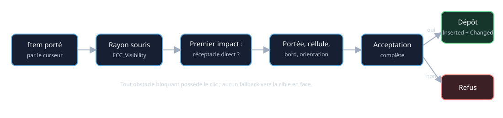
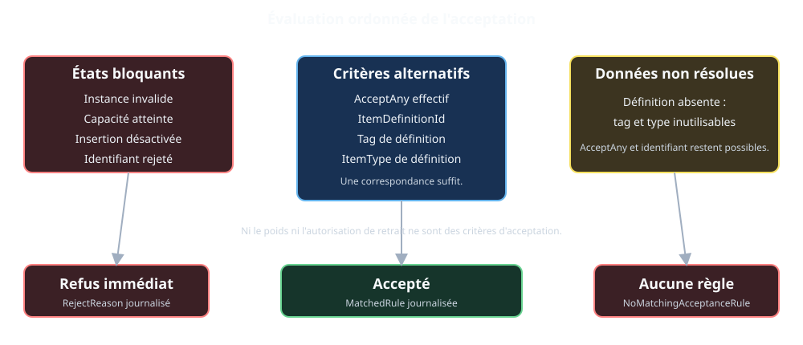
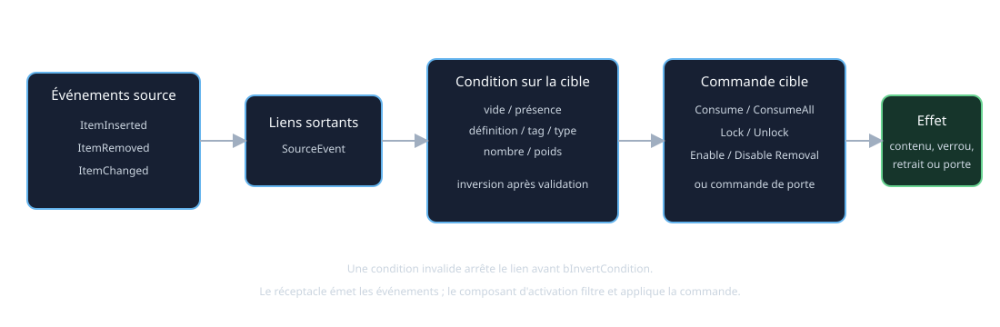

# Architecture du système de réceptacles

## 1. Objet et statut

Ce document décrit le système de réceptacles réellement implémenté : données placées, acteur runtime, transferts d'items, interaction souris, événements, commandes, conditions et validation éditeur.

Le cycle général des items avant et après leur passage dans un réceptacle est décrit dans [`ITEM_PICKUP_AND_PLACEMENT_FOUNDATION.md`](ITEM_PICKUP_AND_PLACEMENT_FOUNDATION.md).

[`docs/Design/RECEPTACLE_SYSTEM.md`](../Design/RECEPTACLE_SYSTEM.md) reste une spécification historique et prospective. Elle contient des intentions utiles, mais aussi des variantes de coffre, d'interface, de sauvegarde et d'événements qui ne constituent pas le contrat actuel.

## 2. Vocabulaire

**Réceptacle placé** : `FGridLevelObjectData` de type `Receptacle`, stocké dans `UGridLevelAsset::Objects`.

**Définition d'item** : `UGridItemDefinitionAsset`, qui fournit `ItemDefinitionId`, type, tags, poids et visuels.

**Instance d'item** : `FGridItemInstance`, identifiée par `RuntimeObjectId` et `ItemDefinitionId`.

**Contenu runtime** : tableau `AGridReceptacleActor::ContainedItems` de `FGridContainedReceptacleItem`.

**Politique** : `EGridReceptacleItemPolicy`, configurée sur la classe runtime ou son Blueprint, et non dans `FGridReceptacleBehaviorParams`.

## 3. Cartographie du code

| Domaine | Déclaration | Implémentation |
|---|---|---|
| Objet placé et liens | `Source/GrimrockPrototype/Public/Core/GridTypes.h` | structures sans `.cpp` |
| Paramètres persistants | `Source/GrimrockPrototype/Public/Core/GridObjectBehavior.h` | structure sans `.cpp` |
| Archétype | `Source/GrimrockPrototype/Public/Core/GridObjectArchetypeAsset.h` | `Source/GrimrockPrototype/Private/Core/GridObjectArchetypeAsset.cpp` |
| Définition et instance d'item | `Source/GrimrockPrototype/Public/Runtime/GridItemDefinitionAsset.h`, `GridInventoryTypes.h` | `Source/GrimrockPrototype/Private/Runtime/GridItemDefinitionAsset.cpp` |
| Acteur de réceptacle | `Source/GrimrockPrototype/Public/Runtime/GridReceptacleActor.h` | `Source/GrimrockPrototype/Private/Runtime/GridReceptacleActor.cpp` |
| Acteur d'item | `Source/GrimrockPrototype/Public/Runtime/GridItemActor.h` | `Source/GrimrockPrototype/Private/Runtime/GridItemActor.cpp` |
| Transferts | `Source/GrimrockPrototype/Public/Runtime/GridItemTransferService.h` | `Source/GrimrockPrototype/Private/Runtime/GridItemTransferService.cpp` |
| Génération et résolution | `Source/GrimrockPrototype/Public/Runtime/GridLevelRuntimeActor.h` | `Source/GrimrockPrototype/Private/Runtime/GridLevelRuntimeActor.cpp` |
| Liens | `Source/GrimrockPrototype/Public/Runtime/GridActivationComponent.h` | `Source/GrimrockPrototype/Private/Runtime/GridActivationComponent.cpp` |
| Souris et groupe | `GrimrockPlayerController.h`, `GrimrockPartyPawn.h` | fichiers `.cpp` correspondants sous `Private/Runtime` |
| Validation et édition | `Source/GrimrockPrototypeEditor/Public/EditorTools/GridLevelEditorActor.h` | `Source/GrimrockPrototypeEditor/Private/EditorTools/GridLevelEditorActor.cpp` |
| Panneaux | widgets sous `Source/GrimrockPrototypeEditor/Private/EditorTools/Widgets/` | inspecteur d'objet et panneau de liens |

## 4. Données persistantes et valeurs runtime

Le niveau persiste les champs communs `ObjectId`, `Type`, cellule, `Edge`, `ArchetypeId`, états initiaux, `Tag` et `Behavior`.

`Behavior.Receptacle` persiste :

- `bAcceptAnyItem` ;
- `InitialContent`, tableau d'assets de définition et de quantités ;
- `MaxContainedItems` ;
- les paramètres de placement physique.

L'archétype fournit la classe `RuntimeActorClass`, la classe visuelle `ItemActorClass`, les meshes, le placement et le comportement copié lors du placement. Une modification ultérieure de l'archétype ne resynchronise pas automatiquement `Behavior`.

`ItemPolicy`, `bCanInsertItem`, `bCanRemoveItem` et `ContainedItemActorClass` appartiennent à l'acteur ou à sa classe Blueprint. `VisualPlacementMode` et les paramètres de placement au clic peuvent être définis par le comportement de l'archétype. La capacité est entièrement définie par `MaxContainedItems` : `1` produit un comportement single-slot, une valeur supérieure à `1` autorise plusieurs items et une valeur inférieure ou égale à `0` est illimitée. L'acceptation dépend de `bAcceptAnyItem` et de `AcceptedItems`, tandis que `InitialContent` définit le contenu initial.

`ObjectData.Tag` n'intervient plus dans l'acceptation des items.

## 5. Génération et contenu runtime

`AGridLevelRuntimeActor::RebuildRuntimeObjects()` résout l'archétype, la classe, le mesh et le transform. `AddRuntimeObjectActor()` assigne `ItemActorClass`, appelle `InitializeGridObject()` et indexe l'acteur par `ObjectId`.

Le réceptacle connaît sa cellule et son bord par la classe de base `AGridRuntimeObjectActor`. `ContainedItems` est la source de vérité runtime. Chaque entrée conserve identité, définition éventuelle, quantité, poids, nom, lumière et acteur visuel éventuel.

Les modes visuels effectifs sont :

- `AttachedSocket` : acteur attaché à `ItemAttachPoint` ;
- `PhysicalAtHit` : transform issu du point et de la normale du clic, collision et physique optionnelles ;
- `ContainerOnly` : contenu logique sans acteur visible.

La capacité est comptée par entrée de `ContainedItems`, pas par somme des quantités. `MaxContainedItems <= 0` est interprété comme illimité par le runtime, même si les outils actuels éditent normalement une valeur positive.

Les alcôves sont des réceptacles multi-items avec `MaxContainedItems = 8`, `VisualPlacementMode = PhysicalAtHit`, `bSimulatePhysicsWhenPlaced = true` et un offset de surface de 5 cm. Les supports de torche restent des réceptacles single-slot avec `MaxContainedItems = 1` et `VisualPlacementMode = AttachedSocket`.

Quand le slot cursor contient un item et qu'un clic vise directement un réceptacle ou un item physique dont ce réceptacle est l'owner, l'intention d'insertion est prioritaire. Un refus affiche la raison réelle (`Full`, insertion désactivée ou filtre d'acceptation) et ne bascule jamais vers la logique de lancer.

L'insertion par clic souris se fait uniquement depuis le slot cursor. Les objets équipés en `MainHand` ou `OffHand` ne sont jamais insérés automatiquement dans un réceptacle. Quand le cursor est vide, cliquer un item contenu demande son retrait, même si une main est occupée.

## 6. Dépôt direct à la souris

`AGrimrockPlayerController` effectue un rayon unique sur `ECC_Visibility`. Le premier impact bloquant est autoritaire. Le dépôt n'est tenté que si cet impact appartient directement à un `AGridReceptacleActor` ou à un acteur dont il est le propriétaire.

Le contrôleur vérifie ensuite la distance, puis `CanPartyInteractWithEdgeObject()` pour la cellule, le bord et l'orientation. Il appelle enfin l'acceptation et `TryPlaceCursorItemFromHit()`. Aucun fallback vers le réceptacle situé en face n'est utilisé par le clic souris. La fonction de débogage `DebugPlaceCursorItemInFrontReceptacle()` reste un chemin explicite séparé.

Un mur, une porte fermée ou tout composant bloquant `Visibility` empêche donc de viser un réceptacle placé derrière, sous réserve de profils de collision corrects.

## 7. Acceptation

`EvaluateItemAcceptance()` applique cet ordre :

1. instance invalide : refus `InvalidItem` ;
2. capacité atteinte : refus `Full` ;
3. insertion désactivée : refus `InsertDisabled` ;
4. `bAcceptAnyItem=true` : acceptation ;
5. sinon : refus `NoMatchingAcceptanceRule`.

Les listes positives sont alternatives : une seule correspondance suffit. La liste de rejet est prioritaire. Une définition non résolue peut encore être acceptée par `AcceptAny` ou par identifiant, mais pas par tag ou type.

Il n'existe actuellement ni capacité par poids ni seuil de quantité à l'insertion. Le poids et le nombre d'entrées servent aux conditions de liens. La politique `Locked` interdit le retrait mais n'interdit pas l'insertion. `bCanRemoveItem` n'intervient pas dans l'acceptation.

Les évaluations d'acceptation sont silencieuses par défaut, notamment pendant le survol souris. Le diagnostic complet de l'état du réceptacle, de l'item candidat et de la règle d'acceptation n'est produit qu'avec `bLogDiagnostics=true`, au niveau `VeryVerbose`.

## 8. Transferts, retrait et consommation

`UGridItemTransferService` orchestre les transferts inventaire ou équipement vers réceptacle et réceptacle vers inventaire. Il valide la destination, retire la source, insère la destination et restaure la source si l'étape suivante échoue.

Le curseur suit un chemin direct : le réceptacle insère l'instance, puis le pawn vide le curseur uniquement après succès.

Le retrait exige :

- un index valide ;
- `bCanRemoveItem=true` ;
- une politique différente de `Locked` ;
- un groupe placé du bon côté ;
- une place disponible dans l'inventaire sélectionné.

Un clic sur l'acteur visuel contenu retire cet item. Pour un support attaché, un clic sur le support peut retirer le premier item. En mode `PhysicalAtHit`, le support seul ne retire pas implicitement le contenu : l'item visible doit être touché. Un curseur déjà occupé prend priorité sur le retrait et tente un dépôt.

`ConsumeItemAtIndex()` détruit une entrée sans la transférer et émet `ItemChanged`. `ConsumeAllItems()` répète cette opération pour chaque entrée ; il peut donc émettre plusieurs `ItemChanged`. La consommation ne dépend ni du verrouillage ni de `bCanRemoveItem`, car il s'agit d'une commande de mécanisme.

## 9. Événements, conditions et commandes

Un transfert réussi suit un seul chemin d'émission dans `AGridReceptacleActor` :

- insertion : `ItemInserted`, puis `ItemChanged` ;
- retrait : `ItemRemoved`, puis `ItemChanged` ;
- consommation : `ItemChanged` seulement.

`ItemChanged` accompagne donc actuellement tout changement de contenu ; il ne désigne pas uniquement une mutation interne d'une instance. `UGridActivationComponent::ActivateReceptacle()` met à jour `ActiveObjectIds`, mais ne réémet aucun événement.

Commandes spécialisées :

| Commande | Effet réel | Événement |
|---|---|---|
| `ReceptacleConsumeItem` | consomme l'entrée d'index 0 ; échec si vide | `ItemChanged` |
| `ReceptacleConsumeAllItems` | consomme toutes les entrées ; échec si vide | un `ItemChanged` par entrée |
| `ReceptacleLock` | passe la politique à `Locked` | aucun |
| `ReceptacleUnlock` | passe la politique à `Returnable`, sans restaurer la politique précédente | aucun |
| `ReceptacleEnableRemoval` | active `bCanRemoveItem` | aucun |
| `ReceptacleDisableRemoval` | désactive `bCanRemoveItem` | aucun |

Ces commandes n'ont pas d'effet visuel spécialisé. Une cible absente ou non réceptacle échoue avec diagnostic.

Conditions :

| Condition | Lecture | Paramètre obligatoire |
|---|---|---|
| `ReceptacleIsEmpty` | aucune entrée | aucun |
| `ReceptacleHasAnyItem` | au moins une entrée | aucun |
| `ReceptacleContainsItemDefinition` | égalité d'identifiant | identifiant non vide |
| `ReceptacleContainsItemTag` | définition résolue contenant le tag | tag non vide |
| `ReceptacleContainsItemType` | définition résolue du type demandé | type différent de `None` |
| `ReceptacleItemCountAtLeast` | nombre d'entrées | seuil supérieur à zéro |
| `ReceptacleWeightAtLeast` | somme `Weight * Quantity` | seuil supérieur à zéro |

Les conditions lisent la cible du lien. Une cible non réceptacle ou un paramètre invalide échoue avant l'application de `bInvertCondition`.

Liens typiques :

- `ItemInserted -> Door Open` ;
- `ItemRemoved -> Door Close` ;
- `ItemChanged` avec condition de contenu vers une commande de mécanisme ;
- événement externe vers une commande de consommation, verrouillage ou retrait.

## 10. Validation éditeur et diagnostics

`ValidateArchetype()` vérifie notamment le type, la classe dérivée de `AGridReceptacleActor`, l'interactivité et la présence d'une règle positive lorsque `bAcceptAnyItem=false`.

`ValidateCurrentLevel()` vérifie le placement générique de bord, les identités, l'archétype, les liens et :

- règles positives vides ;
- item initial historique absent des identifiants acceptés ;
- item initial présent dans les rejets ;
- identifiant présent à la fois dans les listes acceptée et rejetée ;
- réceptacle initialement actif sans item initial ;
- condition de réceptacle visant une autre cible ;
- paramètres de condition vides ou seuils non positifs ;
- commande spécialisée visant un autre type ;
- source ou cible initialement désactivée ;
- asymétrie éventuelle entre liens `ItemInserted` et `ItemRemoved`.

Le runtime journalise les transferts, refus, changements de politique, commandes, conditions et résolutions d'acteurs. Les évaluations utilisées par le survol souris sont silencieuses. Un refus d'action réelle peut produire un warning court. Le diagnostic complet `GridReceptacle Diagnostic` est disponible uniquement avec `bLogDiagnostics=true` et au niveau `VeryVerbose`; `GridRuntime Diagnostic` est également `VeryVerbose`.

## 11. Limites actuelles

- les filtres par type, tag ou définition ne font pas partie du modèle actuel ;
- aucun conteneur à grille ni interface de coffre complète ;
- aucune limite d'acceptation par poids ou quantité ;
- `Locked` ne bloque que le retrait ;
- `Unlock` impose `Returnable` ;
- `ConsumeAllItems` émet plusieurs `ItemChanged` ;
- la résolution d'une définition dépend des assets référencés par le niveau, les archétypes ou l'inventaire ;
- les changements runtime de politique et d'autorisation de retrait ne sont pas capturés dans `FGridRuntimeReceptacleState` ;
- les refus courants de dépôt ont un retour court, mais les refus spécialisés de retrait ou de verrouillage restent principalement signalés par le curseur et les logs.

## 12. Règles d'architecture

1. `UGridLevelAsset::Objects` conserve la configuration placée ; `ContainedItems` conserve le contenu runtime.
2. `ItemDefinitionId` et `RuntimeObjectId` sont les identités de référence.
3. La représentation visuelle d'un item ne remplace pas son entrée logique.
4. Le premier impact `ECC_Visibility` possède le dépôt souris.
5. Les précontrôles d'interaction utilisent les mêmes règles d'acceptation que le transfert.
6. Un transfert ne vide sa source qu'après validation et prévoit un rollback.
7. Les événements de contenu sont émis par l'acteur réceptacle, une seule fois par chemin métier.
8. Une condition invalide échoue avant inversion.
9. Les commandes spécialisées ciblent uniquement un acteur réceptacle généré.
10. Les variantes de support, alcôve ou autel restent des archétypes ou Blueprints, pas de nouveaux types de niveau.

Les curseurs de dépôt et les retours courts de refus sont décrits dans
[`READABLE_OBJECTS_AND_FEEDBACK_FOUNDATION.md`](READABLE_OBJECTS_AND_FEEDBACK_FOUNDATION.md).

Les validations de réceptacle sont présentées dans
[`LEVEL_VALIDATION_PANEL_FOUNDATION.md`](LEVEL_VALIDATION_PANEL_FOUNDATION.md).
