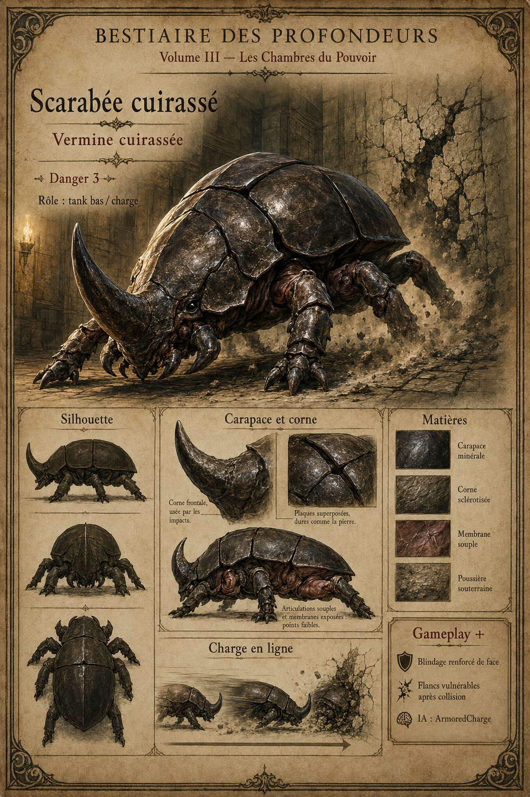
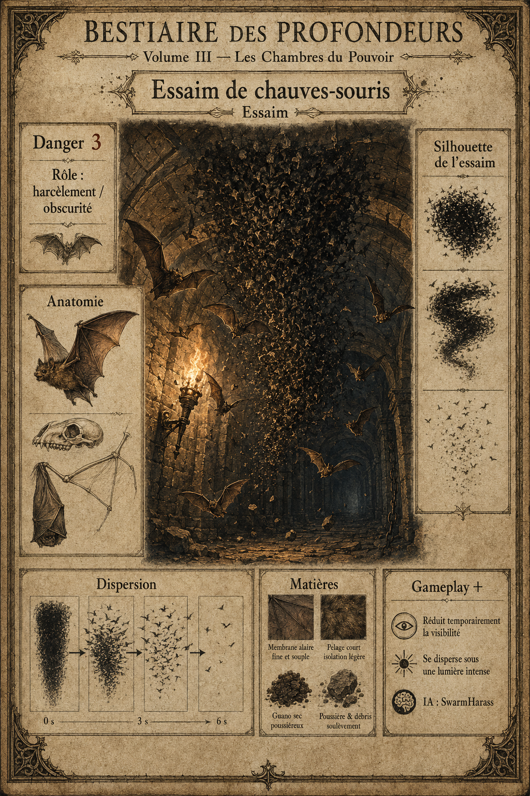
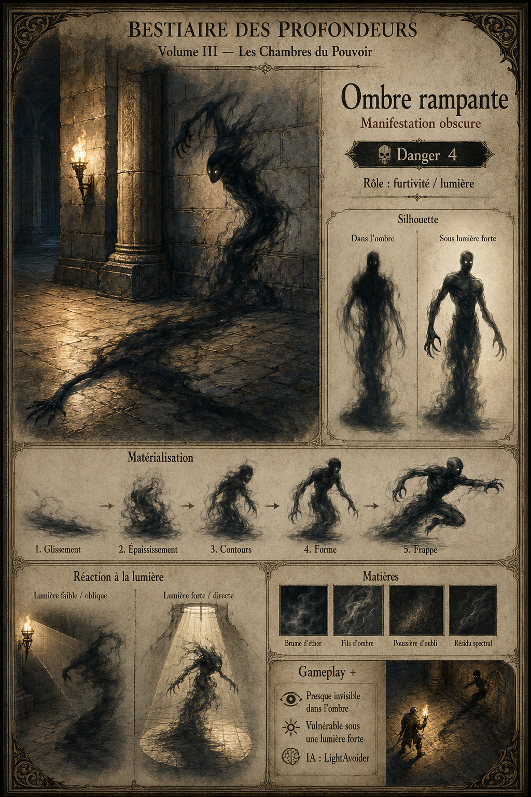
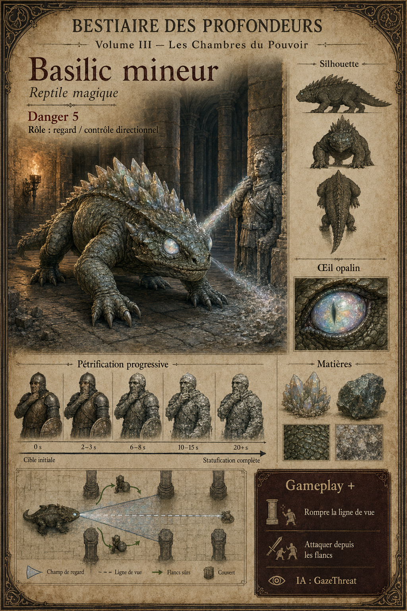
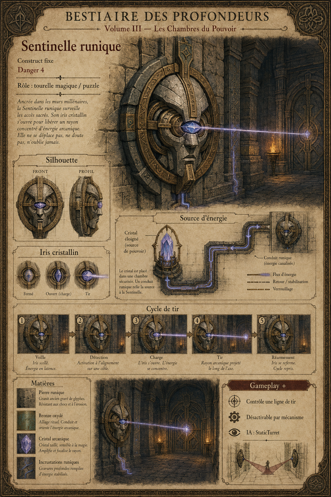

# BESTIAIRE DES PROFONDEURS
## Volume III - Les Chambres du Pouvoir

**Projet :** GrimrockPrototype  
**Moteur :** Unreal Engine 5.5.4  
**Genre :** Dungeon crawler en vue subjective, déplacement case par case  
**Document :** Artbook / Bible artistique / Document de conception du bestiaire  
**Version :** 0.2 - Version illustrée

---

# 01. Intention du Volume III

Le Volume I installait l'écosystème fondamental du donjon. Le Volume II introduisait des ennemis intelligents, magiques et capables d'agir sur les événements du niveau. Le Volume III franchit une nouvelle étape : les créatures ne se contentent plus d'occuper la grille, elles en modifient activement les règles.

**Les Chambres du Pouvoir** sont les salles où l'architecture, la magie et le bestiaire ne forment plus qu'un seul système. La lumière révèle ou affaiblit. L'eau conduit l'électricité. Les mécanismes peuvent être réparés, sabotés ou détournés. Certaines cases deviennent acides, obscures, instables ou dangereuses.

Ce volume poursuit trois objectifs :

- introduire des créatures liées aux pièges et aux mécanismes ;
- formaliser les états persistants appliqués aux cases ;
- proposer des combats qui exigent observation, orientation et utilisation du décor.

## Direction artistique

- pierre ancienne gravée de circuits runiques ;
- cuivre oxydé, fer noirci et cristal conducteur ;
- lumière de torche opposée aux ombres surnaturelles ;
- mécanismes réparés avec des matériaux rudimentaires ;
- acide, électricité et poussière minérale ;
- silhouettes immédiatement lisibles sur une grille ;
- effets magiques localisés, jamais envahissants.

---

# 02. Nouvelles règles de grille

| Règle | Effet de jeu | Créatures principales |
|---|---|---|
| Piège dynamique | Une case peut être armée ou réarmée pendant l'exploration. | Kobold artificier |
| Obscurité locale | La visibilité et la portée de détection sont réduites. | Essaim de chauves-souris, Ombre rampante |
| Menace directionnelle | Regarder une créature ou lui faire face devient dangereux. | Basilic mineur |
| Terrain corrosif | Une case inflige des dégâts et dégrade certaines protections. | Gelée acide |
| Réseau conducteur | Une décharge se propage entre eau, métal et cristaux. | Élémentaire de foudre |
| Dispositif lié | Un ennemi dépend d'un cristal, d'un sceau ou d'un mécanisme. | Sentinelle runique |
| Illusion spatiale | Une présence visible peut ne pas être la véritable cible. | Miroir vivant |
| Régénération conditionnelle | Une créature récupère tant qu'une faiblesse n'est pas exploitée. | Troll des profondeurs |

## États de case proposés

```text
GridState.Trapped
GridState.Darkened
GridState.Acid
GridState.Electrified
GridState.Cursed
GridState.Illusory
GridState.Unstable
GridState.RunicField
```

Chaque état doit posséder une durée, une source, une intensité, des règles de cumul et un événement de fin. Le DataAsset de niveau reste la source de vérité pour l'état initial ; les modifications temporaires appartiennent au runtime.

---

# 03. Pièges, lumière et terrain

## Pièges

Les pièges dynamiques doivent réutiliser les objets de niveau existants. Une créature n'invente pas arbitrairement un nouveau système : elle arme une plaque, dépose un dispositif sur une case valide ou déclenche une commande d'événement.

## Lumière

La lumière devient une donnée de gameplay simple : une case peut être éclairée, faiblement éclairée ou obscure. Les torches, projecteurs runiques et sorts fournissent des sources temporaires. L'Ombre rampante lit cet état pour déterminer sa visibilité et sa résistance.

## Terrain

Les états de terrain doivent être lisibles avant d'être létaux. Une case acide luit et fume ; une case électrifiée crépite ; une case maudite porte un signe stable. Le joueur doit pouvoir comprendre la règle sans ouvrir une interface.

## Principes de production

- une seule menace dominante par case ;
- une télégraphie visuelle avant le premier dégât important ;
- des effets compatibles avec la sauvegarde ;
- une solution de dissipation ou de contournement ;
- aucun effet ne doit rendre une énigme définitivement insoluble.

---

# 04. Profils IA avancés

```text
TrapSetter
SupportCaster
ArmoredCharge
SwarmHarass
LightAvoider
GazeThreat
HazardTrail
StaticTurret
IllusionCaster
Regenerator
ChainCaster
MiniBoss
```

| Profil | Intention |
|---|---|
| TrapSetter | Choisit une case valide, pose ou réarme un piège, puis se replie. |
| SupportCaster | Renforce les alliés et affaiblit l'équipe en restant à distance. |
| ArmoredCharge | Oriente son blindage, prépare une charge et avance en ligne. |
| SwarmHarass | Occupe l'espace, gêne la vision et se disperse sous pression. |
| LightAvoider | Cherche les cases obscures et perd ses avantages dans la lumière. |
| GazeThreat | Vérifie l'orientation et la ligne de vue avant d'appliquer son effet. |
| HazardTrail | Dépose un état de terrain sur les cases traversées. |
| StaticTurret | Contrôle une ligne de tir et dépend d'une source d'énergie. |
| IllusionCaster | Crée des leurres et déplace l'information plutôt que la matière. |
| Regenerator | Récupère selon une condition explicite et interruptible. |
| ChainCaster | Recherche des cibles ou surfaces conductrices connectées. |
| MiniBoss | Enchaîne plusieurs règles lisibles sans devenir un boss complet. |

---

# 05. Tableau synthétique

| N° | Créature | Rôle | IA | Danger | Mécanique principale |
|---:|---|---|---|---:|---|
| 01 | Kobold artificier | Pièges / fuite | TrapSetter | 3 | Pose et réarme des pièges |
| 02 | Chaman gobelin | Soutien / malédiction | SupportCaster | 4 | Renforce et affaiblit |
| 03 | Scarabée cuirassé | Tank bas / charge | ArmoredCharge | 3 | Blindage directionnel |
| 04 | Essaim de chauves-souris | Harcèlement / obscurité | SwarmHarass | 3 | Réduit la visibilité |
| 05 | Ombre rampante | Furtivité / lumière | LightAvoider | 4 | Invisible dans l'ombre |
| 06 | Basilic mineur | Regard / contrôle | GazeThreat | 5 | Menace liée à l'orientation |
| 07 | Gelée acide | Terrain dangereux | HazardTrail | 4 | Laisse des cases corrosives |
| 08 | Sentinelle runique | Tourelle magique | StaticTurret | 4 | Dispositif lié à un mécanisme |
| 09 | Miroir vivant | Illusion / reflet | IllusionCaster | 5 | Produit des doubles trompeurs |
| 10 | Troll des profondeurs | Pression / régénération | Regenerator | 5 | Régénération interrompue par feu/acide |
| 11 | Élémentaire de foudre | Chaînes / conductivité | ChainCaster | 5 | Propage l'électricité |
| 12 | Dragonnet de caverne | Mini-boss mobile | MiniBoss | 6 | Souffle, peur et repositionnement |

---

# 06. Classification du Volume III

```text
Volume III - Les Chambres du Pouvoir
|-- Artisans et thaumaturges
|   |-- Kobold artificier
|   `-- Chaman gobelin
|-- Faune des chambres anciennes
|   |-- Scarabée cuirassé
|   |-- Essaim de chauves-souris
|   `-- Basilic mineur
|-- Manifestations et matières vivantes
|   |-- Ombre rampante
|   |-- Gelée acide
|   |-- Miroir vivant
|   `-- Élémentaire de foudre
|-- Gardiens
|   |-- Sentinelle runique
|   `-- Troll des profondeurs
`-- Mini-boss
    `-- Dragonnet de caverne
```

---

# 07. Direction des planches

Chaque planche devra reprendre le langage visuel des volumes précédents : parchemin ancien, cadre médiéval, titre noir, sujet principal réaliste, études secondaires, matières, silhouette, notes de gameplay et cartouche technique.

Format recommandé : portrait 2:3, sujet entier lisible, environnement secondaire, texte français. Les futures images seront placées en pleine page dans le PDF illustré, sans marges blanches.

## Planches visuelles intégrées

Les douze planches du Volume III sont intégrées dans ce document :

1. Kobold artificier ;
2. Chaman gobelin ;
3. Scarabée cuirassé ;
4. Essaim de chauves-souris ;
5. Ombre rampante ;
6. Basilic mineur ;
7. Gelée acide ;
8. Sentinelle runique ;
9. Miroir vivant ;
10. Troll des profondeurs ;
11. Élémentaire de foudre ;
12. Dragonnet de caverne.

---

# FICHE 01 - Kobold artificier


**Nom technique :** `MON_KoboldArtificer`  
**Catégorie :** Humanoïde technicien  
**Rôle :** Pièges / fuite / sabotage  
**IA :** `TrapSetter`  
**Danger :** 3

## Description immersive

Le kobold artificier transforme les déchets du donjon en mécanismes rusés. Il tend un fil, cale une pointe sous une dalle, dépose une fiole instable puis disparaît derrière une porte qu'il connaît mieux que l'intrus.

## Direction artistique

Petit reptilien voûté, tablier de cuir, lunettes fendues, sac d'outils, pinces, ressorts et fioles. Silhouette nerveuse mais non comique. Cuivre usé, corde, cuir brûlé et verre sale.

## Gameplay

- pose un piège sur une case libre et visible ;
- peut réarmer un piège du niveau ;
- fuit après la pose et appelle parfois un allié ;
- vulnérable lorsqu'il manipule son matériel ;
- loot : outils fins, poudre instable, ressort ouvragé.

## Production

Animations : inspection du sol, pose, armement, lancer de fiole, fuite.  
VFX : étincelles, poudre, faible fumée.  
Sons : cliquetis d'outils, ressort, petit sifflement d'alerte.

## Prompt concept art

Planche de bestiaire médiéval dark fantasy, kobold artificier reptilien, tablier de cuir brûlé, sac d'outils, piège mécanique rudimentaire, cuivre oxydé, couloir de donjon, études de silhouette et de matériaux, annotations françaises, parchemin ancien.

---

# FICHE 02 - Chaman gobelin


**Nom technique :** `MON_GoblinShaman`  
**Catégorie :** Humanoïde thaumaturge  
**Rôle :** Soutien / malédiction  
**IA :** `SupportCaster`  
**Danger :** 4

## Description immersive

Le chaman ne cherche pas le premier rang. Il souffle sur des os peints, frappe son bâton contre la pierre et donne à toute sa bande une assurance surnaturelle. Tant qu'il demeure debout, les gobelins combattent au-delà de leur courage naturel.

## Direction artistique

Gobelin âgé, bâton noueux, masque d'os non humain, cordelettes, talismans et fumée rituelle. Palette terreuse avec quelques accents froids.

## Gameplay

- renforce attaque ou vitesse des alliés proches ;
- applique une malédiction temporaire à un membre de l'équipe ;
- tente de conserver deux cases de distance ;
- son incantation peut être interrompue ;
- loot : fétiche peint, herbes sèches, rune primitive.

## Production

Animations : danse courte, frappe du bâton, malédiction, recul.  
VFX : anneau de symboles, fumée basse, lueur du fétiche.  
Sons : grelots d'os, chant guttural, percussion sèche.

## Prompt concept art

Planche de bestiaire dark fantasy, chaman gobelin âgé avec bâton et masque d'os peint, talismans, fumée rituelle, salle de pierre, études du bâton et des fétiches, annotations françaises, artbook sur parchemin.

---

# FICHE 03 - Scarabée cuirassé



**Nom technique :** `MON_ArmoredBeetle`  
**Catégorie :** Vermine cuirassée  
**Rôle :** Tank bas / charge  
**IA :** `ArmoredCharge`  
**Danger :** 3

## Description immersive

Le scarabée cuirassé rampe au ras du sol sous une carapace presque minérale. Lorsqu'il aligne un couloir, il abaisse ses mandibules et charge comme un bélier vivant.

## Direction artistique

Grand coléoptère noir, plaques épaisses, corne frontale, articulations terreuses. La carapace doit évoquer le fer poli sans perdre sa nature organique.

## Gameplay

- réduit fortement les dégâts reçus de face ;
- télégraphie une charge en ligne droite ;
- peut être attiré contre un mur fragile ou une plaque ;
- flancs vulnérables après collision ;
- loot : plaque de carapace, corne, glande huileuse.

## Production

Animations : marche basse, fermeture des plaques, préparation, charge, renversement.  
VFX : poussière et étincelles à l'impact.  
Sons : pattes sèches, frottement de carapace, choc lourd.

## Prompt concept art

Planche de bestiaire dark fantasy, scarabée géant cuirassé, carapace noire minérale, corne frontale, posture de charge dans un couloir, vues de face et de profil, matières chitine et pierre, annotations françaises, parchemin ancien.

---

# FICHE 04 - Essaim de chauves-souris



**Nom technique :** `MON_BatSwarm`  
**Catégorie :** Essaim  
**Rôle :** Harcèlement / obscurité  
**IA :** `SwarmHarass`  
**Danger :** 3

## Description immersive

L'essaim tombe du plafond comme un rideau vivant. Il ne bloque pas la route par sa masse, mais par le bruit, les ailes et la confusion qu'il impose à ceux qui avancent à la lumière d'une seule torche.

## Direction artistique

Nuée compacte de petites silhouettes, ailes translucides, poussière et fragments de plafond. Un noyau visuel clair doit garantir la lisibilité sur une case.

## Gameplay

- réduit temporairement la visibilité de l'équipe ;
- traverse certaines grilles et ignore les plaques ;
- se disperse sous une attaque de zone ou une lumière intense ;
- peut éteindre une torche non protégée ;
- loot : aucun, parfois guano alchimique.

## Production

Animations : Niagara ou système d'essaim, regroupement, attaque, dispersion.  
VFX : poussière, ombres rapides.  
Sons : battements d'ailes, cris aigus, souffle de torche.

## Prompt concept art

Planche de bestiaire médiéval dark fantasy, essaim dense de chauves-souris dans une chambre de donjon, torche vacillante, poussière, étude d'une silhouette et du mouvement collectif, annotations françaises, parchemin artbook.

---

# FICHE 05 - Ombre rampante



**Nom technique :** `MON_CrawlingShadow`  
**Catégorie :** Manifestation obscure  
**Rôle :** Furtivité / lumière  
**IA :** `LightAvoider`  
**Danger :** 4

## Description immersive

L'Ombre rampante n'habite pas l'obscurité : elle utilise l'ombre projetée par les choses. Elle glisse d'un pilier à l'autre, mince et silencieuse, puis acquiert brièvement du volume pour frapper.

## Direction artistique

Silhouette humaine étirée contre le sol et les murs, contours fumés, yeux très discrets. Elle doit rester lisible sans devenir un simple nuage noir.

## Gameplay

- presque invisible et résistante sur une case obscure ;
- matérialisée et vulnérable dans une lumière forte ;
- cherche à éteindre ou contourner les sources lumineuses ;
- peut passer sous certaines portes ;
- loot : essence d'ombre, poussière noire.

## Production

Animations : glissement projeté, matérialisation, frappe, recul lumineux.  
VFX : masque d'ombre, fumée très basse, rupture à la lumière.  
Sons : froissement sec, souffle inversé, vibration sourde.

## Prompt concept art

Planche de bestiaire dark fantasy, ombre rampante surnaturelle glissant sur les dalles et un mur, forme humanoïde étirée, torche révélant partiellement la créature, études lumière et silhouette, annotations françaises, parchemin ancien.

---

# FICHE 06 - Basilic mineur



**Nom technique :** `MON_LesserBasilisk`  
**Catégorie :** Reptile magique  
**Rôle :** Regard / contrôle directionnel  
**IA :** `GazeThreat`  
**Danger :** 5

## Description immersive

Le basilic mineur n'a pas la puissance des légendes, mais son regard raidit les muscles et alourdit les membres. Dans un couloir étroit, quelques secondes face à lui suffisent pour condamner une équipe immobile.

## Direction artistique

Reptile quadrupède trapu, crête minérale, yeux opalins, écailles ternes. Le regard doit être lisible sans rayon spectaculaire permanent.

## Gameplay

- accumule un état de pétrification si l'équipe lui fait face ;
- la progression cesse lorsque la ligne de vue est rompue ;
- attaque moins efficacement sur les flancs ;
- un miroir ou un obstacle peut détourner son regard ;
- loot : œil opalin, écaille minérale, glande pétrifiante.

## Production

Animations : observation, fixation, marche lourde, morsure, aveuglement.  
VFX : reflet opalin, poussière minérale sur la cible.  
Sons : souffle reptilien, craquement minéral, grondement court.

## Prompt concept art

Planche de bestiaire dark fantasy, basilic mineur quadrupède, reptile trapu à crête minérale et yeux opalins, corridor à piliers, étude du regard et des écailles, annotations françaises, artbook sur parchemin.

---

# FICHE 07 - Gelée acide


**Nom technique :** `MON_AcidJelly`  
**Catégorie :** Matière vivante corrosive  
**Rôle :** Terrain dangereux  
**IA :** `HazardTrail`  
**Danger :** 4

## Description immersive

La gelée acide digère lentement la poussière, le métal et les restes abandonnés. Son passage laisse sur les dalles une pellicule luisante qui transforme la poursuite en problème de terrain.

## Direction artistique

Masse translucide jaune-vert, noyau sombre, bulles lentes, fragments métalliques suspendus. L'effet reste fantastique et non graphique.

## Gameplay

- laisse temporairement une case corrosive derrière elle ;
- dégrade l'armure et inflige des dégâts sur la durée ;
- sensible au froid et aux matières absorbantes ;
- peut dissoudre une grille ou un verrou prévu par le niveau ;
- loot : gel corrosif, noyau alchimique.

## Production

Animations : pulsation, déplacement, projection, dissolution.  
VFX : fumée basse, gouttes, réaction sur métal.  
Sons : bulles, suintement, crépitement chimique.

## Prompt concept art

Planche de bestiaire dark fantasy, gelée acide translucide jaune-vert, noyau sombre, fragments de métal suspendus, trace corrosive sur des dalles, études de matière et de déplacement, annotations françaises, parchemin ancien.

---

# FICHE 08 - Sentinelle runique



**Nom technique :** `MON_RunicSentinel`  
**Catégorie :** Construct fixe  
**Rôle :** Tourelle magique / puzzle  
**IA :** `StaticTurret`  
**Danger :** 4

## Description immersive

La Sentinelle runique est enchâssée dans le mur ou dressée sur un socle. Elle surveille une ligne exacte, alimentée par un cristal que les bâtisseurs ont parfois placé hors de portée directe.

## Direction artistique

Tête ou masque de pierre et bronze, iris cristallin, anneaux gravés, câbles ou nervures runiques courant vers le décor.

## Gameplay

- ne se déplace pas et contrôle une ligne de tir ;
- alterne charge, visée et décharge ;
- peut être désactivée par levier, cristal ou inversion de rune ;
- son tir peut alimenter un récepteur du puzzle ;
- loot : lentille runique, cristal chargé, plaque gravée.

## Production

Animations : rotation, ouverture de l'iris, charge, tir, extinction.  
VFX : rayon fin, glyphes, transfert d'énergie.  
Sons : pierre mobile, bourdonnement, impact cristallin.

## Prompt concept art

Planche de bestiaire dark fantasy, sentinelle runique enchâssée dans un mur de donjon, masque de pierre et bronze, iris cristallin, circuits gravés, rayon magique contrôlé, études du mécanisme, annotations françaises, parchemin artbook.

---

# FICHE 09 - Miroir vivant


**Nom technique :** `MON_LivingMirror`  
**Catégorie :** Entité illusoire  
**Rôle :** Illusion / reflet  
**IA :** `IllusionCaster`  
**Danger :** 5

## Description immersive

Le Miroir vivant emprunte les formes placées devant lui. Son cadre se déplace à peine, mais les reflets quittent parfois la surface pour occuper une case où rien ne se tient réellement.

## Direction artistique

Grand miroir ancien, cadre argenté noirci, surface liquide, silhouette imparfaite reflétée. L'objet doit rester crédible comme élément de salle avant son activation.

## Gameplay

- crée un ou deux doubles visuels sans collision réelle ;
- peut réfléchir un projectile magique annoncé ;
- sa véritable surface se révèle sous une lumière oblique ;
- les doubles disparaissent après un coup ou une interruption ;
- loot : éclat réfléchissant, argent noirci, essence illusoire.

## Production

Animations : ondulation, sortie d'un reflet, rotation du cadre, brisure magique.  
VFX : distorsion, duplication, reflets différés.  
Sons : verre chantant, chuchotement doublé, vibration métallique.

## Prompt concept art

Planche de bestiaire dark fantasy, miroir vivant ancien au cadre d'argent noirci, surface liquide montrant un double imparfait, salle runique, études du reflet et des éclats, annotations françaises, parchemin ancien.

---

# FICHE 10 - Troll des profondeurs


**Nom technique :** `MON_DeepTroll`  
**Catégorie :** Géant souterrain  
**Rôle :** Pression / régénération  
**IA :** `Regenerator`  
**Danger :** 5

## Description immersive

Le troll des profondeurs avance avec la certitude d'une créature qui sait que les blessures ordinaires ne l'arrêtent pas. Les flammes et l'acide sont moins des bonus que la clef nécessaire pour briser sa régénération.

## Direction artistique

Humanoïde massif, peau pierreuse gris-vert, dos chargé de concrétions, membres longs, protections récupérées. Puissant, ancien et adapté aux plafonds bas.

## Gameplay

- régénère après quelques secondes sans recevoir de feu ou d'acide ;
- frappe lentement mais repousse d'une case ;
- peut déplacer un obstacle léger ;
- devient temporairement vulnérable après une attaque lourde ;
- loot : tissu régénérant, dent de troll, concrétion.

## Production

Animations : marche voûtée, balayage, écrasement, régénération, réaction au feu.  
VFX : pulsation sobre de la peau, vapeur au feu.  
Sons : pas massifs, souffle grave, roche frottée.

## Prompt concept art

Planche de bestiaire dark fantasy, troll massif des profondeurs, peau pierreuse gris-vert, dos couvert de concrétions, posture voûtée dans une vaste galerie, études de silhouette et de matières, annotations françaises, parchemin artbook.

---

# FICHE 11 - Élémentaire de foudre


**Nom technique :** `MON_LightningElemental`  
**Catégorie :** Élémentaire  
**Rôle :** Chaînes / conductivité  
**IA :** `ChainCaster`  
**Danger :** 5

## Description immersive

L'Élémentaire de foudre est une tension enfermée dans une silhouette instable. Chaque grille, flaque ou armure métallique peut devenir le chemin le plus court entre lui et sa cible.

## Direction artistique

Corps incomplet formé d'arcs électriques autour d'un noyau cristallin. Quelques plaques de métal flottantes donnent une silhouette stable et lisible.

## Gameplay

- propage une décharge entre surfaces conductrices connectées ;
- électrifie temporairement une case humide ou métallique ;
- peut charger un cristal ou ouvrir un mécanisme prévu ;
- vulnérable à l'isolation, à la terre et à certains cristaux ;
- loot : noyau chargé, éclat conducteur, poussière magnétique.

## Production

Animations : flottement, concentration, arc en chaîne, surcharge, dissipation.  
VFX : éclairs ramifiés, noyau pulsant, arcs au sol.  
Sons : crépitement, grondement électrique, claquement sec.

## Prompt concept art

Planche de bestiaire dark fantasy, élémentaire de foudre autour d'un noyau cristallin, arcs électriques bleus et blancs, plaques métalliques flottantes, sol humide conducteur, études du noyau et des chaînes électriques, annotations françaises, parchemin ancien.

---

# FICHE 12 - Dragonnet de caverne


**Nom technique :** `MON_CaveDrake`  
**Catégorie :** Dragon mineur / mini-boss  
**Rôle :** Mobilité / souffle / peur  
**IA :** `MiniBoss`  
**Danger :** 6

## Description immersive

Le dragonnet ne règne pas sur un royaume ; il règne sur une chambre, un trésor et les passages qui y conduisent. Trop grand pour être traité comme une bête ordinaire, il utilise les piliers, les hauteurs et son souffle pour fractionner l'espace.

## Direction artistique

Dragon souterrain compact, ailes courtes, cornes usées, écailles sombres marquées par la pierre, gorge légèrement incandescente. Il doit tenir visuellement dans l'architecture du donjon.

## Gameplay

- alterne morsure, bond latéral et souffle en ligne ;
- pousse un cri de peur au changement de phase ;
- change de position entre des points prédéfinis de la salle ;
- son souffle peut allumer des braseros ou détruire des obstacles fragiles ;
- loot : écaille de dragonnet, glande ardente, clef du trésor.

## Phases proposées

1. **Territoire :** attaques au sol et souffle télégraphié.  
2. **Fureur :** déplacements plus fréquents et cri de peur.  
3. **Dernier brasier :** souffle renforcé, mais gorge vulnérable après l'attaque.

## Production

Animations : garde, marche, bond, morsure, souffle, cri, chute.  
VFX : braises localisées, souffle, chaleur de la gorge.  
Sons : grondement juvénile, griffes sur pierre, battement d'ailes lourd.

## Prompt concept art

Planche de bestiaire dark fantasy, dragonnet de caverne compact aux ailes courtes, écailles sombres, cornes usées, gorge incandescente, salle souterraine à piliers et trésor discret, études de souffle et silhouette, annotations françaises, parchemin artbook.

---

# 20. Annexes UE5

## Classes et composants

```text
UGridTileStateSubsystem
UGridMonsterAbilityComponent
UGridConductivityComponent
UGridIllusionComponent
UGridLightAwarenessComponent
UGridRegenerationComponent
UGridGazeThreatComponent
```

## DataAssets

```text
DA_MON_KoboldArtificer
DA_MON_GoblinShaman
DA_MON_ArmoredBeetle
DA_MON_BatSwarm
DA_MON_CrawlingShadow
DA_MON_LesserBasilisk
DA_MON_AcidJelly
DA_MON_RunicSentinel
DA_MON_LivingMirror
DA_MON_DeepTroll
DA_MON_LightningElemental
DA_MON_CaveDrake
```

## Gameplay Tags

```text
Monster.Humanoid.Artificer
Monster.Humanoid.Caster
Monster.Beast.Armored
Monster.Swarm
Monster.Shadow
Monster.Reptile
Monster.Ooze.Acid
Monster.Construct.Runic
Monster.Illusion
Monster.Giant.Regenerator
Monster.Elemental.Lightning
Monster.Dragon

State.Petrifying
State.Blinded
State.Cursed
State.Corroded
State.Electrified
State.Regenerating

Grid.Trapped
Grid.Darkened
Grid.Acid
Grid.Electrified
Grid.Illusory

Interaction.LightSensitive
Interaction.Conductive
Interaction.MechanismLinked
Interaction.CanSetTrap
Interaction.CanAlterGridState
```

## Principe d'architecture

Les capacités doivent émettre des commandes de runtime sans modifier directement le DataAsset source. Les changements persistants sont sérialisés séparément avec l'identifiant stable de la case, de l'objet ou du monstre responsable.

---

# 21. Checklist de production

## Conception

- [x] Définir les 12 créatures et leur rôle.
- [x] Définir les profils IA avancés.
- [x] Définir les états de grille nécessaires.
- [ ] Valider les règles de cumul et de dissipation.
- [ ] Fixer les valeurs chiffrées de combat.

## Art

- [ ] Produire les 12 planches illustrées.
- [ ] Valider silhouette, échelle et palette de chaque créature.
- [ ] Produire les vues de profil et détails de matières.
- [ ] Préparer les références 3D et animations.

## Technique UE5

- [ ] Créer le prototype `UGridTileStateSubsystem`.
- [ ] Implémenter lumière, acide et électricité sur une case test.
- [ ] Créer les profils IA `TrapSetter`, `LightAvoider` et `StaticTurret`.
- [ ] Tester la sauvegarde des états temporaires et persistants.
- [ ] Construire une salle de validation par mécanique.

## Validation gameplay

- [ ] Chaque menace possède une télégraphie claire.
- [ ] Chaque règle possède au moins un contre-jeu.
- [ ] Aucun état de terrain ne bloque définitivement la progression.
- [ ] Les solutions restent compréhensibles sans texte explicatif.
- [ ] Les douze créatures restent lisibles dans un déplacement case par case.

---

# Conclusion

Le Volume III transforme le bestiaire en véritable extension du level design. Ses créatures donnent un rôle de gameplay à la lumière, aux matériaux, aux pièges, aux orientations et aux états de terrain. Il prépare ainsi une architecture où le donjon, ses mécanismes et ses habitants partagent le même langage d'événements.
