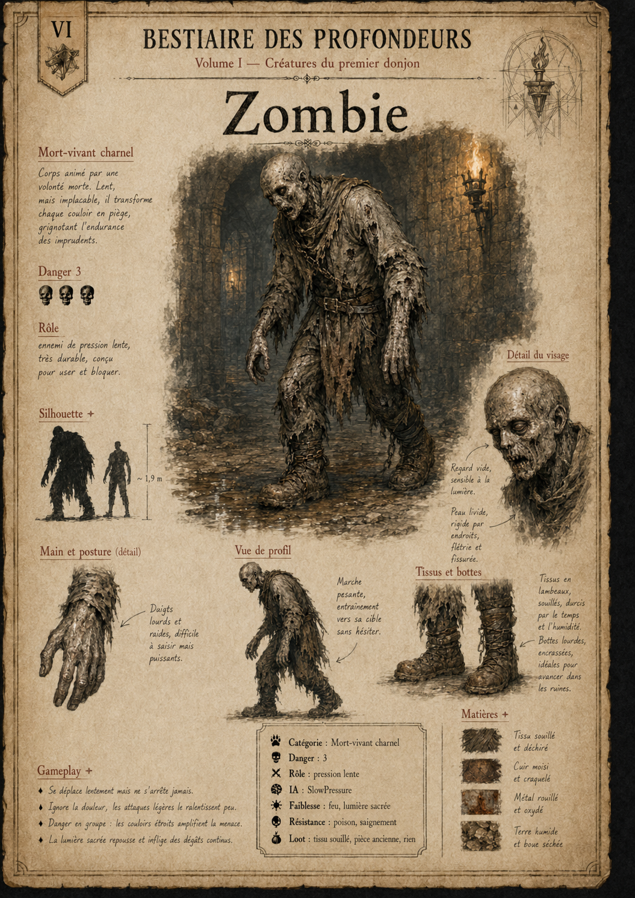
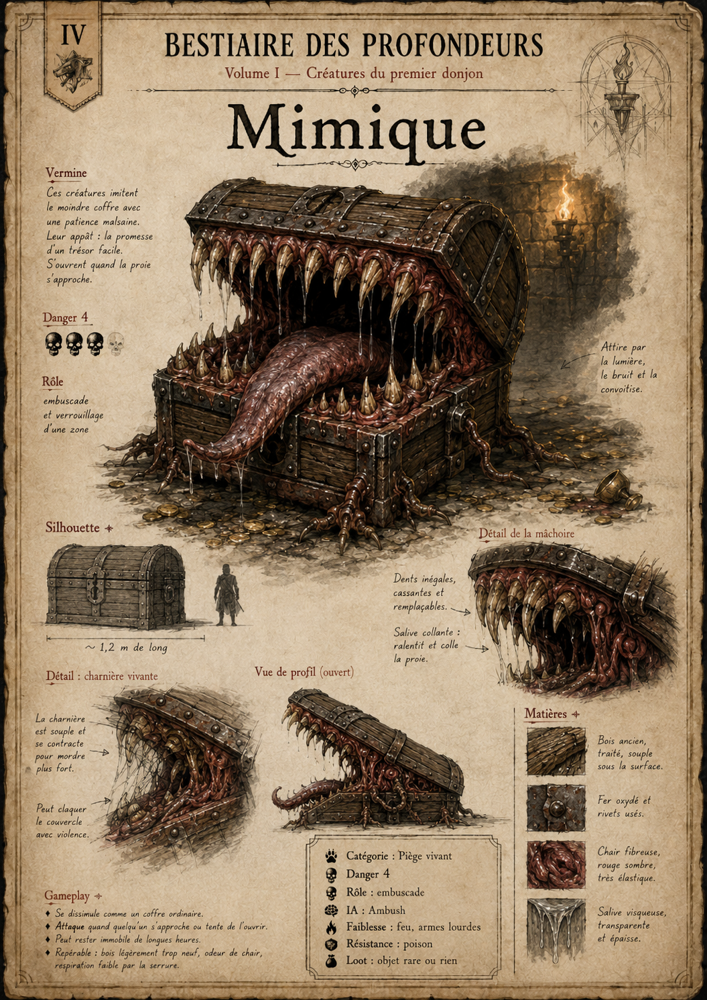
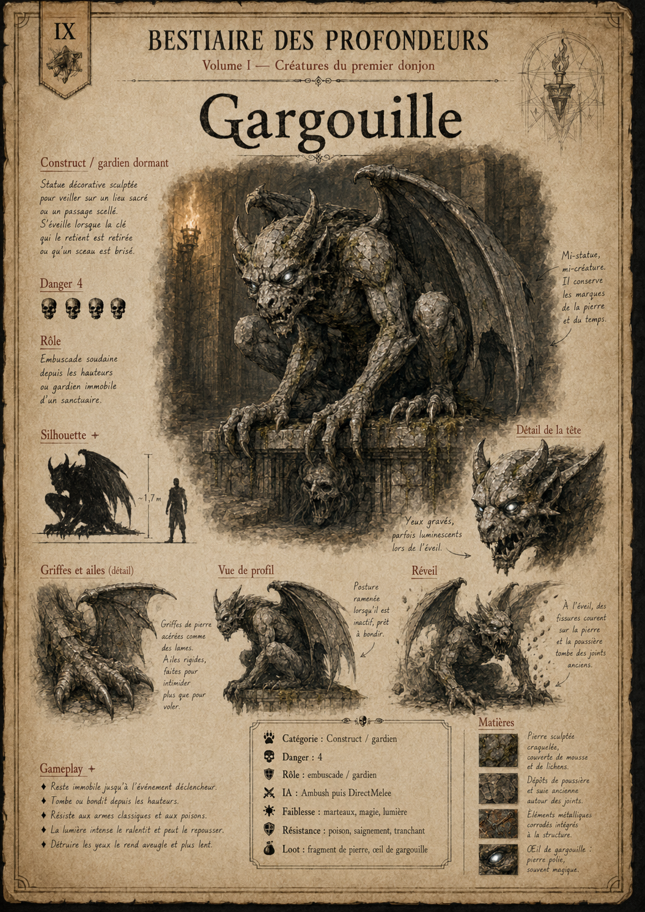
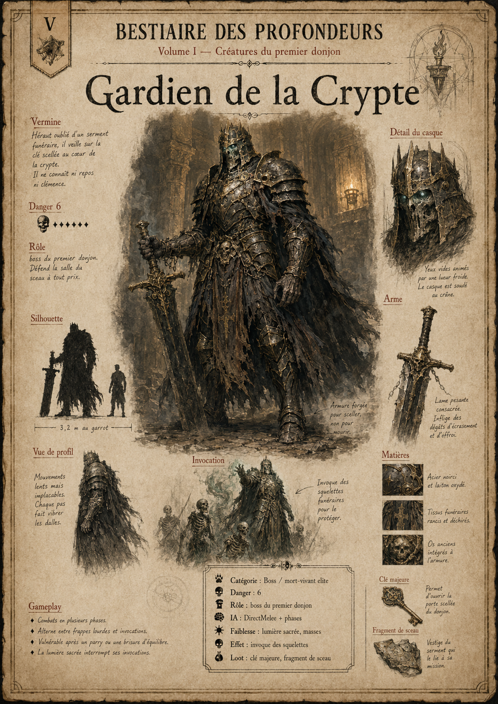

# BESTIAIRE DES PROFONDEURS
## Volume I - Créatures du premier donjon

**Projet :** GrimrockPrototype  
**Version :** 1.0 finalisée  
**Base GitHub :** dd125e0d  
**Objet :** ArtBook / bible visuelle / document de production du bestiaire

---

## Intention

Ce volume rassemble les planches visuelles et les données de production du premier bestiaire du prototype GrimrockPrototype. Il est conçu pour servir à la fois de document d’ambiance, de référence artistique, de support de game design et de base d’intégration Unreal Engine.

## Planches intégrées

- Fiche 01 - Rat géant (`MON_RatGiant`)
- Fiche 02 - Araignée mineure (`MON_MinorSpider`)
- Fiche 03 - Slime vert (`MON_GreenSlime`)
- Fiche 04 - Champignon toxique (`MON_ToxicMushroom`)
- Fiche 05 - Squelette guerrier (`MON_SkeletonWarrior`)
- Fiche 06 - Squelette archer (`MON_SkeletonArcher`)
- Fiche 07 - Zombie (`MON_Zombie`)
- Fiche 08 - Mimique (`MON_MimicChest`)
- Fiche 09 - Ver des cryptes (`MON_CryptWorm`)
- Fiche 10 - Gargouille (`MON_Gargoyle`)
- Fiche 11 - Golem de pierre (`MON_StoneGolem`)
- Fiche 12 - Gardien de la Crypte (`MON_CryptGuardian`)

---

## Tableau de synthèse

| # | Monstre | Catégorie | Danger | IA | Rôle |
|---:|---|---|---:|---|---|
| 1 | Rat géant | Vermine | 1 | DirectMelee / FastHarasser | Tutoriel / harceleur faible |
| 2 | Araignée mineure | Vermine venimeuse | 2 | FastHarasser | Poison / harcèlement |
| 3 | Slime vert | Matière vivante | 2 | SlowPressure | Contrôle de couloir |
| 4 | Champignon toxique | Matière vivante | 3 | SlowPressure | Contrôle de zone / poison |
| 5 | Squelette guerrier | Mort-vivant | 3 | DirectMelee | Combattant standard |
| 6 | Squelette archer | Mort-vivant à distance | 3 | RangedKeeper | Ennemi à distance |
| 7 | Zombie | Mort-vivant charnel | 3 | SlowPressure | Pression lente |
| 8 | Mimique | Piège vivant | 4 | Ambush | Embuscade |
| 9 | Ver des cryptes | Bête de donjon / embuscade | 3 | Ambush | Embuscade / surprise |
| 10 | Gargouille | Construct / gardien dormant | 4 | Ambush puis DirectMelee | Embuscade / gardien |
| 11 | Golem de pierre | Construct lourd | 5 | SlowPressure / PuzzleLinked | Tank / puzzle de combat |
| 12 | Gardien de la Crypte | Boss / mort-vivant elite | 6 | DirectMelee + phases | Boss du premier donjon |

---

# FICHE 01 - Rat géant


**Nom technique :** `MON_RatGiant`  
**Catégorie :** Vermine  
**Danger :** 1  
**Rôle :** Tutoriel / harceleur faible  
**IA :** DirectMelee / FastHarasser  
**Faiblesse :** Feu, armes tranchantes  
**Résistance :** Aucune  
**Loot :** Viande de rat, dent, rien  

---

# FICHE 02 - Araignée mineure


**Nom technique :** `MON_MinorSpider`  
**Catégorie :** Vermine venimeuse  
**Danger :** 2  
**Rôle :** Poison / harcèlement  
**IA :** FastHarasser  
**Faiblesse :** Feu  
**Résistance :** Poison  
**Loot :** Glande à venin, soie, rien  

---

# FICHE 03 - Slime vert


**Nom technique :** `MON_GreenSlime`  
**Catégorie :** Matière vivante  
**Danger :** 2  
**Rôle :** Contrôle de couloir  
**IA :** SlowPressure  
**Faiblesse :** Feu  
**Résistance :** Tranchant, poison  
**Loot :** Gelée acide  

---

# FICHE 04 - Champignon toxique


**Nom technique :** `MON_ToxicMushroom`  
**Catégorie :** Matière vivante  
**Danger :** 3  
**Rôle :** Contrôle de zone / poison  
**IA :** SlowPressure  
**Faiblesse :** Feu, lumière intense  
**Résistance :** Poison  
**Loot :** Spores toxiques, glande fongique  

---

# FICHE 05 - Squelette guerrier


**Nom technique :** `MON_SkeletonWarrior`  
**Catégorie :** Mort-vivant  
**Danger :** 3  
**Rôle :** Combattant standard  
**IA :** DirectMelee  
**Faiblesse :** Armes contondantes, lumière sacrée  
**Résistance :** Poison, saignement  
**Loot :** Os, arme rouillée, clé rare  

---

# FICHE 06 - Squelette archer


**Nom technique :** `MON_SkeletonArcher`  
**Catégorie :** Mort-vivant à distance  
**Danger :** 3  
**Rôle :** Ennemi à distance  
**IA :** RangedKeeper  
**Faiblesse :** Armes contondantes, lumière sacrée  
**Résistance :** Poison, saignement  
**Loot :** Flèches, arc usé, os  

---

# FICHE 07 - Zombie



**Nom technique :** `MON_Zombie`  
**Catégorie :** Mort-vivant charnel  
**Danger :** 3  
**Rôle :** Pression lente  
**IA :** SlowPressure  
**Faiblesse :** Feu, lumière sacrée  
**Résistance :** Poison, saignement  
**Loot :** Tissu souillé, pièce ancienne, rien  

---

# FICHE 08 - Mimique



**Nom technique :** `MON_MimicChest`  
**Catégorie :** Piège vivant  
**Danger :** 4  
**Rôle :** Embuscade  
**IA :** Ambush  
**Faiblesse :** Feu, armes lourdes  
**Résistance :** Poison  
**Loot :** Objet rare, or, ou rien  

---

# FICHE 09 - Ver des cryptes


**Nom technique :** `MON_CryptWorm`  
**Catégorie :** Bête de donjon / embuscade  
**Danger :** 3  
**Rôle :** Embuscade / surprise  
**IA :** Ambush  
**Faiblesse :** Feu, froid  
**Résistance :** Poison léger  
**Loot :** Dent de ver, mucus, rien  

---

# FICHE 10 - Gargouille



**Nom technique :** `MON_Gargoyle`  
**Catégorie :** Construct / gardien dormant  
**Danger :** 4  
**Rôle :** Embuscade / gardien  
**IA :** Ambush puis DirectMelee  
**Faiblesse :** Marteaux, magie, lumière  
**Résistance :** Poison, saignement, tranchant  
**Loot :** Fragment de pierre, oeil de gargouille  

---

# FICHE 11 - Golem de pierre


**Nom technique :** `MON_StoneGolem`  
**Catégorie :** Construct lourd  
**Danger :** 5  
**Rôle :** Tank / puzzle de combat  
**IA :** SlowPressure / PuzzleLinked  
**Faiblesse :** Marteaux, foudre, désactivation par sceau  
**Résistance :** Poison, saignement, tranchant, feu  
**Loot :** Fragment de golem, rune, cristal  

---

# FICHE 12 - Gardien de la Crypte



**Nom technique :** `MON_CryptGuardian`  
**Catégorie :** Boss / mort-vivant elite  
**Danger :** 6  
**Rôle :** Boss du premier donjon  
**IA :** DirectMelee + phases  
**Faiblesse :** Lumière sacrée, masses  
**Résistance :** Poison, saignement, froid  
**Loot :** Clé majeure, fragment de sceau, arme ancienne  

---

# Annexes de production UE5

## Nomenclature proposée

```text
DA_MON_<MonsterId>
BP_MON_<MonsterId>
SK_<MonsterId>
SM_<MonsterId>
M_<MonsterId>_<Part>
ICON_MON_<MonsterId>_512
```

## Classes C++ futures possibles

```text
AGridMonsterActor
AGridMonsterSpawnActor
UGridMonsterDataAsset
UGridMonsterBehaviorComponent
UGridMonsterCombatComponent
UGridMonsterPerceptionComponent
```