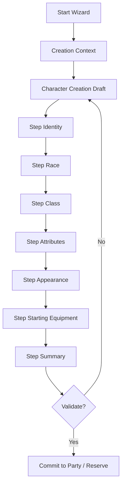

# CC7 - Character Creation Wizard & Recruitment

## 1. Objet

CC7 définit la cible fonctionnelle et visuelle du futur système de création de personnage sous forme de wizard multi-écrans, ainsi que son articulation avec le recrutement de compagnons pendant l'aventure.

Ce document ne lance pas encore l'implémentation complète. Il sert à cadrer la suite après les tranches CC0 à CC6 :

```text
CC0-CC6 = création initiale minimale, portraits, identité visuelle et inventaire
CC7     = wizard multi-écrans + recrutement de compagnons
```

La règle principale est :

```text
Pas tout, tout de suite.
Installer d'abord la structure du wizard, puis brancher progressivement les règles.
```

---

## 2. Décision de conception

Le système cible doit distinguer trois cas très différents.

| Cas | Description | UI recommandée |
|---|---|---|
| Personnage principal | Créé au début d'une nouvelle partie | Wizard complet |
| Compagnon PNJ scénarisé | Rencontré pendant l'aventure | Écran de recrutement simple |
| Recrue personnalisable | Engagée dans une auberge, une guilde, un marché ou auprès d'un recruteur | Wizard complet ou partiel avec coût et restrictions |

Le wizard complet n'est donc pas utilisé pour tous les personnages.

Un PNJ rencontré dans l'aventure ne doit pas perdre son identité narrative dans un générateur générique. Il doit être proposé au joueur via un écran de recrutement dédié, avec portrait, plein pied, classe, niveau, résumé et conditions éventuelles.

---

## 3. Vocabulaire de design

Pour l'univers, éviter autant que possible l'expression brute "acheter un personnage".

Préférer :

```text
Recruter un mercenaire
Engager un aventurier
Signer un contrat
Former une recrue
Acheter les services d'un compagnon
Passer par une guilde d'aventuriers
```

Le coût peut rester réel côté gameplay, mais le vocabulaire doit conserver une tonalité médiéval fantastique crédible.

---

## 4. Contextes de création

Le système doit introduire une notion de contexte de création.

Exemple cible C++ :

```cpp
UENUM(BlueprintType)
enum class ERPGCharacterCreationContext : uint8
{
    NewGameMainHero,
    TavernCustomRecruit,
    MarketCustomRecruit,
    GuildCustomRecruit,
    StoryCompanionPreview,
    DebugTest
};
```

Le contexte détermine :

- les étapes visibles du wizard ;
- les races autorisées ;
- les classes autorisées ;
- les portraits disponibles ;
- le niveau initial ;
- le budget d'attributs ;
- l'équipement de départ ;
- le coût éventuel ;
- l'endroit où placer le personnage après validation : groupe actif, réserve ou refus si impossible.

---

## 5. Types de membres du groupe

Il faut distinguer la nature des personnages du groupe.

Exemple cible C++ :

```cpp
UENUM(BlueprintType)
enum class ERPGPartyMemberKind : uint8
{
    MainHero,
    CustomRecruit,
    StoryCompanion,
    TemporaryGuest
};
```

| Type | Origine | Personnalisation | Exemple |
|---|---|---|---|
| `MainHero` | Début de partie | complète | héros principal |
| `CustomRecruit` | auberge, guilde, marché | complète ou encadrée | mercenaire |
| `StoryCompanion` | rencontre narrative | faible ou nulle | PNJ compagnon |
| `TemporaryGuest` | quête temporaire | aucune | escorte, prisonnier, allié provisoire |

Cette distinction doit rester dans les données runtime. Elle ne doit pas être déduite uniquement du nom, de la classe ou du portrait.

---

## 6. Draft avant validation

Le wizard ne doit pas modifier directement le `PartyInventoryState` pendant la navigation.

Le joueur manipule d'abord un brouillon de création.

Exemple cible :

```cpp
USTRUCT(BlueprintType)
struct FRPGCharacterCreationDraft
{
    GENERATED_BODY()

    ERPGCharacterCreationContext Context;
    ERPGPartyMemberKind TargetMemberKind;

    FText DisplayName;
    FName RaceId;
    FName ClassId;
    FName PortraitVariantId;
    FName FullBodyVariantId;

    FRPGAttributes Attributes;

    int32 StartingLevel = 1;
    int32 GoldCost = 0;
};
```

Le personnage n'est créé ou recruté qu'à l'étape finale.

```text
Wizard Step -> met à jour Draft
Résumé final -> validation C++
Validation C++ OK -> commit dans PartyInventoryState
Validation C++ refusée -> message d'erreur lisible
```

---

## 7. Flux général du wizard



Le widget affiche les étapes. Le C++ valide les choix.

---

## 8. Wizard du personnage principal

Contexte :

```cpp
ERPGCharacterCreationContext::NewGameMainHero
ERPGPartyMemberKind::MainHero
```

### 8.1 Étape 1 - Identité

Contenu :

- nom du personnage ;
- genre ou type de corps ;
- portrait compact ;
- aperçu plein pied si disponible ;
- résumé minimal du contexte : personnage principal.

Critère de sortie : le joueur comprend immédiatement qui il est en train de créer.

### 8.2 Étape 2 - Race

Contenu :

- liste des races disponibles ;
- description courte ;
- bonus ou particularités ;
- portrait ou silhouette de race ;
- incompatibilités éventuelles.

Races minimales actuelles :

```text
Humain
Elfe
Nain
Gnome
Halfelin
Demi-orc
```

### 8.3 Étape 3 - Classe

Contenu :

- liste des classes disponibles ;
- icône de classe ;
- rôle dans le groupe ;
- difficulté ;
- aperçu des PV, mana, équipement de départ.

Classes minimales actuelles :

```text
Guerrier
Voleur
Rôdeur
Mage
Prêtre
Alchimiste
```

### 8.4 Étape 4 - Attributs

Contenu :

- Force ;
- Dextérité ;
- Constitution ;
- Intelligence ;
- Sagesse ;
- Charisme.

Première version : lecture seule ou profils prédéfinis.

Version ultérieure : budget de points, bouton Réinitialiser, validation de bornes.

### 8.5 Étape 5 - Apparence

Contenu :

- portrait compact ;
- corps plein pied ;
- icône de classe ;
- cadre ou couleur d'accent ;
- variante de portrait ;
- variante de plein pied si disponible.

Cette étape doit rester compatible avec `CHARACTER_CREATION_VISUAL_IDENTITY_ROADMAP.md`.

### 8.6 Étape 6 - Équipement de départ

Première version : équipement imposé par la classe.

Version ultérieure : choix entre plusieurs packs.

Exemple guerrier :

```text
Pack équilibré     = épée + bouclier
Pack offensif      = arme à deux mains
Pack exploration   = arme simple + torche
```

### 8.7 Étape 7 - Résumé final

Contenu :

- nom ;
- race ;
- classe ;
- niveau ;
- attributs ;
- PV / mana ;
- portrait ;
- plein pied ;
- équipement de départ ;
- bouton Créer le personnage.

Le bouton final appelle l'API C++ de création. Il ne doit pas écrire les données directement depuis le Blueprint.

---

## 9. Recrutement d'un compagnon PNJ scénarisé

Un PNJ compagnon rencontré dans l'aventure ne passe pas par le wizard complet.

Il utilise un écran de recrutement dédié.

Exemple de contenu :

```text
Nom : Serana de Valombre
Race : Humaine
Classe : Voleuse
Niveau : 3

Ancienne éclaireuse de la garde ducale, elle connaît les souterrains du vieux fort.

Boutons :
- Recruter
- Refuser
- Voir la fiche
```

DataAsset cible possible :

```cpp
UCLASS(BlueprintType)
class URPGStoryCompanionAsset : public UDataAsset
{
    GENERATED_BODY()

public:
    FName CompanionId;
    FText DisplayName;
    FText ShortDescription;

    FName RaceId;
    FName ClassId;
    int32 Level = 1;

    FRPGAttributes Attributes;

    TSoftObjectPtr<UTexture2D> Portrait;
    TSoftObjectPtr<UTexture2D> FullBody;

    TArray<FName> StartingEquipmentIds;
    FText RecruitmentConditionText;
};
```

Première version possible : recruter ajoute le PNJ au groupe actif si une place existe, sinon refuse avec un message simple.

Version ultérieure : si le groupe est plein, proposer l'ajout en réserve.

---

## 10. Recrutement personnalisable en auberge, guilde ou marché

Un recruteur peut proposer un personnage personnalisable.

Exemples de lieux :

```text
Auberge
Marché
Guilde d'aventuriers
Campement de mercenaires
Temple
Tour de mage
```

Exemple d'interaction :

```text
Maître recruteur :
- Engager un guerrier
- Engager un voleur
- Engager un mage
- Créer un aventurier personnalisé
- Quitter
```

Le recruteur ouvre le wizard avec un contexte spécifique :

```cpp
ERPGCharacterCreationContext::TavernCustomRecruit
ERPGPartyMemberKind::CustomRecruit
```

Restrictions possibles :

- coût en or ;
- niveau maximum selon la progression ;
- races ou classes indisponibles ;
- équipement de départ limité ;
- impossibilité de recruter si le groupe et la réserve sont pleins ;
- réputation ou quête requise.

---

## 11. Groupe actif et réserve

CC7 doit anticiper la réserve, sans forcément l'implémenter immédiatement.

Modèle conceptuel :

```text
PartyState
├── ActiveMembers[]
├── ReserveMembers[]
├── KnownStoryCompanions[]
└── TemporaryGuests[]
```

Décision recommandée :

```text
CC7.1 à CC7.4 peuvent ignorer la réserve.
CC7.5 peut refuser le recrutement si le groupe est plein.
CC7.7 introduira la réserve proprement.
```

---

## 12. UI cible

### 12.1 Widget principal du wizard

Widget cible :

```text
WBP_CharacterCreationWizard
```

Rôle :

- contient le cadre général ;
- affiche la progression ;
- gère les boutons Précédent / Suivant / Annuler / Valider ;
- héberge les widgets d'étapes ;
- ne calcule pas les règles.

### 12.2 Widgets d'étape

Widgets possibles :

```text
WBP_CCWizardStep_Identity
WBP_CCWizardStep_Race
WBP_CCWizardStep_Class
WBP_CCWizardStep_Attributes
WBP_CCWizardStep_Appearance
WBP_CCWizardStep_StartingEquipment
WBP_CCWizardStep_Summary
```

Chaque étape modifie le draft, puis demande au C++ si l'étape est valide.

### 12.3 Écran de recrutement PNJ

Widget cible :

```text
WBP_CompanionRecruitment
```

Rôle :

- afficher l'identité du compagnon ;
- afficher portrait et plein pied ;
- afficher résumé, race, classe, niveau ;
- proposer Recruter / Refuser / Voir la fiche.

### 12.4 Écran de recruteur

Widget cible possible :

```text
WBP_RecruiterDialog
```

Rôle :

- afficher les services proposés ;
- lister les options de recrutement ;
- afficher les coûts ;
- ouvrir le wizard avec le bon contexte.

---

## 13. Schéma des écrans

### 13.1 Wizard principal

```text
+-------------------------------------------------------------+
| Création du personnage                          Étape 2 / 7 |
+----------------------+----------------------+---------------+
| Étapes               | Aperçu personnage    | Détails choix |
|                      |                      |               |
| 1. Identité          | Portrait compact     | Description   |
| 2. Race              | Personnage plein pied| Bonus         |
| 3. Classe            | Icône de classe      | Contraintes   |
| 4. Attributs         |                      |               |
| 5. Apparence         |                      |               |
| 6. Équipement        |                      |               |
| 7. Résumé            |                      |               |
+----------------------+----------------------+---------------+
| Annuler                         Précédent       Suivant     |
+-------------------------------------------------------------+
```

### 13.2 Recrutement PNJ

```text
+-------------------------------------------------------------+
| Compagnon rencontré                                         |
+----------------------+----------------------+---------------+
| Portrait / plein pied| Nom, race, classe    | Résumé        |
|                      | Niveau               | Conditions    |
|                      | Rôle dans le groupe  |               |
+----------------------+----------------------+---------------+
| Refuser                         Voir la fiche   Recruter    |
+-------------------------------------------------------------+
```

---

## 14. Roadmap CC7 par tranches

### CC7.0 - Documentation et décisions

But : valider le présent document.

Travail :

- créer le document CC7 ;
- ajouter la décision dans `99_DECISIONS_LOG.md` ;
- ne pas modifier le code ;
- ne pas modifier les Blueprints.

Critère de sortie : la direction générale du wizard et du recrutement est validée.

### CC7.1 - Wizard shell UI seulement

But : créer une coquille de wizard sans règles avancées.

Travail :

- créer `WBP_CharacterCreationWizard` ;
- créer les boutons Précédent / Suivant / Annuler ;
- créer une zone centrale d'étape ;
- créer une liste d'étapes à gauche ;
- naviguer entre des pages factices ;
- ne pas créer de personnage depuis ce widget.

Critère de sortie : le joueur peut parcourir les étapes dans l'UI, mais aucune donnée runtime n'est encore écrite.

### CC7.2 - Draft de création

But : ajouter une structure de brouillon séparée du runtime final.

Travail :

- ajouter `ERPGCharacterCreationContext` ;
- ajouter `ERPGPartyMemberKind` ;
- ajouter `FRPGCharacterCreationDraft` ;
- convertir le draft en `FRPGCharacterCreationRequest` uniquement au résumé final ;
- ajouter des validations minimales.

Critère de sortie : le wizard manipule un draft et ne modifie pas `PartyInventoryState` avant validation.

### CC7.3 - Wizard MainHero branché sur New Game

But : remplacer progressivement l'écran minimal par le wizard pour le personnage principal.

Travail :

- ouvrir le wizard au lancement d'une nouvelle partie ;
- limiter temporairement les choix au périmètre déjà supporté si nécessaire ;
- conserver le blocage des déplacements pendant la création ;
- appeler `CreateInitialCharacter` uniquement au résumé final.

Critère de sortie : le flux New Game reste fonctionnel et testable.

### CC7.4 - Validation visuelle par captures

But : figer la mise en page avant d'aller plus loin.

Captures à produire :

- Step Identity ;
- Step Race ;
- Step Class ;
- Step Attributes ;
- Step Appearance ;
- Step Summary ;
- écran en PIE complet.

Critère de sortie : les captures sont validées avant d'ajouter les PNJ et recruteurs.

### CC7.5 - Recrutement PNJ scénarisé minimal

But : recruter un compagnon prédéfini sans wizard complet.

Travail :

- créer un DataAsset de compagnon scénarisé ;
- créer `WBP_CompanionRecruitment` ;
- afficher portrait, plein pied, race, classe, niveau, résumé ;
- bouton Recruter ;
- ajouter au groupe actif si une place existe.

Critère de sortie : un PNJ prédéfini peut rejoindre le groupe sans passer par le générateur complet.

### CC7.6 - Recruteur d'auberge / marché

But : ouvrir le wizard depuis un PNJ ou un mécanisme de recrutement.

Travail :

- créer un acteur ou objet de recrutement ;
- afficher une liste de services ;
- ouvrir le wizard avec `TavernCustomRecruit`, `MarketCustomRecruit` ou `GuildCustomRecruit` ;
- appliquer un coût simple si l'économie existe déjà, sinon afficher le coût sans l'exécuter.

Critère de sortie : le wizard peut être lancé hors début de partie avec un contexte différent.

### CC7.7 - Réserve de compagnons

But : gérer proprement les recrutements lorsque le groupe actif est plein.

Travail :

- ajouter une réserve ;
- déplacer un compagnon entre groupe actif et réserve ;
- décider ce qui est autorisé dans un donjon, une auberge ou un camp ;
- sauvegarder la réserve.

Critère de sortie : le joueur peut avoir plus de compagnons connus que de places actives.

---

## 15. Tests à prévoir

Tests recommandés :

| Test | Résultat attendu |
|---|---|
| `WizardDraftDoesNotModifyParty` | naviguer dans le wizard ne crée aucun personnage |
| `MainHeroWizardCommitsOnSummaryOnly` | le héros est créé uniquement à la validation finale |
| `CancelWizardKeepsExistingParty` | annuler ne modifie pas le groupe |
| `CreationContextFiltersChoices` | le contexte filtre races, classes et options |
| `StoryCompanionDoesNotUseWizard` | un compagnon scénarisé passe par l'écran de recrutement |
| `RecruitStoryCompanionAddsToParty` | le PNJ rejoint le groupe si une place existe |
| `RejectRecruitWhenPartyFullWithoutReserve` | recrutement refusé si groupe plein et réserve absente |
| `CustomRecruitUsesRecruitContext` | une recrue d'auberge utilise un contexte différent du héros principal |
| `RecruitCostIsValidated` | le coût est validé avant recrutement lorsque l'économie existe |
| `PartyMemberKindPersists` | le type MainHero / CustomRecruit / StoryCompanion est sauvegardé |

---

## 16. Captures d'écran attendues pour validation

Quand le wizard sera maquetté dans UE5, transmettre les captures dans cet ordre :

1. `WBP_CharacterCreationWizard` en Designer avec la hiérarchie visible ;
2. Step Identity en PIE ;
3. Step Race en PIE ;
4. Step Class en PIE ;
5. Step Appearance en PIE ;
6. Step Summary en PIE ;
7. `WBP_CompanionRecruitment` en Designer ;
8. écran de recrutement PNJ en PIE.

Pour chaque capture, vérifier :

- lisibilité ;
- cohérence médiéval fantastique ;
- absence de surcharge ;
- hiérarchie des informations ;
- noms de widgets exposés au C++ ;
- cohérence avec le modèle portrait compact / plein pied ;
- absence de logique de règles dans les Graph Blueprints.

---

## 17. Tâches Codex recommandées

Chaque tâche doit rester courte.

### Tâche Codex 1 - Types seulement

Fichiers autorisés :

```text
Source/GrimrockPrototype/Public/RPG/RPGCharacterTypes.h
Source/GrimrockPrototype/Private/RPG/RPGCharacterTypes.cpp si nécessaire
```

Travail :

- ajouter `ERPGCharacterCreationContext` ;
- ajouter `ERPGPartyMemberKind` ;
- ajouter une structure draft minimale ;
- ne pas modifier l'UI ;
- ne pas modifier l'inventaire.

### Tâche Codex 2 - Wizard shell natif minimal

Travail :

- créer les hooks C++ nécessaires pour un wizard UMG ;
- aucune règle avancée ;
- aucun recrutement PNJ.

### Tâche Codex 3 - Commit final depuis draft

Travail :

- convertir le draft en requête finale ;
- appeler l'API existante ;
- tests de non-régression.

### Tâche Codex 4 - PNJ compagnon scénarisé

Travail :

- DataAsset compagnon ;
- écran de recrutement ;
- ajout au groupe actif si possible.

---

## 18. Critère de validation cible

CC7 est validée lorsque :

- le wizard multi-écrans existe ;
- le personnage principal est créé uniquement au résumé final ;
- les choix sont portés par un draft ;
- les PNJ scénarisés ne passent pas par le wizard complet ;
- un recruteur peut ouvrir le wizard dans un contexte de recrue personnalisable ;
- les types de membres du groupe sont distingués ;
- le système reste compatible avec l'inventaire existant ;
- aucune règle JdR n'est recalculée dans les Blueprints ;
- les captures d'écran ont validé la lisibilité de chaque écran important.
