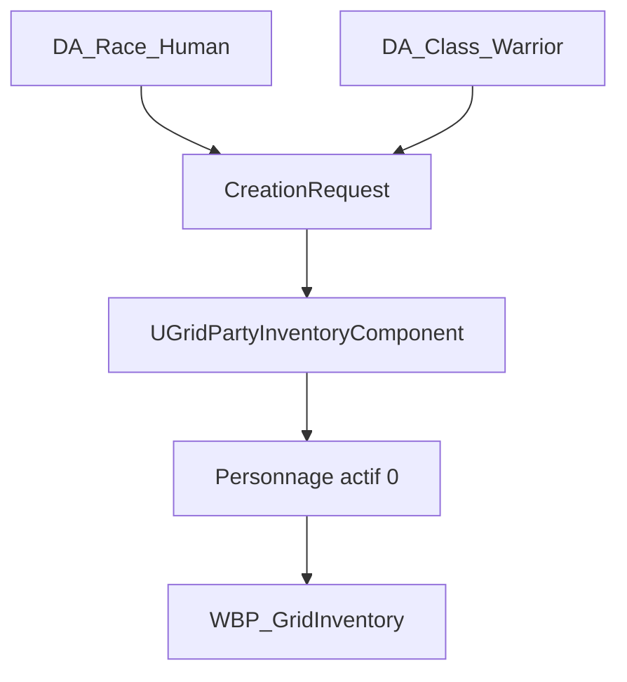

# Roadmap - Creation du premier personnage

## 1. Objet

Cette roadmap definit une premiere implementation simple de la creation de personnage au demarrage de **GrimrockPrototype**.

Elle s'appuie sur :

- `Docs/Rules/RPG_Core_Rules_v0_1.md` pour l'identite, la race, la classe, les six caracteristiques et les valeurs derivees ;
- `docs/Design/INVENTORY_AND_ITEM_OWNERSHIP_DESIGN.md` pour le groupe actif, le personnage selectionne, l'inventaire personnel, l'equipement et la charge.

Le premier objectif n'est pas de livrer tout le systeme JdR. Il est d'obtenir un flux vertical complet et testable :

```text
Nouveau jeu
-> Creation d'un personnage minimal
-> Validation
-> Entree dans le donjon
-> Personnage visible et selectionne dans l'Inventaire
-> Objets ramasses attribues a ce personnage
```

---

## 1.1 Convention de responsabilite

Chaque tranche distingue maintenant trois types de travail :

| Type | Responsable | Contenu |
|---|---|---|
| Implementation | ChatGPT / Codex | Analyse, C++, tests automatises, documentation et branche Git |
| Intervention UE5 | Utilisateur | Compilation UnrealHeaderTool, creation ou modification des `.uasset`, reglages Blueprint et Designer |
| Validation | Utilisateur avec assistance ChatGPT / Codex | Tests Automation, PIE, controle visuel et transmission des erreurs |

ChatGPT / Codex prepare les changements textuels et analyse les resultats. Les assets binaires Unreal et la validation dans l'editeur restent des operations humaines, sauf si un environnement Unreal automatise est explicitement disponible.

---

## 2. Etat actuel a conserver

Le code possede deja une base exploitable :

- `AGrimrockPartyPawn` contient `UGridPartyInventoryComponent` ;
- `BeginPlay()` appelle `InitializeDefaultPartyIfNeeded()` ;
- cette initialisation cree actuellement `Hero_01`, classe `Warrior`, niveau 1 et Force 10 ;
- `FGridCharacterInventoryState` contient deja l'identifiant, le nom, la classe, le niveau, la Force, la charge et les slots personnels ;
- `FGridPartyInventoryState` gere le personnage selectionne, le groupe actif, l'equipement et le `CursorItem` ;
- `WBP_GridInventory` sait afficher et selectionner les membres actifs ;
- `UGridPartyInventoryComponent` doit rester l'unique source de verite de l'inventaire et de l'ownership.

Le personnage technique `Hero_01` doit donc devenir le personnage cree par le joueur. Il ne faut pas creer un second systeme de groupe ou un inventaire parallele dans le Blueprint.

---

## 3. Perimetre du premier personnage jouable

### 3.1 Choix disponibles dans le premier jalon

| Champ | Premiere version |
|---|---|
| Nom | Saisi par le joueur, 1 a 24 caracteres |
| Portrait | Portrait par defaut ; choix ajoute ensuite |
| Race | `Human` uniquement |
| Classe | `Warrior` uniquement |
| Niveau | 1 |
| Experience | 0 |
| Caracteristiques | Profil fixe de guerrier |
| Inventaire | 40 slots personnels existants |
| Equipement initial | Aucun, ou set de depart dans une tranche separee |

Profil de depart recommande :

| Caracteristique | Valeur |
|---|---:|
| Force | 16 |
| Dexterite | 12 |
| Constitution | 14 |
| Intelligence | 10 |
| Sagesse | 10 |
| Charisme | 10 |

Ce choix permet de valider toute la chaine sans devoir equilibrer immediatement 36 combinaisons race/classe.

### 3.2 Valeurs derivees affichees

Pour ce premier jalon :

- PV maximum et actuels ;
- mana maximum et actuelle, meme si elle vaut 0 pour le guerrier ;
- modificateurs des six caracteristiques ;
- charge actuelle ;
- charge maximale, en conservant provisoirement `Force x 5` ;
- etat surcharge.

L'armure physique, l'armure magique, la precision, l'esquive et les resistances peuvent exister dans les donnees avec des valeurs par defaut, sans etre encore utilisees en combat.

### 3.3 Hors perimetre initial

- creation de plusieurs personnages au debut ;
- repartition libre de points ;
- changement d'apparence 3D ;
- competences, dons, sorts et capacites actives ;
- multiclassage ;
- progression de niveau ;
- sauvegarde complete ;
- equipement automatique complexe ;
- reserve ou auberge.

---

## 4. Architecture recommandee

### 4.1 Donnees de definition et donnees runtime

Les races et classes sont des definitions partagees. Elles doivent etre des DataAssets. Le personnage cree est une instance runtime et ne doit pas etre un DataAsset cree dynamiquement.



Fichiers proposes :

```text
Source/GrimrockPrototype/Public/RPG/
|-- RPGCharacterTypes.h
|-- RPGRaceAsset.h
`-- RPGClassAsset.h

Source/GrimrockPrototype/Private/RPG/
|-- RPGRaceAsset.cpp
`-- RPGClassAsset.cpp

Source/GrimrockPrototype/Public/UI/
`-- RPGCharacterCreationWidget.h

Source/GrimrockPrototype/Private/UI/
`-- RPGCharacterCreationWidget.cpp
```

Assets initiaux :

```text
Content/Grimrock/RPG/Races/DA_Race_Human
Content/Grimrock/RPG/Classes/DA_Class_Warrior
Content/Grimrock/UI/CharacterCreation/WBP_CharacterCreation
```

### 4.2 Structures minimales

```cpp
USTRUCT(BlueprintType)
struct FRPGAttributes
{
    GENERATED_BODY()

    int32 Strength = 10;
    int32 Dexterity = 10;
    int32 Constitution = 10;
    int32 Intelligence = 10;
    int32 Wisdom = 10;
    int32 Charisma = 10;
};

USTRUCT(BlueprintType)
struct FRPGDerivedStats
{
    GENERATED_BODY()

    int32 MaxHealth = 1;
    int32 CurrentHealth = 1;
    int32 MaxMana = 0;
    int32 CurrentMana = 0;
    int32 PhysicalArmor = 0;
    int32 MagicalArmor = 0;
};

USTRUCT(BlueprintType)
struct FRPGCharacterCreationRequest
{
    GENERATED_BODY()

    FText DisplayName;
    FName RaceId = TEXT("Human");
    FName ClassId = TEXT("Warrior");
    FRPGAttributes Attributes;
};
```

`FGridCharacterInventoryState` peut etre etendu pour le premier jalon avec :

- `RaceId` ;
- `Experience` ;
- `Attributes` ;
- `DerivedStats` ;
- une reference souple de portrait ;
- `bCreationCompleted` au niveau du groupe ou du personnage.

La Force ne doit pas rester durablement stockee deux fois. La propriete historique `Strength` doit etre migree vers `Attributes.Strength`, puis depreciee apres verification des Blueprints et assets serialises.

### 4.3 Calculs centralises

Les Blueprints ne calculent aucune statistique. Une fonction C++ centrale applique les definitions de race et de classe, borne les valeurs et recalcule les valeurs derivees.

API minimale proposee dans `UGridPartyInventoryComponent` :

```cpp
bool HasCompletedInitialCharacterCreation() const;
bool CreateInitialCharacter(const FRPGCharacterCreationRequest& Request);
bool GetSelectedCharacterDetails(FRPGCharacterDetails& OutDetails) const;
void RecalculateCharacterDerivedStats(int32 CharacterIndex);
```

`CreateInitialCharacter` doit etre une operation atomique : validation, creation ou remplacement du placeholder, initialisation de l'equipement, creation des slots, selection de l'index 0 et recalcul de la charge.

---

## 5. Flux au demarrage

1. `AGrimrockPartyPawn::BeginPlay()` initialise le composant, sans considerer `Hero_01` comme un personnage valide cree.
2. Si aucun personnage finalise n'existe, `WBP_CharacterCreation` est affiche en modal.
3. Les deplacements, rotations, interactions monde et ouverture du menu sont bloques pendant cette etape.
4. Le joueur saisit son nom et confirme le profil Humain/Guerrier.
5. Le widget envoie un `FRPGCharacterCreationRequest` au C++.
6. Le composant cree le personnage actif a l'index 0 et le selectionne.
7. L'interface de creation est fermee et le mode de jeu normal est restaure.
8. A l'ouverture de l'Inventaire, le nom, la race, la classe, le niveau, les caracteristiques, les PV, la mana et la charge proviennent du composant.

Le widget ne modifie jamais directement `PartyInventoryState`.

---

## 6. Roadmap par tranches

### Tranche CC0 - Contrat et tests de non-regression

**Etat : implementee dans le code, execution Unreal a valider.**

Objectif : figer le comportement existant avant d'etendre les donnees.

- ajouter des tests C++ sur l'initialisation d'un groupe vide ;
- verifier 1 personnage actif, index selectionne 0 et equipement aligne ;
- verifier l'ajout d'un objet au personnage selectionne ;
- verifier le calcul `Force x 5` et la surcharge ;
- verifier qu'un item conserve un seul owner.

Critere de sortie : l'inventaire actuel reste fonctionnel sans changement visuel.

Tests ajoutes dans `Private/Tests/GridPartyInventoryCC0Tests.cpp` :

- `DefaultPartyInitialization` ;
- `SelectedCharacterPickup` ;
- `CarryWeightAndOverload` ;
- `ExclusiveOwnershipFlow`.

### Tranche CC1 - Modele JdR minimal

**Etat : implementee dans le code, compilation Unreal et creation des DataAssets a valider.**

Checklist humaine detaillee : `docs/Design/CHARACTER_CREATION_CC1_UE5_CHECKLIST.md`.

| Responsable | Taches CC1 |
|---|---|
| ChatGPT / Codex | Types JdR, classes DataAsset, calculs centralises, migration de Force, tests et documentation |
| Utilisateur dans UE5 | Compiler, creer `DA_Race_Human` et `DA_Class_Warrior`, executer les tests et verifier le PIE |
| Hors CC1 | Ecran de creation, application runtime des DataAssets et affichage des nouvelles statistiques |

Objectif : representer proprement le personnage de niveau 1.

- creer `RPGCharacterTypes.h` ;
- ajouter race, experience, six caracteristiques et valeurs derivees ;
- creer `URPGRaceAsset` et `URPGClassAsset` minimaux ;
- creer `DA_Race_Human` et `DA_Class_Warrior` ;
- centraliser modificateurs, PV, mana et charge ;
- migrer la Force historique.

Critere de sortie : un test C++ construit un Humain/Guerrier valide avec les valeurs attendues.

Tests ajoutes dans `Private/Tests/RPGCharacterModelCC1Tests.cpp` :

- `AttributeModifiers` ;
- `HumanWarriorProfile` ;
- `LegacyStrengthMigration`.

Configuration UE5 attendue pour `DA_Race_Human` :

| Propriete | Valeur |
|---|---|
| `RaceId` | `Human` |
| `DisplayName` | `Humain` |
| `AttributeBonuses` | Force 1, Dexterite 1, Constitution 1, Intelligence 1, Sagesse 1, Charisme 1 |

Configuration UE5 attendue pour `DA_Class_Warrior` :

| Propriete | Valeur |
|---|---|
| `ClassId` | `Warrior` |
| `DisplayName` | `Guerrier` |
| `BaseAttributes` | Force 15, Dexterite 11, Constitution 13, Intelligence 9, Sagesse 9, Charisme 9 |
| `HealthAtLevelOne` | 18 |
| `HealthPerLevel` | 8 |
| `ManaAtLevelOne` | 0 |
| `ManaPerLevel` | 0 |
| `BasePhysicalArmor` | 0 |
| `BaseMagicalArmor` | 0 |

Le profil combine obtenu est `16 / 12 / 14 / 10 / 10 / 10`, avec 20 PV au niveau 1 apres application du modificateur de Constitution.

### Tranche CC2 - API de creation atomique

**Etat : implementee dans le code, compilation Unreal et tests Automation a valider.**

Checklist humaine detaillee : `docs/Design/CHARACTER_CREATION_CC2_UE5_CHECKLIST.md`.

| Responsable | Taches CC2 |
|---|---|
| ChatGPT / Codex | Requete, etat de finalisation, validation, creation atomique, restauration, tests et documentation |
| Utilisateur dans UE5 | Compiler, conserver les DataAssets CC1, executer les dix tests et verifier le PIE |
| Hors CC2 | Widget UMG, blocage des controles et appel de l'API au demarrage |

Objectif : remplacer le placeholder technique de maniere sure.

- ajouter `FRPGCharacterCreationRequest` ;
- ajouter `CreateInitialCharacter` ;
- valider nom, race, classe et bornes 6-20 ;
- refuser un second appel apres finalisation ;
- initialiser exactement 1 personnage, 1 equipement et 40 slots ;
- selectionner l'index 0 ;
- conserver `CursorItem` vide ;
- restaurer l'etat precedent si le diagnostic d'ownership echoue.

Tests ajoutes dans `Private/Tests/RPGCharacterCreationCC2Tests.cpp` :

- `CreateInitialCharacter` ;
- `RejectInvalidRequestAtomically` ;
- `RejectSecondCreation`.

Critere de sortie : l'API cree un personnage coherent sans mutation partielle et les dix tests CC0, CC1 et CC2 sont verts.

### Tranche CC3 - Ecran de creation minimal

Objectif : permettre au joueur de creer le personnage au lancement.

Contenu de `WBP_CharacterCreation` :

- champ `EditableTextBox_Name` ;
- portrait Humain/Guerrier par defaut ;
- libelles Race et Classe ;
- six caracteristiques en lecture seule ;
- PV, mana et charge en apercu ;
- bouton `Button_CreateCharacter` ;
- message de validation localise.

Critere de sortie : un nouveau PIE ne permet pas de se deplacer avant validation et entre ensuite normalement dans le donjon.

### Tranche CC4 - Integration a l'Inventaire

Objectif : rendre le personnage cree visible dans l'interface existante.

- enrichir `FGridInventoryCharacterSummary` ;
- afficher au minimum nom, classe et niveau dans `WBP_PartyMember` ;
- afficher race, experience, six caracteristiques, PV, mana et charge dans la zone centrale ;
- conserver les slots generes, le drag and drop et les mains existantes ;
- rafraichir l'UI depuis `RefreshInventory()` uniquement.

Critere de sortie : les valeurs de creation et celles de l'Inventaire sont identiques, sans copie Blueprint.

### Tranche CC5 - Persistance minimale de nouvelle partie

Objectif : ne plus recreer le personnage a chaque chargement.

- ajouter un objet `USaveGame` versionne ;
- sauvegarder l'identite et les donnees JdR du personnage ;
- sauvegarder `PartyInventoryState`, equipement et ownership ;
- distinguer clairement `New Game` et `Continue` ;
- rouvrir la creation seulement si aucun personnage finalise n'est charge.

Cette tranche peut suivre CC4, mais elle devient obligatoire avant toute vraie boucle de progression.

### Tranche CC6 - Extension des choix

Objectif : ouvrir progressivement les regles v0.1.

Ordre recommande :

1. ajouter les cinq autres races sous forme de DataAssets ;
2. ajouter les cinq autres classes sous forme de DataAssets ;
3. ajouter le choix de portrait ;
4. ajouter une repartition de points avec budget et bouton Reinitialiser ;
5. ajouter l'equipement de depart defini par la classe ;
6. ajouter competences, dons et sorts de niveau 1.

Chaque ajout doit reutiliser `CreateInitialCharacter` et ne pas modifier l'ownership des objets.

---

## 7. Tests d'acceptation du MVP

| Test | Resultat attendu |
|---|---|
| Nouveau PIE sans personnage | Ecran de creation affiche |
| Nom vide | Validation refusee |
| Nom valide | Un seul personnage est cree |
| Validation | Mouvement et interaction redeviennent actifs |
| Ouverture Inventaire | Le personnage cree apparait a gauche et au centre |
| Caracteristiques | 16, 12, 14, 10, 10, 10 |
| Charge maximale | 80 avec la formule actuelle |
| Ramassage d'une torche | Ownership `CharacterInventory`, personnage 0 |
| Equipement de la torche | Ownership `EquipmentSlot`, personnage 0 |
| Retour au curseur | Ownership `Cursor`, sans duplication |
| Rafraichissement UI | Aucun second personnage ni slot manuel n'est cree |

---

## 8. Points de vigilance

- ne pas creer un `Actor` monde par personnage : le groupe reste porte par `AGrimrockPartyPawn` ;
- ne pas mettre les statistiques dans `WBP_CharacterCreation` ou `WBP_GridInventory` ;
- ne pas faire du DataAsset de race ou de classe le proprietaire des valeurs runtime comme les PV actuels ;
- ne pas utiliser le nom comme identifiant : conserver le `FGuid` ;
- ne pas supposer que le groupe contiendra toujours six personnages ;
- garder les tableaux personnage/equipement strictement alignes tant que cette architecture existe ;
- versionner la sauvegarde avant de faire evoluer fortement les structures serialisees ;
- conserver le curseur custom et le routage d'input deja valides par l'Inventaire.

---

## 9. Definition de fini du premier jalon

Le premier jalon est termine lorsque le joueur peut lancer une nouvelle partie, nommer un Humain/Guerrier de niveau 1, valider sa creation, entrer dans le donjon et retrouver exactement ce personnage dans l'onglet Inventaire avec ses caracteristiques, ses PV, sa mana, sa charge, son inventaire personnel et son equipement.

Le ramassage, le transfert au curseur et l'equipement d'un objet doivent continuer a respecter l'ownership exclusif existant.
