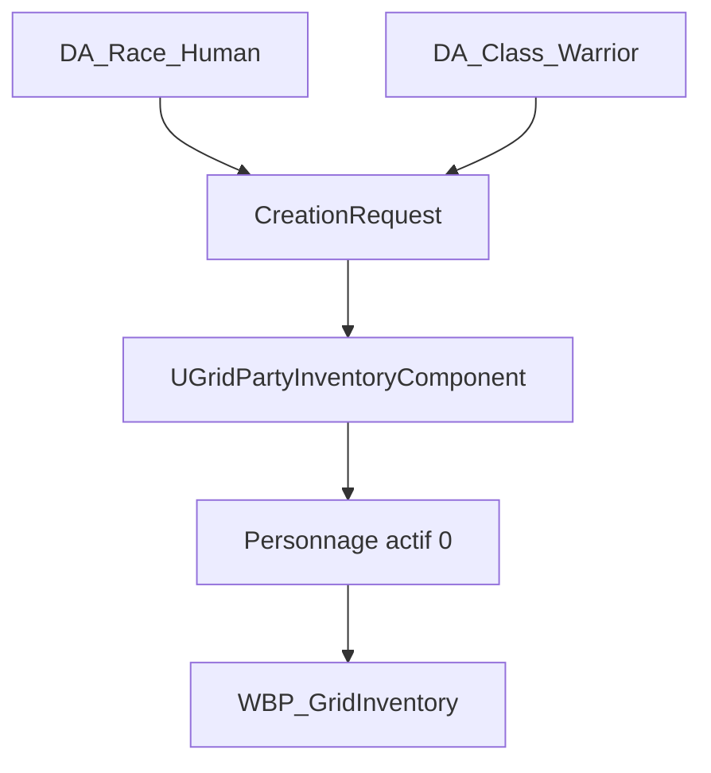

# Roadmap - Création du premier personnage

## 1. Objet

Cette roadmap définit une première implémentation simple de la création de personnage au démarrage de **GrimrockPrototype**.

Elle s'appuie sur :

- `Docs/Rules/RPG_Core_Rules_v0_1.md` pour l'identité, la race, la classe, les six caractéristiques et les valeurs dérivées ;
- `docs/Design/INVENTORY_AND_ITEM_OWNERSHIP_DESIGN.md` pour le groupe actif, le personnage sélectionné, l'inventaire personnel, l'équipement et la charge.

Le premier objectif n'est pas de livrer tout le système JdR. Il est d'obtenir un flux vertical complet et testable :

```text
Nouveau jeu
-> Création d'un personnage minimal
-> Validation
-> Entrée dans le donjon
-> Personnage visible et sélectionné dans l'Inventaire
-> Objets ramassés attribués à ce personnage
```

---

## 1.1 Convention de responsabilité

Chaque tranche distingue maintenant trois types de travail :

| Type | Responsable | Contenu |
|---|---|---|
| Implémentation | ChatGPT / Codex | Analyse, C++, tests automatisés, documentation et branche Git |
| Intervention UE5 | Utilisateur | Compilation UnrealHeaderTool, création ou modification des `.uasset`, réglages Blueprint et Designer |
| Validation | Utilisateur avec assistance ChatGPT / Codex | Tests Automation, PIE, contrôle visuel et transmission des erreurs |

ChatGPT / Codex prépare les changements textuels et analyse les résultats. Les assets binaires Unreal et la validation dans l'éditeur restent des opérations humaines, sauf si un environnement Unreal automatisé est explicitement disponible.

---

## 2. État actuel à conserver

Le code possède déjà une base exploitable :

- `AGrimrockPartyPawn` contient `UGridPartyInventoryComponent` ;
- `BeginPlay()` appelle `InitializeDefaultPartyIfNeeded()` ;
- cette initialisation crée actuellement `Hero_01`, classe `Warrior`, niveau 1 et Force 10 ;
- `FGridCharacterInventoryState` contient déjà l'identifiant, le nom, la classe, le niveau, la Force, la charge et les slots personnels ;
- `FGridPartyInventoryState` gere le personnage sélectionné, le groupe actif, l'équipement et le `CursorItem` ;
- `WBP_GridInventory` sait afficher et sélectionner les membres actifs ;
- `UGridPartyInventoryComponent` doit rester l'unique source de verite de l'inventaire et de l'ownership.

Le personnage technique `Hero_01` doit donc devenir le personnage créé par le joueur. Il ne faut pas créer un second système de groupe ou un inventaire parallèle dans le Blueprint.

---

## 3. Périmètre du premier personnage jouable

### 3.1 Choix disponibles dans le premier jalon

| Champ | Première version |
|---|---|
| Nom | Saisi par le joueur, 1 à 24 caractères |
| Portrait | Portrait par défaut ; choix ajouté ensuite |
| Race | `Human` uniquement |
| Classe | `Warrior` uniquement |
| Niveau | 1 |
| Experience | 0 |
| Caractéristiques | Profil fixe de guerrier |
| Inventaire | 40 slots personnels existants |
| Équipement initial | Aucun, ou set de départ dans une tranche séparée |

Profil de départ recommandé :

| Caractéristique | Valeur |
|---|---:|
| Force | 16 |
| Dexterite | 12 |
| Constitution | 14 |
| Intelligence | 10 |
| Sagesse | 10 |
| Charisme | 10 |

Ce choix permet de valider toute la chaîne sans devoir équilibrer immédiatement 36 combinaisons race/classe.

### 3.2 Valeurs dérivées affichées

Pour ce premier jalon :

- PV maximum et actuels ;
- mana maximum et actuelle, même si elle vaut 0 pour le guerrier ;
- modificateurs des six caractéristiques ;
- charge actuelle ;
- charge maximale, en conservant provisoirement `Force x 5` ;
- etat surcharge.

L'armure physique, l'armure magique, la précision, l'esquive et les résistances peuvent exister dans les données avec des valeurs par défaut, sans être encore utilisées en combat.

### 3.3 Hors périmètre initial

- création de plusieurs personnages au début ;
- répartition libre de points ;
- changement d'apparence 3D ;
- compétences, dons, sorts et capacités actives ;
- multiclassage ;
- progression de niveau ;
- sauvegarde complète ;
- équipement automatique complexe ;
- réserve ou auberge.

---

## 4. Architecture recommandée

### 4.1 Données de définition et données runtime

Les races et classes sont des définitions partagées. Elles doivent être des DataAssets. Le personnage créé est une instance runtime et ne doit pas être un DataAsset créé dynamiquement.



Fichiers proposes :

```text
Source/GrimrockPrototype/Public/RPG/
|-- RPGCharacterTypes.h
|-- RPGRaceAsset.h
`-- RPGClassAsset.h

Source/GrimrockPrototype/Private/RPG/
|-- RPGRaceAsset.cpp
`-- RPGClassAsset.cpp

Source/GrimrockPrototype/Public/UI/
`-- RPGCharacterCreationWidget.h

Source/GrimrockPrototype/Private/UI/
`-- RPGCharacterCreationWidget.cpp
```

Assets initiaux :

```text
Content/Grimrock/RPG/Races/DA_Race_Human
Content/Grimrock/RPG/Classes/DA_Class_Warrior
Content/Grimrock/UI/CharacterCreation/WBP_CharacterCreation
```

### 4.2 Structures minimales

```cpp
USTRUCT(BlueprintType)
struct FRPGAttributes
{
    GENERATED_BODY()

    int32 Strength = 10;
    int32 Dexterity = 10;
    int32 Constitution = 10;
    int32 Intelligence = 10;
    int32 Wisdom = 10;
    int32 Charisma = 10;
};

USTRUCT(BlueprintType)
struct FRPGDerivedStats
{
    GENERATED_BODY()

    int32 MaxHealth = 1;
    int32 CurrentHealth = 1;
    int32 MaxMana = 0;
    int32 CurrentMana = 0;
    int32 PhysicalArmor = 0;
    int32 MagicalArmor = 0;
};

USTRUCT(BlueprintType)
struct FRPGCharacterCreationRequest
{
    GENERATED_BODY()

    FText DisplayName;
    TObjectPtr<URPGRaceAsset> RaceDefinition;
    TObjectPtr<URPGClassAsset> ClassDefinition;
    TSoftObjectPtr<UTexture2D> Portrait;
};
```

`FGridCharacterInventoryState` peut être étendu pour le premier jalon avec :

- `RaceId` ;
- `Experience` ;
- `Attributes` ;
- `DerivedStats` ;
- une référence souple de portrait ;
- `bInitialCharacterCreationCompleted` au niveau du groupe.

La Force ne doit pas rester durablement stockée deux fois. La propriété historique `Strength` doit être migrée vers `Attributes.Strength`, puis dépréciée après vérification des Blueprints et assets sérialisés.

### 4.3 Calculs centralisés

Les Blueprints ne calculent aucune statistique. Une fonction C++ centrale applique les définitions de race et de classe, borne les valeurs et recalcule les valeurs dérivées.

API minimale proposée dans `UGridPartyInventoryComponent` :

```cpp
bool HasCompletedInitialCharacterCreation() const;
bool CreateInitialCharacter(const FRPGCharacterCreationRequest& Request, FText& OutError);
bool GetSelectedCharacterDetails(FRPGCharacterDetails& OutDetails) const;
void RecalculateCharacterDerivedStats(int32 CharacterIndex);
```

`CreateInitialCharacter` doit être une opération atomique : validation, création ou remplacement du placeholder, initialisation de l'équipement, création des slots, sélection de l'index 0 et recalcul de la charge.

---

## 5. Flux au démarrage

1. `AGrimrockPartyPawn::BeginPlay()` initialise le composant, sans considérer `Hero_01` comme un personnage valide créé.
2. Si aucun personnage finalisé n'existe, `WBP_CharacterCreation` est affiché en modal.
3. Les déplacements, rotations, interactions monde et ouverture du menu sont bloqués pendant cette étape.
4. Le joueur saisit son nom et confirme le profil Humain/Guerrier.
5. Le widget envoie un `FRPGCharacterCreationRequest` au C++.
6. Le composant crée le personnage actif à l'index 0 et le sélectionne.
7. L'interface de création est fermée et le mode de jeu normal est restauré.
8. À l'ouverture de l'Inventaire, le nom, la race, la classe, le niveau, les caractéristiques, les PV, la mana et la charge proviennent du composant.

Le widget ne modifie jamais directement `PartyInventoryState`.

---

## 6. Roadmap par tranches

### Tranche CC0 - Contrat et tests de non-régression

**État : implémentée dans le code, exécution Unreal à valider.**

Objectif : figer le comportement existant avant d'etendre les données.

- ajouter des tests C++ sur l'initialisation d'un groupe vide ;
- vérifier 1 personnage actif, index sélectionné 0 et équipement aligné ;
- vérifier l'ajout d'un objet au personnage sélectionné ;
- vérifier le calcul `Force x 5` et la surcharge ;
- vérifier qu'un item conserve un seul owner.

Critère de sortie : l'inventaire actuel reste fonctionnel sans changement visuel.

Tests ajoutés dans `Private/Tests/GridPartyInventoryCC0Tests.cpp` :

- `DefaultPartyInitialization` ;
- `SelectedCharacterPickup` ;
- `CarryWeightAndOverload` ;
- `ExclusiveOwnershipFlow`.

### Tranche CC1 - Modèle JdR minimal

**État : implémentée dans le code, compilation Unreal et création des DataAssets à valider.**

Checklist humaine détaillée : `docs/Design/CHARACTER_CREATION_CC1_UE5_CHECKLIST.md`.

| Responsable | Tâches CC1 |
|---|---|
| ChatGPT / Codex | Types JdR, classes DataAsset, calculs centralisés, migration de Force, tests et documentation |
| Utilisateur dans UE5 | Compiler, créer `DA_Race_Human` et `DA_Class_Warrior`, exécuter les tests et vérifier le PIE |
| Hors CC1 | Écran de création, application runtime des DataAssets et affichage des nouvelles statistiques |

Objectif : representer proprement le personnage de niveau 1.

- créer `RPGCharacterTypes.h` ;
- ajouter race, expérience, six caractéristiques et valeurs dérivées ;
- créer `URPGRaceAsset` et `URPGClassAsset` minimaux ;
- créer `DA_Race_Human` et `DA_Class_Warrior` ;
- centraliser modificateurs, PV, mana et charge ;
- migrer la Force historique.

Critère de sortie : un test C++ construit un Humain/Guerrier valide avec les valeurs attendues.

Tests ajoutés dans `Private/Tests/RPGCharacterModelCC1Tests.cpp` :

- `AttributeModifiers` ;
- `HumanWarriorProfile` ;
- `LegacyStrengthMigration`.

Configuration UE5 attendue pour `DA_Race_Human` :

| Propriété | Valeur |
|---|---|
| `RaceId` | `Human` |
| `DisplayName` | `Humain` |
| `AttributeBonuses` | Force 1, Dexterite 1, Constitution 1, Intelligence 1, Sagesse 1, Charisme 1 |

Configuration UE5 attendue pour `DA_Class_Warrior` :

| Propriété | Valeur |
|---|---|
| `ClassId` | `Warrior` |
| `DisplayName` | `Guerrier` |
| `BaseAttributes` | Force 15, Dexterite 11, Constitution 13, Intelligence 9, Sagesse 9, Charisme 9 |
| `HealthAtLevelOne` | 18 |
| `HealthPerLevel` | 8 |
| `ManaAtLevelOne` | 0 |
| `ManaPerLevel` | 0 |
| `BasePhysicalArmor` | 0 |
| `BaseMagicalArmor` | 0 |

Le profil combiné obtenu est `16 / 12 / 14 / 10 / 10 / 10`, avec 20 PV au niveau 1 après application du modificateur de Constitution.

### Tranche CC2 - API de création atomique

**État : implémentée dans le code, compilation Unreal et tests Automation à valider.**

Checklist humaine détaillée : `docs/Design/CHARACTER_CREATION_CC2_UE5_CHECKLIST.md`.

| Responsable | Tâches CC2 |
|---|---|
| ChatGPT / Codex | Requête, etat de finalisation, validation, création atomique, restauration, tests et documentation |
| Utilisateur dans UE5 | Compiler, conserver les DataAssets CC1, exécuter les dix tests et vérifier le PIE |
| Hors CC2 | Widget UMG, blocage des contrôles et appel de l'API au démarrage |

Objectif : remplacer le placeholder technique de manière sure.

- ajouter `FRPGCharacterCreationRequest` ;
- ajouter `CreateInitialCharacter` ;
- valider nom, race, classe et bornes 6-20 ;
- refuser un second appel après finalisation ;
- initialiser exactement 1 personnage, 1 équipement et 40 slots ;
- sélectionner l'index 0 ;
- conserver `CursorItem` vide ;
- restaurer l'etat précédent si le diagnostic d'ownership échoue.

Tests ajoutés dans `Private/Tests/RPGCharacterCreationCC2Tests.cpp` :

- `CreateInitialCharacter` ;
- `RejectInvalidRequestAtomically` ;
- `RejectSecondCreation`.

Critère de sortie : l'API crée un personnage cohérent sans mutation partielle et les dix tests CC0, CC1 et CC2 sont verts.

### Tranche CC3 - Écran de création minimal

**État : implémentée dans le code, construction UMG et validation PIE à effectuer.**

Checklist humaine détaillée : `docs/Design/CHARACTER_CREATION_CC3_UE5_CHECKLIST.md`.

| Responsable | Tâches CC3 |
|---|---|
| ChatGPT / Codex | Widget natif, aperçu, soumission CC2, ouverture modale, blocage des contrôles et documentation |
| Utilisateur dans UE5 | Créer `WBP_CharacterCreation`, nommer les widgets, assigner les DataAssets et tester le PIE |
| Hors CC3 | Affichage détaillé dans l'Inventaire, sauvegarde et choix de plusieurs races ou classes |

Objectif : permettre au joueur de créer le personnage au lancement.

Contenu de `WBP_CharacterCreation` :

- champ `EditableTextBox_Name` ;
- portrait Humain/Guerrier par défaut ;
- libellés Race et Classe ;
- six caractéristiques en lecture seule ;
- PV, mana et charge en aperçu ;
- bouton `Button_CreateCharacter` ;
- message de validation localisé.

Le Graph Blueprint ne contient aucun calcul ni événement de validation : les bindings, l'aperçu et l'appel à `CreateInitialCharacter()` sont natifs.

Critère de sortie : un nouveau PIE bloque le jeu sur l'écran de création, puis restaure les contrôles après une validation réussie.

### Tranche CC4 - Intégration à l'Inventaire

Objectif : rendre le personnage créé visible dans l'interface existante.

- enrichir `FGridInventoryCharacterSummary` ;
- afficher au minimum nom, classe et niveau dans `WBP_PartyMember` ;
- afficher race, expérience, six caractéristiques, PV, mana et charge dans la zone centrale ;
- conserver les slots générés, le drag and drop et les mains existantes ;
- rafraîchir l'UI depuis `RefreshInventory()` uniquement.

Critère de sortie : les valeurs de création et celles de l'Inventaire sont identiques, sans copie Blueprint.

### Tranche CC5 - Persistance minimale de nouvelle partie

Objectif : ne plus recréer le personnage à chaque chargement.

- ajouter un objet `USaveGame` versionné ;
- sauvegarder l'identité et les données JdR du personnage ;
- sauvegarder `PartyInventoryState`, équipement et ownership ;
- distinguer clairement `New Game` et `Continue` ;
- rouvrir la création seulement si aucun personnage finalisé n'est chargé.

Cette tranche peut suivre CC4, mais elle devient obligatoire avant toute vraie boucle de progression.

### Tranche CC6 - Extension des choix

Objectif : ouvrir progressivement les règles v0.1.

Ordre recommandé :

1. ajouter les cinq autres races sous forme de DataAssets ;
2. ajouter les cinq autres classes sous forme de DataAssets ;
3. ajouter le choix de portrait ;
4. ajouter une répartition de points avec budget et bouton Réinitialiser ;
5. ajouter l'équipement de départ défini par la classe ;
6. ajouter compétences, dons et sorts de niveau 1.

Chaque ajout doit réutiliser `CreateInitialCharacter` et ne pas modifier l'ownership des objets.

---

## 7. Tests d'acceptation du MVP

| Test | Résultat attendu |
|---|---|
| Nouveau PIE sans personnage | Écran de création affiché |
| Nom vide | Validation refusée |
| Nom valide | Un seul personnage est créé |
| Validation | Mouvement et interaction redeviennent actifs |
| Ouverture Inventaire | Le personnage créé apparaît à gauche et au centre |
| Caractéristiques | 16, 12, 14, 10, 10, 10 |
| Charge maximale | 80 avec la formule actuelle |
| Ramassage d'une torche | Ownership `CharacterInventory`, personnage 0 |
| Équipement de la torche | Ownership `EquipmentSlot`, personnage 0 |
| Retour au curseur | Ownership `Cursor`, sans duplication |
| Rafraîchissement UI | Aucun second personnage ni slot manuel n'est créé |

---

## 8. Points de vigilance

- ne pas créer un `Actor` monde par personnage : le groupe reste porté par `AGrimrockPartyPawn` ;
- ne pas mettre les statistiques dans `WBP_CharacterCreation` ou `WBP_GridInventory` ;
- ne pas faire du DataAsset de race ou de classe le propriétaire des valeurs runtime comme les PV actuels ;
- ne pas utiliser le nom comme identifiant : conserver le `FGuid` ;
- ne pas supposer que le groupe contiendra toujours six personnages ;
- garder les tableaux personnage/équipement strictement alignés tant que cette architecture existe ;
- versionner la sauvegarde avant de faire évoluer fortement les structures serialisees ;
- conserver le curseur custom et le routage d'input déjà validés par l'Inventaire.

---

## 9. Définition de fini du premier jalon

Le premier jalon est terminé lorsque le joueur peut lancer une nouvelle partie, nommer un Humain/Guerrier de niveau 1, valider sa création, entrer dans le donjon et retrouver exactement ce personnage dans l'onglet Inventaire avec ses caractéristiques, ses PV, sa mana, sa charge, son inventaire personnel et son équipement.

Le ramassage, le transfert au curseur et l'équipement d'un objet doivent continuer à respecter l'ownership exclusif existant.
