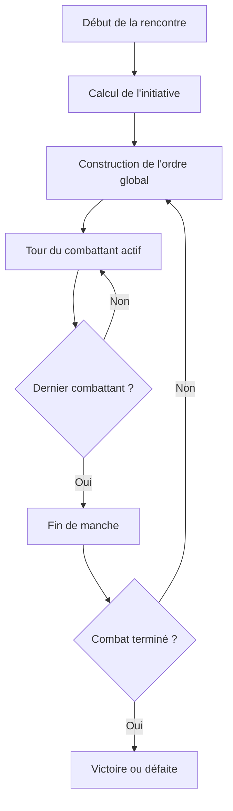
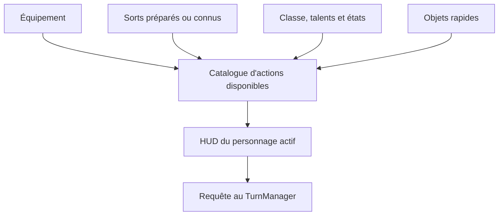
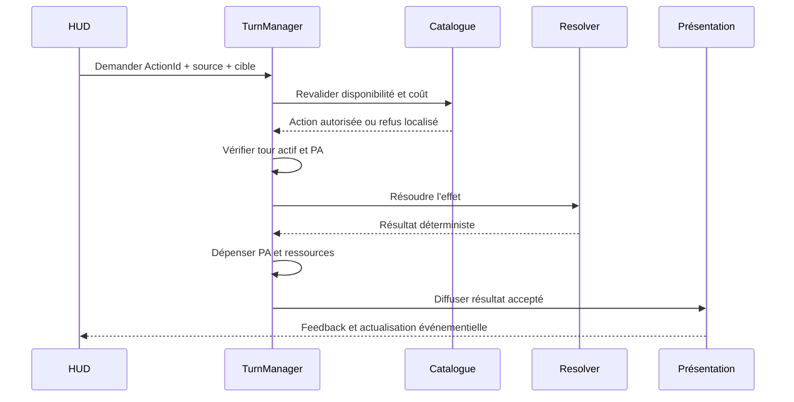
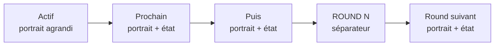

# Combat V2 — Manches, initiative, points d'action et catalogue d'actions

## Statut

Ce document définit la cible de conception proposée le 1er août 2026 avant
la poursuite de MON12.

Il prend le pas sur la feuille de route qui annonçait directement :

- MON12.3 : quatre panneaux de personnages ;
- MON12.4 : panneau des sorts.

Ces deux résultats restent souhaités, mais doivent être construits après la
fondation des tours individuels, des points d'action, de l'initiative globale,
du déplacement du groupe et du catalogue d'actions.

MON11.1 à MON11.4.2 et MON12.1 à MON12.4 restent des jalons fonctionnels. Leur
pipeline de résolution et de présentation doit être conservé pendant la
migration.

MON12.5 est implémentée : les personnages et monstres sont mélangés dans un
ordre global, un seul combattant est actif et les personnages reçoivent leurs
`4 PA` au début de leur propre tour. Les attaques existantes coûtent `2 PA` ;
les translations coûtent `1 PA + 1 PAM` sur une réserve commune de `2 PAM`
restaurée à chaque manche. Les rotations de 90 degrés restent gratuites.

---

## 1. Problème à résoudre

Le combat actuel possède déjà plusieurs briques utiles :

- un cycle global de tours individuels suivi de `EndingRound` ;
- une initiative commune lancée une fois par rencontre ;
- un budget de PA pour chaque monstre ;
- des coûts d'action pour leurs déplacements et leurs attaques ;
- un pipeline autoritaire pour les attaques du groupe ;
- un état runtime et un budget de PA indépendant pour chaque personnage ;
- un premier panneau qui représente directement `MainHand` et `OffHand`.

Ces règles ne forment toutefois pas encore un système unifié :

| Sujet | État actuel | Limite |
| --- | --- | --- |
| monstres | budget de PA réel et tour global | catalogue d'actions encore spécialisé dans l'IA |
| personnages | 4 PA au début du tour, attaques à 2 PA | actions encore représentées par les mains |
| initiative | ordre commun personnages/monstres | barre UMG différée à MON12.7 |
| déplacement du groupe | `1 PA + 1 PAM`, réserve commune de `2 PAM` | modificateurs de mobilité différés |
| interface | boutons `MainHand` et `OffHand` | confond équipement et actions |
| sorts et capacités | différés | aucun catalogue commun |

La cible V2 doit utiliser les mêmes concepts pour le groupe et les monstres,
tout en respectant la particularité essentielle de GrimrockPrototype : les
quatre personnages partagent une caméra, une orientation et une seule cellule.

---

## 2. Comparaison des trois inspirations

### 2.1 Synthèse

| Jeu ou règles | Économie d'actions | Initiative | Apport utile | Limite pour GrimrockPrototype |
| --- | --- | --- | --- | --- |
| *Divinity: Original Sin 2* | PA consommés par les déplacements, attaques, compétences et objets | ordre individuel avec alternance de camps | langage unique et très lisible pour toutes les actions | ses personnages se déplacent séparément ; notre groupe partage une cellule |
| *Pillars of Eternity* en tour par tour | action principale, mouvement et actions gratuites encadrées ; la version 2026 valorise fortement la vitesse | fréquence des tours influencée par l'initiative et la récupération | excellente lisibilité des actions disponibles et des actions gratuites limitées | plusieurs tours par manche selon la vitesse compliqueraient fortement l'équilibrage |
| *Pathfinder* | action standard, action de mouvement, action rapide et actions libres ; variante *Unchained* à trois actes | initiative globale, généralement lancée au début du combat | définition claire de `manche`, `tour`, ordre et réactions | catégories plus rigides qu'un budget numérique de PA |

### 2.2 Conclusion

Si un seul modèle devait être retenu, **DOS2 serait le plus adapté** parce que
la demande centrale porte sur des PA dépensés aussi bien pour agir que pour se
déplacer.

Une copie intégrale de DOS2 ne serait cependant pas adaptée. La cible retenue
est donc :

- économie de PA inspirée de DOS2 ;
- manche et initiative globale inspirées de Pathfinder ;
- catalogue d'actions, feedback et limitation des actions gratuites inspirés
  de Pillars ;
- règle de mobilité propre à GrimrockPrototype pour le groupe occupant une
  cellule unique.

Le système ne reprend pas :

- les tours multiples par manche fondés sur la vitesse de Pillars ;
- les catégories rigides `Standard / Move / Swift` de Pathfinder ;
- le déplacement indépendant des quatre héros de DOS2 ;
- une alternance forcée allié/ennemi qui diminuerait trop la valeur de
  l'initiative globale.

---

## 3. Vocabulaire autoritaire

### Rencontre

Une rencontre commence quand le TurnManager démarre le combat et se termine
par victoire, défaite ou abandon.

### Manche — `Round`

Une manche est un cycle pendant lequel chaque combattant vivant et capable
d'agir reçoit au maximum un tour.

Une manche n'est pas une phase de camp. Elle peut contenir des tours de
personnages et de monstres mélangés par l'initiative.

### Tour — `CombatantTurn`

Un tour est l'activation d'un seul combattant. Pendant son tour, ce combattant
dépense ses PA jusqu'à :

- choisir `Fin du tour` ;
- ne plus avoir de PA ;
- ne plus pouvoir accomplir aucune action ;
- être vaincu ou neutralisé.

### Action

Une action est une commande de combat décrite par une définition orientée
données : attaque, sort, capacité, déplacement, défense, consommation d'un
objet ou interaction.

### Phase

Les phases deviennent des états techniques du combat, et non des tours
complets de camp :

```text
Exploration
StartingCombat
RoundActive
EndingRound
Victory / Defeat
```

Le camp du combattant actif est porté par l'état du tour. Les valeurs actuelles
`PlayerPhase` et `EnemyPhase` restent temporairement nécessaires pendant la
migration, mais ne constituent plus la cible finale.

---

## 4. Cycle cible d'une rencontre



Règles :

1. l'initiative est déterminée au début de la rencontre ;
2. l'ordre est global : personnages et monstres peuvent être intercalés ;
3. chaque combattant reçoit un seul tour par manche ;
4. un combattant vaincu avant son tour est ignoré ;
5. les nouveaux participants rejoignent l'ordre à la manche suivante, sauf
   règle explicite ;
6. `EndingRound` applique les expirations, dégâts périodiques et restaurations
   de ressources prévus ;
7. la manche suivante reprend le même ordre tant qu'aucune règle explicite ne
   modifie l'initiative.

---

## 5. Initiative

### 5.1 Formule proposée

L'initiative est calculée une fois par rencontre avec un jet par combattant.
`InitiativeRandomStream` est dérivé de `ActiveEncounterRandomSeed` avec un sel
fixe. Cette séparation préserve la détermination de l'ordre sans déplacer les
jets ultérieurs d'attaque du `CombatRandomStream`.

Pour un personnage :

```text
InitiativeBasePersonnage
    = 10
    + modificateur de Dextérité
    + bonus explicites de classe, équipement et effets

InitiativeTotale
    = d20 de rencontre
    + InitiativeBasePersonnage
```

Le code actuel place le modificateur de Dextérité dans
`FRPGDerivedStats::Initiative`. Pendant la première migration, la formule peut
donc utiliser :

```text
10 + DerivedStats.Initiative
```

Pour un monstre :

```text
InitiativeTotale
    = d20 de rencontre
    + MonsterDefinition.Initiative
    + modificateurs d'effets
```

Cette convention rend comparable le Rat géant actuel à initiative 12 avec un
personnage moyen dont la base vaut 10.

### 5.2 Départage

En cas d'égalité :

1. initiative de base la plus élevée ;
2. Dextérité finale la plus élevée pour un personnage ;
3. identifiant persistant ou `CharacterId` dans l'ordre lexical.

Le départage doit être déterministe et testable.

### 5.3 Pourquoi l'initiative ne donne pas de PA

La Dextérité contribue déjà à l'initiative, à la précision et à l'évasion dans
le modèle actuel. Lui faire aussi augmenter directement les PA rendrait cette
caractéristique dominante : agir plus tôt **et** agir davantage est beaucoup
plus puissant qu'un simple bonus numérique.

L'initiative détermine donc **quand** un combattant agit. Les PA déterminent
**combien** il peut accomplir pendant son tour.

---

## 6. Points d'action personnels

### 6.1 Personnages

Chaque personnage vivant reçoit par défaut :

```text
4 PA au début de son tour
```

Formule cible :

```text
PA maximum
    = Clamp(
        4
        + bonus explicites de talent, classe ou effet
        - pénalités explicites,
        2,
        6)
```

Principes d'équilibrage :

- aucune caractéristique n'ajoute directement des PA ;
- le niveau n'ajoute pas automatiquement des PA ;
- toutes les classes commencent avec la même économie de base ;
- `Hâte`, `Adrénaline` ou un talent spécialisé peuvent exceptionnellement
  ajouter 1 PA ;
- `Lenteur` peut retirer 1 PA ;
- étourdissement, sommeil ou incapacité peuvent supprimer le tour entier ;
- les bonus permanents de PA doivent rester rares ;
- les PA non dépensés ne sont pas reportés à la manche suivante.

Le report automatique des PA, tel qu'il existe dans DOS2, est écarté pour le
premier système. Il favorise l'accumulation et augmente les possibilités de
tour explosif. Une future action `Préparer` pourra convertir explicitement des
PA en réaction sans créer un report général.

### 6.2 Monstres

`UGridMonsterDefinitionAsset::ActionPointsPerTurn` reste l'autorité des PA
d'un monstre.

La plage recommandée devient :

| Profil | PA typiques |
| --- | ---: |
| lent ou mineur | 2 |
| standard | 3 ou 4 |
| rapide ou élite | 5 |
| exceptionnel | 6 maximum |

Il n'est pas nécessaire que tous les monstres aient quatre PA. Leur DataAsset
peut représenter directement leur rythme tactique.

### 6.3 Coûts initiaux recommandés

| Action | Coût initial |
| --- | ---: |
| rotation de 90° | 0 PA |
| déplacement du groupe d'une cellule | 1 PA personnel + 1 PA de mobilité du groupe |
| attaque normale d'arme | 2 PA |
| attaque légère ou capacité rapide | 1 à 2 PA |
| attaque puissante | 3 PA |
| lancer un shuriken | 2 PA |
| sort direct simple | 2 PA + mana |
| boule de feu ou sort de zone | 3 PA + mana |
| boire une potion | 1 PA |
| interaction de combat | 1 PA |
| défendre | 2 PA |
| fin du tour | 0 PA |

Les coûts sont portés par les définitions d'actions, jamais calculés par le
widget.

---

## 7. Déplacement du groupe pendant le combat

### 7.1 Pourquoi une réserve commune est nécessaire

Les quatre personnages se déplacent ensemble. Si chacun pouvait payer deux
déplacements pendant son propre tour, le groupe pourrait parcourir huit
cellules par manche avec une base de quatre PA, alors qu'un monstre standard
n'en parcourrait que deux à quatre.

À l'inverse, retirer un PA aux quatre personnages pour chaque déplacement
créerait des effets difficiles à comprendre lorsque certains ont déjà joué.

La cible utilise donc une deuxième limite, collective : les **PA de mobilité
du groupe**, abrégés `PAM`.

### 7.2 Règle

Au début de chaque manche :

```text
PAM maximum du groupe = 2
```

Lorsqu'un personnage actif commande une translation :

```text
coût = 1 PA du personnage actif + 1 PAM du groupe
```

La caméra, la cellule, l'orientation et les quatre personnages se déplacent
ensemble. Le personnage actif sacrifie une partie de son propre tour pour
ordonner ce mouvement ; la réserve commune empêche les quatre tours du groupe
de multiplier artificiellement la distance parcourue.

La rotation de 90° reste gratuite, comme pour les monstres actuels, mais elle
n'est acceptée que pendant le tour d'un personnage et lorsque le groupe est au
repos.

MON12.5 applique cette règle dans le TurnManager avant l'interpolation du
Pawn. La cellule, le passage et l'occupation par un monstre sont validés avant
toute dépense. Si le mouvement utilise le dernier PA, le prochain combattant
n'est activé qu'après la fin visuelle de la translation.

### 7.3 Modificateurs futurs

Après validation de la base fixe à 2 PAM :

```text
PAM maximum
    = Clamp(
        2
        + bonus de mobilité du groupe
        - surcharge
        - effets d'entrave,
        0,
        4)
```

Un membre immobilisé doit empêcher la translation de tout le groupe tant
qu'aucune règle de portage, de libération ou d'abandon n'existe. Cette règle
est cohérente avec une formation partageant une seule cellule.

### 7.4 Exemple

Le guerrier commence son tour avec 4 PA et le groupe avec 2 PAM :

1. déplacement avant : guerrier 3 PA, groupe 1 PAM ;
2. déplacement avant : guerrier 2 PA, groupe 0 PAM ;
3. coup tranchant : guerrier 0 PA ;
4. son tour se termine ;
5. les autres personnages conservent leurs 4 PA, mais ne peuvent plus déplacer
   le groupe pendant cette manche.

---

## 8. Les boutons représentent des actions, pas des mains

### 8.1 Principe

`MainHand` et `OffHand` restent des emplacements d'équipement dans
l'inventaire. Ils ne doivent plus définir directement les boutons du HUD de
combat.

Le HUD demande un **catalogue d'actions disponibles** construit depuis les
sources réelles du personnage :



Le slot d'équipement est une information de provenance utile à la validation,
à l'animation et à la consommation. Il n'est pas l'identité de l'action.

### 8.2 Exemples

Une épée équipée peut fournir :

- `Coup tranchant` ;
- `Estoc` ;
- `Frappe puissante` si le personnage possède la capacité requise ;
- `Parade` si l'arme et la compétence le permettent.

Un shuriken équipé fournit :

- `Lancer un shuriken` ;
- coût de 2 PA ;
- portée et présentation MON11.4.2 ;
- consommation d'une unité de la pile après acceptation autoritaire.

Un sort connu `Boule de feu` fournit :

- `Explosion sur cible` ;
- coût de 3 PA ;
- coût de mana ;
- règle de portée ;
- zone d'effet ;
- dégâts et présentation définis par les données du sort.

Une torche qui ne fournit aucune capacité de combat reste équipée et lumineuse,
mais ne crée aucun bouton inutile.

### 8.3 Définition d'action cible

Une définition d'action devra au minimum contenir :

| Champ | Rôle |
| --- | --- |
| `ActionId` | identité stable |
| `DisplayName` | libellé du bouton et du journal |
| `Icon` | icône réelle |
| `Description` | tooltip |
| `ActionPointCost` | coût en PA |
| `ResourceCosts` | mana, charge, munition ou autre ressource |
| `SourcePolicy` | arme, sort, capacité, objet ou action universelle |
| `TargetingPolicy` | soi, allié, première cible axiale, cellule, zone |
| `RangeCells` | portée sur la grille |
| `Requirements` | équipement, classe, niveau, état ou compétence |
| `CooldownRounds` | délai éventuel |
| `ResolutionProfile` | attaque, défense, effet ou interaction |
| `PresentationProfile` | animation, audio, VFX et feedback |

Le résultat runtime `FGridAvailableCombatAction` ajoute :

- l'index et l'identifiant du personnage ;
- la source concrète, par exemple l'épée en `MainHand` ;
- les coûts actuels après effets ;
- `bEnabled` ;
- une raison de désactivation localisée ;
- le contexte de cible courant.

Le catalogue ne résout aucun dégât et ne consomme aucune ressource.

---

## 9. Autorités et exécution

### 9.1 Répartition

| Responsabilité | Autorité |
| --- | --- |
| caractéristiques, PV, mana, équipement | état réel du personnage et inventaire |
| définitions d'armes, sorts et capacités | DataAssets |
| construction des actions disponibles | service de catalogue d'actions |
| ordre, tour actif, PA et PAM | TurnManager |
| validation de la cible et des coûts | TurnManager |
| jets, dégâts, armures et résistances | `FGridCombatResolver` |
| consommation d'item ou de mana | service autoritaire appelé après acceptation |
| affichage | widgets UMG |
| animation, audio et VFX | composants de présentation existants ou spécialisés |

### 9.2 Flux d'une action



Une action refusée ne dépense ni PA, ni mana, ni munition, ni item.

L'interface ne doit jamais anticiper une mutation. Elle relit l'état après la
notification autoritaire.

---

## 10. Interface de combat cible

### 10.1 Zones

| Zone | Contenu |
| --- | --- |
| haut-centre de l'écran | barre de slots d'initiative : portrait, état du combattant actif et prochains tours |
| bas gauche | portraits des quatre personnages, PV, mana, PA restants et état du tour |
| bas centre | actions disponibles du personnage actif uniquement |
| bas droite | coût en PA, ressource, cible, portée et bouton `Fin du tour` |
| près des contrôles de déplacement | PAM restants du groupe |
| zone de feedback | refus localisé, résultat, dégâts et journal |

### 10.2 Barre des prochains combattants

La partie haute de l'interface affiche une chronologie glissante de slots.
Elle constitue une vue des activations autoritaires prédites par le
TurnManager ; le widget ne recalcule et ne retrie jamais l'initiative.



Le premier slot représente toujours le combattant actif. Les slots suivants
représentent, dans leur ordre exact, les futures activations, y compris celles
des rounds suivants. Un combattant ayant terminé son tour sort de la première
position et réapparaît plus loin pour son prochain round. Un séparateur
`ROUND N` signale chaque frontière sans consommer de slot.

Chaque slot affiche au minimum :

- le portrait réel du personnage ou l'icône de présentation du monstre ;
- un cadre de camp distinct : groupe ou ennemi ;
- un marqueur d'état lisible sans dépendre uniquement de la couleur ;
- un indicateur compact de vie ;
- les effets majeurs qui modifient ou empêchent le prochain tour.

Au survol, une infobulle indique le nom, l'initiative totale, les PV et les
états complets. Le score d'initiative n'est pas imposé en permanence dans le
slot : l'ordre visuel reste l'information principale.

| État du slot | Présentation cible |
| --- | --- |
| `Active` | slot agrandi, cadre lumineux, curseur de tour |
| `Waiting` | portrait normal et position dans l'ordre |
| `Incapacitated` | portrait désaturé, symbole d'incapacité, tour ignoré par le TurnManager |
| `Defeated` | retrait immédiat de la liste après la notification autoritaire |

Règles de lisibilité initiales :

- huit slots visibles par défaut, configurables entre sept et dix, actif
  compris ;
- slot actif d'environ `72 x 72`, slots suivants d'environ `56 x 56` ;
- projection continue sur les rounds suivants afin de remplir chaque slot ;
- répétition normale d'un portrait lorsque sa prochaine activation appartient
  à un round ultérieur ;
- aucun clic nécessaire pour jouer : la barre informe, elle ne sélectionne
  pas une cible et ne déclenche aucune action ;
- animation courte lors d'un changement d'ordre, mais aucun `Tick` de
  rafraîchissement des données.

Le personnage utilise son portrait de `FGridCharacterInventoryState`. Le
monstre utilise d'abord `UGridMonsterDefinitionAsset::Icon`, puis une
silhouette de remplacement si l'asset n'est pas renseigné.

L'implémentation cible sépare :

- `UGridCombatInitiativeBarWidget`, conteneur de la liste ;
- `UGridCombatInitiativeSlotWidget`, vue réutilisable d'un combattant ;
- un instantané de slot fourni par le TurnManager avec identité stable, camp,
  portrait, nom, initiative, état de tour et état vital.

La barre s'actualise uniquement à partir des notifications autoritaires
`OnTurnOrderChanged`, `OnActiveCombatantChanged` et
`OnCombatantStateChanged`. Ces événements sont créés avec l'initiative globale
en MON12.4 ; leur représentation UMG appartient à MON12.7.

### 10.3 États d'un panneau de personnage

`Ready / AlreadyActed` est remplacé par des états plus précis :

| État | Sens |
| --- | --- |
| `Waiting` | le tour viendra plus tard dans la manche |
| `Active` | le personnage peut dépenser ses PA |
| `Completed` | le tour est terminé pour cette manche |
| `Incapacitated` | vivant mais incapable d'agir |
| `Defeated` | PV à zéro ou moins |

Le panneau affiche toujours :

- portrait et nom ;
- PV et mana ;
- PA restants et maximum ;
- marqueur du tour actif ;
- effets importants.

Il n'affiche plus deux gros boutons permanents correspondant aux mains. Les
mains peuvent rester visibles en petit comme information d'équipement, mais
les clics de combat utilisent les actions générées.

### 10.4 Barre d'actions

La barre n'affiche que les actions réellement fournies et actuellement
pertinentes. Elle peut être regroupée par source :

- arme ;
- défense ;
- capacités ;
- sorts ;
- objets rapides ;
- actions universelles.

Chaque bouton affiche au minimum :

- icône ;
- coût en PA ;
- coût de ressource ;
- cooldown éventuel ;
- état disponible ou raison de désactivation.

Un grand nombre de sorts doit être paginé ou regroupé, jamais représenté par
une longue série de slots vides.

---

## 11. Exemple de manche

Participants :

| Combattant | Initiative totale | PA |
| --- | ---: | ---: |
| rôdeuse | 24 | 4 |
| Rat géant A | 21 | 2 |
| guerrier | 18 | 4 |
| Rat géant B | 15 | 2 |
| magicienne | 13 | 4 |
| prêtresse | 11 | 4 |

Ordre de la manche :

1. la rôdeuse lance un shuriken pour 2 PA, puis termine son tour ;
2. le Rat A se déplace d'une cellule pour 1 PA et mord pour 1 PA ;
3. le guerrier déplace le groupe d'une cellule : il dépense 1 PA et le groupe
   passe de 2 à 1 PAM ;
4. le guerrier utilise `Coup tranchant` pour 2 PA ;
5. le Rat B agit ;
6. la magicienne lance `Boule de feu` pour 3 PA et paie son coût de mana ;
7. la prêtresse défend pour 2 PA puis termine son tour ;
8. `EndingRound` applique les effets périodiques ;
9. la manche suivante restaure les PA personnels au début de chaque tour et
   les PAM du groupe à 2.

---

## 12. Compatibilité avec MON11 et MON12

### Conservé

- ciblage axial et obstacles MON11.1 ;
- `FGridCombatResolver` MON11.2 ;
- profils offensifs des équipements MON11.3 ;
- présentation attaque, audio, VFX et feedback MON11.4 ;
- véritable cycle du shuriken MON11.4.1 et MON11.4.2 ;
- widget réutilisable par index MON12.1 ;
- routage autoritaire du clic vers le TurnManager MON12.2 ;
- actualisation événementielle sans `Tick` ;
- torche lumineuse sans arme non lumineuse permanente devant la caméra.

### Migré ou remplacé

| Existant | Cible V2 |
| --- | --- |
| `PlayerAttackCommittedCharacterIds` | remplacé en MON12.3 par `PlayerCharacterTurnStates` |
| `AttackerAlreadyActed` | remplacé par `InsufficientActionPoints` et `NotActiveCombatant` |
| `CanCharacterAct()` booléen | complété en MON12.3 par l'instantané PA et `CanCharacterSpendActionPoints()` |
| boutons `MainHand` / `OffHand` | boutons issus du catalogue d'actions |
| priorité automatique MainHand > OffHand | sélection explicite de l'action et de sa source |
| `PlayerPhase` puis `EnemyPhase` | ordre global de tours individuels |
| mouvement libre pendant `PlayerPhase` | coût personnel + PAM pendant le tour actif |

`RequestCharacterAttackFromSlot()` peut rester un adaptateur de compatibilité
jusqu'à ce que toutes les attaques utilisent la requête générique d'action.

---

## 13. Nouvelle feuille de route MON12

Les étapes doivent rester petites, testables et publiées séparément.

### MON12.3 — État de tour et PA des personnages

**Implémentée — validation UE5 requise.**

- état runtime par personnage créé ;
- `AlreadyActed` remplacé par `RemainingActionPoints` comme autorité ;
- 4 PA attribués aux personnages ;
- coût de 2 PA appliqué aux attaques existantes ;
- phases de camp conservées provisoirement ;
- PA actuel / maximum exposés dans le panneau existant.

Voir `MON12_3_CHARACTER_TURN_ACTION_POINTS.md`.

### MON12.4 — Initiative globale et tours individuels

**Implémentée — validation UE5 requise.**

- initiative déterministe de tous les participants ;
- ordre global conservé entre les manches ;
- un seul combattant actif ;
- `Fin du tour` via `EndActivePlayerTurn()` et `NumPad 2` ;
- instantané autoritaire et événements de la future barre d'initiative.

Voir `MON12_4_GLOBAL_INITIATIVE_INDIVIDUAL_TURNS.md`.

### MON12.5 — Déplacement du groupe avec PA et PAM

**Implémentée et validée.**

- intercepter les translations pendant le combat ;
- dépenser 1 PA personnel et 1 PAM ;
- conserver les rotations gratuites ;
- refuser proprement le mouvement sans PA ou PAM ;
- préserver le déplacement libre en exploration.

### MON12.6 — Définitions et catalogue d'actions

**Implémentée et validée.**

- créer la définition générique d'action ;
- faire contribuer armes, capacités et sorts ;
- construire `FGridAvailableCombatAction` ;
- adapter l'attaque MON11 comme première action générique ;
- conserver l'autorité du TurnManager.

Voir `MON12_6_COMBAT_ACTION_CATALOG.md`.

### MON12.7 — HUD orienté actions et quatre personnages

**Implémentée — validation UE5 requise.**

- afficher les quatre panneaux ;
- afficher huit activations d'initiative par défaut avec portrait, camp et
  état ;
- agrandir le combattant actif et faire glisser les prochains tours ;
- continuer la prévisualisation sur les rounds suivants avec un séparateur
  `ROUND N` ;
- afficher PA et état de tour de chacun ;
- remplacer les gros boutons de mains par la barre d'actions ;
- afficher les PAM du groupe ;
- masquer les membres absents et désactiver les vaincus.

Voir `MON12_7_ACTION_ORIENTED_COMBAT_HUD.md`.

### MON12.8 — Barre configurable, objets et sorts

**Implémentée jusqu'à MON12.8.5 — validation UE5 requise.**

- dix raccourcis personnels persistants et vides par défaut ;
- glisser-déposer, déplacement, échange et suppression ;
- exécution par clic et touches `1–9, 0` ;
- potions et parchemins avec consommation transactionnelle ;
- palette des capacités et sorts de classe ;
- attaques axiales et effets personnels avec coûts PA/mana atomiques ;
- prochaine étape : cible cellule et zone d'effet dans MON12.8.6.

### MON12.9 — Défense et réactions

- défendre ;
- préparer une réaction ;
- effets de début et fin de tour ;
- attaques d'opportunité éventuelles ;
- équilibrage final et métriques.

---

## 14. Tests structurants à prévoir

### PA

- restauration au début du tour ;
- dépense exacte ;
- refus sans dépense si coût trop élevé ;
- aucun report à la manche suivante ;
- modificateurs bornés entre 2 et 6.

### Initiative

- même graine et mêmes participants donnent le même ordre ;
- personnages et monstres sont intercalés par score global ;
- départage stable ;
- combattant vaincu ignoré ;
- un seul tour par combattant et par manche.

### Mouvement

- translation : moins 1 PA personnel et moins 1 PAM ;
- rotation gratuite ;
- refus sans déplacement si l'un des budgets est insuffisant ;
- déplacement d'exploration inchangé ;
- deux PAM n'autorisent jamais plus de deux translations normales par manche.

### Catalogue

- une épée peut fournir plusieurs actions ;
- une torche sans action ne crée aucun bouton ;
- une action garde la provenance `MainHand` ou `OffHand` sans devenir un
  bouton de slot ;
- sort indisponible sans mana avec raison localisée ;
- action refusée sans mutation de ressource ;
- shuriken consommé une fois après acceptation.

### Interface

- seul le combattant actif peut demander une action ;
- PA et PAM s'actualisent par événement ;
- aucun `Tick` de rafraîchissement ;
- quatre états de tour indépendants ;
- ordre d'initiative identique à celui du TurnManager ;
- portrait et camp corrects pour personnages et monstres ;
- combattant actif en première position ;
- retrait d'un vaincu et glissement des slots sans recalcul UI ;
- état `Incapacitated` visible avant que le TurnManager ignore son tour ;
- séparateurs de rounds exacts dans les huit activations projetées.

---

## 15. Décisions d'équilibrage initiales

Pour le premier prototype jouable :

| Paramètre | Valeur |
| --- | ---: |
| PA d'un personnage | 4 |
| PA minimum / maximum après effets | 2 / 6 |
| PAM du groupe par manche | 2 |
| rotation | 0 PA |
| translation d'une cellule | 1 PA + 1 PAM |
| attaque normale | 2 PA |
| shuriken | 2 PA |
| boule de feu cible | 3 PA + mana |
| report de PA | aucun |
| jets d'initiative | un d20 déterministe au début du combat |
| ordre | initiative globale décroissante |
| tours par manche | un par combattant |

Ces valeurs sont des paramètres d'équilibrage, pas des constantes à disperser
dans les widgets ou les composants de présentation.

---

## 16. Références externes

- [Divinity: Original Sin 2 — présentation officielle](https://divinity.com/original-sin-ii)
- [Discussion Larian sur les PA de DOS2](https://forums.larian.com/ubbthreads.php?Number=608898&ubb=showflat)
- [Discussion Larian sur l'ordre round-robin de DOS2](https://forums.larian.com/ubbthreads.php?Number=626339&ubb=showflat)
- [Obsidian — mode tour par tour de Pillars of Eternity](https://www.obsidian.net/news/eternity/public-beta-for-turn-based-mode)
- [Pathfinder Reference Document — actions de combat](https://legacy.aonprd.com/coreRulebook/combat.html)
- [Pathfinder Unchained — économie d'actions révisée](https://legacy.aonprd.com/unchained/gameplay/revisedActionEconomy.html)
