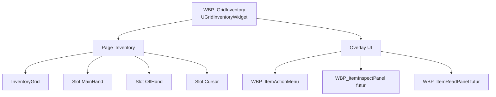
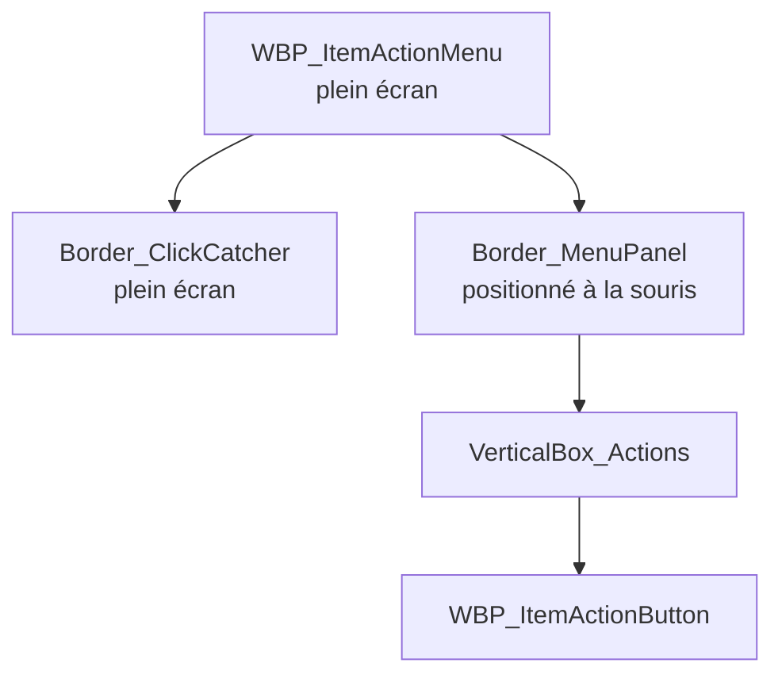
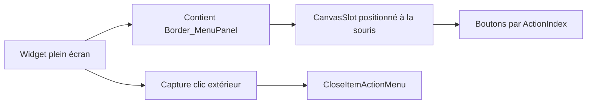
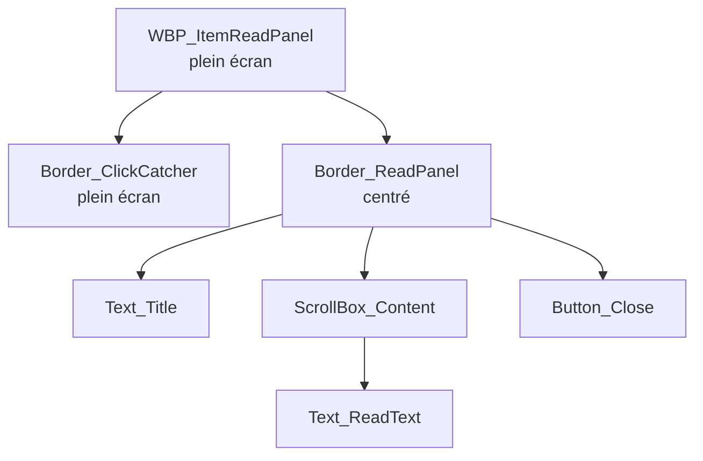

# Inventory Blueprint Construction Guide

Ce guide décrit la construction attendue des Blueprints d'inventaire. Il complète `ITEM_CONTEXT_ACTION_SYSTEM.md` et `INVENTORY_INTERACTION_ROUTING.md`.

## Principe

Les Blueprints affichent et relaient les intentions. Le gameplay reste en C++.

Un Blueprint d'inventaire peut :

- afficher des slots, tooltips, menus et panneaux ;
- stocker les paramètres UI nécessaires, comme `SlotType`, `SlotIndex` ou `ActionIndex` ;
- appeler une fonction C++ explicite ;
- fermer ou repositionner des widgets UI.

Un Blueprint d'inventaire ne doit pas :

- décider qu'un item est compatible avec une main ou une cible ;
- déplacer directement un item entre inventaire, équipement, Cursor ou réceptacle ;
- appeler une porte, une serrure ou un lien gameplay ;
- utiliser `ExecuteInventoryContextAction(ActionType, ...)` depuis le menu visible.

## WBP_GridInventory

Parent class attendu : `UGridInventoryWidget`.

Rôle :

- racine de la page inventaire ;
- création/affichage des slots ;
- réception de `OnContextActionsRequested` ;
- création et fermeture du menu contextuel ;
- implémentation des événements d'affichage `PresentItemExamination`, `PresentItemReading` et `OnItemActionMenuCloseRequested`.

Hiérarchie recommandée :

- `Root` canvas ou overlay ;
- zone `Page_Inventory` ;
- grille d'inventaire ;
- slots `MainHand`, `OffHand`, `Cursor` ;
- couche UI au-dessus pour `WBP_ItemActionMenu`, `WBP_ItemInspectPanel`, `WBP_ItemReadPanel`.



Variables obligatoires :

- `CurrentItemActionMenu` : référence au menu courant ;
- `ItemActionMenuClass` : classe du menu ;
- `CurrentItemReadPanel` : référence au panneau de lecture courant ;
- `ItemReadPanelClass` : classe `WBP_ItemReadPanel` ;
- références aux panels de slots si la construction est manuelle.

Événements à implémenter :

- `OnContextActionsRequested(SlotType, SlotIndex)` : créer ou réinitialiser `WBP_ItemActionMenu` ;
- `OnItemActionMenuCloseRequested(Reason)` : retirer uniquement `CurrentItemActionMenu` ;
- `OnItemReadPanelCloseRequested(Reason)` : retirer uniquement `CurrentItemReadPanel` ;
- `PresentItemExamination(Item, ExaminationText)` : afficher un panneau d'inspection stable ou transitoire ;
- `PresentItemReading(Item, Title, ReadText)` : afficher le panneau de lecture.

Erreurs à éviter :

- ne jamais faire `RemoveFromParent` sur `WBP_GridInventory` pour fermer le menu ;
- ne pas changer de `TopTabs` à la fermeture du menu ;
- ne pas appeler `ExecuteInventoryContextAction(ActionType, ...)` depuis les boutons visibles.

## WBP_ItemActionMenu

Parent class recommandé : `UUserWidget`.

Rôle :

- widget plein écran ;
- capture du clic extérieur ;
- conteneur du panneau de boutons ;
- relai des clics de boutons vers `UGridInventoryWidget`.

Hiérarchie recommandée :

- `CanvasPanel_Root` plein écran ;
- `Button_CloseArea` ou `Border_ClickCatcher` plein écran, invisible ou alpha `0.0` si le hit-test fonctionne ;
- `Border_MenuPanel` au-dessus du click catcher ;
- conteneur vertical pour les `WBP_ItemActionButton`.



Pourquoi le menu reste plein écran :



Variables obligatoires :

- `OwnerInventoryWidget` : référence vers `WBP_GridInventory` / `UGridInventoryWidget` ;
- `SourceSlotType` ;
- `SourceSlotIndex` ;
- liste locale de boutons si besoin.

Variables `Expose on Spawn` recommandées :

- `OwnerInventoryWidget` ;
- `SourceSlotType` ;
- `SourceSlotIndex` ;
- position souris initiale.

Événements à implémenter :

- construction des boutons à partir de `OwnerInventoryWidget.LastContextActions` ;
- clic extérieur : `OwnerInventoryWidget.CloseItemActionMenu("ClickOutside")` ;
- `ExecuteActionByIndex(ActionIndex)` : appeler `OwnerInventoryWidget.ExecuteInventoryContextActionByIndex(SourceSlotType, SourceSlotIndex, ActionIndex)`.

Règles de positionnement :

- `WBP_ItemActionMenu` reste plein écran ;
- ne jamais appeler `CurrentItemActionMenu.SetPositionInViewport(MousePosition)` ;
- seul `Border_MenuPanel` est déplacé à la souris via son `CanvasSlot`.

```text
À ne jamais faire :
CurrentItemActionMenu.SetPositionInViewport(MousePosition)

À faire :
WBP_ItemActionMenu reste plein écran.
Border_MenuPanel est repositionné via son CanvasSlot.
```

Erreurs à éviter :

- placer le widget plein écran à la position souris ;
- laisser le click catcher au-dessus du panneau ;
- utiliser un alpha visible de debug ;
- laisser des messages de debug Blueprint temporaires ;
- retirer `WBP_GridInventory` au lieu du menu.

## WBP_ItemActionButton

Parent class recommandé : `UUserWidget`.

Rôle :

- représenter une entrée de menu ;
- conserver l'index exact de l'action ;
- relayer le clic au menu parent.

Variables obligatoires :

- `OwnerMenu` ;
- `ActionIndex` ;
- `ActionLabel` ;
- `bActionEnabled`.

Variables `Expose on Spawn` :

- `OwnerMenu` ;
- `ActionIndex` ;
- `ActionLabel` ;
- `bActionEnabled`.

Événement :

- `OnClicked` appelle `OwnerMenu.ExecuteActionByIndex(ActionIndex)`.

Erreur critique à éviter :

- ne pas exécuter par `ActionType`, car plusieurs boutons peuvent partager `Equip`.

## WBP_ItemToolTip

Parent class recommandé : `UUserWidget`.

Rôle :

- information passive au survol ;
- nom, type, poids, description courte, compatibilités principales.

Données :

- `DisplayName` ;
- `Description` ;
- `ItemType` ;
- `CompatibleEquipmentSlots` ;
- indication lumière si applicable.

Erreur à éviter :

- ne pas confondre tooltip et action `Examiner`.

## Widgets De Slots

Parent C++ attendu : `UGridInventorySlotWidget`.

Slots concernés :

- slots d'inventaire ;
- `MainHand` ;
- `OffHand` ;
- `Cursor`.

Variables obligatoires :

- `SlotType` ;
- `InventorySlotIndex` ;
- `OwningInventoryWidget`.

Responsabilités :

- afficher l'item courant ;
- relayer clic gauche, clic droit et drag/drop ;
- ne pas appliquer de règle gameplay locale.

Interactions :

- clic droit : `HandleItemSlotRightClicked(SlotType, InventorySlotIndex)` ;
- drop : `HandleSlotDrop(SourceSlotType, SourceSlotIndex, SlotType, InventorySlotIndex, ...)`.

## Futur WBP_ItemInspectPanel

Parent recommandé : `UUserWidget`.

Rôle :

- panneau stable pour `Examiner` ;
- affichage détaillé d'un item sans le confondre avec le tooltip.

Contenu recommandé :

- titre ;
- icône ;
- description courte enrichie ;
- type, poids, compatibilités ;
- état lumière ou tags utiles.

Fermeture :

- clic volontaire ;
- bouton fermer ;
- Escape si disponible.

## WBP_ItemReadPanel

Parent class recommandé : `UUserWidget`.

Rôle :

- afficher le contenu textuel long d'un item lisible ;
- rester visible jusqu'à une fermeture explicite ;
- ne pas modifier l'inventaire ;
- ne pas exécuter d'action gameplay ;
- ne pas remplacer `Examiner`.

Hiérarchie recommandée :

```text
CanvasPanel_Root
├── Border_ClickCatcher
└── Border_ReadPanel
    └── VerticalBox_Root
        ├── Text_Title
        ├── ScrollBox_Content
        │   └── Text_ReadText
        └── Button_Close
            └── Text_Close
```



Variables recommandées :

- `OwnerInventoryWidget` : `GridInventoryWidget Object Reference`, `Expose on Spawn = true` ;
- `Item` : `FGridItemInstance`, `Expose on Spawn = true` ;
- `Title` ;
- `ReadText`.

Événement `Construct` :

- `Text_Title.SetText(Title)` ;
- `Text_ReadText.SetText(ReadText)` ;
- si `ReadText` est vide, afficher `Rien n'est écrit.`.

Fermeture :

- `Button_Close.OnClicked` appelle `OwnerInventoryWidget.CloseItemReadPanel("CloseButton")` ;
- `Border_ClickCatcher.OnMouseButtonDown` appelle `OwnerInventoryWidget.CloseItemReadPanel("ClickOutside")`, puis retourne `Handled` ;
- `OnItemReadPanelCloseRequested(Reason)` dans `WBP_GridInventory` retire uniquement `CurrentItemReadPanel`.

Réglages :

- `WBP_ItemReadPanel` reste plein écran ;
- `Border_ClickCatcher` couvre tout l'écran ;
- `Border_ClickCatcher` est derrière `Border_ReadPanel` ;
- `Border_ReadPanel` est centré ;
- `RemoveFromParent` ne doit jamais viser `WBP_GridInventory`.

Règle :

- `ReadText` vient de la définition d'item ;
- `Description` reste le texte court de tooltip/examen.

### Câblage Dans WBP_GridInventory

Variables Blueprint :

- `ItemReadPanelClass` : `Class Reference` vers `WBP_ItemReadPanel` ;
- `CurrentItemReadPanel` : `WBP_ItemReadPanel Object Reference`.

Implémenter `PresentItemReading(Item, Title, ReadText)` :

1. Appeler `CloseItemActionMenu("ReadOpened")` si le menu contextuel est encore ouvert.
2. Si `CurrentItemReadPanel` est valide, appeler `RemoveFromParent`, puis remettre la référence à `None`.
3. Créer `WBP_ItemReadPanel` avec :
   - `OwnerInventoryWidget = Self` ;
   - `Item = Item` ;
   - `Title = Title` ;
   - `ReadText = ReadText`.
4. Assigner `CurrentItemReadPanel`.
5. Appeler `Add To Viewport` avec `ZOrder = 6000`.

Implémenter `OnItemReadPanelCloseRequested(Reason)` :

1. Si `CurrentItemReadPanel` est valide, appeler `RemoveFromParent`.
2. Remettre `CurrentItemReadPanel` à `None`.

Le C++ ne supprime pas directement le widget : la référence visuelle reste tenue côté Blueprint.

## Checklist De Construction

- `WBP_ItemActionMenu` plein écran.
- `Border_ClickCatcher` derrière `Border_MenuPanel`.
- `Border_MenuPanel` positionné via `CanvasSlot`.
- Aucun `SetPositionInViewport` sur le menu plein écran.
- `WBP_ItemActionButton` reçoit `ActionIndex`.
- Les boutons appellent `ExecuteInventoryContextActionByIndex`.
- Le clic extérieur appelle `CloseItemActionMenu("ClickOutside")`.
- `RemoveFromParent` cible uniquement `WBP_ItemActionMenu`.
- `PresentItemReading` crée `WBP_ItemReadPanel`.
- `WBP_ItemReadPanel` se ferme via `CloseItemReadPanel`.
- `OnItemReadPanelCloseRequested` retire uniquement `CurrentItemReadPanel`.
- Aucun message de debug Blueprint temporaire.
- Aucune logique gameplay locale dans les Blueprints.
