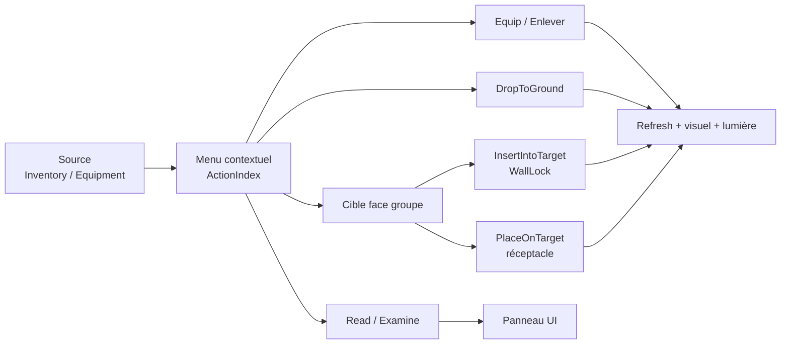

# Inventory Context Action MVP Validation

Ce document valide le MVP du menu contextuel d'inventaire et des actions associées. Il sert de checklist PIE entre le code C++, les Blueprints UMG et la documentation.

## Périmètre validé historique

Le MVP historique couvre :

- clic droit sur slot d'inventaire ;
- clic droit sur `MainHand` et `OffHand` ;
- menu contextuel plein écran avec panneau interne positionné à la souris ;
- fermeture du menu par clic extérieur via `CloseItemActionMenu` ;
- exécution par `ActionIndex` avec `ExecuteInventoryContextActionByIndex` ;
- `Equip` vers les mains ;
- `Enlever` depuis les slots équipés ;
- `DropToGround` depuis inventaire et mains équipées ;
- `Read` pour items lisibles ;
- `Examine` comme panneau transitoire basé sur le contenu tooltip ;
- `InsertIntoTarget` pour clé vers WallLock ;
- `PlaceOnTarget` depuis inventaire, `MainHand`, `OffHand` vers réceptacles compatibles ;
- swaps atomiques entre slots occupés ;
- recalcul lumière depuis `MainHand || OffHand`.

Sources UI historiques validées :

- `Inventory` ;
- `MainHand` ;
- `OffHand`.

## Extension UI-INV2B : paper doll equipment

UI-INV2B introduit le panneau paper doll : le personnage est vu de pied en cap et les slots d'équipement sont placés autour de lui.

La cible visuelle officielle est :

### Colonne gauche

- Tête / `Head` ;
- Visage / `Face` ;
- Amulette / `Amulet` ;
- Épaules / `Shoulders` ;
- Chemise / `Shirt` ;
- Torse / `Chest` ;
- Cape / `Cloak` ;
- Brassards / `Bracers`.

### Colonne droite

- Gants / `Gloves` ;
- Ceinture / `Belt` ;
- Jambes / `Legs` ;
- Bottes / `Feet` ;
- Anneau I / `Ring1` ;
- Anneau II / `Ring2` ;
- Bijou d'oreille I / `Earring1` ;
- Bijou d'oreille II / `Earring2`.

### Bas

- Main principale / `MainHand` ;
- Main secondaire / `OffHand`.

`Cursor` n'est pas un équipement. Il ne doit pas être testé comme slot paper doll.

`Talisman`, `QuickSlot1`, `QuickSlot2` et `Accessory` ne font plus partie du panneau paper doll cible. Ils pourront être traités dans un autre système.

## État technique à valider

Le modèle C++ actuel ne couvre pas encore tous les slots visuels.

Slots fonctionnels attendus maintenant :

- `Head` ;
- `Amulet` ;
- `Shoulders` ;
- `Chest` ;
- `Cloak` ;
- `Gloves` ;
- `Belt` ;
- `Legs` ;
- `Feet` ;
- `Ring1` ;
- `Ring2` ;
- `MainHand` ;
- `OffHand`.

Slots placeholders jusqu'à alignement C++ :

- `Face` ;
- `Shirt` ;
- `Bracers` ;
- `Earring1` ;
- `Earring2`.

Les placeholders ne doivent pas provoquer d'appel fonctionnel à un slot C++ inexistant.

## Synthèse du flux MVP



## Matrice de test synthétique

| Source | Cible | Action attendue | Résultat |
|---|---|---|---|
| Inventaire | Main compatible | `Equip` | Item équipé, UI rafraîchie. |
| Main équipée | Inventaire | `Enlever` | Item replacé si slot disponible. |
| Inventaire / équipement | Sol | `DropToGround` | Spawn au sol puis retrait source. |
| Inventaire | WallLock | `InsertIntoTarget` | Clé transférée, `Activated` émis. |
| Inventaire / main | Réceptacle | `PlaceOnTarget` | Item transféré sans Cursor public. |
| Item lisible | Aucun | `Read` | Texte affiché, item conservé. |

## Pré requis de test

- Niveau : `L_GrimrockEditor` ou carte runtime équivalente.
- Un personnage actif avec slots d'inventaire disponibles.
- Items recommandés : clé, torche, pierre, livre/parchemin ou item lisible, arme, armure, bijou.
- Cibles recommandées : WallLock compatible, porte liée, alcôve/réceptacle compatible, support de torche.
- UMG attendu : `WBP_GridInventory`, `WBP_ItemActionMenu`, `WBP_ItemActionButton`, slots inventaire, slots paper doll, cursor hors paper doll, tooltip.

## Validation routage UI / C++

Règle validée :

- C++ : validation gameplay, compatibilité, mutations atomiques, transferts et logs.
- Blueprint / UMG : affichage, layout, fermeture du menu, relai d'intention.

Le menu visible doit appeler :

```text
ExecuteInventoryContextActionByIndex(SourceSlotType, SourceSlotIndex, ActionIndex)
```

Il ne doit pas appeler l'ancienne API par `ActionType`.

## Tests PIE

### Bloc A — Menu contextuel

| ID | Test | Résultat attendu |
|---|---|---|
| A1 | Clic droit sur item inventaire | Menu visible, actions correctes, panneau positionné à la souris, clic extérieur ferme le menu. |
| A2 | Clic droit sur `MainHand` occupée | Menu visible avec `Enlever`; pas de libellé technique long. |
| A3 | Clic droit sur `OffHand` occupée | Menu visible avec `Enlever`; pas de libellé technique long. |
| A4 | Clic extérieur | Menu fermé, inventaire intact, `Page_Inventory` et `TopTabs` inchangés. |

### Bloc B — Équipement historique mains

| ID | Test | Résultat attendu |
|---|---|---|
| B1 | Inventaire -> `MainHand` | Item compatible équipé, slot inventaire libéré ou remplacé si swap, visuel tenu rafraîchi. |
| B2 | Inventaire -> `OffHand` | Item compatible équipé en main secondaire, visuel tenu rafraîchi. |
| B3 | Slot incompatible | Action absente ou refus propre ; aucun item perdu. |
| B4 | Ancienne API ambiguë | Aucune action visible ne déclenche `Reason=AmbiguousActionType`. |

### Bloc B2 — Paper doll equipment fonctionnel

| ID | Test | Résultat attendu |
|---|---|---|
| B2.1 | Clic gauche slot fonctionnel vide avec `CursorItem` compatible | Item équipé dans le slot cible, puis `RefreshInventory`. |
| B2.2 | Clic gauche slot fonctionnel occupé sans `CursorItem` | Item pris au cursor, slot équipé vidé, puis `RefreshInventory`. |
| B2.3 | Clic droit slot fonctionnel occupé | Menu contextuel si actions supportées. |
| B2.4 | Drop inventaire -> slot fonctionnel compatible | Succès, aucun item perdu, refresh après mutation. |
| B2.5 | Drop inventaire -> slot fonctionnel incompatible | Refus propre, aucun item perdu. |
| B2.6 | Placeholder `Face`, `Shirt`, `Bracers`, `Earring1`, `Earring2` | Aucun crash, aucune mutation tant que C++ n'est pas aligné. |
| B2.7 | `MainHand` / `OffHand` | Fonctionnement conservé dans le paper doll. |

### Bloc C — Enlever

| ID | Test | Résultat attendu |
|---|---|---|
| C1 | `MainHand` -> `Enlever` | Main vidée, item placé dans un slot libre d'inventaire, visuel tenu rafraîchi. |
| C2 | `OffHand` -> `Enlever` | Main secondaire vidée, item placé dans un slot libre, visuel tenu rafraîchi. |
| C3 | Inventaire plein | Refus propre, log `Reason=NoFreeInventorySlot`, aucun item perdu. |

### Bloc D — Déposer au sol

| ID | Test | Résultat attendu |
|---|---|---|
| D1 | Inventaire -> `Déposer au sol` | Item retiré de l'inventaire et spawn au sol. |
| D2 | Équipement fonctionnel -> `Déposer au sol` | Slot vidé, item spawn au sol, visuel rafraîchi si nécessaire. |
| D3 | Placeholder non fonctionnel -> action | Aucune action ou refus propre. |

### Bloc E — Swap atomique

| ID | Test | Résultat attendu |
|---|---|---|
| E1 | Inventaire occupé -> inventaire occupé | Les deux items échangent leurs slots ; Cursor non utilisé. |
| E2 | Inventaire -> équipement occupé compatible | Swap atomique si compatibilité OK ; aucun item perdu. |
| E3 | Inventaire -> équipement occupé incompatible | Refus propre ; aucun item perdu. |
| E4 | `MainHand` <-> `OffHand` | Swap si les deux destinations sont compatibles ; refus propre sinon. |

Logs attendus :

```text
GridInventory SwapSlots Source=... SourceIndex=... Target=... TargetIndex=...
GridInventory SwapSlots Success ItemA=... ItemB=...
GridInventory SwapSlots Failed Reason=IncompatibleSourceToTarget
GridInventory SwapSlots Failed Reason=IncompatibleTargetToSource
```

### Bloc F — Lumière équipée

| ID | Test | Résultat attendu |
|---|---|---|
| F1 | Torche `MainHand` + pierre `OffHand` | Lumière active. |
| F2 | Torche `OffHand` + pierre `MainHand` | Lumière active. |
| F3 | Retirer/déposer uniquement la pierre | Lumière reste active. |
| F4 | Retirer/déposer la torche | Lumière s'éteint si aucune autre source lumineuse équipée. |
| F5 | Log recompute | `GridEquipmentLight Recompute ... Result=...`. |

### Bloc G — Interactions avec cible

| ID | Test | Résultat attendu |
|---|---|---|
| G1 | Clé inventaire -> WallLock | `Insérer dans la serrure` fonctionne ; clic direct WallLock sans cursor ne consomme pas automatiquement la clé. |
| G2 | Clé inventaire -> alcôve | `Placer dans l'alcôve` ou `Placer sur la cible` fonctionne. |
| G3 | Clé main équipée -> alcôve | Main vidée, clé visible dans l'alcôve. |
| G4 | Torche inventaire -> support | Torche placée, lumière activée sur support. |
| G5 | Torche main équipée -> support | Main vidée, torche placée, lumière activée. |
| G6 | Cible incompatible | Action absente ou refus propre ; aucun item perdu. |

### Bloc H — Tooltip / Examiner / Lire

| ID | Test | Résultat attendu |
|---|---|---|
| H1 | Tooltip | Affichage rapide au survol. |
| H2 | Examiner | Action disponible ; panneau ou comportement transitoire documenté. |
| H3 | Lire | Action uniquement pour items lisibles ; appelle `PresentItemReading`. |

## Limitations connues

- Les placeholders `Face`, `Shirt`, `Bracers`, `Earring1`, `Earring2` attendent l'alignement C++.
- `Consume`, `SplitStack`, `Throw`, combat et panneaux complexes `Inspect` / `Read` ne sont pas inclus dans ce MVP.
- `Examiner` peut encore réutiliser le contenu du tooltip ; état transitoire.
- La fermeture visuelle du menu dépend du câblage Blueprint de `OnItemActionMenuCloseRequested`.

## Décisions

- L'action visible du menu contextuel reste strictement indexée par `ActionIndex`.
- Le clic direct sur WallLock ne scanne pas l'inventaire.
- `InsertIntoTarget` est l'action explicite pour utiliser une clé d'inventaire sur une serrure.
- `PlaceOnTarget` fonctionne depuis inventaire et mains équipées sans utiliser le Cursor.
- Les swaps occupés sont atomiques et ne passent pas par le Cursor.
- La lumière équipée se calcule au minimum sur `MainHand || OffHand`.
- Le paper doll est la cible visuelle officielle du panneau d'équipement.

## Résultat attendu de la passe UI-INV2B

- Validation statique : documentation et Blueprint alignés.
- Compilation : `GrimrockPrototypeEditor Win64 Development`.
- PIE : checklist prête pour exécution manuelle.
