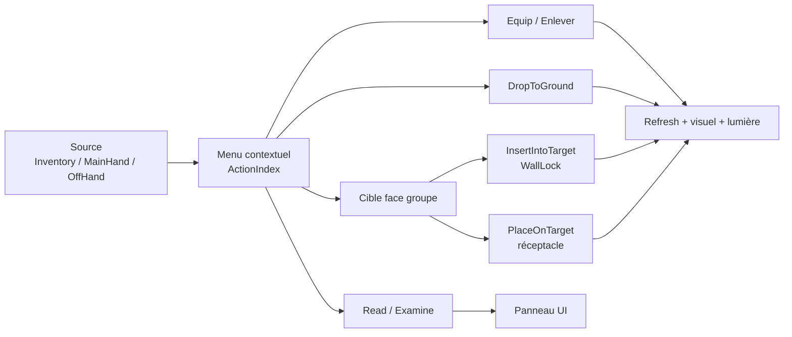

# Inventory Context Action MVP Validation

Ce document valide le MVP actuel du menu contextuel d'inventaire et des actions associées. Il sert de checklist PIE et de point de contrôle entre le code C++, les Blueprints UMG et la documentation.

## Périmètre Validé

Le MVP couvre :

- clic droit sur slot d'inventaire, `MainHand`, `OffHand` ;
- menu contextuel plein écran avec panneau interne positionné à la souris ;
- fermeture du menu par clic extérieur via `CloseItemActionMenu`;
- exécution par `ActionIndex` avec `ExecuteInventoryContextActionByIndex`;
- `Equip` vers `MainHand` et `OffHand` ;
- `Enlever` depuis les slots équipés ;
- `DropToGround` depuis inventaire et mains équipées ;
- `Read` pour items lisibles ;
- `Examine` comme panneau transitoire basé sur le contenu tooltip ;
- `InsertIntoTarget` pour clé vers WallLock ;
- `PlaceOnTarget` depuis inventaire, `MainHand`, `OffHand` vers réceptacles compatibles ;
- swaps atomiques entre slots occupés ;
- recalcul lumière depuis `MainHand || OffHand`.

Synthèse du périmètre MVP :



Matrice de test synthétique :

| Source | Cible | Action attendue | Résultat |
|---|---|---|---|
| Inventaire | Main compatible | `Equip` | Item équipé, UI rafraîchie. |
| `MainHand` / `OffHand` | Inventaire | `Enlever` | Item replacé si slot disponible. |
| Inventaire / main | Sol | `DropToGround` | Spawn au sol puis retrait source. |
| Inventaire | WallLock | `InsertIntoTarget` | Clé transférée, `Activated` émis. |
| Inventaire / main | Réceptacle | `PlaceOnTarget` | Item transféré sans Cursor public. |
| Item lisible | Aucun | `Read` | Texte affiché, item conservé. |

## Pré requis De Test

- Niveau : `L_GrimrockEditor`.
- Un personnage actif avec slots d'inventaire disponibles.
- Items recommandés : clé cuivre, torche, pierre, livre/parchemin ou item lisible.
- Cibles recommandées : WallLock compatible, porte liée par `Activated -> Open`, alcôve/réceptacle compatible, support de torche.
- UMG attendu : `WBP_GridInventory`, `WBP_ItemActionMenu`, `WBP_ItemActionButton`, slots inventaire/main/cursor, tooltip.
- Le menu visible doit appeler `ExecuteInventoryContextActionByIndex(SourceSlotType, SourceSlotIndex, ActionIndex)`.

## Validation Routage UI / C++

Règle validée :

- C++ : validation gameplay, exécution, compatibilité de slots, transferts atomiques, logs structurés.
- Blueprint / UMG : affichage, layout, fermeture du menu, relai d'intention.

Audit statique effectué :

- aucun appel applicatif C++ inspectable détecté à `CurrentItemActionMenu.SetPositionInViewport(MousePosition)` ;
- aucune trace source non binaire des anciens messages de debug UMG temporaires ;
- le menu visible est documenté comme devant utiliser `ExecuteInventoryContextActionByIndex` ;
- l'ancienne API par `ActionType` refuse les actions ambiguës avec `Reason=AmbiguousActionType` ;
- logs C++ utiles présents : `GridInventory RightClick`, `GridItemActions ExecuteByIndex`, `GridInventory SwapSlots`, `GridEquipmentLight Recompute`, `GridItemActions Execute PlaceOnTarget`, `GridItemActions Execute InsertIntoTarget`, `GridItemActionMenu Closed`.

## Tests PIE

### Bloc A — Menu Contextuel

| ID | Test | Résultat attendu |
|---|---|---|
| A1 | Clic droit sur item inventaire | Menu visible, actions correctes, panneau positionné à la souris, clic extérieur ferme le menu. |
| A2 | Clic droit sur `MainHand` occupée | Menu visible avec `Enlever`; aucun libellé long `Retirer de la main directrice`. |
| A3 | Clic droit sur `OffHand` occupée | Menu visible avec `Enlever`; aucun libellé long `Retirer de la main secondaire`. |
| A4 | Clic extérieur | Menu fermé, inventaire intact, `Page_Inventory` et `TopTabs` inchangés. |

### Bloc B — Équipement

| ID | Test | Résultat attendu |
|---|---|---|
| B1 | Inventaire -> `MainHand` | Item compatible équipé, slot inventaire libéré ou remplacé si swap, visuel tenu rafraîchi. |
| B2 | Inventaire -> `OffHand` | Item compatible équipé en main secondaire, visuel tenu rafraîchi. |
| B3 | Slot incompatible | Action absente ou refus propre; aucun item perdu. |
| B4 | Ancienne API ambiguë | Aucune action visible ne déclenche `Reason=AmbiguousActionType`; ce log ne doit apparaître que si l'ancienne API est appelée directement. |

### Bloc C — Enlever

| ID | Test | Résultat attendu |
|---|---|---|
| C1 | `MainHand` -> `Enlever` | Main vidée, item placé dans un slot libre d'inventaire, visuel tenu rafraîchi. |
| C2 | `OffHand` -> `Enlever` | Main secondaire vidée, item placé dans un slot libre, visuel tenu rafraîchi. |
| C3 | Inventaire plein | Refus propre, log `Reason=NoFreeInventorySlot`, aucun item perdu. |

### Bloc D — Déposer Au Sol

| ID | Test | Résultat attendu |
|---|---|---|
| D1 | Inventaire -> `Déposer au sol` | Item retiré de l'inventaire et spawn au sol. |
| D2 | `MainHand` -> `Déposer au sol` | `MainHand` vidée, item spawn au sol, visuel tenu rafraîchi. |
| D3 | `OffHand` -> `Déposer au sol` | `OffHand` vidée, item spawn au sol, visuel tenu rafraîchi. |

### Bloc E — Swap Atomique

| ID | Test | Résultat attendu |
|---|---|---|
| E1 | Inventaire occupé -> inventaire occupé | Les deux items échangent leurs slots; Cursor non utilisé. |
| E2 | Inventaire -> `MainHand` occupée | Swap atomique si compatibilité OK; aucun item perdu. |
| E3 | Inventaire -> `OffHand` occupée | Swap atomique si compatibilité OK; aucun item perdu. |
| E4 | `MainHand` -> inventaire occupé | Swap atomique si item cible compatible `MainHand`; refus propre sinon. |
| E5 | `MainHand` <-> `OffHand` | Swap si les deux destinations sont compatibles; refus propre sinon. |

Logs attendus :

```text
GridInventory SwapSlots Source=... SourceIndex=... Target=... TargetIndex=...
GridInventory SwapSlots Success ItemA=... ItemB=...
GridInventory SwapSlots Failed Reason=IncompatibleSourceToTarget
GridInventory SwapSlots Failed Reason=IncompatibleTargetToSource
```

### Bloc F — Lumière Équipée

| ID | Test | Résultat attendu |
|---|---|---|
| F1 | Torche `MainHand` + pierre `OffHand` | Lumière active. |
| F2 | Torche `OffHand` + pierre `MainHand` | Lumière active. |
| F3 | Retirer/déposer uniquement la pierre | Lumière reste active. |
| F4 | Retirer/déposer la torche | Lumière s'éteint si aucune autre source lumineuse équipée. |
| F5 | Log recompute | `GridEquipmentLight Recompute MainHand=... MainLight=... OffHand=... OffLight=... Result=...`. |

### Bloc G — Interactions Avec Cible

| ID | Test | Résultat attendu |
|---|---|---|
| G1 | Clé inventaire -> WallLock | `Insérer dans la serrure` fonctionne; clic direct WallLock sans cursor ne consomme pas automatiquement la clé. |
| G2 | Clé inventaire -> alcôve | `Placer dans l'alcôve` ou `Placer sur la cible` fonctionne. |
| G3 | Clé `MainHand` -> alcôve | `MainHand` vidée, clé visible dans l'alcôve. |
| G4 | Clé `OffHand` -> alcôve | `OffHand` vidée, clé visible dans l'alcôve. |
| G5 | Torche inventaire -> support | Torche placée, lumière activée sur support. |
| G6 | Torche `MainHand` -> support | Main vidée, torche placée, lumière activée. |
| G7 | Torche `OffHand` -> support | Main secondaire vidée, torche placée, lumière activée. |
| G8 | Cible incompatible | Action absente ou refus propre; aucun item perdu. |

### Bloc H — Tooltip / Examiner / Lire

| ID | Test | Résultat attendu |
|---|---|---|
| H1 | Tooltip | Affichage rapide au survol. |
| H2 | Examiner | Action disponible; comportement transitoire documenté si contenu identique au tooltip. |
| H3 | Lire | Action uniquement pour items lisibles; appelle `PresentItemReading`; ne remplace pas `Examiner`. |

## Limitations Connues

- Les tests PIE listés ici restent à exécuter manuellement dans Unreal Editor ; cette passe a exécuté une compilation et un audit statique des sources non binaires.
- `Consume`, `SplitStack`, `Throw`, combat et panneaux complexes `Inspect` / `Read` ne sont pas inclus dans ce MVP.
- `Examiner` peut encore réutiliser le contenu du tooltip ; c'est un état transitoire documenté.
- La fermeture visuelle du menu dépend du câblage Blueprint de `OnItemActionMenuCloseRequested`.
- Le contrôle des anciens prints UMG ne peut pas inspecter le graphe interne des `.uasset` sans modifier les assets ; seules les sources non binaires ont été vérifiées.

## Anomalies Détectées Pendant Cette Passe

- `ITEM_CONTEXT_ACTION_SYSTEM.md` contenait encore une limite obsolète indiquant que les actions étaient calculées mais non exécutées.
- `ITEM_CONTEXT_ACTION_SYSTEM.md` mentionnait encore le scan automatique d'inventaire par WallLock comme comportement transitoire.
- `WALL_LOCK_MVP_RUNTIME_BEHAVIOR.md` contenait encore des sections décrivant `UnlockSuccess Source=Inventory`.

Ces anomalies étaient documentaires et ont été corrigées dans cette passe.

## Décisions

- L'action visible du menu contextuel reste strictement indexée par `ActionIndex`.
- Le clic direct sur WallLock ne scanne pas l'inventaire.
- `InsertIntoTarget` est l'action explicite pour utiliser une clé d'inventaire sur une serrure.
- `PlaceOnTarget` fonctionne depuis inventaire, `MainHand` et `OffHand` sans utiliser le Cursor.
- Les swaps occupés sont atomiques et ne passent pas par le Cursor.
- La lumière équipée se calcule sur l'état complet `MainHand || OffHand`.

## Résultat De Cette Passe

- Validation statique : effectuée.
- Compilation : `GrimrockPrototypeEditor Win64 Development` réussie ; cible déjà à jour.
- PIE : checklist prête pour exécution manuelle.
