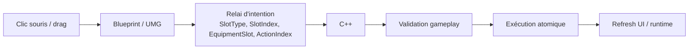

# Inventory Interaction Routing

Ce document consolide le routage Blueprint / C++ des interactions d'inventaire. Il décrit le système tel qu'il doit rester maintenable après l'ajout du menu contextuel, des actions par index, des swaps atomiques, des transferts vers les cibles en face du groupe et du panneau paper doll UI-INV2B.

## Règle générale

`C++ = règles, validation, exécution gameplay`.

Le C++ possède l'état d'inventaire, les règles de compatibilité, les transferts atomiques, les effets gameplay et les logs.

`Blueprint / UMG = présentation, layout, relai d'intention`.

Les Blueprints affichent les slots, tooltips, menus et panneaux. Ils captent les événements UI, puis appellent une fonction C++ explicite. Ils ne doivent pas contenir de logique gameplay durable.



## Frontière avec le système souris monde

Deux modèles coexistent et ne doivent pas être confondus.

| Modèle | Déclencheur | Cible utilisée | Usage |
|---|---|---|---|
| Item tenu au curseur | Clic gauche monde avec un item déjà porté par le curseur | Cible sous la souris | Interaction directe : wall lock, réceptacle, dépôt monde, lancer |
| Action contextuelle d'inventaire | Clic droit sur un slot, puis bouton du menu | Cible face au groupe au moment de construire l'action | Action explicite : équiper, lire, insérer, placer, déposer |

Le clic gauche monde répond à la question :

```text
Que fait l'item que je tiens sur ce que je vise avec la souris ?
```

Le menu contextuel répond à la question :

```text
Quelles actions explicites sont disponibles pour cet item d'inventaire maintenant ?
```

La cible sous la souris est prioritaire pour le routage monde direct. La cible face au groupe est un contexte d'aide pour le menu clic droit, pas une substitution automatique au hit souris.

## UI-INV2B — Paper doll equipment

La cible visuelle officielle du panneau personnage est un paper doll :

- personnage vu de pied en cap au centre ;
- slots d'équipement autour du personnage ;
- panneau de stats séparé ;
- `Cursor` hors panneau d'équipement.

### Slots paper doll canoniques

Colonne gauche :

```text
Head       -> Tête
Face       -> Visage
Amulet     -> Amulette
Shoulders  -> Épaules
Shirt      -> Chemise
Chest      -> Torse
Cloak      -> Cape
Bracers    -> Brassards
```

Colonne droite :

```text
Gloves     -> Gants
Belt       -> Ceinture
Legs       -> Jambes
Feet       -> Bottes
Ring1      -> Anneau I
Ring2      -> Anneau II
Earring1   -> Bijou d'oreille I
Earring2   -> Bijou d'oreille II
```

Bas :

```text
MainHand   -> Main principale
OffHand    -> Main secondaire
```

`Talisman`, `QuickSlot1`, `QuickSlot2` et `Accessory` ne sont pas des slots du paper doll validé. Ils pourront appartenir plus tard à une barre rapide ou un autre système.

### Etat fonctionnel actuel

Le C++ actuel peut router les slots déjà existants dans `EGridEquipmentSlot`. Les slots suivants sont la cible visuelle mais demandent encore un alignement C++ :

```text
Face
Shirt
Bracers
Earring1
Earring2
```

Tant que ces slots ne sont pas ajoutés au modèle, les Blueprints ne doivent pas tenter d'exécuter une mutation fonctionnelle sur eux.

## Tableau des interactions

| Interaction | Capture | Validation | Exécution | Refresh UI | Logs principaux |
|---|---|---|---|---|---|
| Clic gauche slot inventaire | `UGridInventorySlotWidget` puis `UGridInventoryWidget::HandleRegisteredSlotClicked` | `UGridInventoryWidget` et `UGridPartyInventoryComponent` | Fonctions cursor/inventory du composant | `RefreshInventory` après mutation | `GridInventory UI Drop`, `GridInventory SlotClicked` |
| Clic gauche slot équipement fonctionnel | `UGridInventorySlotWidget` avec `SlotType=Equipment` | `HandleEquipmentSlotClicked` puis composant inventaire | `TryEquipCursorItemToCharacterSlot` ou `TryTakeEquipmentSlotToCursor` | `RefreshInventory` après mutation | `GridInventory UI EquipmentClicked` |
| Clic slot placeholder | Blueprint ou widget slot désactivé | Aucune validation gameplay | Aucune mutation | Aucun refresh requis | Aucun crash attendu |
| Clic droit slot | `UGridInventorySlotWidget::NativeOnMouseButtonDown` | `BuildContextActionsForSlot`, `UGridItemContextActionLibrary` | Aucune mutation à l'ouverture | Blueprint ouvre `WBP_ItemActionMenu` | `GridInventory RightClick`, `GridItemActions Build` |
| Drag/drop | `NativeOnDragDetected` / `NativeOnDrop` | `HandleSlotDrop` | Swap atomique ou transfert via composant/pawn | `RefreshInventory`; sync visuel si équipement touché | `GridInventory UI Drop`, `GridInventory SwapSlots` |
| Clic action menu | `WBP_ItemActionButton` | Action reconstruite et validée par index | `ExecuteInventoryContextActionByIndex` puis `ExecuteResolvedInventoryContextAction` | `RefreshInventory` si action exécutée | `GridItemActions ExecuteByIndex`, `Execute ...` |
| Clic extérieur menu | `WBP_ItemActionMenu` click catcher | Blueprint vérifie que le clic est hors panneau | `CloseItemActionMenu("ClickOutside")` puis retrait du menu uniquement | Pas de refresh gameplay | `GridItemActionMenu Closed` |
| Tooltip hover | `WBP_ItemToolTip` / slot widget | Lecture passive | Aucune mutation | Affichage tooltip uniquement | Pas de log requis |
| Examiner | Menu action par index | Source et action disponibles | `PresentItemExamination` | Panneau Blueprint stable à terme | `GridItemActions Execute Examine` |
| Lire | Menu action par index | Item lisible | `PresentItemReading` | Panneau Blueprint persistant | `GridItemActions Execute Read` |
| Placement sur cible | Menu action par index | Cible face au groupe, acceptation réceptacle | `UGridItemTransferService` | Refresh + sync visuel si source équipée | `GridItemActions Execute PlaceOnTarget`, `GridItemTransfer` |
| Insertion serrure | Menu action par index | WallLock face au groupe et clé compatible | `TransferInventorySlotToWallLock` | Refresh après succès | `GridItemActions Execute InsertIntoTarget`, `GridWallLock UnlockSuccess` |
| Equip | Menu action par index | Slot exact dans `SelectedAction.EquipmentSlot` | `EquipItemFromInventorySlot` | Refresh + sync visuel/lumière | `GridItemActions Execute Equip` |
| Enlever | Menu action par index | Slot source équipé et inventaire disponible | `UnequipItemToInventory` | Refresh + sync visuel/lumière | `GridItemActions Execute Unequip` |
| Drop au sol | Menu action par index | Source valide et runtime actif | `TryDropItemInstanceAtCell`, puis retrait source | Refresh + sync visuel si source équipée | `GridItemActions Execute DropToGround` |

## Flux clic gauche sur slot équipement

Flux cible pour un slot fonctionnel :

```text
UGridInventorySlotWidget
  -> SlotType = Equipment
  -> EquipmentSlot = EGridEquipmentSlot cible
  -> InventorySlotIndex = static_cast<int32>(EquipmentSlot)
  -> UGridInventoryWidget::HandleRegisteredSlotClicked
  -> UGridInventoryWidget::HandleEquipmentSlotClicked
  -> UGridPartyInventoryComponent
  -> RefreshInventory
```

Si le joueur tient un `CursorItem`, le système tente d'équiper l'item dans le slot cible. Si le joueur ne tient rien et que le slot est occupé, le système tente de prendre l'item au cursor.

Les slots placeholders (`Face`, `Shirt`, `Bracers`, `Earring1`, `Earring2`) ne doivent pas appeler ce flux tant que le C++ n'est pas aligné.

## Flux clic droit

1. Le slot reçoit `RightMouseButton` dans `UGridInventorySlotWidget::NativeOnMouseButtonDown`.
2. Le slot appelle `OwningInventoryWidget->HandleItemSlotRightClicked(SlotType, SlotIndex)`.
3. `UGridInventoryWidget` reconstruit `LastContextItem`, `LastFacingTargetContext` et `LastContextActions`.
4. `UGridItemContextActionLibrary` résout la cible face au groupe et génère les actions compatibles.
5. `OnContextActionsRequested(SlotType, SlotIndex)` est diffusé.
6. `WBP_GridInventory` crée ou affiche `WBP_ItemActionMenu`.
7. Le Blueprint positionne seulement `Border_MenuPanel`, pas le widget plein écran.

Le clic droit d'inventaire ne déplace pas l'item et ne démarre pas une interaction monde.

## Flux drag/drop

1. `UGridInventorySlotWidget` crée un `UGridInventoryDragDropOperation` avec source, index, item et split éventuel.
2. Le slot cible appelle `HandleSlotDrop(SourceType, SourceIndex, TargetType, TargetIndex, bSplitStack, RequestedQuantity)`.
3. Si source et cible sont occupées et hors Cursor, `HandleSlotDrop` tente un swap atomique.
4. Le swap valide chaque item contre son slot de destination avant mutation.
5. Si le swap est impossible, rien n'est déplacé.
6. Les autres flux continuent d'utiliser les fonctions historiques du composant/pawn pour les slots vides ou le Cursor.
7. Après mutation, l'UI est rafraîchie et les visuels équipés sont resynchronisés si un équipement visible est touché.

## Flux menu contextuel

Le menu visible doit toujours exécuter les actions par index.

Règle stricte : ne jamais appeler `ExecuteInventoryContextAction(ActionType, ...)` depuis le menu visible.

Le bouton doit appeler :

```text
ExecuteInventoryContextActionByIndex(SourceSlotType, SourceSlotIndex, ActionIndex)
```

L'ancienne API par `ActionType` reste disponible uniquement pour compatibilité technique. Elle refuse les actions ambiguës, par exemple plusieurs actions `Equip`, avec `Reason=AmbiguousActionType`.

## Flux lire

```text
Item lisible
  -> clic droit
  -> action Lire
  -> ExecuteInventoryContextActionByIndex
  -> Execute Read
  -> PresentItemReading
  -> WBP_GridInventory crée WBP_ItemReadPanel
  -> fermeture par bouton ou clic extérieur
```

Après ramassage, `FGridItemInstance` est la source de vérité pour `ReadableContentAsset`, `ReadableContentId`, `ReadTitleOverride` et `ReadTextOverride`. Les transferts inventaire/équipement utilisent des copies complètes de la structure.

## Flux fermeture par clic extérieur

1. `WBP_ItemActionMenu` reste plein écran.
2. `Border_ClickCatcher` ou `Button_CloseArea` couvre l'écran derrière `Border_MenuPanel`.
3. Le clic extérieur appelle `OwnerInventoryWidget.CloseItemActionMenu("ClickOutside")`.
4. `UGridInventoryWidget` loggue `GridItemActionMenu Closed Reason=ClickOutside`.
5. Le Blueprint reçoit `OnItemActionMenuCloseRequested` et retire uniquement `WBP_ItemActionMenu`.

`RemoveFromParent` ne doit jamais viser `WBP_GridInventory`.

La fermeture est idempotente : si le menu est déjà fermé, l'appel ne doit pas produire d'erreur et ne doit pas modifier l'inventaire.

## Règles de maintenance

- Les Blueprints ne décident pas si un item est compatible avec une main, une armure, un bijou, une serrure ou un réceptacle.
- Les Blueprints ne retirent pas eux-mêmes un item de l'inventaire ou de l'équipement.
- Les Blueprints ne doivent pas ouvrir une porte, déverrouiller une serrure ou déplacer un item par logique locale.
- Toute action visible du menu conserve son `ActionIndex`.
- Toute mutation C++ doit préserver l'atomicité : succès complet ou aucun changement.
- Le Cursor peut rester pour les anciens flux, mais il n'est pas un slot paper doll.
- `Talisman`, `QuickSlot1`, `QuickSlot2` et `Accessory` ne doivent pas être traités comme slots paper doll.
- Les slots placeholders ne doivent pas muter l'inventaire tant que le C++ ne les supporte pas.

## Logs utiles

- `GridInventory RightClick`
- `GridInventory UI EquipmentClicked`
- `GridItemActions Build`
- `GridItemActions ExecuteByIndex`
- `GridItemActions Execute Equip`
- `GridItemActions Execute Unequip`
- `GridItemActions Execute DropToGround`
- `GridItemActions Execute PlaceOnTarget`
- `GridInventory SwapSlots`
- `GridEquipmentLight Recompute`
- `GridItemActionMenu Closed`
- `GridItemActionMenu Closed Reason=ClickOutside`
- `GridItemTransfer Success/Failed`

Le flux nominal de fermeture du menu ne doit pas produire de warning `RemoveFromParent`.
