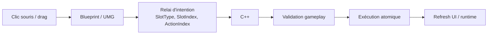
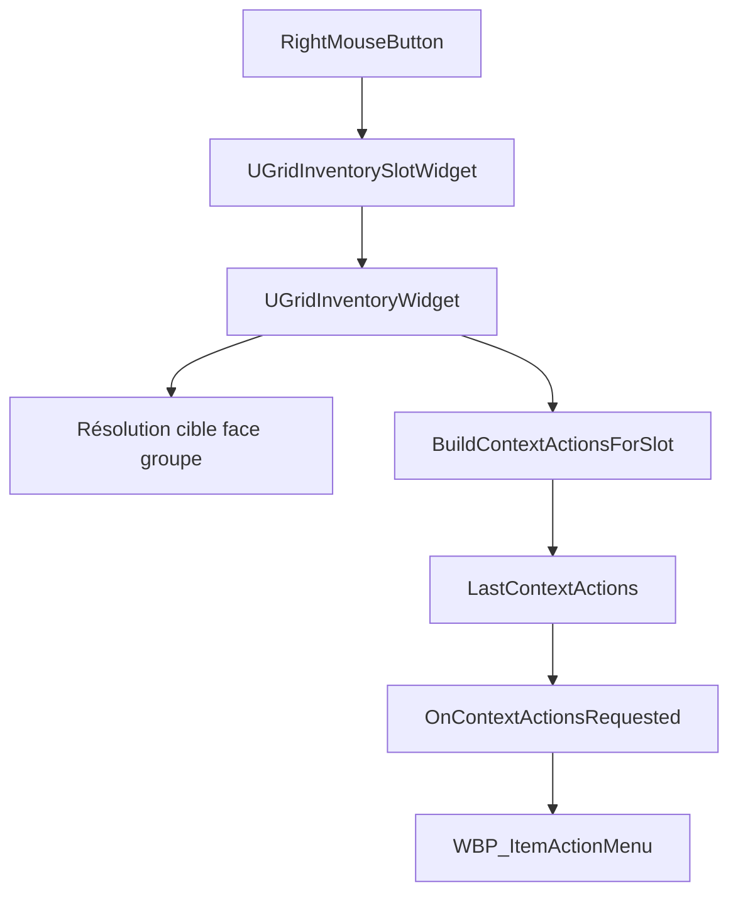
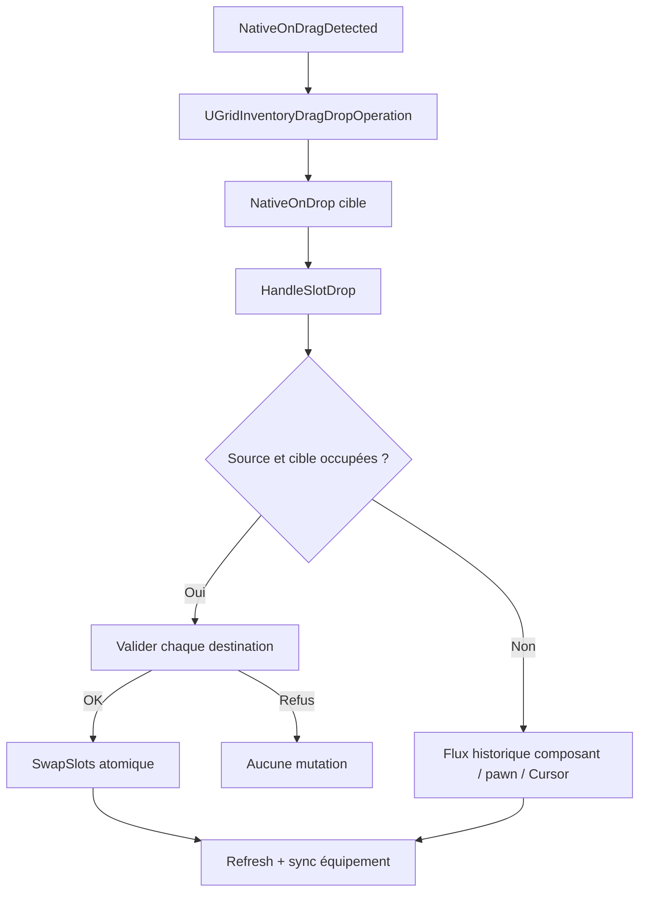
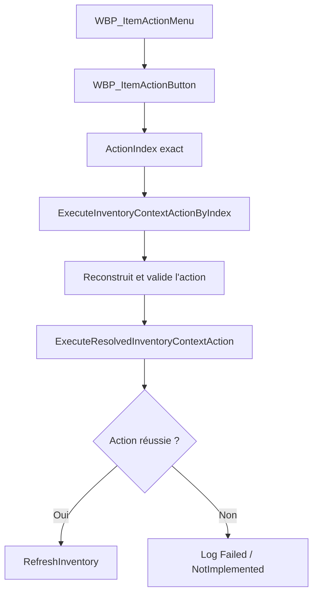
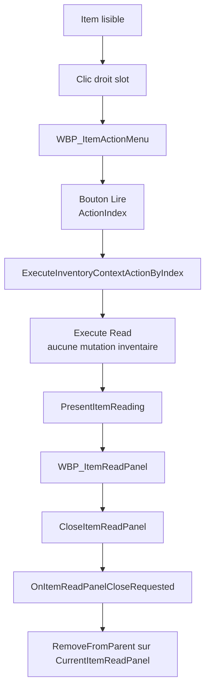
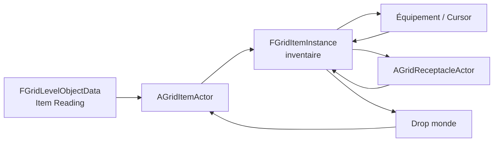
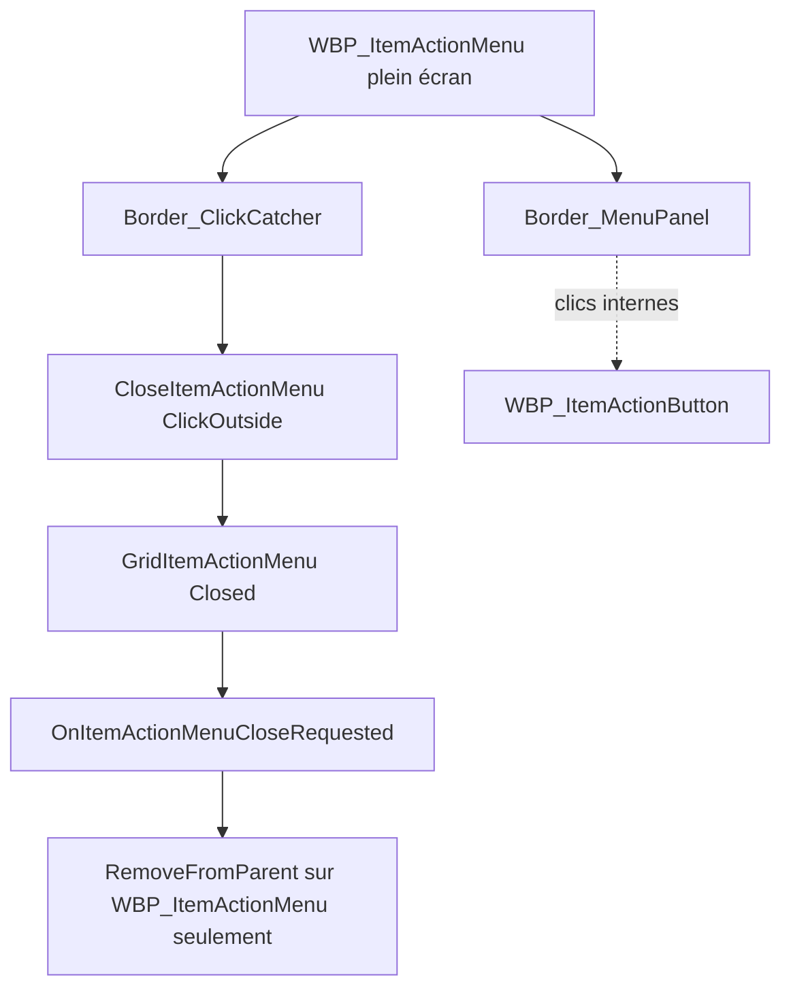

# Inventory Interaction Routing

Ce document consolide le routage Blueprint / C++ des interactions d'inventaire. Il décrit le système tel qu'il doit rester maintenable après l'ajout du menu contextuel, des actions par index, des swaps atomiques et des transferts vers les cibles en face du groupe.

## Règle Générale

`C++ = règles, validation, exécution gameplay`.

Le C++ possède l'état d'inventaire, les règles de compatibilité, les transferts atomiques, les effets gameplay et les logs.

`Blueprint / UMG = présentation, layout, relai d'intention`.

Les Blueprints affichent les slots, tooltips, menus et panneaux. Ils captent les événements UI, puis appellent une fonction C++ explicite. Ils ne doivent pas contenir de logique gameplay durable.

Séparation des responsabilités :



## Tableau Des Interactions

| Interaction | Capture | Validation | Exécution | Refresh UI | Logs principaux |
|---|---|---|---|---|---|
| Clic gauche slot | `UGridInventorySlotWidget` puis `UGridInventoryWidget::HandleRegisteredSlotClicked` | `UGridInventoryWidget` et `UGridPartyInventoryComponent` | Fonctions cursor/equipment du pawn et du composant | `RefreshInventory` après mutation | `GridInventory UI MainHandClicked`, `OffHandClicked`, `Drop` |
| Clic droit slot | `UGridInventorySlotWidget::NativeOnMouseButtonDown` | `BuildContextActionsForSlot`, `UGridItemContextActionLibrary` | Aucune mutation à l'ouverture | Blueprint ouvre `WBP_ItemActionMenu` via `OnContextActionsRequested` | `GridInventory RightClick`, `GridItemActions Build` |
| Drag/drop | `UGridInventorySlotWidget::NativeOnDragDetected` / `NativeOnDrop` | `UGridInventoryWidget::HandleSlotDrop` | Swap atomique ou transfert via composant/pawn | `RefreshInventory`; `SyncHeldVisualFromSelectedCharacterEquipment` si main touchée | `GridInventory UI Drop`, `GridInventory SwapSlots` |
| Clic action menu | `WBP_ItemActionButton` | Action reconstruite et validée par index | `ExecuteInventoryContextActionByIndex` puis `ExecuteResolvedInventoryContextAction` | `RefreshInventory` si action exécutée | `GridItemActions ExecuteByIndex`, `Execute ...` |
| Clic extérieur menu | `WBP_ItemActionMenu` click catcher | Blueprint vérifie que le clic est hors panneau | `CloseItemActionMenu("ClickOutside")` puis retrait du menu uniquement | Pas de refresh gameplay | `GridItemActionMenu Closed` |
| Tooltip hover | `WBP_ItemToolTip` / slot widget | Lecture passive de la définition d'item | Aucune mutation | Affichage tooltip uniquement | Pas de log requis |
| Examiner | Menu action par index | Source et action disponibles | `PresentItemExamination` | Panneau Blueprint stable à terme | `GridItemActions Execute Examine` |
| Lire | Menu action par index | Item lisible (`Book`, `Scroll`, tag ou `ReadText`) | `PresentItemReading` | Panneau Blueprint persistant | `GridItemActions Execute Read` |
| Placement sur cible | Menu action par index | Cible face au groupe, acceptation réceptacle | `UGridItemTransferService` depuis inventory/main/off hand | Refresh + sync visuel si source équipée | `GridItemActions Execute PlaceOnTarget`, `GridItemTransfer` |
| Insertion serrure | Menu action par index | WallLock face au groupe et clé compatible | `TransferInventorySlotToWallLock` | Refresh après succès | `GridItemActions Execute InsertIntoTarget`, `GridWallLock UnlockSuccess` |
| Equip | Menu action par index | Slot exact dans `SelectedAction.EquipmentSlot` | `EquipItemFromInventorySlot` | Refresh + sync visuel/lumière | `GridItemActions Execute Equip` |
| Enlever | Menu action par index | Slot source équipé et inventaire disponible | `UnequipItemToInventory` | Refresh + sync visuel/lumière | `GridItemActions Execute Unequip` |
| Drop au sol | Menu action par index | Source valide et runtime actif | `TryDropItemInstanceAtCell`, puis retrait source | Refresh + sync visuel si source équipée | `GridItemActions Execute DropToGround` |

Lecture rapide :

| Question | Réponse |
|---|---|
| Qui capte ? | `UGridInventorySlotWidget`, `WBP_ItemActionMenu`, `WBP_ItemActionButton` |
| Qui valide ? | `UGridInventoryWidget`, `UGridItemContextActionLibrary`, services C++ |
| Qui exécute ? | `ExecuteInventoryContextActionByIndex`, `ExecuteResolvedInventoryContextAction`, `UGridItemTransferService` |
| Qui rafraîchit ? | `UGridInventoryWidget::RefreshInventory`, synchronisation visuelle du pawn, recompute lumière |

## Flux Clic Droit

1. Le slot reçoit `RightMouseButton` dans `UGridInventorySlotWidget::NativeOnMouseButtonDown`.
2. Le slot appelle `OwningInventoryWidget->HandleItemSlotRightClicked(SlotType, SlotIndex)`.
3. `UGridInventoryWidget` reconstruit `LastContextItem`, `LastFacingTargetContext` et `LastContextActions`.
4. `UGridItemContextActionLibrary` résout la cible face au groupe et génère les actions compatibles.
5. `OnContextActionsRequested(SlotType, SlotIndex)` est diffusé.
6. `WBP_GridInventory` crée ou affiche `WBP_ItemActionMenu`.
7. Le Blueprint positionne seulement `Border_MenuPanel`, pas le widget plein écran.



## Flux Drag/Drop

1. `UGridInventorySlotWidget` crée un `UGridInventoryDragDropOperation` avec source, index, item et split éventuel.
2. Le slot cible appelle `HandleSlotDrop(SourceType, SourceIndex, TargetType, TargetIndex, bSplitStack, RequestedQuantity)`.
3. Si source et cible sont occupées et hors Cursor, `HandleSlotDrop` tente un swap atomique.
4. Le swap valide chaque item contre son slot de destination avant mutation.
5. Si le swap est impossible, rien n'est déplacé.
6. Les autres flux continuent d'utiliser les fonctions historiques du composant/pawn pour les slots vides ou le Cursor.
7. Après mutation, l'UI est rafraîchie et les visuels équipés sont resynchronisés si une main est touchée.



## Flux Menu Contextuel

Le menu visible doit toujours exécuter les actions par index.

Règle stricte : ne jamais appeler `ExecuteInventoryContextAction(ActionType, ...)` depuis le menu visible.

Le bouton doit appeler :

```text
ExecuteInventoryContextActionByIndex(SourceSlotType, SourceSlotIndex, ActionIndex)
```

L'ancienne API par `ActionType` reste disponible uniquement pour compatibilité technique. Elle refuse les actions ambiguës, par exemple plusieurs actions `Equip`, avec `Reason=AmbiguousActionType`.



## Flux Lire

```text
Item lisible
  -> clic droit
  -> action Lire
  -> ExecuteInventoryContextActionByIndex
  -> Execute Read
  -> PresentItemReading
  -> WBP_GridInventory crée WBP_ItemReadPanel
  -> fermeture par bouton ou clic extérieur
```



### Per-instance readable content

Le contenu de lecture suit l'instance complète :



Après ramassage, `FGridItemInstance` est la source de vérité pour `ReadableContentAsset`, `ReadableContentId`, `ReadTitleOverride` et `ReadTextOverride`. Les transferts inventaire/équipement utilisent des copies complètes de la structure. Les chemins réceptacle, pickup, drop et état runtime recopient explicitement les champs de lecture.

`OverrideReadableText` reste indépendant et réservé aux objets lisibles directement dans le monde.

## Flux Fermeture Par Clic Extérieur

1. `WBP_ItemActionMenu` reste plein écran.
2. `Border_ClickCatcher` ou `Button_CloseArea` couvre l'écran derrière `Border_MenuPanel`.
3. Le clic extérieur appelle `OwnerInventoryWidget.CloseItemActionMenu("ClickOutside")`.
4. `UGridInventoryWidget` loggue `GridItemActionMenu Closed Reason=ClickOutside`.
5. Le Blueprint reçoit `OnItemActionMenuCloseRequested` et retire uniquement `WBP_ItemActionMenu`.

`RemoveFromParent` ne doit jamais viser `WBP_GridInventory`.



## Règles De Maintenance

- Les Blueprints ne décident pas si un item est compatible avec une main, une serrure ou un réceptacle.
- Les Blueprints ne retirent pas eux-mêmes un item de l'inventaire ou de l'équipement.
- Les Blueprints ne doivent pas ouvrir une porte, déverrouiller une serrure ou déplacer un item par logique locale.
- Toute action visible du menu conserve son `ActionIndex`.
- Toute mutation C++ doit préserver l'atomicité : succès complet ou aucun changement.
- Le Cursor peut rester pour les anciens flux, mais il ne doit pas être utilisé pour les swaps occupés ou les transferts `PlaceOnTarget` depuis une main équipée.

## Logs Utiles

- `GridInventory RightClick`
- `GridItemActions Build`
- `GridItemActions ExecuteByIndex`
- `GridItemActions Execute Equip`
- `GridItemActions Execute Unequip`
- `GridItemActions Execute DropToGround`
- `GridItemActions Execute PlaceOnTarget`
- `GridInventory SwapSlots`
- `GridEquipmentLight Recompute`
- `GridItemActionMenu Closed`
- `GridItemTransfer Success/Failed`
