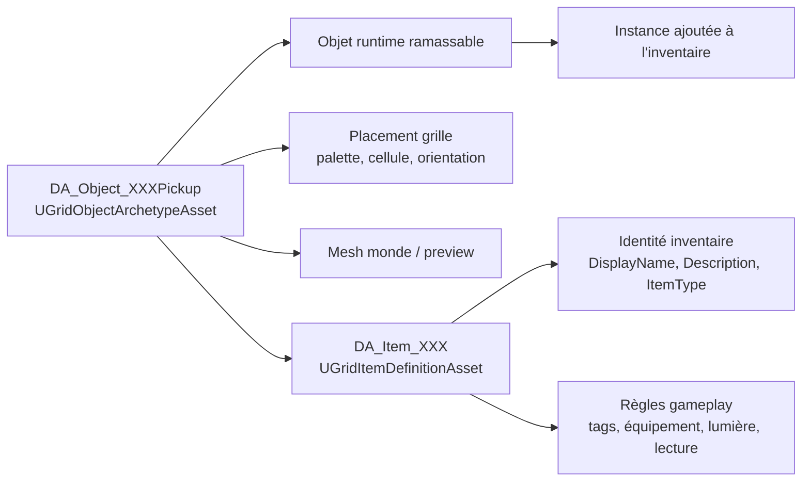
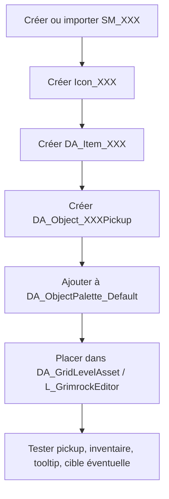

# Guide de création des items ramassables et plaçables

Statut : **guide de production Design / Content**  
Portée : **assets Unreal, configuration éditeur et textes affichés au joueur**  
Ne remplace pas : `docs/Architecture/ITEM_PICKUP_AND_PLACEMENT_FOUNDATION.md`, qui décrit le socle runtime réellement implémenté.

---

## 1. Objet du document

Ce document fixe la procédure standard pour créer un objet de jeu pouvant être ramassé au sol, placé dans une alcôve ou un autre réceptacle, affiché dans l'inventaire, manipulé par le curseur, éventuellement équipé, lancé, utilisé comme clé, composant, torche, arme, nourriture, outil ou objet de quête.

Le but est d'éviter de redécouvrir à chaque nouvel item la différence entre :

- l'item logique ;
- l'objet plaçable dans la grille ;
- son mesh ;
- son acteur Blueprint ;
- son entrée de palette ;
- son comportement dans les réceptacles ;
- son affichage dans le tooltip d'inventaire ;
- ses textes visibles par le joueur.

---

## 2. Règle fondamentale de langue

Règle absolue :

> Tous les textes affichés au joueur doivent être en français.

Cela concerne notamment :

```text
DisplayName
Description
ReadableText
LockedMessage
UnlockedMessage
MissingKeyMessage
InteractionFeedback
Text_ItemName
Text_ItemType
Text_Description
Text_Weight
messages de validation visibles en jeu
messages d'échec ou de réussite visibles en jeu
```

Les éléments techniques restent en anglais, car ils servent au code, aux liens, aux assets, aux tags et à la stabilité des données :

```text
ItemDefinitionId
ArchetypeId
AssetName
ClassName
Enum value
ItemTags
ObjectCategory
SupportedType
Parameter name
Blueprint class name
Static mesh name
Material name
```

Exemple correct :

```text
AssetName        = DA_Item_CopperKey
ItemDefinitionId = Key_Copper
ItemType         = Key
ItemTags         = Key, Key.Copper, Key.Dungeon
DisplayName      = Clé en cuivre
Description      = Petite clé en cuivre usée par le temps. Elle ouvre sans doute une serrure simple à proximité.
```

Exemple incorrect :

```text
DisplayName = Copper Key
Description = A small copper key, worn by age.
```

### 2.1 Cas particulier de `ItemType`

`ItemType` est une valeur technique d'enum et reste en anglais dans les assets :

```text
ItemType = Key
ItemType = Weapon
ItemType = Gem
ItemType = Food
```

Mais l'interface joueur ne doit pas afficher ces valeurs brutes. Le tooltip doit afficher une traduction française :

```text
Key       -> Clé
Weapon    -> Arme
Shield    -> Bouclier
Armor     -> Armure
Jewelry   -> Bijou
Gem       -> Gemme
Potion    -> Potion
Scroll    -> Parchemin
Book      -> Livre
Food      -> Nourriture
Component -> Composant
Quest     -> Objet de quête
Misc      -> Divers
Torch     -> Torche
```

Si le tooltip affiche encore `Key`, `Weapon` ou `Misc`, il faut corriger l'UI, pas renommer l'enum.

---

## 3. Deux familles d'objets dans le projet

### 3.1 Objets fixes ou structurels

Ces objets appartiennent d'abord au niveau. Ils sont généralement commandés par le système de liens ou participent à la géométrie jouable.

Exemples : sols, murs, plafonds, portes, portes secrètes, boutons, leviers, plaques de pression, serrures murales, chaînes, téléporteurs, triggers, décorations fixes, lumières fixes, réceptacles eux-mêmes : alcôves, supports, autels, bols, coffres.

Ils sont principalement définis par :

```text
DA_Object_XXX
GridObjectArchetypeAsset
```

et éventuellement par :

```text
BP_XXXActor
SM_XXX
M_XXX
```

### 3.2 Items ramassables, transportables ou plaçables

Ces objets ont une identité d'item et peuvent changer de propriétaire.

Exemples : clé, pierre, torche, arme, bouclier, armure, gemme, potion, parchemin, livre, nourriture, composant, objet de quête, outil, ressource.

Ils nécessitent en général **deux DataAssets distincts** :

```text
DA_Item_XXX
GridItemDefinitionAsset

DA_Object_XXXPickup
GridObjectArchetypeAsset
```

Le premier définit **ce qu'est l'item**. Le second définit **comment cet item est placé dans un niveau**.

---

## 4. Chaîne complète d'un item ramassable

Pour un item standard, la chaîne complète est :

```text
SM_XXX
  -> mesh visuel monde / preview / équipé

Icon_XXX
  -> icône d'inventaire et tooltip

DA_Item_XXX
  -> définition logique stable de l'item

BP_GridItemActor ou BP_XXXActor
  -> représentation runtime de l'item

DA_Object_XXXPickup
  -> archétype plaçable dans la grille

DA_ObjectPalette_Default
  -> exposition dans la palette de l'éditeur

DA_GridLevelAsset / L_GrimrockEditor
  -> placement concret dans le niveau

Réceptacle.InitialContent
  -> placement initial dans une alcôve, un coffre, un support, etc.
```

Schéma de séparation logique / placement :



Flux de création recommandé :



| Élément | Responsabilité |
|---|---|
| `DA_Item_XXX` | Identité d'inventaire, type, textes joueur, tags et règles gameplay. |
| `DA_Object_XXXPickup` | Objet plaçable, palette, placement initial dans le niveau. |
| `SM_XXX` | Forme visible dans le monde, en pickup ou attachée si réutilisée. |
| `Icon_XXX` | Icône d'inventaire, tooltip et menu contextuel. |
| `DisplayName` / `Description` | Texte joueur court et stable, en français. |
| Tags | Compatibilités métier : serrure, recette, famille, lisible, etc. |
| Runtime | Interaction de pickup, transfert vers inventaire, placement dans réceptacle. |

---

## 5. `DA_Item_XXX` — définition logique de l'item

Classe Unreal :

```text
GridItemDefinitionAsset
```

Emplacement recommandé :

```text
Content/Grimrock/Core/DataAssets/Items/
```

Exemple :

```text
Content/Grimrock/Core/DataAssets/Items/DA_Item_CopperKey
```

### 5.1 Rôle

`DA_Item_XXX` est la source de vérité métier de l'item. Il répond aux questions suivantes :

- quel est l'identifiant stable ?
- quel nom voit le joueur ?
- quelle description voit le joueur ?
- quel type d'item est-ce ?
- quel poids possède-t-il ?
- quelle icône utilise le tooltip ?
- quel mesh apparaît dans le monde ?
- peut-il être équipé ?
- peut-il être lancé ?
- peut-il émettre de la lumière ?
- quels tags métier portent ses compatibilités futures ?

### 5.2 Paramètres obligatoires

| Paramètre | Rôle | Recommandation |
|---|---|---|
| `ItemDefinitionId` | Identifiant stable de gameplay | Obligatoire. Anglais technique stable. Ne doit jamais changer une fois utilisé dans un niveau. |
| `DisplayName` | Nom affiché au joueur | Obligatoire. **Toujours en français.** Sert au tooltip. |
| `Description` | Texte descriptif affiché au joueur | Recommandé. **Toujours en français.** Sert au tooltip. |
| `ItemType` | Type d'item | Obligatoire. Valeur enum technique en anglais : `Key`, `Weapon`, `Gem`, etc. |
| `Weight` | Poids unitaire | Obligatoire, même si 0. |
| `Icon` | Icône UI | Recommandé pour tout item inventoriable. |
| `WorldMesh` | Mesh dans le monde | Recommandé pour tout item ramassable. |

### 5.3 Identité

#### `ItemDefinitionId`

Convention recommandée :

```text
Key_Copper
Stone_Rough
Torch_Wooden
Gem_Blue
Weapon_Dagger_Iron
Food_Bread
Quest_RelicFragment01
```

Règles :

- ne pas mettre `DA_` dans l'identifiant ;
- ne pas utiliser d'espaces ;
- préférer l'anglais technique stable ;
- ne jamais réutiliser un identifiant pour un autre item ;
- ne pas renommer après placement dans un niveau.

#### `DisplayName`

Nom joueur, toujours en français.

Exemples corrects :

```text
Clé en cuivre
Pierre brute
Torche en bois
Gemme bleue
Dague en fer
Pain
Fragment de relique
```

Exemples incorrects :

```text
Copper Key
Rough Stone
Wooden Torch
Blue Gem
Iron Dagger
Bread
```

#### `Description`

Texte du tooltip, toujours en français.

Exemples corrects :

```text
Petite clé en cuivre usée par le temps. Elle ouvre sans doute une serrure simple à proximité.

Pierre brute assez lourde pour maintenir une plaque de pression enfoncée.

Torche en bois enduite de résine. Elle peut éclairer les couloirs obscurs du donjon.

Gemme bleue soigneusement taillée. Elle semble destinée à un mécanisme ancien.
```

Exemples incorrects :

```text
A small copper key, worn by age.

A rough stone heavy enough to hold down a pressure plate.
```

### 5.4 Type d'item

`ItemType` doit être choisi dans `EGridItemType` :

```text
None
Torch
Weapon
Shield
Armor
Jewelry
Key
Gem
Potion
Scroll
Book
Food
Component
Quest
Misc
```

Règles :

- une clé doit être `Key` ;
- une pierre simple peut être `Misc` ou `Component` ;
- un objet de quête doit être `Quest` si sa perte peut bloquer une progression ;
- une gemme de mécanisme doit être `Gem` ou `Quest` selon son importance ;
- l'interface joueur doit traduire le type en français dans le tooltip.

### 5.5 Poids

`Weight` est le poids unitaire.

| Type | Poids indicatif |
|---|---:|
| Clé | 0.05 à 0.10 |
| Pierre légère | 0.5 à 1.5 |
| Torche | 1.0 |
| Gemme | 0.1 |
| Arme légère | 1.0 à 3.0 |
| Arme lourde | 4.0 à 8.0 |
| Armure | 5.0 à 25.0 |

### 5.6 Stack

| Paramètre | Rôle |
|---|---|
| `bStackable` | Autorise plusieurs unités dans une même case d'inventaire. |
| `MaxStackSize` | Taille maximale d'une pile. |

Règles : clé, arme, armure généralement non stackables ; composants, nourriture et ressources souvent stackables ; pierre selon usage.

### 5.7 Équipement

| Paramètre | Rôle |
|---|---|
| `CompatibleEquipmentSlots` | Liste des slots où l'item peut être équipé. |
| `EquippedMesh` | Mesh utilisé si l'item est visible sur le personnage. |

### 5.8 Action rapide de combat — potion ou parchemin

Pour rendre une potion ou un parchemin exécutable depuis
`WBP_GridCombatHud`, activer `Provides Quick Item Combat Action` dans son
`GridItemDefinitionAsset`, puis configurer `Quick Item Combat Action`.

Potion de soins ou de mana :

```text
TargetingPolicy       Self
ResolutionProfile    Effect
EffectProfile        RestoreHealth et/ou RestoreMana
```

Parchemin offensif :

```text
TargetingPolicy       FirstAxialTarget
ResolutionProfile    Attack
OffensiveProfile     profil de dégâts et portée
```

Le code impose automatiquement l'identité `Use_<ItemDefinitionId>`, la source
`QuickItem` et une consommation minimale d'une unité. Voir
`docs/Design/MON12_8_4_QUICK_ITEM_COMBAT_ACTIONS.md` pour les réglages complets.

Exemples : arme -> `MainHand`; bouclier -> `OffHand`; torche -> `MainHand` / `OffHand`; amulette -> `Amulet`; anneau -> `Ring1` / `Ring2`.

Pour une clé :

```text
CompatibleEquipmentSlots = vide
EquippedMesh = vide
```

### 5.8 Visuels

| Paramètre | Rôle |
|---|---|
| `Icon` | Icône inventaire et tooltip. |
| `WorldMesh` | Mesh utilisé lorsque l'item est dans le monde. |
| `EquippedMesh` | Mesh utilisé lorsqu'il est équipé ou tenu. |

Règles :

- `Icon` carré, lisible, idéalement 512x512 avec alpha ;
- `WorldMesh` avec pivot propre et échelle UE correcte ;
- `EquippedMesh` peut rester vide tant que l'item n'est pas visible en main.

### 5.9 Lancer d'objet

| Paramètre | Rôle |
|---|---|
| `bThrowable` | Autorise le lancer. |
| `ThrowSpeed` | Vitesse initiale. |
| `ThrowArc` | Composante verticale. |
| `ThrowLifeSeconds` | Durée de vie du projectile. |
| `ThrowImpactDropOffset` | Offset après impact. |

Clé : généralement non lançable au début. Pierre : lançable. Objet de quête : éviter le lancer tant que la restauration n'est pas robuste.

### 5.10 Lumière

| Paramètre | Rôle |
|---|---|
| `bCanEmitLight` | Item capable d'émettre de la lumière. |
| `bDefaultLightEnabled` | État initial. |
| `LightRadius` | Rayon lumineux. |

Torche typique :

```text
bCanEmitLight = true
bDefaultLightEnabled = true
LightRadius = 600
```

Clé :

```text
bCanEmitLight = false
```

### 5.11 Tags métier

`ItemTags` décrit la nature métier de l'item. Les tags sont techniques et restent en anglais.

Exemples :

```text
Key
Key.Copper
Key.Dungeon
Key.Prison
Tool
Tool.LockpickSet
Quest
Quest.CrownFragment
Gem
Gem.Blue
Throwable
WeightObject
```

Règles :

- les tags métier appartiennent à `DA_Item_XXX` ;
- ne pas les recopier inutilement dans `DA_Object_XXXPickup` ;
- utiliser les tags pour les compatibilités futures : serrures, recettes, mécanismes, filtres d'inventaire ;
- les tags ne sont pas affichés au joueur, sauf interface debug.

---

## 6. Impact sur le tooltip d'inventaire

Le tooltip doit lire les informations depuis `DA_Item_XXX` et l'instance runtime.

### 6.1 Champs issus de `DA_Item_XXX`

| Élément tooltip | Source | Langue joueur |
|---|---|---|
| `ItemIcon` | `Icon` | Image |
| `Text_ItemName` | `DisplayName` | Français obligatoire |
| `Text_ItemType` | `ItemType` converti en libellé UI | Français obligatoire |
| `Text_Description` | `Description` | Français obligatoire |
| `Text_Weight` | `Weight` | Français obligatoire pour le libellé, valeur numérique conservée |
| Indication lumière | `bCanEmitLight`, `bDefaultLightEnabled`, état runtime | Français obligatoire |

### 6.2 Champs issus de l'instance runtime

| Élément tooltip | Source |
|---|---|
| Quantité | `FGridItemInstance.Quantity` |
| Lumière actuellement active | `FGridItemInstance.bLightsEnabled` |
| Identité runtime | `RuntimeObjectId`, seulement debug |
| Propriétaire | `OwnerType`, debug ou diagnostics |

Règle importante : le tooltip ne doit pas dépendre de `DA_Object_XXXPickup`. `DA_Object_XXXPickup` sert au placement dans le monde, pas à l'identité d'inventaire.

### 6.3 Libellés recommandés pour le tooltip

Exemple Copper Key :

```text
Text_ItemName        = Clé en cuivre
Text_ItemType        = Clé
Text_Description     = Petite clé en cuivre usée par le temps. Elle ouvre sans doute une serrure simple à proximité.
Text_Weight          = Poids : 0.1
Text_Quantity        = Quantité : 1
```

Exemple pierre :

```text
Text_ItemName        = Pierre brute
Text_ItemType        = Divers
Text_Description     = Pierre brute assez lourde pour maintenir une plaque de pression enfoncée.
Text_Weight          = Poids : 1.0
Text_Quantity        = Quantité : 1
```

---

## 7. `SM_XXX` — Static Mesh

Emplacement recommandé :

```text
Content/Grimrock/Meshes/Items/
```

Exemples :

```text
SM_Key_Copper
SM_Stone_Rough
SM_Torch_Wooden
SM_Gem_Blue
```

Paramètres attendus :

- échelle correcte en centimètres UE ;
- pivot utile ;
- orientation cohérente ;
- matériaux assignés ;
- collision simple suffisante ;
- pas de transform exotique importé depuis Blender ;
- `Apply All Transforms` côté Blender si nécessaire avant export.

Pour un item ramassable :

```text
WorldMesh = mesh mobile / ramassable
PreviewMesh = souvent le même mesh
EquippedMesh = mesh spécifique si tenu/équipé
```

Pour un objet structurel :

```text
FixedMesh = partie fixe
MovingMesh = partie animée
PreviewMesh = fallback ou preview éditeur
```

---

## 8. `BP_XXXActor` — acteur runtime

La majorité des items peut utiliser :

```text
AGridItemActor
BP_GridItemActor
```

Créer un `BP_XXXActor` spécifique seulement si l'item a besoin de logique ou de composants particuliers : torche avec lumière visible, objet animé, projectile particulier, item avec plusieurs composants, item interactif spécial, item équipé avec sockets particuliers.

Pour la Copper Key, commencer avec l'acteur item générique.

---

## 9. `DA_Object_XXXPickup` — objet plaçable dans le niveau

Classe Unreal :

```text
GridObjectArchetypeAsset
```

Emplacement recommandé :

```text
Content/Grimrock/Core/DataAssets/ObjectArchetypes/Items/
```

Exemple :

```text
DA_Object_KeyCopperPickup
```

### 9.1 Rôle

`DA_Object_XXXPickup` est l'entrée plaçable dans la grille. Il répond aux questions : comment l'objet apparaît-il dans la palette, quel type de niveau est créé lorsqu'on le place, où peut-il être placé, quel mesh sert à la preview, quel acteur runtime est utilisé, quel `DA_Item_XXX` est injecté dans l'objet placé.

### 9.2 Paramètres principaux

| Paramètre | Valeur pour un pickup |
|---|---|
| `ArchetypeId` | `Item_CopperKey_Pickup`, `Item_Stone_Rough_Pickup`, etc. |
| `DisplayName` | Nom dans la palette. Français recommandé pour cohérence éditeur, même si non affiché au joueur. |
| `SupportedType` | `Item` |
| `ObjectCategory` | `Item` |
| `Category` | `Items`, `Items/Keys`, `Items/Quest`, etc. |
| `PlacementKind` | `Floor` ou `Center`, parfois `Edge` |
| `bCanShareCell` | généralement `true` |
| `bCanShareAnchor` | généralement `true` |
| `PreviewMesh` | mesh monde ou preview |
| `PreviewMaterial` | optionnel |
| `RuntimeActorClass` | généralement vide pour item si le runtime item a son chemin propre, ou classe compatible si le pipeline le requiert |
| `ItemActorClass` | `BP_GridItemActor` ou spécialisation |
| `PlacementZOffset` | hauteur au-dessus du sol |
| `DefaultBehavior.Item.ItemDefinitionAsset` | `DA_Item_XXX` |
| `DefaultBehavior.Item.ItemDefinitionId` | identifiant stable de l'item |

### 9.3 `ArchetypeId`

Convention recommandée :

```text
Item_CopperKey_Pickup
Item_RoughStone_Pickup
Item_WoodenTorch_Pickup
Item_BlueGem_Pickup
Item_IronDagger_Pickup
```

Ne pas mettre `DA_` dans `ArchetypeId`; ne pas confondre avec `ItemDefinitionId`.

### 9.4 `SupportedType`

Pour un item ramassable :

```text
SupportedType = Item
```

### 9.5 Catégorie palette

Recommandations :

```text
Category = Items
Category = Items/Keys
Category = Items/Tools
Category = Items/Weapons
Category = Items/Food
Category = Items/Quest
```

`ObjectCategory` doit rester :

```text
ObjectCategory = Item
```

### 9.6 Placement

Pour un item au sol :

```text
PlacementKind = Floor
```

ou :

```text
PlacementKind = Center
```

Pour un item posé sur une arête de la cellule :

```text
PlacementKind = Edge
```

Attention : le runtime applique des règles d'accessibilité différentes entre un item central et un item sur arête.

### 9.7 DefaultBehavior.Item

Lien essentiel entre l'objet plaçable et l'item logique :

```text
DefaultBehavior.Item.ItemDefinitionAsset = DA_Item_CopperKey
DefaultBehavior.Item.ItemDefinitionId    = Key_Copper
```

Renseigner les deux quand c'est possible.

---

## 10. Impact de `DA_ObjectPalette_Default`

`DA_ObjectPalette_Default` contrôle ce que l'éditeur de grille propose dans sa palette.

Créer `DA_Item_XXX` et `DA_Object_XXXPickup` ne suffit pas toujours. Il faut aussi ajouter :

```text
DA_Object_XXXPickup
```

à :

```text
DA_ObjectPalette_Default
```

ou à l'asset de palette actuellement utilisé par `L_GrimrockEditor`.

Effet attendu :

```text
Grimrock Grid Editor Mode
  -> catégorie Items / Keys
  -> Clé en cuivre
```

Le placement doit créer un objet de niveau :

```text
Type = Item
ArchetypeId = Item_CopperKey_Pickup
ItemDefinitionAsset = DA_Item_CopperKey
ItemDefinitionId = Key_Copper
```

À vérifier : l'objet apparaît dans la bonne catégorie, la preview s'affiche, le placement crée bien un objet `Item`, le runtime génère un item ramassable, l'item rejoint l'inventaire au clic.

---

## 11. Placement direct dans le niveau

Un item peut être placé directement dans `DA_GridLevelAsset::Objects`.

Champs importants :

```text
Type = Item
CellX / CellY
Edge
ArchetypeId = Item_XXX_Pickup
ItemDefinitionAsset = DA_Item_XXX
ItemDefinitionId = XXX
```

Règle de résolution : utiliser `ItemDefinitionAsset` si renseigné ; sinon `ItemDefinitionId` ; sinon `DefaultBehavior.Item` de l'archétype.

Bonne pratique : renseigner `ArchetypeId` pour le placement et la preview, mais aussi `ItemDefinitionAsset` ou `ItemDefinitionId` pour éviter toute ambiguïté.

---

## 12. Item placé dans un réceptacle

Pour placer un item dans une alcôve, un support, un autel, un bol, un coffre ou tout autre réceptacle :

```text
Objet réceptacle
  -> Behavior.Receptacle.InitialContent
      -> ItemDefinition = DA_Item_XXX
      -> Quantity = N
```

Règles :

- le réceptacle contient des items logiques, pas des `DA_Object_XXXPickup` ;
- utiliser `DA_Item_XXX`, pas l'archétype de pickup ;
- le visuel contenu est généré par le réceptacle ;
- le joueur retire ensuite l'item vers l'inventaire ;
- les textes affichés dans le tooltip viennent toujours de `DA_Item_XXX`.

Exemple :

```text
Alcove_A
InitialContent:
  - DA_Item_CopperKey
```

---

## 13. Exemple complet : Copper Key / Clé en cuivre

### 13.1 Static Mesh

```text
SM_Key_Copper
Path: Content/Grimrock/Meshes/Items/SM_Key_Copper
```

### 13.2 Icône

```text
Icon_CopperKey
Path: Content/Grimrock/Icons/Items/Icon_CopperKey
```

### 13.3 Définition d'item

```text
DA_Item_CopperKey
Class: GridItemDefinitionAsset
Path: Content/Grimrock/Core/DataAssets/Items/DA_Item_CopperKey
```

Paramètres :

```text
ItemDefinitionId = Key_Copper
DisplayName = Clé en cuivre
Description = Petite clé en cuivre usée par le temps. Elle ouvre sans doute une serrure simple à proximité.
ItemType = Key
Weight = 0.1
bStackable = false
MaxStackSize = 1
CompatibleEquipmentSlots = empty
Icon = Icon_CopperKey
WorldMesh = SM_Key_Copper
EquippedMesh = empty
bThrowable = false
bCanEmitLight = false
ItemTags:
  - Key
  - Key.Copper
  - Key.Dungeon
```

### 13.4 Acteur item

```text
BP_GridItemActor
```

ou, seulement si nécessaire plus tard :

```text
BP_KeyItemActor
```

### 13.5 Archétype plaçable

```text
DA_Object_KeyCopperPickup
Class: GridObjectArchetypeAsset
Path: Content/Grimrock/Core/DataAssets/ObjectArchetypes/Items/DA_Object_KeyCopperPickup
```

Paramètres :

```text
ArchetypeId = Item_CopperKey_Pickup
DisplayName = Clé en cuivre
SupportedType = Item
ObjectCategory = Item
Category = Items/Keys
PlacementKind = Floor
bCanShareCell = true
bCanShareAnchor = true
PreviewMesh = SM_Key_Copper
PreviewMaterial = empty or copper material
RuntimeActorClass = empty unless required by current item pipeline
ItemActorClass = BP_GridItemActor
PlacementZOffset = 12
DefaultBehavior.Item.ItemDefinitionAsset = DA_Item_CopperKey
DefaultBehavior.Item.ItemDefinitionId = Key_Copper
```

### 13.6 Palette

Ajouter :

```text
DA_Object_KeyCopperPickup
```

à :

```text
DA_ObjectPalette_Default
```

### 13.7 Placement au sol

Dans `L_GrimrockEditor` / `DA_GridLevelAsset` :

```text
Type = Item
ArchetypeId = Item_CopperKey_Pickup
ItemDefinitionAsset = DA_Item_CopperKey
ItemDefinitionId = Key_Copper
CellX / CellY = position choisie
Edge = None ou edge si placement bord
```

### 13.8 Placement dans une alcôve

Dans l'objet alcôve :

```text
Behavior.Receptacle.InitialContent:
  - ItemDefinition = DA_Item_CopperKey
    Quantity = 1
```

### 13.9 Serrure compatible

Dans la serrure murale :

```text
Behavior.Lock.AcceptedKeyItems:
  - DA_Item_CopperKey

Behavior.Lock.AcceptedKeyIds:
  - Key_Copper
```

Messages visibles par le joueur, si renseignés dans la serrure :

```text
LockedMessage = La serrure est verrouillée.
UnlockedMessage = La serrure s'ouvre avec un déclic métallique.
MissingKeyMessage = Il vous manque la clé adéquate.
```

Lien :

```text
CopperWallLock.Activated -> Door.Open
```

---

## 14. Exemple complet : pierre ramassable

### 14.1 Définition d'item

```text
DA_Item_RoughStone
ItemDefinitionId = Stone_Rough
DisplayName = Pierre brute
Description = Pierre brute assez lourde pour maintenir une plaque de pression enfoncée.
ItemType = Misc
Weight = 1.0
bStackable = false
WorldMesh = SM_Stone_Rough
Icon = Icon_Stone_Rough
bThrowable = true
ThrowSpeed = 1200
ThrowArc = 0.08
ThrowLifeSeconds = 5
ThrowImpactDropOffset = 12
ItemTags:
  - Stone
  - Throwable
  - WeightObject
```

### 14.2 Archétype plaçable

```text
DA_Object_StonePickup
ArchetypeId = Item_RoughStone_Pickup
DisplayName = Pierre brute
SupportedType = Item
ObjectCategory = Item
Category = Items/Props
PlacementKind = Floor
PreviewMesh = SM_Stone_Rough
DefaultBehavior.Item.ItemDefinitionAsset = DA_Item_RoughStone
DefaultBehavior.Item.ItemDefinitionId = Stone_Rough
```

---

## 15. Exemple complet : torche ramassable

### 15.1 Définition d'item

```text
DA_Item_WoodenTorch
ItemDefinitionId = Torch_Wooden
DisplayName = Torche en bois
Description = Torche en bois enduite de résine. Elle peut éclairer les couloirs obscurs du donjon.
ItemType = Torch
Weight = 1.0
bStackable = false
WorldMesh = SM_Torch_Wooden
Icon = Icon_Torch_Wooden
CompatibleEquipmentSlots:
  - MainHand
  - OffHand
bCanEmitLight = true
bDefaultLightEnabled = true
LightRadius = 600
ItemTags:
  - Torch
  - LightSource
```

### 15.2 Archétype plaçable

```text
DA_Object_WoodenTorchPickup
ArchetypeId = Item_WoodenTorch_Pickup
DisplayName = Torche en bois
SupportedType = Item
ObjectCategory = Item
Category = Items/Light
PlacementKind = Floor
PreviewMesh = SM_Torch_Wooden
DefaultBehavior.Item.ItemDefinitionAsset = DA_Item_WoodenTorch
DefaultBehavior.Item.ItemDefinitionId = Torch_Wooden
```

---

## 16. Erreurs fréquentes

### 16.1 Créer seulement `DA_Item_XXX`

Symptôme : l'item existe comme définition, mais il n'apparaît pas dans la palette et n'est pas facilement plaçable.

Correction : créer aussi `DA_Object_XXXPickup` et l'ajouter à `DA_ObjectPalette_Default`.

### 16.2 Créer seulement `DA_Object_XXXPickup`

Symptôme : l'objet est plaçable, mais l'inventaire ne connaît pas correctement son nom, son type, son icône ou ses tags.

Correction : créer `DA_Item_XXX` et l'assigner dans `DefaultBehavior.Item`.

### 16.3 Mettre les tags métier sur l'archétype au lieu de l'item

Symptôme : la compatibilité de serrure, recette ou filtre d'inventaire ne fonctionne pas de manière stable.

Correction : mettre `Key.Copper`, `Tool.LockpickSet`, `Quest`, etc. dans `DA_Item_XXX.ItemTags`.

### 16.4 Utiliser `DA_` dans les identifiants

Mauvais :

```text
ItemDefinitionId = DA_Item_CopperKey
ArchetypeId = DA_Object_KeyCopperPickup
```

Bon :

```text
ItemDefinitionId = Key_Copper
ArchetypeId = Item_CopperKey_Pickup
```

### 16.5 Confondre pickup et contenu de réceptacle

Mauvais :

```text
Receptacle.InitialContent = DA_Object_KeyCopperPickup
```

Bon :

```text
Receptacle.InitialContent = DA_Item_CopperKey
```

### 16.6 Oublier `DA_ObjectPalette_Default`

Symptôme : l'asset existe, mais l'éditeur ne le propose pas.

Correction : ajouter l'archétype dans la palette utilisée par l'éditeur.

### 16.7 Rédiger les textes joueur en anglais

Mauvais :

```text
DisplayName = Copper Key
Description = A small copper key, worn by age.
MissingKeyMessage = You need the right key.
```

Bon :

```text
DisplayName = Clé en cuivre
Description = Petite clé en cuivre usée par le temps. Elle ouvre sans doute une serrure simple à proximité.
MissingKeyMessage = Il vous manque la clé adéquate.
```

### 16.8 Afficher les enums brutes dans le tooltip

Mauvais tooltip :

```text
Copper Key
Key
A small copper key, worn by age.
```

Bon tooltip :

```text
Clé en cuivre
Clé
Petite clé en cuivre usée par le temps. Elle ouvre sans doute une serrure simple à proximité.
```

---

## 17. Checklist création d'un nouvel item

### 17.1 Préparation visuelle

- [ ] Créer ou importer `SM_XXX`.
- [ ] Vérifier échelle, pivot, orientation.
- [ ] Créer ou importer `Icon_XXX`.
- [ ] Vérifier fond alpha et lisibilité à petite taille.
- [ ] Créer ou assigner matériaux.

### 17.2 Définition logique

- [ ] Créer `DA_Item_XXX`.
- [ ] Renseigner `ItemDefinitionId` en anglais technique stable.
- [ ] Renseigner `DisplayName` en français.
- [ ] Renseigner `Description` en français.
- [ ] Choisir `ItemType`.
- [ ] Vérifier que l'UI traduit `ItemType` en français.
- [ ] Renseigner `Weight`.
- [ ] Configurer `bStackable` / `MaxStackSize`.
- [ ] Assigner `Icon`.
- [ ] Assigner `WorldMesh`.
- [ ] Assigner `EquippedMesh` si nécessaire.
- [ ] Configurer `bThrowable` si nécessaire.
- [ ] Configurer lumière si nécessaire.
- [ ] Ajouter les `ItemTags` techniques.

### 17.3 Archétype plaçable

- [ ] Créer `DA_Object_XXXPickup`.
- [ ] Renseigner `ArchetypeId`.
- [ ] Renseigner `DisplayName` en français recommandé.
- [ ] Mettre `SupportedType = Item`.
- [ ] Mettre `ObjectCategory = Item`.
- [ ] Choisir `Category`.
- [ ] Choisir `PlacementKind`.
- [ ] Assigner `PreviewMesh`.
- [ ] Assigner `ItemActorClass`.
- [ ] Configurer `PlacementZOffset`.
- [ ] Assigner `DefaultBehavior.Item.ItemDefinitionAsset`.
- [ ] Assigner `DefaultBehavior.Item.ItemDefinitionId`.

### 17.4 Palette

- [ ] Ajouter `DA_Object_XXXPickup` à `DA_ObjectPalette_Default`.
- [ ] Vérifier la catégorie dans l'éditeur.
- [ ] Vérifier que la preview s'affiche.
- [ ] Vérifier que le libellé palette est compréhensible.

### 17.5 Placement

- [ ] Placer l'item dans `L_GrimrockEditor`.
- [ ] Vérifier `Type = Item`.
- [ ] Vérifier `ArchetypeId`.
- [ ] Vérifier `ItemDefinitionAsset`.
- [ ] Vérifier `ItemDefinitionId`.
- [ ] Vérifier position cellule/arête.

### 17.6 Réceptacle optionnel

- [ ] Placer l'item dans `Behavior.Receptacle.InitialContent` si nécessaire.
- [ ] Vérifier `Quantity`.
- [ ] Tester retrait vers inventaire.

### 17.7 Test PIE

- [ ] L'item apparaît dans le monde.
- [ ] Le curseur d'interaction apparaît.
- [ ] Le clic ramasse l'item.
- [ ] L'item est ajouté au personnage sélectionné.
- [ ] Le tooltip affiche nom, type, icône, description, poids.
- [ ] Tous les textes visibles dans le tooltip sont en français.
- [ ] La quantité est correcte.
- [ ] L'item peut être déposé si le système le permet.
- [ ] L'item peut être replacé dans un réceptacle compatible.
- [ ] Le comportement spécifique fonctionne : clé, torche, pierre lançable, etc.

---

## 18. Checklist spécifique : clé

- [ ] `ItemType = Key`.
- [ ] `ItemDefinitionId` stable, par exemple `Key_Copper`.
- [ ] `DisplayName` en français, par exemple `Clé en cuivre`.
- [ ] `Description` en français.
- [ ] Tag générique `Key`.
- [ ] Tag spécifique `Key.Copper`.
- [ ] Non stackable.
- [ ] Non throwable au début, sauf décision contraire.
- [ ] Pas d'équipement.
- [ ] Poids faible.
- [ ] Icône claire.
- [ ] Mesh monde visible.
- [ ] Archétype pickup présent dans palette.
- [ ] Serrure compatible configurée avec `AcceptedKeyItems` et/ou `AcceptedKeyIds`.
- [ ] Messages de serrure visibles en français : `MissingKeyMessage`, `UnlockedMessage`, etc.

---

## 19. Checklist spécifique : objet de poids / projectile

- [ ] `ItemType = Misc` ou `Component`.
- [ ] `DisplayName` en français.
- [ ] `Description` en français.
- [ ] `bThrowable = true`.
- [ ] Paramètres de lancer configurés.
- [ ] Poids cohérent.
- [ ] Collision et mesh adaptés.
- [ ] Tags `Throwable`, `WeightObject` si utile.
- [ ] Test avec plaque de pression si l'objet doit servir de poids.

---

## 20. Images recommandées pour enrichir cette documentation

Des images seraient utiles, mais il ne faut pas mélanger cette étape avec la création de la Copper Key. La documentation peut être enrichie plus tard avec quatre schémas simples :

```text
1. Chaîne complète d'un item ramassable
   SM_XXX -> Icon_XXX -> DA_Item_XXX -> DA_Object_XXXPickup -> Palette -> Niveau -> Inventaire

2. Différence DA_Item_XXX / DA_Object_XXXPickup
   Identité gameplay vs placement éditeur

3. Sources du tooltip
   DA_Item_XXX + FGridItemInstance -> WBP_ItemToolTip

4. Placement au sol vs contenu de réceptacle
   DA_Object_XXXPickup pour le monde, DA_Item_XXX pour InitialContent
```

Règle pour ces futures images :

- ne pas surcharger le document ;
- préférer des schémas très lisibles ;
- conserver les identifiants techniques en anglais ;
- afficher les exemples joueur en français : `Clé en cuivre`, `Pierre brute`, `Torche en bois`.

---

## 21. Per-instance readable content

Pour les notes, lettres, parchemins et journaux partageant le même visuel, séparer les assets :

| Asset / donnée | Responsabilité |
|---|---|
| `DA_Item_Note_Generic` | Identité d'inventaire, poids, icône, mesh, tags et fallback `ReadText`. |
| `DA_ReadableContent_XXX` | Titre et corps propres à un document. |
| `DA_Object_NotePickup_Generic` | Archétype de placement réutilisable. |
| `FGridLevelObjectData.Item|Reading` | Contenu choisi pour l'instance placée. |
| `FGridItemInstance.Reading` | Source de vérité après ramassage. |

Workflow recommandé :

1. Créer une seule définition `DA_Item_Note_Generic` pour une famille visuelle de notes.
2. Créer un `DA_ReadableContent_XXX` par contenu narratif.
3. Placer `DA_Object_NotePickup_Generic` dans le niveau.
4. Dans l'inspecteur de l'objet placé, renseigner `ReadableContentAsset` sous `Item Reading / Contenu lisible de l'item ramassé`.
5. Utiliser `ReadTitleOverride` et `ReadTextOverride` uniquement pour le prototypage ou une exception locale.
6. Vérifier en PIE que pickup, lecture, drop au sol et passage par un réceptacle conservent le contenu.

Les champs `DefaultReadableContentAsset`, `DefaultReadableContentId`, `DefaultReadTitleOverride` et `DefaultReadTextOverride` peuvent fournir un défaut d'archétype. Ils sont copiés uniquement lors de la création d'un nouvel objet placé ; ils ne remplacent pas le contenu déjà défini sur une instance existante.

`OverrideReadableText` ne fait pas partie de ce flux. Il reste réservé aux inscriptions et objets lus directement dans le monde.

Les assets de test `DA_ReadableContent_Test_A` et `DA_ReadableContent_Test_B` doivent être créés manuellement dans Unreal Editor ; ce patch ne modifie aucun `.uasset`.

---

## 22. Règle finale

Pour tout nouvel item ramassable :

```text
DA_Item_XXX
  = identité d'inventaire et gameplay
  = source des textes joueur en français

DA_Object_XXXPickup
  = manière de placer cette identité dans un niveau

DA_ObjectPalette_Default
  = exposition dans l'éditeur

Réceptacle.InitialContent
  = contenu logique, donc DA_Item_XXX, jamais DA_Object_XXXPickup
```

Ne jamais confondre ces rôles.

Rappel final :

```text
Identifiants techniques : anglais stable.
Textes affichés au joueur : français obligatoire.
```
