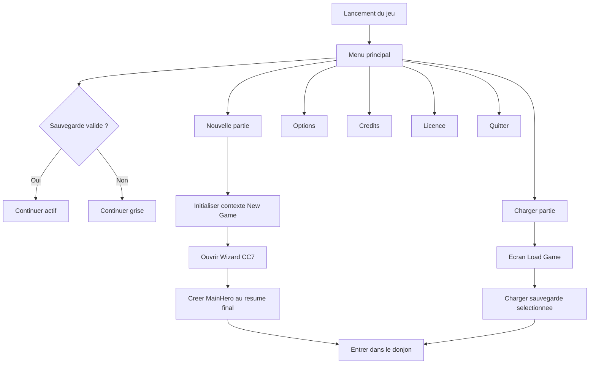

# MM0 - Menu principal et flux de demarrage

## 1. Objet

Ce document definit le menu principal cible de GrimrockPrototype et son role dans le flux global du jeu.

Le menu principal devient le point d'entree officiel avant toute partie jouable.

Options ciblees :

```text
Continuer
Nouvelle partie
Charger partie
Options
Credits
Licence
Quitter
```

MM0 est une etape de documentation. Elle ne demande pas encore d'implementation UE5 immediate.

---

## 2. Decision de conception

Le jeu doit demarrer sur un menu principal dedie.

Le bouton Nouvelle partie ne cree pas directement le personnage. Il lance le flux de nouvelle partie, puis ouvre le wizard CC7 du personnage principal.

Le bouton Continuer n'est actif que si une sauvegarde valide existe.

Le menu principal est distinct du futur menu pause en jeu.

---

## 3. Options du menu principal

| Option | Role | Disponibilite |
|---|---|---|
| Continuer | charge la sauvegarde la plus recente | actif seulement si une sauvegarde valide existe |
| Nouvelle partie | lance un nouveau flux de partie et ouvre le wizard CC7 | toujours actif |
| Charger partie | ouvre un ecran de selection des sauvegardes | actif si au moins une sauvegarde existe |
| Options | ouvre les reglages du jeu | toujours actif |
| Credits | affiche les credits du projet | toujours actif |
| Licence | affiche les licences des contenus, outils et dependances | toujours actif |
| Quitter | ferme le jeu | toujours actif |

---

## 4. Flux general



---

## 5. Lien avec CC7

Le menu principal doit etre compatible avec `CHARACTER_CREATION_CC7_WIZARD_RECRUITMENT.md`.

Le bouton Nouvelle partie lance le wizard avec le contexte :

```cpp
ERPGCharacterCreationContext::NewGameMainHero
ERPGPartyMemberKind::MainHero
```

Flux attendu :

```text
Menu principal
-> Nouvelle partie
-> Wizard CC7
-> Resume final
-> CreateInitialCharacter
-> Entree dans le donjon
```

Le menu principal ne doit pas :

- creer directement le personnage ;
- manipuler directement `PartyInventoryState` ;
- decider des regles de race, classe, attributs ou equipement ;
- remplacer le wizard CC7.

Il choisit uniquement le flux de jeu.

---

## 6. Menu principal vs menu pause

Menu principal : avant la partie.

```text
Continuer
Nouvelle partie
Charger partie
Options
Credits
Licence
Quitter
```

Menu pause futur possible : pendant la partie.

```text
Reprendre
Sauvegarder
Charger
Options
Retour au menu principal
Quitter
```

Les deux menus peuvent partager certains ecrans secondaires, mais ils ne doivent pas etre confondus.

---

## 7. Widgets UE5 cibles

Widgets recommandes :

```text
WBP_MainMenu
WBP_LoadGameMenu
WBP_OptionsMenu
WBP_Credits
WBP_License
WBP_ConfirmDialog
```

Carte recommandee :

```text
Content/GrimrockPrototype/Maps/L_MainMenu
```

Role de la carte :

- afficher le menu principal ;
- bloquer le gameplay ;
- utiliser un mode input UI ;
- afficher un fond simple, une image ou un decor 3D ;
- ne pas charger le donjon runtime tant qu'aucune partie n'est choisie.

---

## 8. Maquette visuelle cible

```text
+-------------------------------------------------------------+
|                      GRIMROCK PROTOTYPE                     |
|                                                             |
|                    Fond de donjon sombre                    |
|                                                             |
|                         Continuer                           |
|                         Nouvelle partie                     |
|                         Charger partie                      |
|                         Options                             |
|                         Credits                             |
|                         Licence                             |
|                         Quitter                             |
|                                                             |
|                    Version / Build                          |
+-------------------------------------------------------------+
```

Style recommande :

```text
Fond sombre de donjon
Pierre, cuir, metal vieilli
Boutons sobres et lisibles
Texte ivoire clair
Effets de survol discrets
Pas de style cartoon ou mobile
```

---

## 9. Etats des boutons

### Continuer

```text
Actif  : sauvegarde valide detectee
Grise  : aucune sauvegarde valide
Action : charger la sauvegarde la plus recente
```

### Nouvelle partie

```text
Actif  : toujours
Action : ouvrir le flux New Game puis le wizard CC7
```

### Charger partie

```text
Actif  : au moins une sauvegarde existe
Grise  : aucune sauvegarde disponible
Action : ouvrir WBP_LoadGameMenu
```

### Quitter

```text
Actif  : toujours
Action : demander confirmation puis quitter
```

---

## 10. Roadmap MM

### MM0 - Documentation menu principal

But : valider le present document.

Critere de sortie : le flux principal est valide avant implementation.

### MM1 - Menu principal visuel seul

But : creer une premiere maquette UE5 du menu principal.

Travail :

- creer `WBP_MainMenu` ;
- creer les sept boutons ;
- ajouter un titre ;
- ajouter un fond simple ;
- afficher Continuer grise par defaut ;
- ne pas brancher encore les sauvegardes ;
- ne pas ouvrir encore le wizard.

Critere de sortie : une capture du menu principal est validee visuellement.

### MM2 - Nouvelle partie vers CC7

But : brancher le bouton Nouvelle partie.

Travail :

- ouvrir le wizard CC7 en contexte `NewGameMainHero` ;
- conserver le blocage du gameplay pendant la creation ;
- entrer dans le donjon apres validation du personnage.

Critere de sortie : Nouvelle partie lance un flux complet jusqu'au donjon.

### MM3 - Continuer

But : charger automatiquement la derniere sauvegarde.

Travail :

- detecter l'existence d'une sauvegarde valide ;
- activer ou griser le bouton ;
- charger la sauvegarde la plus recente ;
- afficher un message propre en cas d'echec.

### MM4 - Charger partie

But : choisir une sauvegarde.

Travail :

- creer `WBP_LoadGameMenu` ;
- afficher une liste de sauvegardes ;
- afficher date, nom du personnage et lieu si disponible ;
- charger la sauvegarde selectionnee ;
- ajouter un bouton Retour.

### MM5 - Options, Credits, Licence, Quitter

But : completer les ecrans secondaires.

Travail :

- creer `WBP_OptionsMenu` ;
- creer `WBP_Credits` ;
- creer `WBP_License` ;
- creer `WBP_ConfirmDialog` ;
- brancher Quitter avec confirmation.

---

## 11. Captures d'ecran attendues

Pour valider MM1, transmettre :

1. `WBP_MainMenu` en Designer avec la hierarchie visible ;
2. `WBP_MainMenu` en PIE ou Standalone ;
3. bouton Continuer grise sans sauvegarde ;
4. etat de survol d'un bouton ;
5. ecran Options provisoire si deja present ;
6. ecran Credits provisoire si deja present ;
7. ecran Licence provisoire si deja present.

Controles :

- lisibilite ;
- style medieval fantastique sobre ;
- ordre des boutons ;
- etat grise de Continuer ;
- absence de surcharge visuelle ;
- coherence avec l'identite visuelle CC6 ;
- compatibilite avec le futur wizard CC7.

---

## 12. Taches Codex recommandees

### Tache Codex MM1 - Widget menu principal visuel

Travail :

- creer ou preparer `WBP_MainMenu` ;
- ajouter les sept boutons ;
- exposer des hooks simples pour les actions ;
- ne pas modifier le systeme de sauvegarde ;
- ne pas brancher CC7.

### Tache Codex MM2 - Nouvelle partie vers wizard

Travail :

- brancher Nouvelle partie vers le flux CC7 ;
- conserver un diff minimal ;
- ne pas ajouter le systeme de sauvegarde complet.

### Tache Codex MM3 - Detection sauvegarde

Travail :

- exposer une fonction `HasAnyValidSaveGame()` ou equivalent ;
- activer ou griser Continuer et Charger partie ;
- ne pas creer encore d'ecran de liste complexe.

---

## 13. Critere de validation cible

Le menu principal est valide lorsque :

- le jeu demarre sur un ecran principal clair ;
- les sept options prevues sont visibles ;
- Continuer est grise sans sauvegarde ;
- Nouvelle partie mene au wizard CC7 ;
- Charger partie ouvre un ecran de chargement ;
- Options, Credits et Licence ouvrent des ecrans dedies ;
- Quitter demande confirmation ou quitte proprement ;
- le menu principal reste distinct du menu pause ;
- le style visuel reste coherent avec l'identite medieval fantastique sombre du projet.
