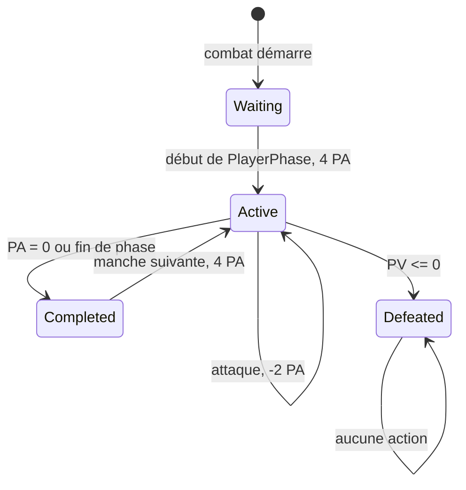

# MON12.3 — État de tour et points d'action des personnages

> Ce document décrit le jalon MON12.3 validé. Depuis MON12.4, un seul
> personnage est `Active` à la fois et reçoit ses 4 PA au début de son propre
> tour. Voir `MON12_4_GLOBAL_INITIATIVE_INDIVIDUAL_TURNS.md` pour le
> comportement courant.

## Résultat

MON12.3 remplace le verrou binaire `Ready / AlreadyActed` par un état runtime
autoritaire et un budget de points d'action pour chaque personnage du groupe.

- chaque personnage vivant reçoit `4 PA` au début de la phase joueur ;
- une attaque existante coûte `2 PA` ;
- un personnage peut donc attaquer deux fois tant que les autres validations
  MON11 réussissent ;
- une troisième attaque est refusée avec
  `InsufficientActionPoints` sans tirage aléatoire, dégâts ni consommation
  d'objet ;
- les budgets des personnages sont indépendants ;
- les PA non dépensés ne sont pas reportés à la manche suivante ;
- le panneau existant affiche `PA courant / maximum` et l'état de tour.

MON12.3 conserve provisoirement `PlayerPhase / EnemyPhase`. Tous les
personnages vivants sont donc `Active` pendant la phase joueur. MON12.4
introduira l'ordre d'initiative global et un seul combattant actif à la fois.

## État autoritaire

`FGridPlayerCharacterTurnState` est détenu par
`UGridTurnManagerComponent` et identifié par le `CharacterId` stable du
personnage. Il expose :

| Champ | Rôle |
| --- | --- |
| `CharacterIndex` | index actuel dans le groupe |
| `CharacterId` | identité stable |
| `State` | état individuel du tour |
| `MaximumActionPoints` | budget maximum de la manche |
| `RemainingActionPoints` | budget encore disponible |

États disponibles :

| État | Comportement MON12.3 |
| --- | --- |
| `Waiting` | combat non entré dans la phase joueur |
| `Active` | personnage vivant avec au moins 1 PA pendant `PlayerPhase` |
| `Completed` | PA épuisés ou phase joueur terminée |
| `Incapacitated` | réservé au futur système d'effets incapacitants |
| `Defeated` | PV à zéro ou moins, PA forcés à zéro |

`GetPlayerCharacterTurnState()` fournit l'instantané de lecture.
`CanCharacterAct()` vérifie l'état commun du tour et
`CanCharacterSpendActionPoints()` ajoute la vérification d'un coût précis.
Le widget ne recalcule aucune de ces règles.

## Cycle des PA pendant la migration



Au début de chaque `PlayerPhase`, `BeginPlayerCharacterPhase()` reconstruit
les états depuis les personnages réels. À la fin de la phase,
`CompletePlayerCharacterPhase()` marque tous les personnages vivants
`Completed` sans effacer la valeur diagnostique de leurs PA restants. La
manche suivante restaure ensuite le budget complet.

## Dépense d'une attaque

Le coût temporaire commun se trouve dans :

```text
UGridTurnManagerComponent::PlayerAttackActionPointCost = 2
```

Le budget initial se trouve dans :

```text
UGridTurnManagerComponent::BasePlayerActionPointsPerTurn = 4
```

Ces deux valeurs sont exposées dans les détails du composant et bornées à la
plage de conception `2–6 PA` pour le budget, `1–6 PA` pour l'attaque.

Une attaque suit cet ordre :

1. vérifier le combat, la phase, le groupe et le personnage ;
2. vérifier que le personnage peut payer 2 PA ;
3. valider l'équipement, le ciblage, la portée et la cible ;
4. dépenser 2 PA ;
5. résoudre l'attaque avec le `CombatRandomStream` ;
6. diffuser la demande et le résultat existants.

Une validation refusée avant l'étape 4 ne dépense aucun PA. Le coût réellement
appliqué est conservé dans `FGridPlayerAttackRequest::ActionPointCost` et dans
le log `[GridPlayerAttack] ... APCost=2`.

`AttackerAlreadyActed` reste dans l'enum uniquement pour préserver les valeurs
sérialisées et la compatibilité historique. Le pipeline courant utilise
`InsufficientActionPoints`. La fonction
`HasCharacterCommittedAttackThisPhase()` est dépréciée et ne sert plus
d'autorité ; elle indique seulement si le personnage a dépensé des PA.

## Actualisation du panneau sans Tick

Le TurnManager diffuse `OnPlayerCharacterTurnStateChanged` après :

- l'attribution des PA de la manche ;
- chaque dépense acceptée ;
- la fin de la phase joueur ;
- le passage à `Defeated`.

`UGridCombatActionPanelWidget` relit alors les sources et expose :

- `TurnState` ;
- `RemainingActionPoints` ;
- `MaximumActionPoints` ;
- `AttackActionPointCost` ;
- `bCanAct` ;
- `bCanPayAttackCost`.

Les boutons de mains restent l'adaptateur MON12.2. Ils sont actifs uniquement
si le slot est offensif et si le personnage peut payer les 2 PA. Ils seront
remplacés par le catalogue d'actions en MON12.6–MON12.7.

## Modification manuelle obligatoire dans UE5

Aucun `.uasset` n'est modifié automatiquement.

Après compilation C++ :

1. ouvrir
   `/Game/GrimrockPrototype/Blueprints/UI/Combat/WBP_GridCombatActionPanel` ;
2. dans la zone contenant `Text_Health` et `Text_Mana`, ajouter un
   `TextBlock` ;
3. le nommer exactement `Text_ActionPoints` ;
4. cocher **Is Variable** ;
5. placer ce texte à proximité des PV et de la mana ;
6. prévoir une largeur suffisante pour `PA 4 / 4` ;
7. ne créer aucun binding Blueprint ni événement dans l'Event Graph ;
8. compiler et sauvegarder le Widget Blueprint.

Le C++ remplit automatiquement le texte. `Text_ActionPoints` est
`BindWidgetOptional` : l'absence du widget ne provoque pas d'erreur de
compilation, mais les PA ne seront pas visibles.

Vérifier également sur le composant `GridTurnManagerComponent` :

```text
Base Player Action Points Per Turn = 4
Player Attack Action Point Cost = 2
```

## Tests automatisés

Filtre :

```text
Grimrock.Monsters.MON12
```

MON12.3 ajoute :

```text
Grimrock.Monsters.MON12.CharacterActionPoints.Lifecycle
```

Ce test couvre :

- `4/4 PA` et `Active` au début de la phase ;
- première attaque à `2/4 PA` ;
- seconde attaque à `0/4 PA` et `Completed` ;
- troisième attaque refusée sans tirage ni dégâts ;
- indépendance des PA du second personnage ;
- passage à `Completed` en fin de phase ;
- restauration à `4/4 PA` à la manche suivante ;
- passage à `Defeated` et PA forcés à zéro.

Les tests MON11 qui validaient l'ancien verrou ont été migrés : ils valident
maintenant deux attaques acceptées, puis le refus de la troisième.

## Validation PIE détaillée

1. équiper au moins trois shurikens en `MainHand` ;
2. lancer un combat et attendre `PlayerPhase` ;
3. vérifier `Active` et `PA 4 / 4` ;
4. cliquer une première fois sur le shuriken ;
5. vérifier un seul projectile, un seul décrément et `PA 2 / 4` ;
6. vérifier que le personnage reste `Active` et que le bouton reste actif ;
7. cliquer une seconde fois ;
8. vérifier un second projectile, un second décrément, `PA 0 / 4` et
   `Completed` ;
9. cliquer une troisième fois ;
10. vérifier l'absence de projectile, de dégâts et de décrément, avec le
    feedback « Ce personnage n'a pas assez de points d'action. » ;
11. sélectionner un autre personnage vivant et vérifier son budget indépendant
    à `PA 4 / 4` ;
12. terminer la phase joueur avec `NumPad 2` ;
13. après la phase ennemie, vérifier le retour à `Active` et `PA 4 / 4` ;
14. vérifier qu'un personnage à zéro PV affiche `Defeated`, `PA 0 / 4` et ne
    peut plus attaquer ;
15. contrôler les non-régressions du shuriken, de la torche et de `NumPad 7`.

## Hors périmètre

- initiative globale et combattant actif unique : MON12.4 ;
- coût PA du déplacement et réserve PAM : MON12.5 ;
- coût porté par chaque définition d'action : MON12.6 ;
- quatre panneaux et barre d'initiative UMG : MON12.7 ;
- sorts, mana, zones et réactions.
