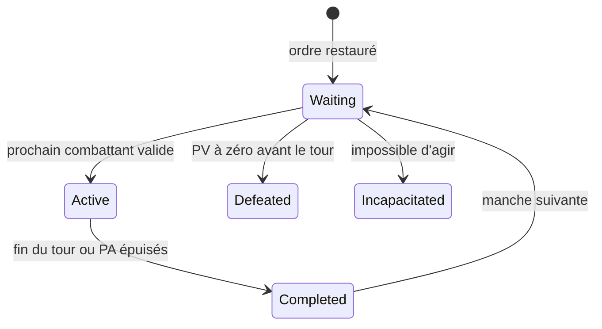

# MON12.4 — Initiative globale et tours individuels

## Résultat

MON12.4 remplace l'alternance de deux phases de camp par un ordre autoritaire
unique qui mélange les personnages et les monstres.

- l'initiative est jetée une fois au début de la rencontre ;
- l'ordre reste identique pendant les manches suivantes ;
- un seul combattant est `Active` à un instant donné ;
- les personnages reçoivent leurs `4 PA` au début de leur propre tour ;
- un personnage ne peut jamais employer les PA d'un autre ;
- les monstres conservent leurs PA et leur planification MON5–MON10 ;
- un participant vaincu ou incapable d'agir est ignoré ;
- la fin du dernier tour déclenche `EndingRound`, puis la manche suivante ;
- le TurnManager expose déjà les données et événements de la future barre
  d'initiative MON12.7.

Aucun widget UMG ni asset Unreal n'est ajouté dans cette étape.

## Calcul de l'initiative

Pour un personnage :

```text
InitiativeBase = 10 + DerivedStats.Initiative
InitiativeTotale = InitiativeBase + d20
```

Pour un monstre :

```text
InitiativeBase = MonsterDefinition.Initiative
InitiativeTotale = InitiativeBase + d20
```

Départage, dans l'ordre :

1. initiative totale la plus élevée ;
2. initiative de base la plus élevée ;
3. Dextérité finale la plus élevée ;
4. `CharacterId` ou identifiant persistant dans l'ordre lexical.

Le jet utilise `InitiativeRandomStream`, initialisé à partir du même
`ActiveEncounterRandomSeed` que la rencontre avec un sel fixe. Ce flux séparé
garantit simultanément :

- le même ordre pour la même rencontre ;
- aucune variation des futurs jets d'attaque lorsque le nombre de participants
  change ou lorsque l'affichage de l'initiative évolue.

## Instantané autoritaire

Chaque participant est représenté par
`FGridCombatantInitiativeEntry` :

| Champ | Rôle |
| --- | --- |
| `CombatantId` | identité stable du personnage ou du monstre |
| `Side` | `Party` ou `Monster` |
| `CharacterIndex` | index du membre du groupe, sinon `INDEX_NONE` |
| `DisplayName` | nom destiné à l'interface |
| `Portrait` | portrait du personnage ou icône du monstre |
| `InitiativeRoll` | résultat du d20 de rencontre |
| `InitiativeBase` | bonus avant le d20 |
| `InitiativeTotal` | valeur utilisée pour l'ordre |
| `Dexterity` | deuxième départage déterministe |
| `CurrentHealth / MaximumHealth` | état vital compact |
| `State` | `Waiting`, `Active`, `Completed`, `Incapacitated`, `Defeated` |

`InitiativeOrder` conserve cet ordre complet. `CurrentInitiativeIndex` indique
le participant en cours. `GetUpcomingInitiativeOrder()` fournit uniquement le
combattant actif puis les participants encore en attente pendant la manche.

## Cycle d'une manche



Le séquenceur applique les règles suivantes :

1. remettre les participants vivants à `Waiting` ;
2. activer la première entrée valide ;
3. exécuter un tour de personnage ou le plan d'IA du monstre ;
4. marquer l'entrée `Completed` ;
5. ignorer les entrées `Defeated` et `Incapacitated` ;
6. passer à `EndingRound` après la dernière entrée ;
7. restaurer les états de la manche sans relancer l'initiative.

## Tour d'un personnage

Lorsqu'un personnage devient actif :

- son état passe de `Waiting` à `Active` ;
- ses PA passent de `0 / 4` à `4 / 4` ;
- il devient le personnage sélectionné dans l'interface transitoire ;
- l'entrée groupe est déverrouillée ;
- les autres personnages restent `Waiting` ou `Completed` avec `0 PA` s'ils
  n'ont pas encore commencé leur tour.

Une requête d'attaque provenant d'un autre personnage est refusée avec
`NotActiveCombatant`, avant tout jet, dégât ou consommation de ressource.

`NumPad 2` appelle désormais `EndActivePlayerTurn()` et termine uniquement le
tour du personnage actif. `EndPlayerPhase()` reste un adaptateur de
compatibilité C++ pour les anciens appels.

Une attaque existante coûte toujours `2 PA` :

- première attaque : `4 -> 2 PA`, le tour continue ;
- deuxième attaque : `2 -> 0 PA`, le tour se termine automatiquement ;
- le participant suivant devient immédiatement actif.

## Tour d'un monstre

Lorsqu'une entrée monstre devient active, le TurnManager réutilise sans
duplication :

- `MonsterDefinition.ActionPointsPerTurn` ;
- la perception et le pathfinding MON3–MON4 ;
- les profils d'IA MON6–MON7 ;
- la résolution, l'animation, l'audio et les VFX MON6–MON10.

Le groupe est verrouillé pendant l'exécution du plan. Lorsque le monstre a
épuisé ses PA, attendu ou terminé toutes ses actions, son entrée passe à
`Completed` et l'ordre global reprend.

## Compatibilité des phases

Les valeurs sérialisées `PlayerPhase` et `EnemyPhase` sont conservées pendant
la migration, mais leur sens change :

| Valeur | Sens MON12.4 |
| --- | --- |
| `PlayerPhase` | le combattant actif appartient au groupe |
| `EnemyPhase` | le combattant actif est un monstre |
| `EndingRound` | toutes les entrées de la manche sont terminées |

Elles ne représentent donc plus « tous les héros », puis « tous les
monstres ». Une future normalisation pourra les remplacer par `RoundActive`
une fois les systèmes de déplacement et d'actions génériques migrés.

## Événements pour la barre d'initiative

Le TurnManager publie :

| Événement | Utilisation future |
| --- | --- |
| `OnTurnOrderChanged` | reconstruire les slots après création, nouvelle manche ou retrait |
| `OnActiveCombatantChanged` | agrandir le nouveau premier slot |
| `OnCombatantStateChanged` | actualiser état, PV et retrait d'un vaincu |

Les widgets MON12.7 devront lire `GetInitiativeOrder()` ou
`GetUpcomingInitiativeOrder()` après ces notifications. Ils ne jetteront, ne
trieront et ne simuleront jamais l'initiative eux-mêmes.

## Tests automatisés

Filtre :

```text
Grimrock.Monsters.MON12.GlobalInitiative
```

Tests ajoutés :

```text
Grimrock.Monsters.MON12.GlobalInitiative.OrderRules
Grimrock.Monsters.MON12.GlobalInitiative.Lifecycle
```

Ils couvrent :

- le d20 borné et reproductible ;
- les quatre critères de tri ;
- l'intercalage groupe/monstre dans un tableau commun ;
- un seul personnage actif et doté de PA ;
- le refus d'une attaque hors tour ;
- la sélection automatique du personnage actif ;
- l'avancement par `Fin du tour` ;
- l'exécution d'un tour monstre dans le même ordre ;
- le démarrage de la manche suivante ;
- l'absence de nouveau jet entre deux manches.

## Validation PIE

1. lancer le combat avec au moins deux personnages vivants et deux monstres ;
2. rechercher les lignes `[GridInitiative]` dans l'Output Log ;
3. vérifier que chaque participant possède `Base`, `Roll` et `Total` ;
4. vérifier que le participant au total le plus élevé agit en premier, même
   s'il s'agit d'un monstre ;
5. pendant un tour joueur, vérifier que seul le personnage actif est
   sélectionné, `Active` et à `PA 4 / 4` ;
6. tenter une attaque avec un autre index et vérifier
   `NotActiveCombatant` sans projectile ni dégât ;
7. attaquer une fois et vérifier `PA 2 / 4` ;
8. attaquer une seconde fois et vérifier le passage automatique au prochain
   portrait ou au prochain monstre ;
9. lors d'un autre tour joueur, presser `NumPad 2` et vérifier que seul ce tour
   se termine ;
10. laisser la manche s'achever et vérifier que le même ordre revient, avec
    `Round=2` et les PA restaurés au début de chaque tour ;
11. vaincre un monstre avant son tour et vérifier qu'il est ignoré ;
12. contrôler les non-régressions shuriken, torche, audio, VFX et victoire.

## Hors périmètre

- coût du déplacement et PA de mobilité du groupe : MON12.5 ;
- définition et catalogue d'actions : MON12.6 ;
- widgets de quatre personnages et barre d'initiative : MON12.7 ;
- sorts, mana, zones, réactions et effets d'incapacité complets.
