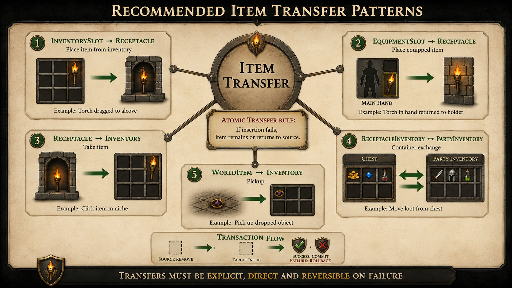
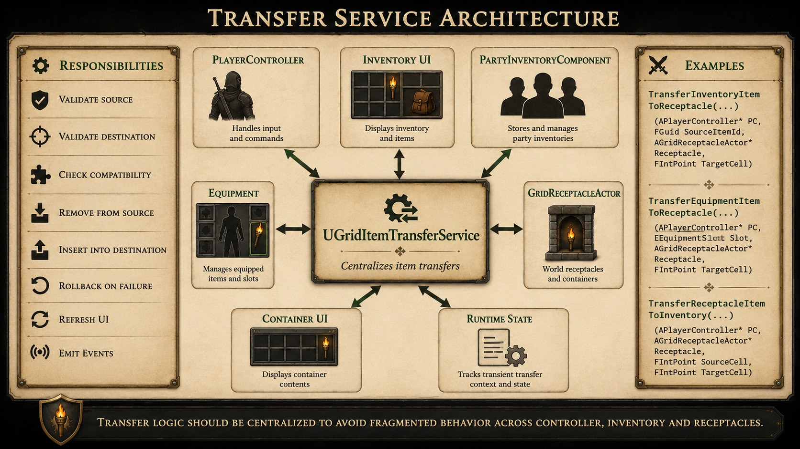
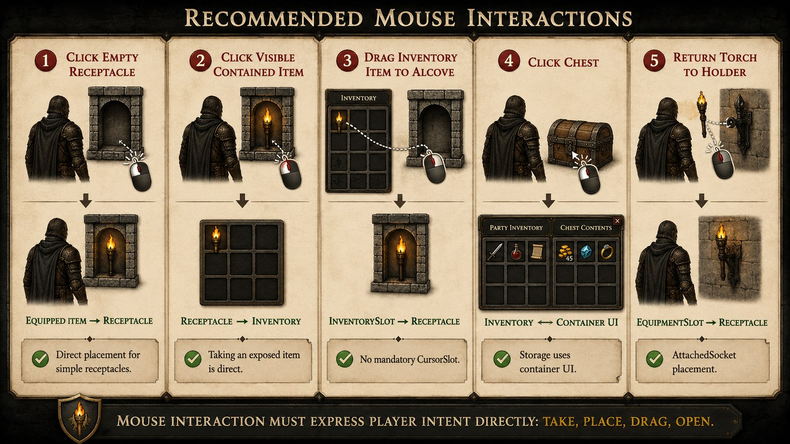
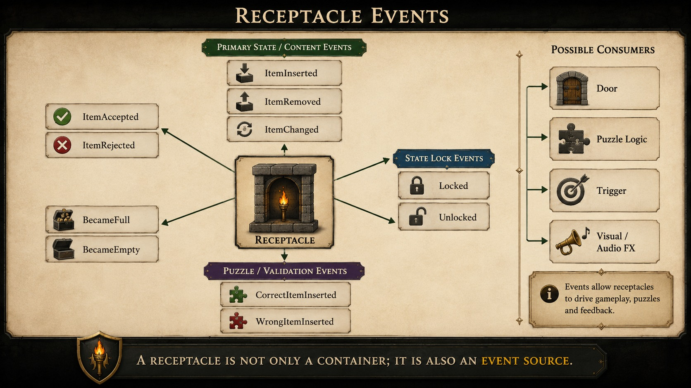
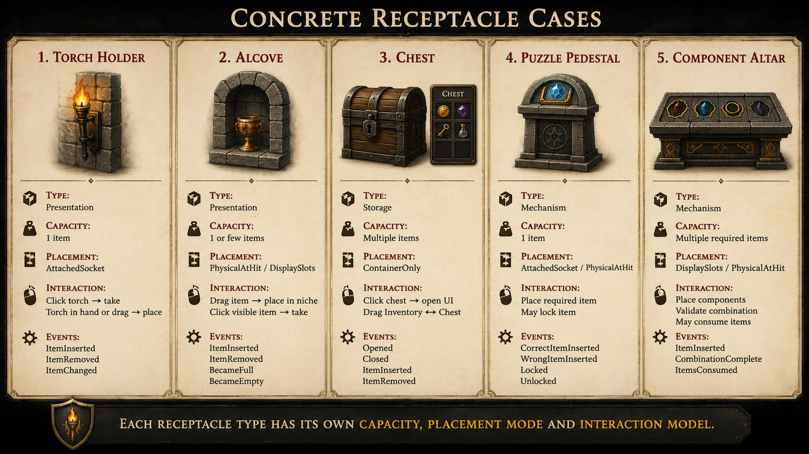

# Receptacle System

> **Statut : spécification de conception historique et prospective.**
> Le contrat réellement implémenté est documenté dans
> [`docs/Architecture/RECEPTACLE_SYSTEM_FOUNDATION.md`](../Architecture/RECEPTACLE_SYSTEM_FOUNDATION.md).
> Les enums, services et comportements proposés ci-dessous ne sont pas tous disponibles ni configurables dans les données placées actuelles.

## 1. Objet du document

Ce document constitue la référence de conception du système de réceptacles de GrimrockPrototype. Il définit le rôle d'un réceptacle, ses variantes, ses interactions avec les items et les responsabilités attendues des systèmes runtime et UI.

Cette référence doit éviter l'accumulation de corrections ponctuelles contradictoires. Toute évolution concernant les alcôves, supports, coffres, objets équipés, transferts d'inventaire ou mécanismes consommant des items doit respecter les principes décrits ici.

Le document décrit à la fois les invariants à préserver et une architecture cible. Les types, enums et services présentés comme des recommandations ne doivent pas être considérés comme déjà disponibles dans le runtime. Leur introduction éventuelle doit être progressive, compatible avec les données existantes et accompagnée de tests de migration.

## 2. Définition générale

Un réceptacle est un objet du niveau capable de recevoir, contenir, exposer et éventuellement restituer un ou plusieurs items. Il représente une destination ou une source d'items avec des règles explicites de capacité, de compatibilité, de placement et d'interaction.

Un réceptacle n'est pas nécessairement un inventaire. Un support de torche ne possède qu'un emplacement visible, tandis qu'un coffre peut exposer une véritable interface de conteneur. Les deux reçoivent des items, mais leur organisation et leur usage sont différents.

## 3. Exemples de réceptacles

Le concept couvre notamment :

- support de torche ;
- crochet mural ;
- alcôve ;
- niche ;
- socle ;
- piédestal ;
- autel ;
- présentoir ;
- râtelier d'armes ;
- étagère ;
- coffre ;
- caisse ;
- tonneau ;
- sac ;
- armoire ;
- cadavre fouillable ;
- cache secrète ;
- serrure à gemme ;
- plaque de poids ;
- balance ;
- réceptacle sacrificiel ;
- emplacement de cristal ;
- mécanisme consommant un objet.

Cette liste décrit des usages, pas nécessairement des classes C++ distinctes.

## 4. Distinction entre objet interactif, inventaire et réceptacle

Tous les réceptacles sont interactifs, mais tous les objets interactifs ne sont pas des réceptacles. Une porte, un levier ou un panneau lisible peut être interactif sans recevoir d'item.


L'inventaire organise les objets possédés par un personnage ou un conteneur. Il fournit des emplacements, des règles de poids, des équipements et une interface de manipulation.

Le réceptacle représente un emplacement de réception dans le monde ou dans un conteneur. Il définit pourquoi, où et comment un item peut être inséré ou retiré. Un réceptacle de stockage peut déléguer son organisation interne à un inventaire, mais cette délégation n'est pas obligatoire.

## 5. Typologie des réceptacles


### Réceptacle de présentation

Il expose visuellement un nombre limité d'items dans le monde.

Exemples : support de torche, alcôve, niche, présentoir, étagère, râtelier d'armes.

Comportement attendu :

- insertion et retrait directs ;
- item visible et cliquable ;
- placement contrôlé par socket, point d'impact ou emplacements d'affichage ;
- capacité généralement faible ;
- absence d'interface d'inventaire complexe.

### Réceptacle de stockage

Il conserve plusieurs items et les organise comme le contenu d'un conteneur.

Exemples : coffre, caisse, tonneau, sac, armoire, cadavre fouillable, cache secrète.

Comportement attendu :

- ouverture d'une interface de conteneur ;
- transferts entre inventaire du groupe et inventaire du conteneur ;
- contenu potentiellement invisible dans le monde ;
- capacité exprimée en emplacements, poids ou volume ;
- verrouillage et persistance possibles.

### Réceptacle de mécanisme

Il reçoit un item pour produire un effet de gameplay.

Exemples : serrure à gemme, plaque de poids, balance, socle d'énigme, autel sacrificiel, emplacement de cristal.

Comportement attendu :

- validation stricte de l'item ;
- émission d'événements ;
- item conservé, restitué, verrouillé ou consommé selon le mécanisme ;
- retour visuel clair en cas d'acceptation ou de refus ;
- possibilité de déclencher des liens sans devenir un nouvel objet logique de niveau.

## 6. Capacité et organisation interne

`MaxContainedItems` définit le nombre maximal d'instances contenues. Une valeur de 1 décrit un réceptacle à emplacement unique. Une valeur supérieure autorise plusieurs items. Une capacité illimitée doit être représentée explicitement par la convention choisie par le runtime.

Les organisations internes recommandées sont :

- `SingleSlot` : un seul item ;
- `MultiSlot` : plusieurs emplacements linéaires ;
- `GridInventory` : inventaire organisé en grille ;
- `DisplaySlots` : emplacements visuels nommés ou indexés.

Capacité et organisation sont deux notions différentes. Un réceptacle multi-slot peut contenir plusieurs items tout en utilisant un placement visuel au point cliqué. `MaxContainedItems` ne décrit pas à lui seul la manière dont les items sont affichés.

## 7. Compatibilité des items

Un réceptacle peut définir les règles suivantes :


- `AcceptAnyItem` : accepte tout item valide qui n'est pas rejeté ;
- `AcceptedItemDefinitionIds` : liste d'identifiants explicitement acceptés ;
- `RejectedItemDefinitionIds` : liste d'identifiants explicitement rejetés ;
- `AcceptedItemTags` : tags fonctionnels acceptés ;
- `AcceptedItemTypes` : catégories d'items acceptées.

La validation doit suivre un ordre stable :

1. refuser un item invalide ;
2. refuser si le réceptacle est plein ;
3. refuser si l'insertion est désactivée ;
4. refuser un item explicitement rejeté ;
5. accepter si `AcceptAnyItem` est actif ;
6. accepter si le `ItemDefinitionId` est autorisé ;
7. accepter si au moins un tag est autorisé ;
8. accepter si le type est autorisé ;
9. refuser dans tous les autres cas.

Les motifs de refus doivent être distinguables dans les logs et, lorsque nécessaire, dans l'UI.

## 8. Modes de placement visuel

Les modes recommandés sont :


- `AttachedSocket` : acteur attaché à un socket ou un point fixe ;
- `PhysicalAtHit` : acteur placé dans le monde à partir du point d'impact et de la normale de surface ;
- `ContainerOnly` : contenu logique ou visible uniquement dans une UI ;
- `DisplaySlots` : acteur attaché à un emplacement d'affichage déterminé.

Le mode visuel ne doit pas modifier l'identité logique de l'item.

Une alcôve configurée en `PhysicalAtHit` doit placer l'objet dans la niche visée, en utilisant le point d'impact, la normale de surface et un léger offset. Elle ne doit pas déposer l'objet au sol ni le placer au centre arbitraire du réceptacle.

`PhysicalAtHit` n'implique pas obligatoirement une simulation physique. L'acteur peut rester immobile tout en conservant un transform dans le monde, une collision permettant de le reprendre et son identité logique dans le réceptacle. Le mode de collision et l'activation éventuelle de la physique relèvent du type d'item et du comportement recherché.

Un support de torche utilise normalement `AttachedSocket` afin de garantir une position, une orientation et un comportement lumineux stables.

## 9. Relation avec l'inventaire

Les transferts possibles comprennent :


- `Inventory -> Receptacle` ;
- `Equipment -> Receptacle` ;
- `Receptacle -> Inventory` ;
- `Receptacle -> ContainerUI` ;
- `WorldItem -> Inventory`.

Le réceptacle valide sa capacité, sa compatibilité et son mode de placement. Il ne devrait pas gérer seul toute la logique de transfert, car la source doit aussi mettre à jour sa propriété, son poids, son équipement, son curseur et son UI.

`Receptacle -> ContainerUI` désigne l'exposition du contenu par une interface dédiée, pas un changement de propriétaire vers l'UI. L'interface ne doit conserver que des références ou des identifiants nécessaires à l'affichage ; le réceptacle ou son inventaire de conteneur reste la source de vérité.

Une instance transférée doit conserver son `RuntimeObjectId`, son `ItemDefinitionId`, sa quantité et ses états persistants lorsque le gameplay l'exige.

## 10. Le problème du Cursor Slot

`CursorItem` ou `CursorSlot` ne doit pas être une étape obligatoire du gameplay. Il peut exister comme état technique temporaire pendant un drag, un échange ou une transaction, mais il ne doit pas devenir un emplacement permanent imposé au joueur.


Flux à éviter :

`Inventory -> CursorSlot -> fermeture UI -> clic monde -> Receptacle`

Ce flux fragilise l'interaction, mélange l'état de l'UI avec celui du monde et oblige le joueur à suivre une séquence artificielle.

Flux recommandé :

`Inventory -> drag & drop direct -> Receptacle`

Le curseur peut transporter techniquement l'instance pendant le drag, mais cette étape doit rester invisible dans le modèle conceptuel et être annulée atomiquement en cas d'échec.

## 11. Transferts recommandés



### InventorySlot -> Receptacle

Le drag commence depuis un emplacement d'inventaire. La destination valide l'item, puis la transaction retire l'instance de l'inventaire et l'insère dans le réceptacle.

### EquipmentSlot -> Receptacle

L'item équipé est transféré directement. Le visuel tenu est synchronisé après le succès. En cas d'échec, l'item reste équipé ou revient dans son emplacement initial.

### Receptacle -> Inventory

Un clic sur l'objet visible ou une action de retrait transfère l'instance vers l'inventaire sélectionné. Si l'inventaire est plein, le contenu reste dans le réceptacle.

### ReceptacleInventory -> PartyInventory

Pour un coffre ou un conteneur, les deux inventaires participent à une transaction entre emplacements. L'UI ne doit pas modifier directement les tableaux internes sans service de transfert.

### WorldItem -> Inventory

Le ramassage retire l'acteur du monde seulement après confirmation que l'inventaire accepte l'instance.

Tous les transferts doivent être atomiques : si l'insertion échoue, l'objet reste ou revient à sa source avec son identité et son état intacts.

Une transaction doit donc valider les deux extrémités, capturer suffisamment d'informations pour restaurer la source, effectuer le retrait et l'insertion comme une seule opération logique, puis publier les changements d'UI et les événements uniquement après le succès. Un échec intermédiaire doit déclencher un rollback sans créer de copie, perdre l'instance ni provoquer un dépôt implicite dans le monde.

## 12. Service de transfert recommandé

Une couche dédiée, par exemple `UGridItemTransferService`, doit progressivement centraliser les transactions.



Responsabilités :

- vérifier la source ;
- vérifier la destination ;
- valider la compatibilité ;
- retirer l'objet de la source ;
- insérer l'objet dans la destination ;
- restaurer l'objet en cas d'échec ;
- rafraîchir les UI ;
- émettre les événements.

Signatures indicatives, proposées comme direction d'API et non comme contrat déjà implémenté :

```cpp
bool TransferInventoryItemToReceptacle(
    UGridPartyInventoryComponent* Inventory,
    int32 CharacterIndex,
    int32 InventorySlotIndex,
    AGridReceptacleActor* Receptacle,
    const FHitResult* PlacementHit);

bool TransferEquipmentItemToReceptacle(
    UGridPartyInventoryComponent* Inventory,
    int32 CharacterIndex,
    EGridEquipmentSlot EquipmentSlot,
    AGridReceptacleActor* Receptacle,
    const FHitResult* PlacementHit);

bool TransferReceptacleItemToInventory(
    AGridReceptacleActor* Receptacle,
    int32 ContainedItemIndex,
    UGridPartyInventoryComponent* Inventory,
    int32 CharacterIndex);
```

Le service ne remplace pas les règles propres au réceptacle. Il orchestre les deux extrémités de la transaction.

## 13. Interaction souris recommandée



### Clic sur un réceptacle vide

Si le personnage tient un item compatible, le clic tente un transfert direct depuis l'équipement. Sans item tenu, le clic peut ouvrir une UI de conteneur ou ne produire aucune action selon le type.

### Clic sur un objet contenu visible

Le clic cible l'instance contenue et tente son retrait vers l'inventaire. Le réceptacle reste propriétaire tant que le transfert n'a pas réussi.

### Drag depuis l'inventaire vers une alcôve

Le point de drop fournit le `HitResult`. Une alcôve physique place l'acteur dans la niche à ce point.

### Drag depuis l'inventaire vers un coffre

Le drop vise l'interface du conteneur et transfère l'item vers un emplacement du coffre. Aucun acteur physique n'est requis.

### Drag depuis l'équipement vers un support

Le transfert retire l'item de l'emplacement équipé et l'attache au socket du support. Le visuel tenu est ensuite synchronisé.

## 14. Événements liés aux réceptacles

Le système peut exposer les événements suivants :



- `ItemInserted` ;
- `ItemRemoved` ;
- `ItemChanged` ;
- `ItemAccepted` ;
- `ItemRejected` ;
- `BecameFull` ;
- `BecameEmpty` ;
- `CorrectItemInserted` ;
- `WrongItemInserted` ;
- `Locked` ;
- `Unlocked`.

`ItemAccepted` et `ItemRejected` décrivent le résultat d'une tentative. `ItemInserted` et `ItemRemoved` décrivent une modification effective du contenu. `ItemChanged` représente une modification d'instance qui ne change pas nécessairement le nombre d'items. `BecameFull` et `BecameEmpty` ne sont émis que lors du franchissement de l'état correspondant.

`ItemInserted`, `ItemRemoved` et `ItemChanged` conviennent aux liens génériques existants. Les autres événements permettent des mécanismes plus expressifs et ne doivent être ajoutés au runtime que lorsqu'un cas concret les nécessite. Les événements de succès ne doivent être publiés qu'après validation complète de la transaction.

## 15. Sauvegarde et restauration

L'état persistant d'un réceptacle doit pouvoir inclure :

- `ObjectId` du réceptacle ;
- liste ordonnée des items contenus ;
- `RuntimeObjectId` de chaque item ;
- `ItemDefinitionId` ;
- quantité et données propres à l'instance ;
- transform du visuel physique ;
- état lumineux ;
- état verrouillé ;
- état consommé ou retiré.

Dans les structures de sauvegarde existantes, le champ persistant peut être nommé `ObjectId` tout en représentant l'identité runtime de l'item. Quel que soit le nom concret du champ, cette identité doit rester stable pendant les transferts, la sauvegarde et la restauration.

La restauration doit recréer la représentation visuelle adaptée au mode de placement. Elle doit privilégier une classe d'acteur spécifique lorsqu'elle existe, puis utiliser un acteur générique initialisé depuis `WorldMesh`.

Un item physique restauré conserve son transform. Un item attaché revient sur son socket. Un contenu `ContainerOnly` ne doit pas créer inutilement d'acteur dans le monde.

## 16. Cas concrets



### Support de torche

- Type : `Presentation`.
- Capacité : 1.
- Organisation : `SingleSlot`.
- Placement : `AttachedSocket`.
- Interaction : clic pour prendre ou remettre une torche compatible.
- Particularité : la classe Blueprint spécifique et son état lumineux doivent être préservés.

### Alcôve

- Type : `Presentation`.
- Capacité : 1 ou plusieurs items.
- Organisation : `MultiSlot` ou `DisplaySlots`.
- Placement : `PhysicalAtHit` pour une niche libre, éventuellement `DisplaySlots` pour une composition contrôlée.
- Interaction : dépôt direct depuis inventaire ou équipement, clic sur l'objet visible pour le reprendre.
- Particularité : l'objet doit apparaître dans la niche visée.

### Coffre

- Type : `Storage`.
- Capacité : plusieurs items.
- Organisation : `GridInventory`.
- Placement : `ContainerOnly`.
- Interaction : ouverture d'une interface dédiée et transferts entre deux inventaires.
- Particularité : le coffre ne doit pas réutiliser l'interaction d'une alcôve comme modèle principal.

### Socle d'énigme

- Type : `Mechanism`.
- Capacité : généralement 1.
- Organisation : `SingleSlot`.
- Placement : `AttachedSocket` ou `DisplaySlots`.
- Interaction : accepte une définition, un tag ou un type précis et déclenche des événements de réussite ou d'erreur.
- Particularité : l'item peut être verrouillé jusqu'à la résolution de l'énigme.

### Autel à composants

- Type : `Mechanism`.
- Capacité : plusieurs items.
- Organisation : `MultiSlot` ou `DisplaySlots`.
- Placement : emplacements visibles ordonnés.
- Interaction : accepte une combinaison de composants, puis les conserve, les transforme ou les consomme.
- Particularité : la recette et la consommation doivent être transactionnelles.

## 17. Règles de conception à respecter


- Un réceptacle ne doit jamais dépendre d'un seul mode de manipulation.
- `CursorItem` ne doit pas être une étape obligatoire de gameplay.
- Tout transfert doit être atomique.
- La logique de contenu et sa représentation visuelle doivent être séparées.
- Un coffre n'est pas une alcôve.
- Une alcôve n'est pas un coffre.
- Un support de torche doit rester simple.
- La compatibilité doit produire un motif de refus déterministe.
- L'identité runtime d'un item doit survivre aux transferts.
- Un échec ne doit jamais supprimer, dupliquer ou déposer implicitement l'item.
- Le mode de placement doit être une propriété explicite du réceptacle.
- Les interactions souris et grille doivent appeler les mêmes opérations métier.

## 18. Recommandation d'implémentation

Les enums suivants permettraient de rendre les intentions explicites :

```cpp
UENUM(BlueprintType)
enum class EGridReceptacleKind : uint8
{
    Presentation,
    Storage,
    Mechanism
};

UENUM(BlueprintType)
enum class EGridReceptacleLayout : uint8
{
    SingleSlot,
    MultiSlot,
    GridInventory,
    DisplaySlots
};

UENUM(BlueprintType)
enum class EGridReceptaclePlacementMode : uint8
{
    AttachedSocket,
    PhysicalAtHit,
    ContainerOnly,
    DisplaySlots
};
```

`EGridReceptacleKind` décrit l'intention de gameplay. `EGridReceptacleLayout` décrit l'organisation du contenu. `EGridReceptaclePlacementMode` décrit la représentation visuelle. Ces axes doivent rester indépendants.

L'introduction de ces enums doit être progressive et accompagnée d'une migration des données existantes. Elle ne doit pas imposer une nouvelle classe d'objet de niveau pour chaque combinaison.

## 19. Décision de conception actuelle

Le réceptacle doit devenir une destination et une source d'item clairement définies, avec des règles de capacité, de compatibilité, d'organisation et de placement explicites.

`CursorItem` ne doit plus être utilisé comme étape conceptuelle obligatoire. Il peut subsister comme mécanisme technique temporaire, à condition que son utilisation soit atomique et invisible pour le modèle de gameplay.

Le drag & drop direct `Inventory -> Receptacle` doit devenir le flux principal pour l'interface d'inventaire. Le clic direct doit rester disponible pour les objets tenus en main et les réceptacles simples comme les supports de torche et les alcôves.

Les coffres et autres conteneurs de stockage doivent utiliser une interface de conteneur dédiée, fondée sur des transferts entre inventaires plutôt que sur le comportement visuel d'une alcôve.

La direction retenue est donc un système unifié de transfert d'items, transactionnel et indépendant du mode d'affichage, dans lequel chaque réceptacle conserve une responsabilité claire et adaptée à son usage.

## 20. Cas de test et critères d’acceptation

Les tests suivants définissent le comportement minimal attendu du système. Ils doivent être exécutés avec les différents modes de manipulation disponibles afin de vérifier que la logique métier ne dépend ni du curseur, ni d'une UI particulière, ni d'un acteur visuel spécifique.

### Compatibilité et capacité

1. Un item invalide est refusé sans modifier la source ni le contenu du réceptacle.
2. Un réceptacle plein refuse toute insertion supplémentaire avec un motif distinct d'un refus de compatibilité.
3. Un item présent dans `RejectedItemDefinitionIds` est refusé même si `AcceptAnyItem` est actif.
4. Un item est accepté lorsqu'il correspond à une définition, un tag ou un type autorisé.
5. Un item sans règle d'acceptation correspondante est refusé de manière déterministe.

Critères d'acceptation :

- le motif de refus correspond à la première règle applicable dans l'ordre défini en section 7 ;
- aucun refus ne supprime, duplique, déplace ou dépose implicitement l'item ;
- `MaxContainedItems` est respecté indépendamment du mode de placement visuel.

### Transferts et atomicité

1. Transférer un item d'inventaire vers un réceptacle compatible retire exactement une instance de la source et crée exactement une entrée dans la destination.
2. Transférer un item équipé vers un réceptacle synchronise l'emplacement d'équipement et le visuel tenu après le succès.
3. Retirer un item d'un réceptacle vers un inventaire plein échoue sans modifier le réceptacle.
4. Une erreur après le retrait de la source déclenche un rollback complet.
5. Un transfert conserve le `RuntimeObjectId`, le `ItemDefinitionId`, la quantité et les états persistants de l'instance.

Critères d'acceptation :

- une instance ne possède qu'un seul propriétaire logique à la fin de la transaction ;
- les UI et les événements ne sont rafraîchis qu'après validation du succès ;
- un échec laisse les deux extrémités dans leur état initial.

### Placement et représentation visuelle

1. Un support de torche en `AttachedSocket` place la torche au point prévu, conserve son orientation et restaure correctement son état lumineux.
2. Une alcôve en `PhysicalAtHit` place l'item dans la niche au point visé, avec l'offset de surface, sans le déposer au sol.
3. Un réceptacle en `DisplaySlots` utilise un emplacement libre déterministe.
4. Un coffre en `ContainerOnly` ne crée pas d'acteur visuel inutile dans le monde.
5. La sauvegarde puis la restauration recréent le mode visuel approprié sans changer l'identité logique de l'item.

Critères d'acceptation :

- un item visible reste cliquable et peut être repris ;
- la classe d'acteur spécifique est prioritaire lorsqu'elle existe, avec `WorldMesh` comme représentation générique de repli ;
- le support fixe, le transform physique et les slots d'affichage sont restaurés conformément au mode choisi.

### Interactions joueur

1. Le drag & drop direct d'un inventaire vers une alcôve compatible insère l'item sans imposer la fermeture de l'UI.
2. Le drag d'un emplacement d'équipement vers un support transfère l'item sans passage conceptuel obligatoire par `CursorItem`.
3. Le clic direct avec un item tenu permet l'insertion dans un réceptacle simple compatible.
4. Le clic sur un item contenu visible tente son retrait vers l'inventaire.
5. Le clic ou le drop sur un réceptacle plein ou incompatible laisse l'item à sa source.

Critères d'acceptation :

- les différents chemins d'interaction appellent les mêmes règles de capacité et de compatibilité ;
- `CursorItem` reste un état technique temporaire et récupérable, jamais une étape obligatoire du gameplay ;
- aucun refus de réceptacle ne se transforme en dépôt au sol involontaire.

### Événements et mécanismes

1. Une insertion réussie émet `ItemAccepted`, puis `ItemInserted`, après la validation de la transaction.
2. Une tentative refusée émet `ItemRejected` sans émettre `ItemInserted`.
3. `BecameFull` et `BecameEmpty` ne sont émis que lors du franchissement effectif de ces états.
4. Un socle d'énigme distingue `CorrectItemInserted` de `WrongItemInserted`.
5. Un mécanisme consommant un objet ne détruit l'instance qu'après la réussite complète de son action.

Critères d'acceptation :

- un événement de succès n'est jamais publié pour une transaction annulée ;
- chaque événement est émis une seule fois par changement logique ;
- les liens de gameplay observent le même état final que l'inventaire et le réceptacle.

### Sauvegarde et restauration

1. Sauvegarder puis restaurer un réceptacle vide conserve son état vide.
2. Sauvegarder puis restaurer un réceptacle rempli conserve l'ordre, les quantités et les identités runtime.
3. Les transforms des items en `PhysicalAtHit` sont restaurés.
4. Les états lumineux, verrouillés, consommés ou retirés sont restaurés lorsqu'ils sont persistants.
5. Un contenu `ContainerOnly` est restauré logiquement sans apparition d'un acteur monde parasite.

Critères d'acceptation :

- aucune instance n'est perdue ou dupliquée après restauration ;
- le contenu logique et sa représentation visuelle sont cohérents ;
- une sauvegarde restaurée permet les mêmes interactions et produit les mêmes règles de compatibilité qu'avant la sauvegarde.

Le système est accepté lorsque ces scénarios passent pour les réceptacles de présentation, de stockage et de mécanisme, sans régression du support de torche, des alcôves, des coffres ni des objets d'énigme.
