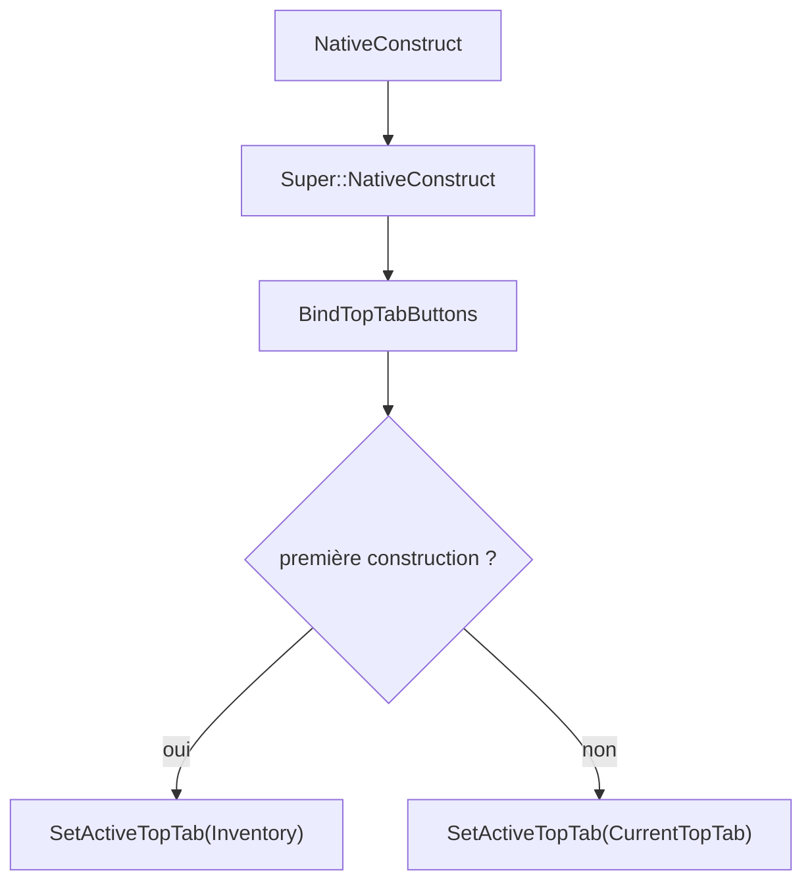
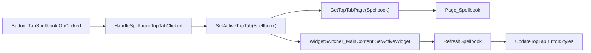
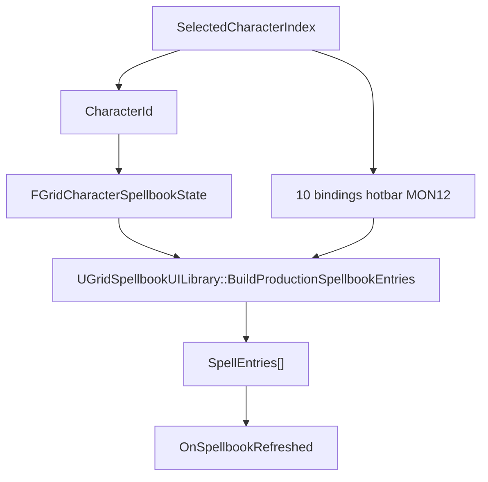

# GrimrockMenu — Complete Technical Reference

## 1. Statut et rôle du document

Ce document est la référence canonique du menu joueur multipage de GrimrockPrototype.

État de référence avant UI01.4.3a :

```text
89bb94b71d155c9b70b87a509db020a638bc732d
Integrate GridSpellbook into GrimrockMenu
```

UI01.4.3a ajoute le pont runtime natif du Spellbook. Le code de ce jalon doit encore être compilé sous UE5.5.4 par l'utilisateur avant d'être déclaré validé.

Le document couvre :

- `WBP_GrimrockMenu` ;
- `UGrimrockMenuWidget` ;
- ouverture et fermeture depuis `AGrimrockPartyPawn` ;
- navigation des onglets ;
- page inventaire ;
- page Spellbook ;
- modèle natif de connaissance des sorts ;
- projection UI MON18.7a ;
- pont vers la hotbar MON12 ;
- règles de maintenance pour les évolutions futures.

En cas de divergence, l'ordre de priorité est :

1. code C++ réellement compilé ;
2. assets réellement sérialisés dans Unreal ;
3. présent document ;
4. documents de conception historiques.

Toute évolution significative du menu doit mettre à jour cette référence dans le même jalon.

---

## 2. Résumé architectural

```mermaid
flowchart TD
    Input["Touche I"] --> Pawn["AGrimrockPartyPawn"]
    Pawn --> Menu["WBP_GrimrockMenu / UGrimrockMenuWidget"]
    Menu --> Switcher["WidgetSwitcher_MainContent"]
    Switcher --> Inventory["Page_Inventory / UGridInventoryWidget"]
    Switcher --> SpellbookPage["Page_Spellbook / WBP_GridSpellbook"]
    Inventory --> InventoryComponent["UGridPartyInventoryComponent"]
    SpellbookPage -. "UI01.4.3b: reparent" .-> SpellbookWidget["UGridSpellbookWidget"]
    SpellbookWidget --> InventoryComponent
    SpellbookWidget --> SpellbookComponent["UGridPartySpellbookComponent"]
    SpellbookWidget --> UILibrary["UGridSpellbookUILibrary"]
    UILibrary --> Hotbar["MON12 persistent 10-slot hotbar"]
    Pawn --> Controller["AGrimrockPlayerController"]
```



Principes :

- le menu global possède la navigation ;
- chaque page possède sa présentation spécialisée ;
- les données de gameplay restent dans les composants/services C++ ;
- le Spellbook ne crée pas une deuxième hotbar ;
- le Blueprint ne duplique pas la navigation du shell C++.

---

## 3. Sources de vérité

### 3.1 Shell et navigation

| Responsabilité | Fichier |
|---|---|
| Enum des onglets | `Source/GrimrockPrototype/Public/UI/GridInventoryUiTypes.h` |
| Contrat du shell | `Source/GrimrockPrototype/Public/UI/GrimrockMenuWidget.h` |
| Navigation et styles | `Source/GrimrockPrototype/Private/UI/GrimrockMenuWidget.cpp` |
| Surface 1920x1080 | `Source/GrimrockPrototype/Public/UI/GrimrockDesignSurfaceWidget.h` |
| Cycle ouverture/fermeture | `Source/GrimrockPrototype/Public/Runtime/GrimrockPartyPawn.h` |
| Implémentation ouverture/fermeture | `Source/GrimrockPrototype/Private/Runtime/GrimrockPartyPawn.cpp` |
| État UI global / souris | `Source/GrimrockPrototype/Public/Runtime/GrimrockPlayerController.h` |

### 3.2 Inventaire

| Responsabilité | Fichier |
|---|---|
| Page inventaire native | `Source/GrimrockPrototype/Public/UI/GridInventoryWidget.h` |
| Implémentation page inventaire | `Source/GrimrockPrototype/Private/UI/GridInventoryWidget.cpp` |
| État parti/inventaire/hotbar | `Source/GrimrockPrototype/Public/Runtime/GridPartyInventoryComponent.h` |

### 3.3 Spellbook

| Responsabilité | Fichier |
|---|---|
| État de connaissance | `Source/GrimrockPrototype/Public/Magic/GridSpellbookTypes.h` |
| Propriétaire runtime | `Source/GrimrockPrototype/Public/Magic/GridPartySpellbookComponent.h` |
| Mutations runtime | `Source/GrimrockPrototype/Private/Magic/GridPartySpellbookComponent.cpp` |
| Projection UI / hotbar | `Source/GrimrockPrototype/Public/Magic/GridSpellbookUI.h` |
| Implémentation projection | `Source/GrimrockPrototype/Private/Magic/GridSpellbookUI.cpp` |
| Widget natif du Spellbook | `Source/GrimrockPrototype/Public/UI/GridSpellbookWidget.h` |
| Implémentation widget natif | `Source/GrimrockPrototype/Private/UI/GridSpellbookWidget.cpp` |
| Drag/drop hotbar | `Source/GrimrockPrototype/Public/UI/GridCombatHotbarDragDropOperation.h` |

---

## 4. Assets UMG actuels

Le menu principal est :

```text
/Game/GrimrockPrototype/Blueprints/UI/WBP_GrimrockMenu
```

Son parent natif est :

```text
UGrimrockMenuWidget
```

Les pages actuellement intégrées sont :

| Page | Widget |
|---|---|
| `Page_Inventory` | `WBP_GridInventory` |
| `Page_Skills` | `WBP_GridSkills` |
| `Page_Spellbook` | `WBP_GridSpellbook` |
| `Page_Journal` | `WBP_GridJournal` |
| `Page_Map` | `WBP_GridMap` |
| `Page_Recipes` | `WBP_GridRecipes` |
| `Page_Codex` | `WBP_GridCodex` |

UI01.4.2 a validé dans Unreal :

- présence de l'onglet `Sorts` ;
- présence de `Button_TabSpellbook` ;
- présence de `Page_Spellbook` ;
- navigation entre les sept onglets ;
- affichage temporaire `Livre de sorts` dans la nouvelle page.

`WBP_GridSpellbook` reste, à la fin de UI01.4.3a, un `UserWidget` simple. Son reparenting vers `UGridSpellbookWidget` appartient explicitement à UI01.4.3b.

---

## 5. Widget Tree contractuel

Structure logique :

```text
WBP_GrimrockMenu
└── CanvasPanel_Root
    └── ScaleBox_DesignRoot
        └── SizeBox_DesignSurface
            └── Border
                └── VerticalBox
                    ├── HorizontalBox des onglets
                    │   ├── Button_TabInventory
                    │   ├── Button_TabSkills
                    │   ├── Button_TabSpellbook
                    │   ├── Button_TabJournal
                    │   ├── Button_TabMap
                    │   ├── Button_TabRecipes
                    │   └── Button_TabCodex
                    └── WidgetSwitcher_MainContent
                        ├── Page_Inventory
                        ├── Page_Skills
                        ├── Page_Spellbook
                        ├── Page_Journal
                        ├── Page_Map
                        ├── Page_Recipes
                        └── Page_Codex
```

L'ordre physique des pages n'est pas utilisé pour résoudre la navigation. Le C++ appelle `SetActiveWidget(TargetPage)` et non `SetActiveWidgetIndex()`.

Le Graph de `WBP_GrimrockMenu` ne doit contenir aucune navigation parallèle de type :

```text
OnClicked(Button_TabX)
    -> SetActiveWidgetIndex(...)
```

---

## 6. Enum des onglets

Déclaration courante :

```cpp
enum class EInventoryTopTab : uint8
{
    Inventory = 0,
    Skills = 1,
    Journal = 2,
    Map = 3,
    Recipes = 4,
    Codex = 5,
    Spellbook = 6
};
```

`Spellbook` a volontairement été ajouté à la fin pour ne pas renuméroter les valeurs existantes susceptibles d'être sérialisées.

L'ordre visuel peut être :

```text
Inventaire | Compétences | Sorts | Journal | Carte | Recettes | Codex
```

sans dépendre de la valeur numérique de l'enum.

### Dette de nommage

`EInventoryTopTab`, `ToggleInventoryWidget()`, `ShowInventoryWidget()`, `HideInventoryWidget()`, `bInventoryWidgetVisible` et `bInventoryUiOpen` portent encore un nom historique centré inventaire alors que l'écran est désormais un menu RPG global.

Aucun renommage transversal n'est effectué pendant UI01 : cela demanderait un refactor dédié avec redirects et validation des références sérialisées.

---

## 7. Contrat C++ ↔ `WBP_GrimrockMenu`

### 7.1 Bindings existants obligatoires

```text
WidgetSwitcher_MainContent
Button_TabInventory
Button_TabSkills
Button_TabJournal
Button_TabMap
Button_TabRecipes
Button_TabCodex
Page_Inventory
Page_Skills
Page_Journal
Page_Map
Page_Recipes
Page_Codex
```

### 7.2 Bindings Spellbook préparatoires

UI01.4.1 a ajouté :

```text
Button_TabSpellbook   BindWidgetOptional
Page_Spellbook        BindWidgetOptional
```

Ils existent désormais réellement dans l'asset depuis UI01.4.2.

`Page_Spellbook` reste temporairement typé `UWidget*` dans `UGrimrockMenuWidget`. Ceci est intentionnel : le Blueprint n'est reparenté vers `UGridSpellbookWidget` qu'en UI01.4.3b. Ainsi UI01.4.3a peut compiler sans exiger immédiatement une modification binaire.

---

## 8. Navigation native

### 8.1 Construction



Le menu mémorise l'onglet actif tant que son instance n'est pas détruite.

### 8.2 Flux d'un clic Spellbook



`RefreshSpellbook()` est explicitement demandé lors de l'activation de l'onglet. Si le Blueprint n'est pas encore enfant de `UGridSpellbookWidget`, le cast retourne `nullptr` et l'appel reste sans effet.

### 8.3 Styles

`BindTopTabButtons()` :

- capture le style initial de chaque bouton une fois ;
- charge `T_ButtonTab_Selected_480x100` ;
- bind les handlers avec `RemoveDynamic` puis `AddDynamic` ;
- inclut maintenant `Button_TabSpellbook`.

`UpdateTopTabButtonStyles()` applique les styles aux sept boutons.

---

## 9. Ouverture / fermeture du menu

### 9.1 Ouverture

Point d'entrée :

```text
I -> AGrimrockPartyPawn::ToggleInventoryWidget()
```

Première ouverture :

```text
CreateWidget(MenuWidgetClass)
-> InitializeMenuWidget(this)
-> AddToViewport(100)
-> Visible
-> RefreshInventory()
-> GameAndUI / focus / curseur
-> SetInventoryUiOpen(true)
```

Réouverture : la même instance est réutilisée. Elle n'est pas recréée.

### 9.2 Fermeture

```text
HideInventoryWidget()
-> SetVisibility(Collapsed)
-> restauration Z-order HUD
-> SetInventoryUiOpen(false)
-> autosave conditionnel
```

La fermeture ne détruit pas l'instance et ne remet pas `CurrentTopTab` à Inventory.

---

## 10. Page Inventaire

`UGrimrockMenuWidget::InitializeMenuWidget()` continue d'initialiser :

```text
Page_Inventory->InitializeInventoryWidget(InPartyPawn)
```

`RefreshInventory()` continue de déléguer uniquement à :

```text
Page_Inventory->RefreshInventory()
```

Aucune logique d'inventaire n'est déplacée vers le shell par UI01.4.3a.

---

## 11. Modèle de connaissance Spellbook

`FGridCharacterSpellbookState` contient :

```text
CharacterId
KnownSpellIds[]
```

Principes :

- identité stable par `FName SpellId` ;
- un état par `CharacterId` ;
- pas de copie d'asset de définition ;
- pas de pointeur d'acteur dans l'état ;
- pas de doublon de `SpellId` ;
- `NAME_None` interdit.

`UGridPartySpellbookComponent` possède :

```text
FGridPartySpellbookState SpellbookState
```

et expose :

```text
EnsureCharacterSpellbook
RemoveCharacterSpellbook
LearnSpell
ForgetSpell
KnowsSpell
GetKnownSpellIds
ResetAllSpellbooks
ValidateSpellbookState
```

La persistance reste volontairement hors périmètre jusqu'à MON18.8.

---

## 12. Notification native du Spellbook

UI01.4.3a ajoute :

```cpp
FGridPartySpellbookChangedSignature OnSpellbookChanged;
```

Il s'agit d'une notification de présentation sans copie de données. Les consommateurs relisent l'état autoritaire du composant.

Le delegate est diffusé lorsqu'une mutation effective réussit :

- création d'un état personnage absent ;
- suppression d'un état personnage ;
- `LearnSpell` réussi ;
- `ForgetSpell` réussi ;
- `ResetAllSpellbooks` lorsqu'il existait au moins un état.

Pas de broadcast pour :

- `AlreadyKnown` ;
- `NotKnown` ;
- identifiant invalide ;
- `EnsureCharacterSpellbook` sur un état déjà présent.

---

## 13. `UGridSpellbookWidget` — rôle

UI01.4.3a introduit une classe native dédiée à la page Spellbook :

```text
UUserWidget
└── UGridSpellbookWidget
    └── WBP_GridSpellbook     [après reparent UI01.4.3b]
```

Elle est une couche de présentation. Elle ne possède aucune copie autoritaire de gameplay.

### 13.1 État de présentation exposé

```text
OwningPartyPawn
InventoryComponent
SpellbookComponent
SelectedCharacterIndex
SelectedCharacterId
SpellEntries[]
OnSpellbookRefreshed
```

### 13.2 API Blueprint exposée

```text
InitializeSpellbookWidget(PartyPawn)
RefreshSpellbook()
GetSpellEntryCount()
GetSpellEntry(Index, OutEntry)
AssignSpellToHotbar(SpellId, SlotIndex)
UnassignSpellFromHotbar(SpellId)
```

Ces fonctions sont destinées à `WBP_GridSpellbook` après UI01.4.3b.

---

## 14. Résolution runtime du composant Spellbook

MON18.2 avait volontairement laissé `UGridPartySpellbookComponent` détaché de `AGrimrockPartyPawn`.

UI01.4.3a ferme ce manque pour l'UI sans modifier le gros contrat sérialisé du Pawn : `UGridSpellbookWidget` recherche d'abord un composant existant sur le pawn :

```cpp
PartyPawn->FindComponentByClass<UGridPartySpellbookComponent>()
```

S'il n'en existe pas, le widget crée une instance runtime :

```text
NewObject<UGridPartySpellbookComponent>(PartyPawn)
-> PartyPawn->AddInstanceComponent(...)
-> RegisterComponent()
```

Conséquences :

- le composant est possédé par le pawn pour sa durée de vie runtime ;
- une réouverture du menu retrouve la même instance ;
- aucune seconde structure de Spellbook n'est créée ;
- aucun `.uasset` de Pawn n'est modifié par UI01.4.3a ;
- le composant n'existe qu'à partir de la première initialisation effective de la page native ;
- ce choix reste compatible avec une migration future vers un default subobject si le Spellbook doit exister avant toute UI.

Cette création paresseuse est une décision de portée UI01.4.3a, pas une règle générale imposant que les composants gameplay soient créés par l'UI.

---

## 15. Sélection du personnage

La page Spellbook ne crée pas son propre sélecteur de personnage.

La source autoritaire reste :

```text
UGridPartyInventoryComponent::GetSelectedCharacterIndex()
```

Puis :

```text
PartyInventoryState.ActiveCharacters[SelectedCharacterIndex].CharacterId
```

Le Spellbook et l'inventaire décrivent donc toujours le même personnage sélectionné.

Lors d'un `OnPartyInventoryChanged`, `UGridSpellbookWidget` relit cette sélection et reconstruit sa vue.

---

## 16. Enregistrement d'un état personnage

Lors du refresh, si le personnage sélectionné possède un `CharacterId` valide mais pas encore d'entrée Spellbook :

```text
EnsureCharacterSpellbook(CharacterId)
```

est appelé.

Cette opération :

- crée seulement le conteneur vide `FGridCharacterSpellbookState` ;
- n'ajoute aucun sort ;
- ne connaît aucune classe ou progression ;
- ne fabrique aucun `SpellId` ;
- ne donne donc aucun sort artificiellement au personnage.

Un personnage sans sort connu produit légitimement `SpellEntries.Num() == 0`.

---

## 17. Construction de `SpellEntries`

Flux :



Chaque `FGridSpellbookEntryView` peut exposer :

- `SpellId` ;
- nom ;
- description ;
- école ;
- coût mana ;
- coût PA ;
- portée min/max ;
- politique de ciblage ;
- LOS ;
- définition résolue ou non ;
- assignabilité hotbar ;
- présence éventuelle dans un slot ;
- index du slot ;
- `FGridCombatActionDefinition` adapté au HUD.

Un `SpellId` connu dont la définition n'est pas résolue reste visible dans le modèle UI et n'est pas silencieusement supprimé.

---

## 18. Réactivité et cycle de vie du widget Spellbook

`InitializeSpellbookWidget()` :

1. retire les anciens bindings de delegates ;
2. mémorise le pawn ;
3. récupère `PartyInventoryComponent` ;
4. résout ou crée `UGridPartySpellbookComponent` ;
5. bind `OnPartyInventoryChanged` ;
6. bind `OnSpellbookChanged` ;
7. appelle `RefreshSpellbook()`.

`NativeDestruct()` retire les bindings mais ne détruit pas le composant Spellbook du pawn.

Un garde `bRefreshInProgress` empêche une récursion lorsque l'enregistrement initial d'un personnage déclenche `OnSpellbookChanged` pendant un refresh.

---

## 19. Pont Spellbook → hotbar MON12

Aucun nouveau stockage de raccourcis n'est créé.

Identité d'un sort dans la hotbar :

```text
ActionId           = SpellId
SourcePolicy       = Spell
SourceDefinitionId = SpellId
```

`AssignSpellToHotbar()` délègue à :

```text
UGridSpellbookUILibrary::AssignKnownSpellToHotbar()
```

Le bridge :

- vérifie le personnage ;
- vérifie l'index de slot ;
- refuse un sort non connu ;
- refuse une définition de production invalide ;
- utilise les API MON12 existantes ;
- déplace/échange si le sort est déjà assigné ailleurs ;
- évite les doublons.

`UnassignSpellFromHotbar()` enlève seulement le raccourci. Le sort reste connu.

Après une affectation/désaffectation réussie, `UGridSpellbookWidget` rafraîchit sa projection.

---

## 20. Drag & Drop déjà disponible

`UGridCombatHotbarDragDropOperation` possède déjà le contrat MON18.7a :

```text
bFromSpellbook
InitializeFromSpellbookEntry(...)
CommitSpellbookDrop(...)
```

UI01.4.3a n'ajoute aucun second système de drag/drop. UI01.4.3b pourra connecter le visuel du Spellbook à ce contrat existant.

---

## 21. Intégration dans `UGrimrockMenuWidget`

UI01.4.3a ajoute :

```text
RefreshSpellbook()
GetSpellbookWidget()
```

`GetSpellbookWidget()` effectue :

```cpp
Cast<UGridSpellbookWidget>(Page_Spellbook)
```

Ce cast est volontairement tolérant :

- avant reparent UI01.4.3b : `nullptr`, aucune régression ;
- après reparent : API native disponible.

`InitializeMenuWidget()` initialise désormais la page Spellbook si le cast réussit.

`SetActiveTopTab(Spellbook)` demande un refresh après activation de la page.

Aucune logique métier de cast n'entre dans `UGrimrockMenuWidget`.

---

## 22. Ce qui reste hors périmètre UI01.4.3a

UI01.4.3a ne :

- reparent pas `WBP_GridSpellbook` ;
- ne construit pas les lignes visuelles de sorts ;
- ne crée pas d'icônes finales ;
- ne réalise pas le drag/drop visuel ;
- ne modifie aucun `.uasset` ou `.umap` ;
- ne donne aucun sort de test au personnage ;
- ne modifie pas le pipeline de cast MON18.3–MON18.5 ;
- ne persiste pas le Spellbook ;
- ne modifie pas le format SaveGame.

La persistance reste MON18.8.

---

## 23. UI01.4.3b — raccordement Blueprint attendu

Après compilation réussie de UI01.4.3a, le travail Unreal doit être limité à :

1. ouvrir `WBP_GridSpellbook` ;
2. `File -> Reparent Blueprint` ;
3. choisir `GridSpellbookWidget` ;
4. compiler et sauvegarder ;
5. vérifier que `Page_Spellbook` reste l'instance correcte dans `WBP_GrimrockMenu` ;
6. construire le visuel des entrées à partir de `SpellEntries` / `GetSpellEntry` ;
7. binder la reconstruction sur `OnSpellbookRefreshed` ;
8. raccorder ensuite le drag/drop existant MON18.7a ;
9. valider en PIE.

La procédure détaillée sera fournie lors de UI01.4.3b. Il ne faut pas anticiper ces modifications binaires pendant UI01.4.3a.

---

## 24. Invariants à préserver

1. `WBP_GrimrockMenu` reste enfant de `UGrimrockMenuWidget`.
2. Navigation supérieure uniquement dans le shell C++.
3. Aucun `SetActiveWidgetIndex` parallèle dans le Graph.
4. Les anciennes valeurs de `EInventoryTopTab` restent stables.
5. Le Spellbook utilise `CharacterId` et `SpellId` comme identités stables.
6. `UGridPartySpellbookComponent` reste la source de vérité de connaissance runtime.
7. `UGridPartyInventoryComponent` reste la source de vérité de sélection et de hotbar.
8. `SpellEntries` est une projection de présentation, jamais un stockage gameplay.
9. Les dix slots MON12 restent l'unique hotbar persistante.
10. Un sort inconnu ne peut pas être assigné.
11. Un sort connu n'est jamais oublié lors d'un simple unassign de hotbar.
12. Aucun coût mana/PA n'est payé par l'UI Spellbook.
13. Le cast autoritaire reste dans les services MON18.3–MON18.5.
14. Les mutations du Spellbook notifient les vues sans dupliquer l'état.
15. La persistance Spellbook reste séparée jusqu'à MON18.8.

---

## 25. Diagnostic rapide

### L'onglet Sorts ne s'ouvre pas

Vérifier :

```text
Button_TabSpellbook
Page_Spellbook
EInventoryTopTab::Spellbook
HandleSpellbookTopTabClicked
GetTopTabPage(Spellbook)
BindTopTabButtons
UpdateTopTabButtonStyles
```

et rechercher :

```text
GrimrockMenu cannot activate TopTab
```

### Le Spellbook s'ouvre mais reste vide

Un livre vide est valide si le personnage ne connaît aucun sort.

Vérifier ensuite :

1. `GetSelectedCharacterIndex()` valide ;
2. `CharacterId` valide ;
3. `SpellbookComponent` non nul ;
4. état personnage enregistré ;
5. `KnownSpellIds` réellement non vide ;
6. `OnSpellbookRefreshed` reçu côté Blueprint ;
7. construction visuelle des lignes réalisée en UI01.4.3b.

### Un sort connu apparaît avec son identifiant brut

Cela signifie que la connaissance existe mais que la définition de production n'a pas été résolue/validée. Le modèle conserve volontairement l'entrée et la marque non assignable.

### L'affectation hotbar échoue

Inspecter `EGridSpellHotbarAssignmentResult` :

```text
InvalidCharacter
InvalidSlot
UnknownSpell
InvalidDefinition
HotbarRejected
NotAssigned
```

### Changer de personnage ne met pas la page à jour

Vérifier le binding de :

```text
UGridPartyInventoryComponent::OnPartyInventoryChanged
```

vers :

```text
UGridSpellbookWidget::HandlePartyInventoryChanged
```

### LearnSpell ne met pas la page à jour

Vérifier :

```text
UGridPartySpellbookComponent::OnSpellbookChanged
```

et que la mutation a réellement retourné `Success`.

---

## 26. Résumé canonique actuel

```text
AGrimrockPartyPawn
    |
    +-- UGridPartyInventoryComponent
    |
    +-- WBP_GrimrockMenu / UGrimrockMenuWidget
            |
            +-- navigation C++ 7 onglets
            |
            +-- Page_Inventory / UGridInventoryWidget
            |
            +-- Page_Spellbook / WBP_GridSpellbook
                    |
                    +-- UI01.4.3b -> parent UGridSpellbookWidget
                            |
                            +-- selected character depuis InventoryComponent
                            +-- UGridPartySpellbookComponent runtime sur le pawn
                            +-- UGridSpellbookUILibrary
                            +-- FGridSpellbookEntryView[]
                            +-- hotbar MON12

Connaissance
    UGridPartySpellbookComponent
        CharacterId -> KnownSpellIds[]

Présentation
    UGridSpellbookWidget
        -> projection uniquement

Hotbar
    UGridPartyInventoryComponent
        -> 10 slots existants

Cast
    services MON18.3-MON18.5
        -> autoritaires
```

Ce document doit permettre de reprendre le travail sur le menu ou le Spellbook sans recommencer un audit de découverte de l'architecture.
