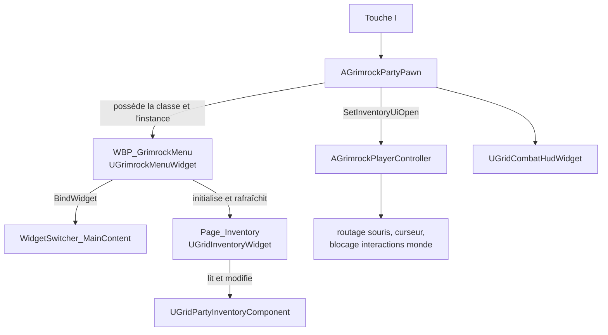
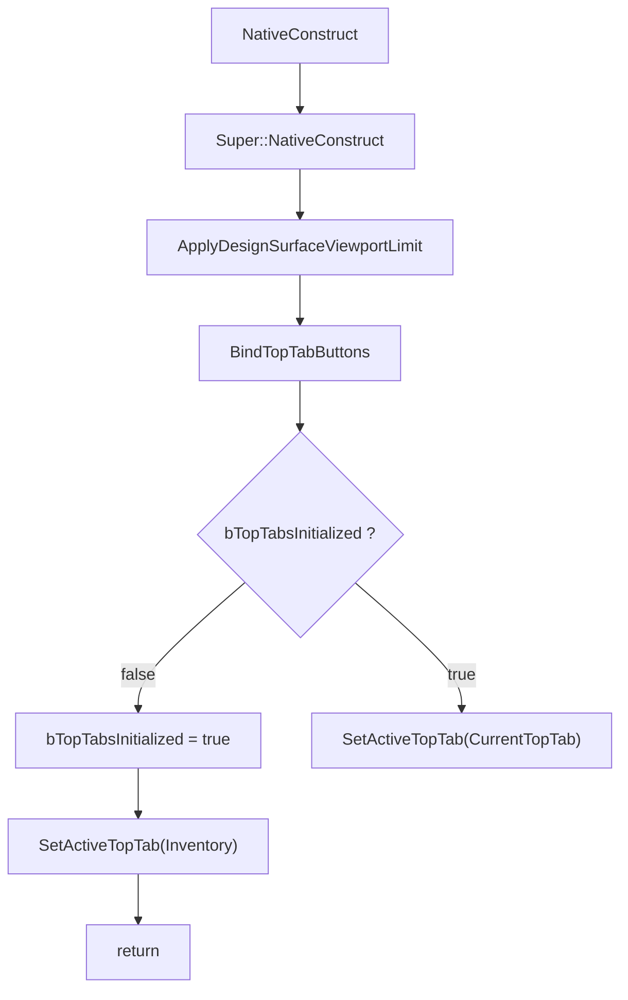
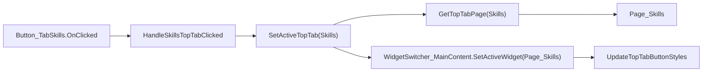
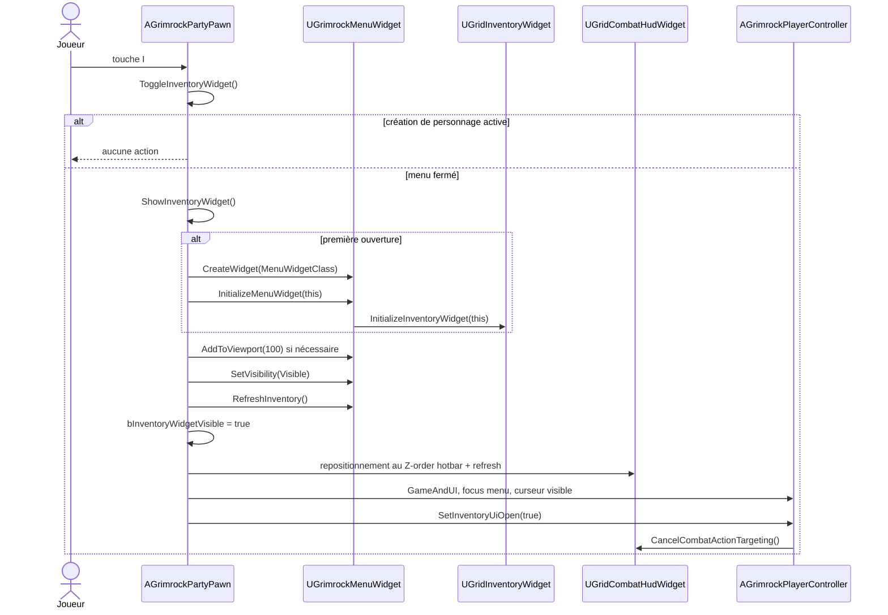
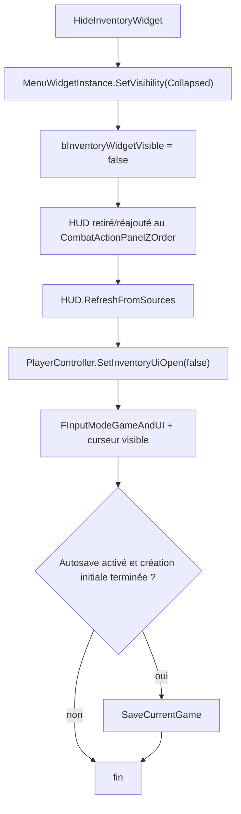

# UI01.3.3 — GrimrockMenu Complete Technical Reference

## 1. Statut et objectif

Ce document est la référence canonique de l'architecture actuellement en place pour le menu joueur :

- asset UMG `WBP_GrimrockMenu` ;
- classe native `UGrimrockMenuWidget` ;
- ouverture et fermeture depuis `AGrimrockPartyPawn` ;
- état partagé avec `AGrimrockPlayerController` ;
- page inventaire `WBP_GridInventory` / `UGridInventoryWidget` ;
- navigation des onglets, bindings, styles et état persistant de l'instance.

Il décrit l'existant audité au 21 août 2026, à partir de `master` au commit `ca1c7f7`, avant le commit UI01.3.3.

UI01.3.3 est un jalon exclusivement documentaire. Il ne modifie ni comportement C++, ni Blueprint, ni `.uasset`, ni `.umap`.

### Conclusion immédiate

`WBP_GrimrockMenu` est déjà un shell multipage fonctionnel. La navigation n'est pas pilotée par le Graph du Widget Blueprint : elle appartient à `UGrimrockMenuWidget`.

Le menu n'est pas créé à chaque ouverture. `AGrimrockPartyPawn` crée une instance unique à la première demande, la conserve dans `MenuWidgetInstance`, puis alterne sa visibilité entre `Visible` et `Collapsed`.

---

## 2. Sources de vérité

### 2.1 Code natif

| Responsabilité | Fichier |
|---|---|
| Shell du menu, bindings, navigation, styles | `Source/GrimrockPrototype/Public/UI/GrimrockMenuWidget.h` |
| Implémentation du shell | `Source/GrimrockPrototype/Private/UI/GrimrockMenuWidget.cpp` |
| Enum des onglets | `Source/GrimrockPrototype/Public/UI/GridInventoryUiTypes.h` |
| Surface de design 1920x1080 | `Source/GrimrockPrototype/Public/UI/GrimrockDesignSurfaceWidget.h` |
| Mise à l'échelle de la surface | `Source/GrimrockPrototype/Private/UI/GrimrockDesignSurfaceWidget.cpp` |
| Propriétaire, entrée clavier, ouverture/fermeture | `Source/GrimrockPrototype/Public/Runtime/GrimrockPartyPawn.h` |
| Implémentation du cycle de vie du menu | `Source/GrimrockPrototype/Private/Runtime/GrimrockPartyPawn.cpp` |
| État global d'UI et routage souris | `Source/GrimrockPrototype/Public/Runtime/GrimrockPlayerController.h` |
| Effets de `SetInventoryUiOpen()` | `Source/GrimrockPrototype/Private/Runtime/GrimrockPlayerController.cpp` |
| Contrat de la page inventaire | `Source/GrimrockPrototype/Public/UI/GridInventoryWidget.h` |
| Initialisation et refresh inventaire | `Source/GrimrockPrototype/Private/UI/GridInventoryWidget.cpp` |

### 2.2 Assets vérifiés en lecture seule

| Asset | Rôle constaté |
|---|---|
| `/Game/GrimrockPrototype/Blueprints/UI/WBP_GrimrockMenu` | Widget Blueprint du menu joueur |
| `/Game/GrimrockPrototype/Blueprints/Runtime/BP_GrimrockPartyPawn` | Affecte `WBP_GrimrockMenu_C` à `MenuWidgetClass` |
| `/Game/GrimrockPrototype/Blueprints/UI/WBP_GridInventory` | Contenu natif spécialisé de `Page_Inventory` |
| `WBP_GridSkills`, `WBP_GridJournal`, `WBP_GridMap`, `WBP_GridRecipes`, `WBP_GridCodex` | Contenus des cinq autres pages |

L'inspection de l'asset confirme :

- `WBP_GrimrockMenu_C` a pour parent natif `/Script/GrimrockPrototype.GrimrockMenuWidget` ;
- `BP_GrimrockPartyPawn_C.MenuWidgetClass` pointe vers `WBP_GrimrockMenu_C` ;
- les widgets requis par les `BindWidget` existent avec les noms et types attendus ;
- `WidgetSwitcher_MainContent` contient six enfants dans l'ordre documenté plus bas ;
- le Graph ne porte aucune logique fonctionnelle de navigation des onglets.

### 2.3 Priorité en cas de divergence future

1. comportement du code C++ compilé ;
2. contenu réellement sérialisé dans les assets ;
3. présent document ;
4. documents de conception plus anciens.

Si le code ou l'asset évolue, ce document doit être mis à jour dans le même jalon.

---

## 3. Vue d'ensemble de l'ownership



### Répartition des responsabilités

| Objet | Responsabilité |
|---|---|
| `AGrimrockPartyPawn` | entrée `I`, création de l'instance, visibilité, focus, mode d'entrée, Z-order du HUD, autosave à la fermeture |
| `UGrimrockMenuWidget` | shell multipage, onglet actif, résolution page, bindings de clic, styles d'onglets, relais vers l'inventaire |
| `WBP_GrimrockMenu` | hiérarchie visuelle, boutons, pages, switcher et styles de base |
| `UGridInventoryWidget` | présentation et interactions spécifiques à l'inventaire |
| `AGrimrockPlayerController` | état `bInventoryUiOpen`, priorité de la souris, curseur et annulation du ciblage de combat |
| `UGrimrockDesignSurfaceWidget` | mise à l'échelle et centrage de la surface logique 1920x1080 |

Le shell global ne doit pas absorber les interactions propres à une page. Réciproquement, `WBP_GridInventory` ne doit pas piloter les onglets supérieurs.

---

## 4. Héritage et construction UMG

```text
UUserWidget
    └── UGrimrockDesignSurfaceWidget
            └── UGrimrockMenuWidget
                    └── WBP_GrimrockMenu_C
```

`UGrimrockMenuWidget` hérite de `UGrimrockDesignSurfaceWidget`, pas directement de `UUserWidget`.

Conséquence : l'appel `Super::NativeConstruct()` dans `UGrimrockMenuWidget::NativeConstruct()` exécute d'abord le contrat de surface de design, puis le menu initialise ses onglets.

---

## 5. Widget Tree actuel

### 5.1 Chaîne physique principale vérifiée

```text
CanvasPanel_Root [CanvasPanel]
└── ScaleBox_DesignRoot [ScaleBox]
    └── SizeBox_DesignSurface [SizeBox]
        └── Border_RootFrame [Border]
            └── VerticalBox_Root [VerticalBox]
                ├── HorizontalBox_TopTabs [HorizontalBox]
                │   ├── SizeBox_TabInventory
                │   │   └── Button_TabInventory [Button]
                │   ├── SizeBox_TabSkills
                │   │   └── Button_TabSkills [Button]
                │   ├── SizeBox_TabJournal
                │   │   └── Button_TabJournal [Button]
                │   ├── SizeBox_TabMap
                │   │   └── Button_TabMap [Button]
                │   ├── SizeBox_TabRecipes
                │   │   └── Button_TabRecipes [Button]
                │   └── SizeBox_TabCodex
                │       └── Button_TabCodex [Button]
                └── SizeBox_1033 [SizeBox]
                    └── WidgetSwitcher_MainContent [WidgetSwitcher]
```

Les éléments décoratifs internes aux boutons ne font pas partie du contrat C++ et ne sont pas détaillés ici. Les noms contractuels sont les six `Button_Tab*`, le switcher et les six `Page_*`.

### 5.2 Enfants réels du switcher

| Index sérialisé | Nom | Classe réelle | Type C++ du binding |
|---:|---|---|---|
| 0 | `Page_Inventory` | `WBP_GridInventory_C` | `UGridInventoryWidget*` |
| 1 | `Page_Skills` | `WBP_GridSkills_C` | `UWidget*` |
| 2 | `Page_Journal` | `WBP_GridJournal_C` | `UWidget*` |
| 3 | `Page_Map` | `WBP_GridMap_C` | `UWidget*` |
| 4 | `Page_Recipes` | `WBP_GridRecipes_C` | `UWidget*` |
| 5 | `Page_Codex` | `WBP_GridCodex_C` | `UWidget*` |

La navigation native utilise `SetActiveWidget(TargetPage)`, pas un index numérique. L'ordre du switcher est donc une information de structure et de lisibilité, mais pas le mécanisme de résolution de l'onglet.

### 5.3 Graph Blueprint

Le Graph de `WBP_GrimrockMenu` ne contient aucune chaîne fonctionnelle de navigation des onglets. En particulier, il ne doit pas contenir de logique parallèle de type :

```text
OnClicked(Button_TabX)
    -> SetActiveWidgetIndex(...)
```

Les clics sont reliés aux handlers C++ par `BindTopTabButtons()`.

---

## 6. Contrat C++ ↔ Blueprint

### 6.1 Bindings obligatoires de `UGrimrockMenuWidget`

Toutes les propriétés ci-dessous utilisent `UPROPERTY(meta = (BindWidget))`. Leur nom et leur type constituent un contrat strict avec `WBP_GrimrockMenu`.

| Propriété C++ | Type attendu | Widget Blueprint attendu | Rôle |
|---|---|---|---|
| `WidgetSwitcher_MainContent` | `UWidgetSwitcher*` | `WidgetSwitcher_MainContent` | affiche une seule page active |
| `Button_TabInventory` | `UButton*` | `Button_TabInventory` | ouvre Inventory |
| `Button_TabSkills` | `UButton*` | `Button_TabSkills` | ouvre Skills |
| `Button_TabJournal` | `UButton*` | `Button_TabJournal` | ouvre Journal |
| `Button_TabMap` | `UButton*` | `Button_TabMap` | ouvre Map |
| `Button_TabRecipes` | `UButton*` | `Button_TabRecipes` | ouvre Recipes |
| `Button_TabCodex` | `UButton*` | `Button_TabCodex` | ouvre Codex |
| `Page_Inventory` | `UGridInventoryWidget*` | `Page_Inventory` | page inventaire spécialisée |
| `Page_Skills` | `UWidget*` | `Page_Skills` | page Skills générique |
| `Page_Journal` | `UWidget*` | `Page_Journal` | page Journal générique |
| `Page_Map` | `UWidget*` | `Page_Map` | page Map générique |
| `Page_Recipes` | `UWidget*` | `Page_Recipes` | page Recipes générique |
| `Page_Codex` | `UWidget*` | `Page_Codex` | page Codex générique |

Règle de maintenance : renommer, supprimer ou remplacer un de ces widgets par un type incompatible rompt le contrat natif.

### 6.2 Bindings hérités de la surface de design

`UGrimrockDesignSurfaceWidget` déclare en `BindWidgetOptional` :

- `CanvasPanel_Root` ;
- `ScaleBox_DesignRoot` ;
- `SizeBox_DesignSurface`.

Ils existent tous les trois dans `WBP_GrimrockMenu`. Les résolveurs natifs peuvent aussi rechercher certains anciens noms de repli, mais le menu actuel utilise les noms canoniques ci-dessus.

Le contrat de structure impose également que `ScaleBox_DesignRoot` soit directement enfant de `CanvasPanel_Root` et possède un `UCanvasPanelSlot`.

### 6.3 API exposée au Blueprint

| Fonction / état | Exposition | Usage |
|---|---|---|
| `InitializeMenuWidget(AGrimrockPartyPawn*)` | `BlueprintCallable` | injecte le pawn et initialise la page inventaire |
| `RefreshInventory()` | `BlueprintCallable` | relaie le refresh vers `Page_Inventory` |
| `SetActiveTopTab(EInventoryTopTab)` | `BlueprintCallable` | active une page et synchronise les styles |
| `UpdateTopTabButtonStyles()` | `BlueprintCallable` | recalcule les styles depuis `CurrentTopTab` |
| `GetInventoryWidget()` | `BlueprintCallable` | expose la page inventaire native |
| `OwningPartyPawn` | `BlueprintReadOnly` | pawn injecté lors de la création |
| `CurrentTopTab` | `BlueprintReadOnly` | onglet actif après activation réussie |

`GetTopTabPage()`, `BindTopTabButtons()`, `ApplyTopTabButtonStyle()` et les six handlers sont privés et restent des détails d'implémentation native.

---

## 7. Modèle d'onglets : `EInventoryTopTab`

Déclaration actuelle :

```cpp
UENUM (BlueprintType)
enum class EInventoryTopTab : uint8
{
    Inventory = 0,
    Skills = 1,
    Journal = 2,
    Map = 3,
    Recipes = 4,
    Codex = 5
};
```

### Mapping canonique

| Enum | Valeur | Page | Bouton | Handler |
|---|---:|---|---|---|
| `Inventory` | 0 | `Page_Inventory` | `Button_TabInventory` | `HandleInventoryTopTabClicked()` |
| `Skills` | 1 | `Page_Skills` | `Button_TabSkills` | `HandleSkillsTopTabClicked()` |
| `Journal` | 2 | `Page_Journal` | `Button_TabJournal` | `HandleJournalTopTabClicked()` |
| `Map` | 3 | `Page_Map` | `Button_TabMap` | `HandleMapTopTabClicked()` |
| `Recipes` | 4 | `Page_Recipes` | `Button_TabRecipes` | `HandleRecipesTopTabClicked()` |
| `Codex` | 5 | `Page_Codex` | `Button_TabCodex` | `HandleCodexTopTabClicked()` |

### Dette de nommage

`EInventoryTopTab` représente maintenant les onglets du menu RPG global, pas seulement l'inventaire. Le même héritage lexical existe dans :

- `ToggleInventoryWidget()` ;
- `ShowInventoryWidget()` ;
- `HideInventoryWidget()` ;
- `bInventoryWidgetVisible` ;
- `bInventoryUiOpen` ;
- catégorie `Inventory|UI`.

Ces noms sont historiques. UI01.3.3 ne les renomme pas, car un renommage transversal pourrait affecter le code, les appels Blueprint et les références sérialisées. La dette est connue et doit être traitée, si nécessaire, dans un refactor dédié avec redirects et validation Unreal.

---

## 8. Cycle de construction de `UGrimrockMenuWidget`

### 8.1 `NativeConstruct()`



Comportement exact :

1. la surface de design est appliquée par la classe parente ;
2. les styles initiaux sont mémorisés et les clics sont bindés ;
3. au premier `NativeConstruct`, l'onglet Inventory est demandé ;
4. lors d'une reconstruction ultérieure de la même instance, `CurrentTopTab` est réactivé.

`bTopTabsInitialized` est mis à `true` avant l'appel initial à `SetActiveTopTab()`. Si le switcher ou `Page_Inventory` manque, l'activation échoue avec un warning, mais l'état d'initialisation reste posé.

### 8.2 Persistance entre fermeture et réouverture

La fermeture courante utilise `SetVisibility(Collapsed)`. Elle ne fait ni `RemoveFromParent()`, ni destruction de l'instance, ni remise à zéro de `CurrentTopTab`.

Par conséquent :

- la première ouverture part sur Inventory ;
- si l'utilisateur choisit Map, ferme puis rouvre le menu, Map reste l'onglet courant ;
- la réouverture appelle `RefreshInventory()`, même si l'onglet visible n'est pas Inventory ;
- la réouverture ne rappelle pas `InitializeMenuWidget()` tant que l'instance existe.

---

## 9. Initialisation et refresh des données

### 9.1 `InitializeMenuWidget()`

```text
AGrimrockPartyPawn::ShowInventoryWidget
    -> CreateWidget<UGrimrockMenuWidget>()            [première fois seulement]
    -> UGrimrockMenuWidget::InitializeMenuWidget(this)
        -> OwningPartyPawn = InPartyPawn
        -> Page_Inventory->InitializeInventoryWidget(InPartyPawn)
            -> OwningPartyPawn = InPartyPawn
            -> InventoryComponent = Pawn->PartyInventoryComponent
            -> RefreshInventory()
```

La fonction ne traite actuellement que `Page_Inventory`. Les cinq autres pages ne reçoivent aucune initialisation native depuis le shell.

La fonction accepte un pointeur nul : `OwningPartyPawn` devient nul et la page inventaire reçoit également ce pointeur. Le chemin normal lui transmet toujours `this` depuis le pawn.

### 9.2 `RefreshInventory()` du shell

`UGrimrockMenuWidget::RefreshInventory()` vérifie `Page_Inventory`, puis appelle uniquement :

```cpp
Page_Inventory->RefreshInventory();
```

Elle ne :

- reconstruit pas les bindings d'onglets ;
- ne change pas `CurrentTopTab` ;
- ne rafraîchit pas Skills, Journal, Map, Recipes ou Codex ;
- ne met pas à jour les styles ;
- ne recrée pas le widget.

### 9.3 Refresh interne de l'inventaire

`UGridInventoryWidget::RefreshInventory()` exécute :

1. `RefreshSelectedCharacterDetails()` ;
2. `RefreshRegisteredPartyMemberWidgets()` ;
3. `RefreshRegisteredSlotWidgets()`.

Le shell ne connaît pas ces détails. Cette séparation doit être conservée.

---

## 10. Navigation native complète

### 10.1 Flux d'un clic



Les cinq autres onglets suivent exactement le même patron.

### 10.2 `GetTopTabPage()`

Cette fonction est l'unique table de résolution enum → page. Elle utilise un `switch` explicite et renvoie `nullptr` pour toute valeur inconnue.

Elle ne dépend ni de l'index du switcher, ni de l'ordre numérique pour calculer une position.

### 10.3 `SetActiveTopTab()`

Ordre exact :

1. résolution de `TargetPage` par `GetTopTabPage(NewTab)` ;
2. validation de `WidgetSwitcher_MainContent` et `TargetPage` ;
3. affectation `CurrentTopTab = NewTab` ;
4. activation par `SetActiveWidget(TargetPage)` ;
5. appel `UpdateTopTabButtonStyles()` ;
6. log `VeryVerbose` de l'onglet et de la page.

En cas de switcher ou page manquante :

- un warning `GrimrockMenu cannot activate TopTab=%d` est émis ;
- `CurrentTopTab` n'est pas modifié ;
- aucun style n'est recalculé ;
- aucune autre page n'est activée en repli.

### 10.4 `BindTopTabButtons()`

La fonction remplit trois rôles.

#### A. Capturer les styles Blueprint de base

Les six boutons sont parcourus. Pour chaque bouton valide absent de `DefaultTopTabButtonStyles`, une copie de `Button->GetStyle()` est mémorisée.

La condition `!Contains(Button)` garantit que la copie n'est prise qu'une fois par bouton et par instance.

#### B. Charger la texture sélectionnée

Si `SelectedTopTabTexture` est nulle, le code charge :

```text
/Game/GrimrockPrototype/Blueprints/UI/Buttons/TopTabs/
T_ButtonTab_Selected_480x100.T_ButtonTab_Selected_480x100
```

Le chargement est synchrone et codé en dur avec `LoadObject<UTexture2D>()`. Un échec laisse la texture nulle ; aucun warning spécifique n'est actuellement émis.

#### C. Binder les clics de façon idempotente

Pour chaque bouton valide :

```cpp
Button->OnClicked.RemoveDynamic(this, &Handler);
Button->OnClicked.AddDynamic(this, &Handler);
```

Le `RemoveDynamic()` préalable évite d'empiler le même handler lors d'un nouveau `NativeConstruct()`.

### 10.5 Handlers

Chaque handler ne fait qu'une chose : appeler `SetActiveTopTab()` avec sa valeur enum.

```text
HandleInventoryTopTabClicked -> Inventory
HandleSkillsTopTabClicked    -> Skills
HandleJournalTopTabClicked   -> Journal
HandleMapTopTabClicked       -> Map
HandleRecipesTopTabClicked   -> Recipes
HandleCodexTopTabClicked     -> Codex
```

Cette simplicité est intentionnelle : validation, activation et mise à jour visuelle restent centralisées.

---

## 11. Styles des onglets

### 11.1 Styles de base sérialisés dans le Blueprint

Les six boutons utilisent le même jeu de textures :

| État Slate | Texture de base |
|---|---|
| `Normal` | `T_ButtonTab_Normal_480x100` |
| `Hovered` | `T_ButtonTab_Hovered_480x100` |
| `Pressed` | `T_ButtonTab_Pressed_480x100` |
| `Disabled` | `T_ButtonTab_Disabled_480x100` |

Ces styles sont la source restaurée pour un onglet non sélectionné.

### 11.2 `UpdateTopTabButtonStyles()`

La fonction appelle explicitement `ApplyTopTabButtonStyle()` pour les six couples bouton/enum. Il n'existe pas de collection déclarative unique : l'ajout d'un onglet exige donc de modifier cette fonction.

### 11.3 `ApplyTopTabButtonStyle()`

Pour chaque bouton :

1. abandon si le bouton est nul ;
2. recherche du style Blueprint initial dans `DefaultTopTabButtonStyles` ;
3. copie locale complète de ce style ;
4. si `Tab == CurrentTopTab` et si la texture sélectionnée existe, remplacement des brushes `Normal`, `Hovered` et `Pressed` par la texture sélectionnée ;
5. application de la copie avec `Button->SetStyle(Style)`.

L'état `Disabled` n'est jamais remplacé par la texture sélectionnée. Il conserve le brush `Disabled` du style initial.

Un onglet non actif retrouve donc intégralement son style de base, et l'onglet actif conserve la texture sélectionnée même au survol et à l'appui.

### 11.4 Limite connue

Le snapshot de style est pris une seule fois. Une modification dynamique du style d'un bouton après le premier binding ne devient pas le nouveau style de référence. Le prochain `UpdateTopTabButtonStyles()` repart de la copie initiale.

---

## 12. État runtime

### 12.1 État porté par `UGrimrockMenuWidget`

| Propriété | Type / exposition | Valeur initiale | Rôle |
|---|---|---|---|
| `OwningPartyPawn` | `TObjectPtr`, `BlueprintReadOnly` | `nullptr` | contexte gameplay injecté |
| `CurrentTopTab` | `EInventoryTopTab`, `BlueprintReadOnly` | `Inventory` | source de vérité visuelle de l'onglet |
| `DefaultTopTabButtonStyles` | `Transient TMap<Button, FButtonStyle>` | vide | styles Blueprint mémorisés |
| `SelectedTopTabTexture` | `Transient TObjectPtr<UTexture2D>` | `nullptr` | texture commune de sélection |
| `bTopTabsInitialized` | `Transient bool` | `false` | distingue première construction et reconstruction |

### 12.2 État porté par `AGrimrockPartyPawn`

| Propriété | Rôle |
|---|---|
| `MenuWidgetClass` | classe configurée ; `BP_GrimrockPartyPawn` pointe vers `WBP_GrimrockMenu_C` |
| `MenuWidgetInstance` | instance unique conservée après fermeture |
| `bInventoryWidgetVisible` | état local utilisé par le toggle et le blocage combat |
| `bAutoSaveOnInventoryClose` | active l'autosave conditionnel à la fermeture |

### 12.3 État porté par `AGrimrockPlayerController`

`bInventoryUiOpen` est mis à jour par `SetInventoryUiOpen(bool)`.

Malgré son nom, ce booléen sert d'état modal plus large : la création de personnage l'utilise également. Pour le menu, il :

- bloque certaines interactions souris avec le monde ;
- participe au blocage des actions de hotbar ;
- annule un ciblage de combat en cours à l'ouverture ;
- impose le curseur système par défaut ;
- masque le custom cursor widget.

---

## 13. Ouverture depuis le gameplay

### 13.1 Point d'entrée clavier

Dans `SetupPlayerInputComponent()` :

```cpp
PlayerInputComponent->BindKey(
    EKeys::I,
    IE_Pressed,
    this,
    &AGrimrockPartyPawn::ToggleInventoryWidget);
```

Il s'agit d'un binding direct de la touche `I`, distinct des `UInputAction` Enhanced Input utilisés pour le déplacement.

### 13.2 Flux complet d'ouverture



### 13.3 Garde-fous et erreurs

`ShowInventoryWidget()` s'arrête sans créer ni afficher le menu si :

- `bCharacterCreationModalActive` est vrai ;
- le pawn n'a pas de `APlayerController` ;
- `MenuWidgetClass` n'est pas configurée ;
- `CreateWidget()` échoue.

Logs associés :

```text
GridInventory UI Show Failed ... Reason=NoPlayerController
GrimrockMenu UI Show Failed ... Reason=NoMenuWidgetClass
GrimrockMenu UI Show Failed ... Reason=CreateWidgetFailed
```

### 13.4 Création paresseuse et Z-order

La classe est instanciée uniquement si `MenuWidgetInstance == nullptr`.

L'ajout au viewport est lui aussi conditionnel :

```cpp
if (!MenuWidgetInstance->IsInViewport())
{
    MenuWidgetInstance->AddToViewport(100);
}
```

Le menu utilise donc le Z-order `100` lors de son premier ajout.

### 13.5 Mode d'entrée et curseur

À l'ouverture :

- click events activés ;
- mouse-over events activés ;
- curseur système visible ;
- curseur courant et curseur par défaut fixés à `EMouseCursor::Default` ;
- `FInputModeGameAndUI` ;
- focus Slate fixé sur `MenuWidgetInstance->TakeWidget()` ;
- souris non verrouillée au viewport ;
- curseur non masqué pendant la capture.

`SetInventoryUiOpen(true)` répète volontairement certains réglages de curseur, masque `CustomCursorWidget` et annule le ciblage de combat.

### 13.6 Interaction avec le HUD de combat

Si `CombatHudWidgetInstance` est dans le viewport, le pawn :

1. le retire du parent ;
2. le réajoute au Z-order `CombatHotbarConfigurationZOrder` ;
3. appelle `RefreshFromSources()`.

Cette opération change son ordre d'affichage sans le recréer.

---

## 14. Fermeture depuis le gameplay

### 14.1 Points d'entrée

Le chemin natif principal est la même touche `I` :

```text
I -> ToggleInventoryWidget()
  -> bInventoryWidgetVisible == true
  -> HideInventoryWidget()
```

`HideInventoryWidget()` est aussi `BlueprintCallable`, mais `UGrimrockMenuWidget` ne possède actuellement ni handler de bouton Close ni binding Escape natif.

### 14.2 Flux complet de fermeture



### 14.3 Ce que la fermeture ne fait pas

Elle ne :

- retire pas le menu du viewport ;
- ne détruit pas `MenuWidgetInstance` ;
- ne remet pas `CurrentTopTab` à Inventory ;
- ne vide pas `OwningPartyPawn` ;
- ne rappelle pas `RefreshInventory()` ;
- ne passe pas en `FInputModeGameOnly` ;
- ne masque pas le curseur système.

Ces choix sont le comportement actuel, pas des recommandations implicites.

### 14.4 Interaction avec le HUD de combat

À la fermeture, le HUD est retiré puis réajouté au Z-order `CombatActionPanelZOrder`, suivi de `RefreshFromSources()`.

### 14.5 Autosave

L'autosave est tenté seulement si :

- `bAutoSaveOnInventoryClose` est vrai ;
- `PartyInventoryComponent` existe ;
- la création initiale du personnage est terminée.

Un échec de `SaveCurrentGame()` n'empêche pas la fermeture ; il produit :

```text
PartySave InventoryClose Failed Slot=... Reason=...
```

---

## 15. Surface de design et dépendance viewport

Valeurs natives par défaut :

| Paramètre | Valeur |
|---|---:|
| `DesignWidth` | 1920 |
| `DesignHeight` | 1080 |
| `SafeMarginPx` | 48 |
| `bLimitToDesignSize` | `true` |

`ApplyDesignSurfaceViewportLimit()` :

- mesure la taille et le DPI du viewport ;
- calcule une mise à l'échelle `ScaleToFit` limitée à `DownOnly` ;
- centre la surface ;
- fixe `SizeBox_DesignSurface` à 1920x1080 logiques ;
- réapplique le calcul via `NativeTick()` si taille ou DPI changent.

Les pages enfants, dont `WBP_GridInventory`, vivent dans cette surface. Elles ne doivent pas recréer leur propre gestion DPI ou leur propre `ScaleBox` global.

---

## 16. Dépendances et couplages

### 16.1 Dépendances de compilation directes du shell

`GrimrockMenuWidget.cpp` dépend de :

- `Components/Button.h` ;
- `Components/WidgetSwitcher.h` ;
- `Engine/Texture2D.h` ;
- `UI/GridInventoryWidget.h`.

Le header dépend de :

- `Styling/SlateTypes.h` pour `FButtonStyle` ;
- `UI/GrimrockDesignSurfaceWidget.h` ;
- `UI/GridInventoryUiTypes.h`.

### 16.2 Couplage spécifique à l'inventaire

Le menu global connaît directement `UGridInventoryWidget` pour trois opérations :

- `InitializeInventoryWidget()` ;
- `RefreshInventory()` ;
- `GetInventoryWidget()`.

Les autres pages sont liées comme simples `UWidget*`. Elles n'ont donc pas encore de contrat commun d'initialisation ou de refresh.

### 16.3 Pont vers le contrôleur

`AGrimrockPartyPawn::GetInventoryWidget()` délègue à `MenuWidgetInstance->GetInventoryWidget()`.

`AGrimrockPlayerController` utilise ce pont notamment pour connaître l'état du menu contextuel d'item et arbitrer les clics souris. Le contrôleur ne navigue pas dans les onglets.

### 16.4 Blocage des actions de combat

`IsCombatHotbarExecutionBlocked()` renvoie vrai si au moins un de ces états est actif :

- `bInventoryWidgetVisible` ;
- `bCharacterCreationModalActive` ;
- `PlayerController->bInventoryUiOpen`.

L'ouverture du menu participe donc directement au verrouillage des actions de hotbar.

---

## 17. Invariants à préserver

1. `WBP_GrimrockMenu` reste enfant de `UGrimrockMenuWidget`.
2. Les noms des widgets `BindWidget` restent exacts.
3. La navigation supérieure reste possédée par le shell C++.
4. Les pages ne pilotent pas `WidgetSwitcher_MainContent` directement.
5. `SetActiveWidget()` reste préféré à un index calculé depuis l'enum.
6. Chaque bouton est ajouté aux trois endroits natifs requis : binding, style, handler.
7. Les valeurs existantes de `EInventoryTopTab` ne sont pas renumérotées sans migration explicite.
8. La page inventaire reste le seul propriétaire des détails d'inventaire.
9. La surface de design globale reste portée par le menu parent.
10. Tout changement d'asset est effectué via Unreal Editor et validé séparément ; aucune modification binaire n'appartient à UI01.3.3.

---

## 18. Limites et dettes connues

### 18.1 Nommage centré Inventory

Le menu est global, mais plusieurs API conservent un vocabulaire inventaire. Voir section 7.

### 18.2 Initialisation asymétrique des pages

Seule `Page_Inventory` reçoit le pawn et un refresh natif. Ajouter une page dynamique comme Spellbook oblige soit à étendre explicitement le shell, soit à introduire plus tard un contrat commun de page. Il ne faut pas supposer que changer de page déclenche un refresh.

### 18.3 Texture sélectionnée codée en dur

La texture de sélection est chargée par chemin dans le C++. Un déplacement ou renommage d'asset casse silencieusement l'état sélectionné.

### 18.4 Pas de fermeture possédée par le menu

Le shell ne ferme pas lui-même son conteneur. La fermeture appartient actuellement au pawn.

### 18.5 État modal partagé

`bInventoryUiOpen` est aussi utilisé par la création de personnage. Le nom ne représente donc pas exactement sa responsabilité réelle.

### 18.6 Instance conservée dans le viewport

Le menu fermé reste attaché au viewport en visibilité `Collapsed`. C'est ce qui conserve l'onglet courant et les styles capturés.

### 18.7 Mode d'entrée après fermeture

La fermeture conserve `GameAndUI` et le curseur visible. Ce document constate ce comportement ; toute évolution vers `GameOnly` ou curseur masqué doit être un jalon fonctionnel distinct.

---

## 19. Procédure exacte pour ajouter un nouvel onglet Spellbook

Cette procédure décrit l'extension future de l'architecture existante. Elle n'est pas réalisée par UI01.3.3.

### 19.1 Préconditions

1. travailler sur `master` à jour et propre ;
2. disposer de la page `WBP_GridSpellbook` et de son éventuelle classe C++ native ;
3. décider son contrat d'initialisation et de refresh ;
4. effectuer les changements C++ et asset dans un jalon Spellbook dédié ;
5. ouvrir et sauvegarder les assets avec Unreal Engine 5.5.4 uniquement.

### 19.2 Étape A — Étendre l'enum sans renuméroter l'existant

Dans `GridInventoryUiTypes.h`, ajouter :

```cpp
Spellbook = 6
```

Recommandation sûre : ajouter la valeur après `Codex`, même si le bouton est affiché visuellement entre Skills et Journal.

Pourquoi : les valeurs 0 à 5 sont explicites et peuvent être sérialisées dans des Blueprints. Insérer Spellbook à `2` en décalant Journal à `3`, Map à `4`, etc. introduirait un risque de migration inutile.

L'ordre visuel ne dépend pas de la valeur enum, puisque la navigation utilise un pointeur de page.

### 19.3 Étape B — Étendre `GrimrockMenuWidget.h`

Ajouter :

```cpp
UFUNCTION ()
void HandleSpellbookTopTabClicked ();

UPROPERTY (meta = (BindWidget))
TObjectPtr<UButton> Button_TabSpellbook;

UPROPERTY (meta = (BindWidget))
TObjectPtr<UWidget> Page_Spellbook;
```

Si la page possède une classe native dédiée et si le shell doit appeler son API, remplacer `UWidget*` par le type natif exact et ajouter la forward declaration correspondante.

### 19.4 Étape C — Étendre la résolution page

Dans `GetTopTabPage()` :

```cpp
case EInventoryTopTab::Spellbook:
    return Page_Spellbook;
```

Ne pas résoudre la page avec `GetChildAt(static_cast<int32>(Tab))`.

### 19.5 Étape D — Étendre le binding

Dans le tableau local `Buttons` de `BindTopTabButtons()`, ajouter `Button_TabSpellbook`.

Puis ajouter le binding idempotent :

```cpp
if (Button_TabSpellbook)
{
    Button_TabSpellbook->OnClicked.RemoveDynamic(
        this,
        &UGrimrockMenuWidget::HandleSpellbookTopTabClicked);
    Button_TabSpellbook->OnClicked.AddDynamic(
        this,
        &UGrimrockMenuWidget::HandleSpellbookTopTabClicked);
}
```

L'ajout au tableau est indispensable : sans lui, le style de base ne sera pas capturé et `ApplyTopTabButtonStyle()` ne pourra pas restaurer le bouton.

### 19.6 Étape E — Étendre les styles

Dans `UpdateTopTabButtonStyles()` :

```cpp
ApplyTopTabButtonStyle(
    Button_TabSpellbook,
    EInventoryTopTab::Spellbook);
```

Le nouvel onglet réutilise automatiquement `T_ButtonTab_Selected_480x100` lorsqu'il est actif.

### 19.7 Étape F — Ajouter le handler

Dans `GrimrockMenuWidget.cpp` :

```cpp
void UGrimrockMenuWidget::HandleSpellbookTopTabClicked ()
{
    SetActiveTopTab (EInventoryTopTab::Spellbook);
}
```

Ne pas mettre de logique de refresh ou de gameplay dans ce handler. Elle doit rester centralisée dans le contrat de page ou dans le shell.

### 19.8 Étape G — Définir initialisation et refresh

Si Spellbook dépend du pawn ou d'un composant :

1. typer `Page_Spellbook` avec sa classe native ;
2. appeler son initialisation depuis `InitializeMenuWidget()` ;
3. décider quand la rafraîchir :
   - à l'ouverture globale du menu ;
   - à l'activation de l'onglet ;
   - sur notification du composant spellbook ;
4. documenter ce choix.

Ne pas détourner `RefreshInventory()` pour rafraîchir silencieusement toutes les pages. Si le shell devient multipage dynamique, préférer une API clairement nommée comme `RefreshMenuPages()` dans un jalon de refactor dédié.

### 19.9 Étape H — Modifier `WBP_GrimrockMenu` dans Unreal Editor

Dans `HorizontalBox_TopTabs` :

1. ajouter un `SizeBox_TabSpellbook` ;
2. y placer un `Button` nommé exactement `Button_TabSpellbook` ;
3. activer `Is Variable` ;
4. copier les styles Normal/Hovered/Pressed/Disabled d'un onglet existant ;
5. ajouter son libellé, par exemple `Sorts` ;
6. le placer visuellement à la position validée, par exemple après Skills ;
7. vérifier que les sept onglets restent entièrement accessibles sur la surface 1920x1080 et aux petits viewports pris en charge.

Dans `WidgetSwitcher_MainContent` :

1. ajouter une instance de `WBP_GridSpellbook` ;
2. la renommer exactement `Page_Spellbook` ;
3. activer `Is Variable` ;
4. la placer de préférence après `Page_Skills` pour garder l'ordre du Widget Tree lisible.

Ne créer aucun `OnClicked` Blueprint pour ce bouton. Le Graph doit rester sans navigation parallèle.

### 19.10 Étape I — Vérifier le contrat d'ouverture

Décider explicitement le comportement attendu :

- comportement actuel conservé : le dernier onglet reste actif après fermeture/réouverture ;
- comportement alternatif : chaque ouverture force Inventory.

Pour conserver l'existant, ne rien ajouter dans `ShowInventoryWidget()`.

Pour forcer Inventory, il faudrait appeler explicitement `SetActiveTopTab(Inventory)` à chaque ouverture. Ce serait un changement de comportement et doit être validé séparément.

### 19.11 Étape J — Validation attendue du futur jalon

Checklist minimale :

- compilation C++ UE 5.5.4 réussie ;
- `WBP_GrimrockMenu` compile sans erreur `BindWidget` ;
- première ouverture sur Inventory ;
- clic Spellbook active `Page_Spellbook` ;
- seul le bouton Spellbook utilise la texture sélectionnée ;
- retour vers chacun des six onglets existants ;
- fermeture/réouverture conserve l'onglet selon la décision de l'étape I ;
- aucune duplication de handlers après reconstruction ;
- aucun onglet tronqué aux résolutions supportées ;
- interactions monde et hotbar bloquées pendant l'ouverture ;
- autosave à la fermeture inchangé ;
- logs sans `GrimrockMenu cannot activate TopTab` ;
- aucune logique de navigation ajoutée au Graph.

Cette checklist décrit des résultats à obtenir lors du futur jalon. UI01.3.3 n'annonce aucune compilation ni validation PIE.

---

## 20. Checklist de diagnostic rapide

### Un bouton ne change pas de page

Vérifier dans cet ordre :

1. nom exact `Button_TabX` dans le Widget Tree ;
2. type `UButton` ;
3. présence du binding dans `BindTopTabButtons()` ;
4. présence et `UFUNCTION()` du handler ;
5. appel du handler vers la bonne valeur enum ;
6. présence du case dans `GetTopTabPage()` ;
7. nom exact et type de `Page_X` ;
8. appartenance de `Page_X` à `WidgetSwitcher_MainContent` ;
9. absence du warning `GrimrockMenu cannot activate TopTab`.

### La page change mais le style actif ne suit pas

Vérifier :

1. bouton présent dans le tableau `Buttons` de `BindTopTabButtons()` ;
2. couple ajouté à `UpdateTopTabButtonStyles()` ;
3. texture `T_ButtonTab_Selected_480x100` encore au chemin codé en dur ;
4. `CurrentTopTab` correctement mis à jour ;
5. style Blueprint initial valide.

### Le menu ne s'ouvre pas

Vérifier :

1. création de personnage non modale ;
2. contrôleur du pawn valide ;
3. `BP_GrimrockPartyPawn.MenuWidgetClass == WBP_GrimrockMenu_C` ;
4. logs `NoPlayerController`, `NoMenuWidgetClass` ou `CreateWidgetFailed` ;
5. binding direct de la touche `I` ;
6. `MenuWidgetInstance` et `IsInViewport()`.

### L'inventaire est vide ou périmé

Vérifier :

1. `InitializeMenuWidget(this)` exécuté à la création ;
2. `Page_Inventory` lié comme `UGridInventoryWidget` ;
3. `InventoryComponent` récupéré depuis le pawn ;
4. `RefreshInventory()` appelé à l'ouverture ;
5. widgets de membres et slots enregistrés dans `UGridInventoryWidget`.

---

## 21. Résumé canonique

```text
Entrée / cycle de vie
    AGrimrockPartyPawn
        I -> ToggleInventoryWidget
        CreateWidget une seule fois
        Visible / Collapsed
        focus + curseur + HUD + autosave

Shell / navigation
    WBP_GrimrockMenu_C
        parent UGrimrockMenuWidget
        6 boutons BindWidget
        6 pages BindWidget
        WidgetSwitcher_MainContent
        navigation et styles en C++

Données
    InitializeMenuWidget
        -> Page_Inventory.InitializeInventoryWidget
    RefreshInventory
        -> Page_Inventory.RefreshInventory

État
    CurrentTopTab conservé entre fermeture et réouverture
    bInventoryWidgetVisible dans le pawn
    bInventoryUiOpen dans le contrôleur

Extension Spellbook
    étendre l'enum sans renuméroter
    ajouter bouton + page + mapping + binding + style + handler
    définir explicitement initialisation/refresh
    ne pas ajouter de navigation Blueprint parallèle
```

UI01.3.3 transforme ainsi l'audit ponctuel en contrat de maintenance : toute évolution future du menu doit pouvoir partir de ce document sans recommencer la découverte de son architecture.
