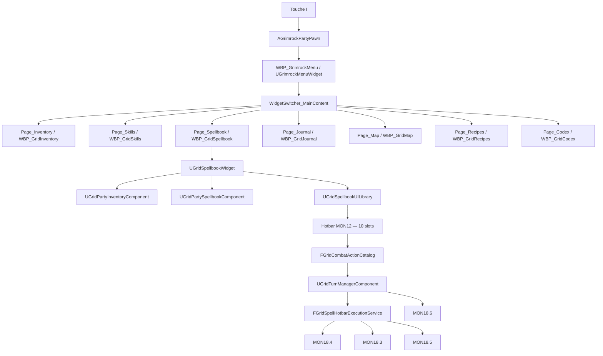

# GrimrockMenu — Complete Technical Reference

## 1. Statut et rôle du document

Ce document est la référence canonique du menu joueur multipage de GrimrockPrototype.

État de référence : **UI01.4.3e VALIDÉ ET CLOS sous UE5.5.4**.  
Date : **21 août 2026**.

Référence Git de clôture fonctionnelle Spellbook/hotbar :

```text
56bce2cdd90064b1b548cd93649b9e1207ba0bdc
Fix UI01.4.3e.2 Spellbook action availability
```

Le document couvre :

- `WBP_GrimrockMenu` et `UGrimrockMenuWidget` ;
- navigation des sept onglets ;
- cycle ouverture/fermeture depuis `AGrimrockPartyPawn` ;
- page inventaire ;
- page Spellbook ;
- modèle natif de connaissance des sorts ;
- projection visuelle ;
- drag & drop vers la hotbar MON12 ;
- résolution et exécution d'un sort depuis la hotbar ;
- responsabilités gameplay/UI ;
- limites restantes, notamment MON18.8.

En cas de divergence, l'ordre de priorité est :

1. code C++ réellement compilé ;
2. assets réellement sérialisés dans Unreal ;
3. présent document ;
4. documents historiques.

---

## 2. Architecture actuelle



Principes :

- le menu global possède la navigation ;
- chaque page possède sa présentation spécialisée ;
- aucune logique métier n'est dupliquée dans le Graph du shell ;
- le Spellbook ne crée pas une deuxième hotbar ;
- les coûts, le ciblage et les effets restent autoritaires en C++ ;
- l'UI demande une action, elle ne la résout pas elle-même.

---

## 3. Sources de vérité C++

### Shell / navigation

| Responsabilité | Fichier |
|---|---|
| Enum onglets | `Source/GrimrockPrototype/Public/UI/GridInventoryUiTypes.h` |
| Shell natif | `Source/GrimrockPrototype/Public/UI/GrimrockMenuWidget.h` |
| Navigation / styles | `Source/GrimrockPrototype/Private/UI/GrimrockMenuWidget.cpp` |
| Surface de design | `Source/GrimrockPrototype/Public/UI/GrimrockDesignSurfaceWidget.h` |
| Ouverture / fermeture | `Source/GrimrockPrototype/Private/Runtime/GrimrockPartyPawn.cpp` |

### Inventaire / hotbar

| Responsabilité | Fichier |
|---|---|
| Inventaire / hotbar autoritaire | `Source/GrimrockPrototype/Public/Runtime/GridPartyInventoryComponent.h` |
| Drag/drop hotbar | `Source/GrimrockPrototype/Public/UI/GridCombatHotbarDragDropOperation.h` |
| Catalogue d'actions | `Source/GrimrockPrototype/Private/Runtime/Combat/GridCombatActionCatalog.cpp` |

### Spellbook

| Responsabilité | Fichier |
|---|---|
| État de connaissance | `Source/GrimrockPrototype/Public/Magic/GridSpellbookTypes.h` |
| Propriétaire runtime | `Source/GrimrockPrototype/Public/Magic/GridPartySpellbookComponent.h` |
| Projection UI/hotbar | `Source/GrimrockPrototype/Public/Magic/GridSpellbookUI.h` |
| Page native | `Source/GrimrockPrototype/Public/UI/GridSpellbookWidget.h` |
| Exécution hotbar | `Source/GrimrockPrototype/Public/Magic/GridSpellHotbarExecution.h` |
| Routage runtime | `Source/GrimrockPrototype/Private/Runtime/Combat/GridTurnManagerPlayerActionCatalog.cpp` |
| Présentation | `Source/GrimrockPrototype/Public/Magic/GridSpellPresentationComponent.h` |

---

## 4. Assets UMG actuels

Menu principal :

```text
/Game/GrimrockPrototype/Blueprints/UI/WBP_GrimrockMenu
Parent natif : UGrimrockMenuWidget
```

Pages intégrées :

| Page | Widget |
|---|---|
| `Page_Inventory` | `WBP_GridInventory` |
| `Page_Skills` | `WBP_GridSkills` |
| `Page_Spellbook` | `WBP_GridSpellbook` |
| `Page_Journal` | `WBP_GridJournal` |
| `Page_Map` | `WBP_GridMap` |
| `Page_Recipes` | `WBP_GridRecipes` |
| `Page_Codex` | `WBP_GridCodex` |

`WBP_GridSpellbook` est désormais reparenté vers `UGridSpellbookWidget` et la page est fonctionnelle en PIE.

`WBP_GridSpellbookEntry` fournit la présentation d'une entrée de sort.

---

## 5. Contrat du shell `WBP_GrimrockMenu`

Le Graph de `WBP_GrimrockMenu` ne porte pas la navigation. La logique est dans `UGrimrockMenuWidget`.

Bindings principaux :

```text
WidgetSwitcher_MainContent
Button_TabInventory
Button_TabSkills
Button_TabSpellbook
Button_TabJournal
Button_TabMap
Button_TabRecipes
Button_TabCodex
Page_Inventory
Page_Skills
Page_Spellbook
Page_Journal
Page_Map
Page_Recipes
Page_Codex
```

Le C++ sélectionne la page par widget et non par index physique du `WidgetSwitcher`.

Il ne faut pas réintroduire dans le Graph :

```text
OnClicked(Button_TabX)
    -> SetActiveWidgetIndex(...)
```

---

## 6. Enum des onglets

```cpp
enum class EInventoryTopTab : uint8
{
    Inventory = 0,
    Skills = 1,
    Journal = 2,
    Map = 3,
    Recipes = 4,
    Codex = 5,
    Spellbook = 6
};
```

`Spellbook` a été ajouté en fin d'enum pour préserver les valeurs existantes.

Ordre visuel courant :

```text
Inventaire | Compétences | Sorts | Journal | Carte | Recettes | Codex
```

La dette de nommage `EInventoryTopTab` / `ToggleInventoryWidget()` reste volontairement hors périmètre : aucun refactor transversal n'est justifié pour cette seule raison.

---

## 7. Ouverture / fermeture

Point d'entrée historique :

```text
I -> AGrimrockPartyPawn::ToggleInventoryWidget()
```

Première ouverture :

```text
CreateWidget(MenuWidgetClass)
-> InitializeMenuWidget(this)
-> AddToViewport(...)
-> affichage
-> refresh
-> GameAndUI / curseur
```

La même instance est ensuite réutilisée. La fermeture replie le widget, restaure l'état UI du joueur et peut déclencher l'autosave prévu par le pawn.

Le menu mémorise son onglet actif tant que l'instance subsiste.

---

## 8. Page Spellbook

Hiérarchie :

```text
UUserWidget
└── UGridSpellbookWidget
    └── WBP_GridSpellbook
```

La page est une couche de présentation. Elle ne possède pas de copie autoritaire de gameplay.

État exposé :

```text
OwningPartyPawn
InventoryComponent
SpellbookComponent
SelectedCharacterIndex
SelectedCharacterId
SpellEntries[]
OnSpellbookRefreshed
```

API principale :

```text
InitializeSpellbookWidget(...)
RefreshSpellbook()
GetSpellEntryCount()
GetSpellEntry(...)
AssignSpellToHotbar(...)
UnassignSpellFromHotbar(...)
```

---

## 9. Modèle de connaissance

`FGridCharacterSpellbookState` contient :

```text
CharacterId
KnownSpellIds[]
```

Invariants :

- identité stable par `CharacterId` et `SpellId` ;
- aucun doublon de `SpellId` ;
- `NAME_None` interdit ;
- aucune copie d'asset de définition dans l'état ;
- aucune dépendance d'acteur dans la structure de connaissance.

`UGridPartySpellbookComponent` est la source de vérité runtime.

La persistance de cet état reste à faire dans MON18.8.

---

## 10. Projection visuelle

`UGridSpellbookUILibrary::BuildProductionSpellbookEntries()` construit `FGridSpellbookEntryView[]` avec :

- `SpellId` ;
- nom et description ;
- école ;
- coût mana et PA ;
- portée min/max ;
- ciblage ;
- LOS ;
- résolution de définition ;
- assignabilité ;
- slot hotbar associé ;
- définition d'action pour le HUD.

Un sort connu dont la définition n'est pas résolue reste visible mais non assignable.

Le seed de développement :

```text
Grimrock.Spellbook.SeedProduction
```

apprend temporairement les quatre sorts de production pendant PIE. Il est runtime-only et ne constitue pas une persistance.

---

## 11. Spellbook → Hotbar

Identité canonique :

```text
ActionId           = SpellId
SourcePolicy       = Spell
SourceDefinitionId = SpellId
SourceRuntimeId    = invalid
EquipmentSlot      = None
```

Les dix slots MON12 restent l'unique hotbar.

Le drag/drop Spellbook réutilise `UGridCombatHotbarDragDropOperation`. Le move/swap et la suppression réutilisent les API existantes du composant inventaire.

Un même sort ne doit pas être dupliqué dans plusieurs slots.

---

## 12. Résolution du sort dans le catalogue

`BuildPlayerCombatActionContributions()` relit les `KnownSpellIds` du personnage puis reconstruit chaque définition de production.

Une action Spellbook est reconnue par :

```text
SourcePolicy == Spell
SourceDefinitionId == ActionId == SpellId
```

La correction `56bce2c` garantit que ces actions ne sont plus bloquées par l'ancien garde `ExecutionNotImplemented` réservé aux anciens profils de classe.

La palette générique n'affiche pas les sorts gérés par le Livre de sorts ; la hotbar conserve les bindings explicitement configurés.

---

## 13. Exécution depuis la hotbar

Chemin réel :

```text
clic / touche hotbar
    -> RequestCharacterCombatAction()
    -> FGridSpellHotbarExecutionService
    -> FGridSpellCastPipelineService
        -> ciblage MON18.4
        -> coûts MON18.3
    -> FGridSpellEffectResolver MON18.5
    -> commit autoritaire
    -> présentation MON18.6
```

Les coûts sont calculés sur copies et commités uniquement après succès de la résolution des effets.

### Sorts de production actuels

```text
Spell_ArcaneBolt   hostile axial
Spell_LesserHeal   allié
Spell_Haste        allié
Spell_CurePoison   allié
```

Pour une activation directe de la hotbar, `Ally` cible actuellement le lanceur lui-même. La sélection d'un autre membre pourra être ajoutée ultérieurement sans casser ce pipeline.

---

## 14. Validation UI01.4.3e

Automation UE5.5.4 : **6/6 Success** pour le filtre :

```text
Grimrock.UI.UI01.4.3e.2
```

Couverture :

```text
ArcaneBoltExecution
LesserHealExecution
MissingStatusNoCostCommit
SpellbookCatalogAvailability
SpellbookCatalogExecutorGate
UnknownSpellNoCostCommit
```

PIE validé :

- `Lesser Heal` : -2 PA, -4 mana, +5 PV ;
- `Arcane Bolt` : -2 PA, -3 mana, 4 dégâts ;
- mort de Gobelin par sort propagée vers loot, XP, `MonsterDied` et occupation ;
- mana insuffisant correctement refusé avant exécution.

Référence détaillée : `docs/Design/UI_SPELLBOOK_HOTBAR_EXECUTION.md`.

---

## 15. Invariants de maintenance

1. `WBP_GrimrockMenu` reste enfant de `UGrimrockMenuWidget`.
2. La navigation supérieure reste dans le shell C++.
3. Aucun `SetActiveWidgetIndex()` parallèle dans le Graph.
4. Les valeurs historiques de `EInventoryTopTab` restent stables.
5. `UGridPartySpellbookComponent` reste la source de vérité de connaissance runtime.
6. `UGridPartyInventoryComponent` reste la source de vérité de sélection et de hotbar.
7. `SpellEntries` reste une projection UI.
8. Les dix slots MON12 restent l'unique hotbar.
9. Un sort inconnu ne peut pas être assigné ou exécuté.
10. Un unassign de hotbar ne fait jamais oublier le sort.
11. L'UI ne paie jamais directement PA/mana.
12. Les services MON18 restent autoritaires pour ciblage, transaction et effets.
13. Une erreur d'effet ne doit pas consommer de ressources.
14. Les mutations Spellbook notifient les vues sans dupliquer l'état.
15. La persistance Spellbook appartient à MON18.8.

---

## 16. Diagnostic rapide

### Onglet Sorts inaccessible

Vérifier :

```text
Button_TabSpellbook
Page_Spellbook
EInventoryTopTab::Spellbook
HandleSpellbookTopTabClicked
GetTopTabPage(Spellbook)
```

### Spellbook vide

Vérifier :

```text
SelectedCharacterIndex
CharacterId
UGridPartySpellbookComponent
KnownSpellIds
OnSpellbookRefreshed
```

Un Spellbook vide est valide si aucun sort n'est connu.

### Sort visible mais non assignable

La définition de production n'a probablement pas été résolue ou validée.

### Sort dans la hotbar mais `ExecutionNotImplemented`

Ce comportement est une régression. Les projections Spellbook valides doivent passer le garde du catalogue depuis `56bce2c`. Lancer :

```text
Grimrock.UI.UI01.4.3e.2.SpellbookCatalogAvailability
Grimrock.UI.UI01.4.3e.2.SpellbookCatalogExecutorGate
```

### Sort refusé au clic

Inspecter d'abord le log `GridActionCatalog` puis `GridSpellAction`. Les causes attendues incluent :

```text
InsufficientActionPoints
InsufficientMana
InvalidTarget
SpellNotKnown
MissingStatusEffectDefinition
```

---

## 17. Limite actuelle et prochain travail

Le parcours UI Spellbook/hotbar est fonctionnellement terminé.

La limite structurante restante est la persistance : `UGridPartySpellbookComponent::SpellbookState` est runtime et les `KnownSpellIds` ne sont pas encore sauvegardés/restaurés.

Prochain sous-jalon autoritaire :

```text
MON18.8 — Persistence / Migration du Spellbook
```

Ce document doit permettre de reprendre le travail sur le menu ou le Spellbook sans recommencer un audit de découverte de l'architecture.
