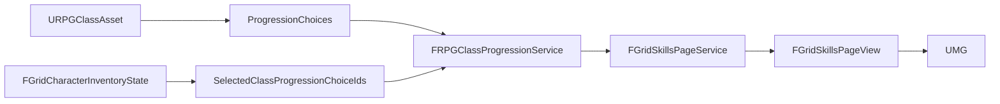

# UI-RPG — Talent Tree Architecture

Date : **7 octobre 2026**  
Projet : **GrimrockPrototype — Unreal Engine 5.5.4**  
Statut : **CANONIQUE après UI-RPG01**

## But

Ce document décrit l'architecture stable utilisée pour exposer les classes, branches et talents RPG03 à l'interface du jeu. Les tickets UI-RPG01.2 à UI-RPG01.4 conservent leur rôle d'historique d'implémentation ; ce document est la référence de lecture rapide.

## Autorités



Responsabilités :

- `URPGClassAsset` : définition des choix, coûts, niveaux, prérequis et métadonnées structurelles ;
- `FGridCharacterInventoryState` : sélections réellement acquises ;
- `FRPGClassProgressionService` : disponibilité, prérequis, exclusivités et budget ;
- `FRPGClassProgressionTransactionService` : mutations atomiques ;
- `FGridSkillsPageService` : projection read-only ;
- UMG : présentation et interaction uniquement.

## Identités

### ChoiceId

Identité gameplay d'une sélection concrète. Elle est utilisée par la progression, la transaction et la persistance.

### TalentNodeId

Identité structurelle d'un **talent conceptuel**. Pour un talent simple, elle peut être identique au `ChoiceId`. Pour un talent à variantes, plusieurs `ChoiceId` partagent le même `TalentNodeId`.

### TalentBranchId

Identité structurelle d'une branche. Elle ne contient ni nom localisé, ni couleur, ni ordre gauche/centre/droite.

## Read model

```text
FGridSkillsPageView
└── TalentTree : FGridTalentTreeView
    ├── ClassId
    └── Branches[3]
        └── FGridTalentBranchView
            ├── TalentBranchId
            ├── AcquiredNodeCount
            └── Nodes[5]
                └── FGridTalentNodeView
                    ├── TalentNodeId
                    ├── Tier
                    ├── MinimumLevel
                    ├── PointCost
                    ├── State
                    ├── PreviousNodeId
                    ├── SelectedChoiceId
                    └── Variants[1..N]
                        └── FGridTalentVariantView
                            ├── ChoiceId
                            ├── DisplayName
                            ├── Description
                            ├── bSelected
                            ├── bAvailable
                            └── State
```

## États

```text
Acquired
Available
LockedLevel
LockedPrerequisite
LockedPoints
LockedExclusive
```

`Pending` n'appartient pas au read model. Ce sera un état transitoire de l'interaction UI lorsqu'UI-RPG04 introduira l'acquisition depuis l'écran.

## Invariants de production

```text
6 classes
3 branches par classe
5 nœuds conceptuels par branche
18 branches
90 nœuds conceptuels
paliers 2 / 6 / 10 / 14 / 18
```

Le nombre de `ChoiceId` n'est pas un invariant car certains nœuds contiennent plusieurs variantes.

## Variantes actuelles

| Classe | Nœud conceptuel | Variantes |
|---|---|---|
| Guerrier | Spécialisation martiale | Tranchant / Perforant / Contondant |
| Rôdeur | Ennemi juré | N catégories de bestiaire |
| Mage | Affinité élémentaire | Feu / Glace / Foudre / Terre |
| Mage | Imprégnation | Feu / Glace / Foudre / Terre |

## UI-RPG02 — Presentation Data

UI-RPG02.1 fixe une couche **strictement de présentation** sous la forme d'un catalogue unique :

```text
URPGTalentPresentationAsset
└── Classes[]
    └── FRPGClassPresentationDefinition
        ├── ClassId
        ├── portrait / emblème / palette / motifs
        └── Branches[3]
            └── FRPGTalentBranchPresentationDefinition
                ├── TalentBranchId
                ├── DisplayName / ShortDescription
                ├── BranchEmblemTexture
                └── AccentColor
```

L'ordre de `Branches[3]` est directement gauche / centre / droite. Cette forme évite de dupliquer `OwningClassId`, `SortIndex` ou `OrderedBranchIds`.

La couche de présentation ne contient aucun coût, niveau, prérequis, choix acquis, calcul de disponibilité ou transaction.

Les données de nœud individuelles restent volontairement hors de UI-RPG02.1 : leurs noms/descriptions viennent déjà des `ProgressionChoices`; les icônes de talents pourront être ajoutées ultérieurement si la production graphique le justifie.

Après UI-RPG02.2 (catalogue de production minimal), **UI-RPG03.1 crée le vrai écran WBP Talent Tree**.

## Validation

```text
Grimrock.UI.RPG01.ReadModel          5/5
Grimrock.UI.RPG01.ProductionAssets  5/5
Grimrock.RPG.RPG03                 193/193
Warnings                                0
Failures                                0
```

## Références

- `docs/Design/RPG03_SKILL_TREE_SYNTHESIS.md`
- `docs/Design/UI_RPG01_3_TALENT_TREE_READ_MODEL.md`
- `docs/Design/UI_RPG01_4_PRODUCTION_MATERIALIZATION.md`
- `docs/Design/UI_RPG01_VISUAL_SYNTHESIS.md`
