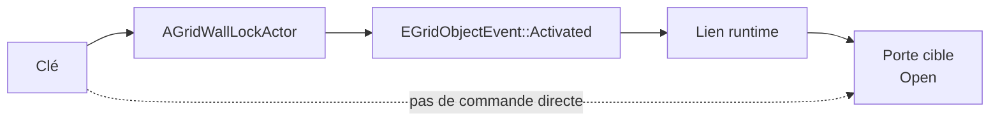
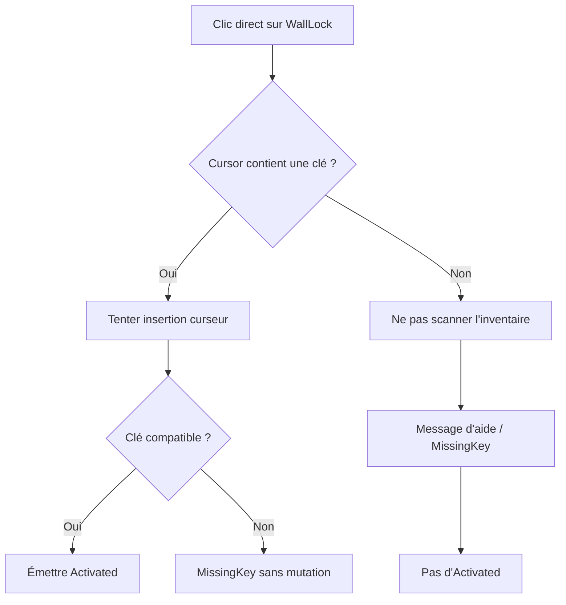
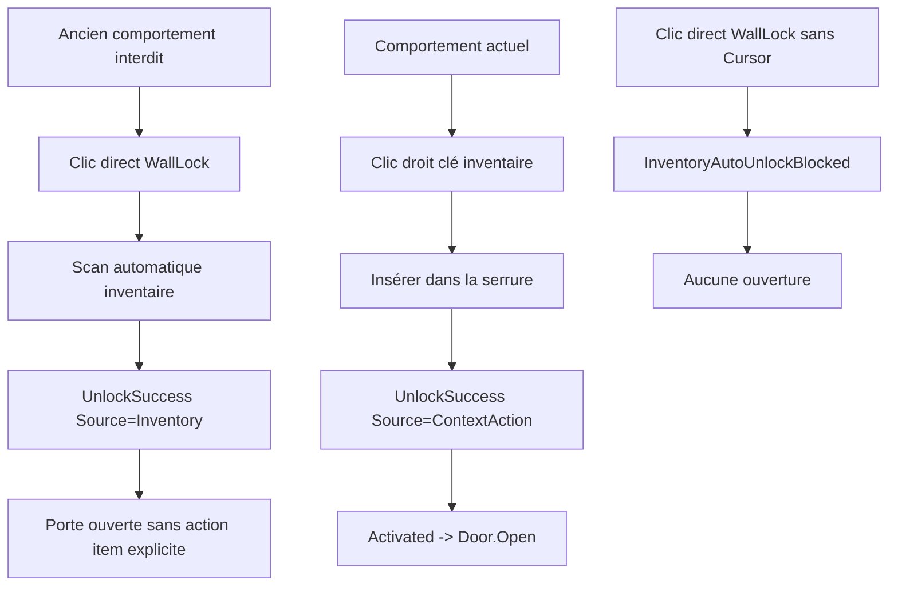

# Wall Lock MVP — comportement runtime validé et cible UX

Statut : **documentation MVP actuelle + clarification de transition UX**  
Portée : **serrure murale, clé en inventaire, clé en curseur, connecteurs, transition vers actions contextuelles**  
Complète : `GRIMROCK_LOCK_SYSTEM.md` et `ITEM_CONTEXT_ACTION_SYSTEM.md`  
Ne remplace pas : `docs/Architecture/RECEPTACLE_SYSTEM_FOUNDATION.md` ni `docs/Architecture/ITEM_PICKUP_AND_PLACEMENT_FOUNDATION.md`

---

## 1. Objet du document

Ce document décrit le comportement réellement validé pour le MVP des serrures murales après validation de la **Copper Key** et de la serrure murale **WallLockPit / Copper Wall Lock** dans `L_GrimrockEditor`.

Il clarifie aussi une décision de design plus récente :

> Le comportement `clé dans inventaire -> auto-unlock` n'est plus le chemin attendu. L'utilisation d'une clé d'inventaire passe par l'action explicite `Insérer dans la serrure`.

La cible UX devient :

```text
clic sur serrure verrouillée
  -> ouvrir l'inventaire en mode assisté
  -> surligner les clés compatibles
  -> action explicite : Insérer dans la serrure
```

---

## 2. Règle architecturale inchangée

La porte reste un objet passif commandable.

```text
Serrure murale
  -> émet un événement
  -> connecteur
  -> commande sur la porte
```

La porte ne connaît pas :

- la clé ;
- la serrure ;
- l'inventaire ;
- le curseur ;
- le crochetage ;
- les pièges.



Pour le MVP Copper Key :

```text
CopperWallLock.Activated -> Door.Open
```

Le connecteur correct est donc :

```text
SourceObject = CopperWallLock / WallLockPit
SourceEvent  = Activated
TargetObject = Door cible
Command      = Open
```

Le connecteur incorrect est :

```text
CopperWallLock.ItemInserted -> Door.Open
```

`ItemInserted` reste valable pour les vrais réceptacles : alcôves, supports, autels, bols d'offrande, etc. Il ne doit pas être le signal principal d'ouverture d'une serrure murale.

---

## 3. Comportement MVP validé

## 3.1. Chemin inventaire — action explicite

```text
Clé dans inventaire
  -> clic droit sur la clé
  -> Insérer dans la serrure
  -> clé compatible transférée vers WallLock
  -> UnlockSuccess Source=ContextAction
  -> Event Activated
  -> Door.Open
```

Ce comportement valide :

- l'intention explicite du joueur ;
- la compatibilité par `ItemDefinitionId` ;
- le retrait de la clé uniquement après succès ;
- l'événement `Activated` ;
- le lien `WallLock.Activated -> Door.Open`.

Clic direct sur la serrure sans item explicite :

```text
clic serrure
  -> InventoryAutoUnlockBlocked
  -> message d'aide
  -> aucun Activated
```

La serrure ne fouille plus automatiquement l'inventaire.



---

## 3.2. Chemin curseur — MVP physique

Le MVP sait aussi ouvrir une serrure lorsque la clé est portée par le mécanisme actuel de Cursor.

Flux technique :

```text
Clé dans curseur
  -> clic sur WallLock
  -> vérification de compatibilité
  -> UnlockSuccess Source=Cursor
  -> clé retirée du curseur
  -> clé attachée à ItemAttachPoint
  -> Event Activated
  -> Door.Open
```

Ce comportement valide la partie diégétique :

- la clé quitte le conteneur de manipulation ;
- elle est attachée à la serrure ;
- elle ne simule pas la physique ;
- elle n'a plus de collision de pickup ;
- elle n'est plus récupérable ;
- elle reste visible dans la serrure.

Cependant, le Cursor lui-même ne doit pas devenir le modèle UX principal. La cible est de remplacer l'usage visible du Cursor par une action contextuelle :

```text
clic droit clé
  -> Insérer dans la serrure
```

Le code pourra temporairement réutiliser certaines fonctions du Cursor en interne pendant la transition.

---

## 4. Nouvelle règle de design cible

Règle cible :

> Une serrure murale ne doit pas fouiller automatiquement l'inventaire et consommer ou utiliser une clé sans action explicite du joueur.

Le flux final recherché est :

```text
clic sur serrure verrouillée
  -> si aucune clé compatible : message
  -> si clés compatibles : inventaire assisté
  -> joueur choisit une clé
  -> joueur confirme Insérer dans la serrure
  -> clé retirée de l'inventaire
  -> clé attachée à la serrure
  -> Activated
  -> Door.Open
```

Cela aligne les serrures sur les autres interactions d'items :

```text
torche -> placer sur support
armure -> s'équiper
potion -> consommer
livre -> lire
pierre -> déposer / lancer
clé -> insérer dans serrure
```

---

## 5. Pourquoi ne pas garder l'auto-use comme règle générale ?

L'auto-use depuis l'inventaire est confortable, mais il casse la cohérence globale :

```text
Torche dans support     -> action explicite
Pierre sur plaque       -> action explicite
Objet dans alcôve       -> action explicite
Armure équipée          -> action explicite
Clé dans serrure        -> devrait aussi être une action explicite
```

Le jeu doit évoluer vers un système d'actions contextuelles décrit dans :

```text
docs/Design/ITEM_CONTEXT_ACTION_SYSTEM.md
```

---

## 6. Messages joueur

Tous les textes visibles doivent être en français.

Messages recommandés pour la Copper Wall Lock :

```text
LockedMessage:
  La serrure est verrouillée.

UnlockSuccessMessage / UnlockedMessage:
  La serrure s'ouvre avec un déclic métallique.

AlreadyUnlockedMessage:
  La serrure est déjà déverrouillée.

MissingKeyMessage:
  Il vous manque la clé adéquate.
```

Important : le message de succès et le message déjà ouvert ne doivent pas être confondus.

Mauvais :

```text
UnlockSuccess -> La serrure est déjà déverrouillée.
```

Bon :

```text
UnlockSuccess   -> La serrure s'ouvre avec un déclic métallique.
AlreadyUnlocked -> La serrure est déjà déverrouillée.
```

---

## 7. Logs PIE attendus pour le MVP actuel

### 7.1. Sans clé

```text
GridWallLock UnlockFailed MissingKey
AcceptedKeys=[Key_Copper]
Message=Il vous manque la clé adéquate.
```

Aucun événement `Activated` ne doit ouvrir la porte.

---

### 7.2. Clé dans inventaire — action contextuelle

```text
GridItemActions Execute InsertIntoTarget Item=Key_Copper Target=WallLock
GridWallLock UnlockSuccess ... Source=ContextAction
GridWallLock ActivatedEventEmitted ... LinkExecuted=true
Grid link executed ... Command=Open Success=true
```

Un clic direct sur la serrure avec la clé dans l'inventaire doit produire :

```text
GridWallLock DirectInteract InventoryAutoUnlockBlocked ...
```

Aucun `UnlockSuccess Source=Inventory` ne doit apparaître dans ce cas.

---

### 7.3. Clé dans curseur — MVP physique

```text
GridInventory WorldDrop RoutedToWallLock Item=Key_Copper Target=...
GridWallLock CursorKeyAttempt ... CursorItemDefinitionId=Key_Copper
GridWallLock UnlockSuccess ... Source=Cursor
GridWallLock ActivatedEventEmitted ... LinkExecuted=true
Grid link executed ... Command=Open Success=true
```

La porte ne doit pas dépendre de :

```text
Event=ItemInserted
```

---

## 8. Configuration attendue des assets

### 8.1. `DA_Item_CopperKey`

```text
ItemDefinitionId = Key_Copper
DisplayName = Clé en cuivre
ItemType = Key
```

---

### 8.2. `DA_LockCopperWallLock` / `WallLockPit`

```text
RuntimeActorClass = BP_GridWallLockActor
SupportedType = Receptacle

Behavior.Lock.AcceptedKeyItems:
  - DA_Item_CopperKey

Behavior.Lock.AcceptedKeyIds:
  - Key_Copper

Behavior.Lock.bStartsUnlocked = false
Behavior.Lock.bConsumeKeyOnUnlock = false
```

Messages :

```text
LockedMessage = La serrure est verrouillée.
UnlockedMessage = La serrure s'ouvre avec un déclic métallique.
MissingKeyMessage = Il vous manque la clé adéquate.
```

Visuel de clé insérée :

```text
VisualPlacementMode = AttachedSocket
bSimulatePhysicsWhenPlaced = false
MaxContainedItems = 1
bCanRemoveItem = false
```

---

### 8.3. Connecteur

Le connecteur correct est :

```text
CopperWallLock.Activated -> Door.Open
```

Le connecteur incorrect est :

```text
CopperWallLock.ItemInserted -> Door.Open
```

---

## 9. Décision de design mise à jour

Ancienne lecture MVP :

```text
clé en inventaire OU clé en curseur
  -> WallLock UnlockSuccess
  -> Activated
  -> Door.Open
```

Lecture mise à jour :

```text
MVP actuel :
  clé inventaire -> menu contextuel -> Insérer dans la serrure
  clé curseur -> insertion explicite
  clic direct serrure -> aide, pas d'auto-unlock
```

Décision :

> L'ouverture de porte par serrure passe uniquement par `Activated`.  
> `ItemInserted` reste réservé aux vrais réceptacles.  
> L'auto-use depuis inventaire est supprimé du clic direct.
> L'action explicite d'item est intégrée au système d'actions contextuelles.

Comparaison de comportement :



---

## 10. Transition recommandée

Étape suivante recommandée :

```text
1. Ajouter le menu clic droit d'item.
2. Ajouter le contexte de cible en face du groupe.
3. Ajouter le mode inventaire assisté depuis WallLock.
4. Surligner les clés compatibles.
5. Ajouter l'action Insérer dans la serrure.
6. Retirer l'auto-unlock direct depuis l'inventaire.
```

Objectif final :

```text
clé dans inventaire
  -> pas d'ouverture automatique silencieuse
  -> action explicite Insérer
  -> clé attachée dans la serrure
  -> Activated
  -> Door.Open
```
